# 我如何建造自己的键盘

> 原文：<https://medium.com/hackernoon/what-i-learned-while-building-my-own-keyboard-8b3bbc7ac3c3>

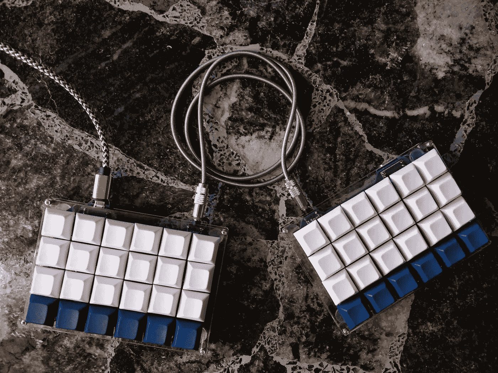

The finished product

不久前，我偶然发现了 [Let's Split](https://github.com/nicinabox/lets-split-guide) ，并对构建自己的键盘的想法着迷。从我记事起，我就一直在使用微软的人体工程学键盘，并且感觉到🎄既然我有一些休息时间，圣诞节将是尝试一下的好时机。

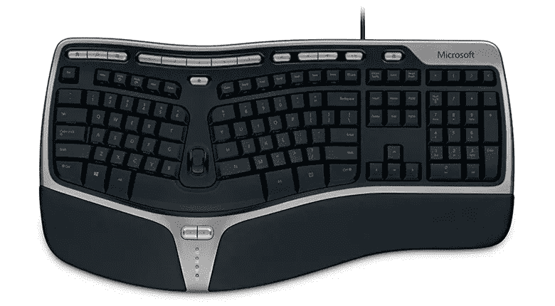

The Microsoft ergonomic keyboard model to be replaced

你可能马上会注意到的一件事是 Let's Split 键盘的大小。它的大小大约是普通键盘的 40%,并且遵循了*正交*设计。与典型键盘的交错按键布局相比，正交基本上意味着按键在相等的网格中垂直对齐。如果你很想知道你是如何用这么少的键生存下来的，那么我建议你看看这个关于一个叫做普朗克的类似键盘的视频。简而言之，你利用了层。

Covering some of the main concepts via a similar keyboard

在做了大量的研究和比较供应商之后，我决定使用一家名为 [MechBoardsUK](https://mechboards.co.uk/) 的本地供应商。运输需要一些时间，因为他们必须激光切割丙烯酸案件，但他们的服务始终是非常积极的。

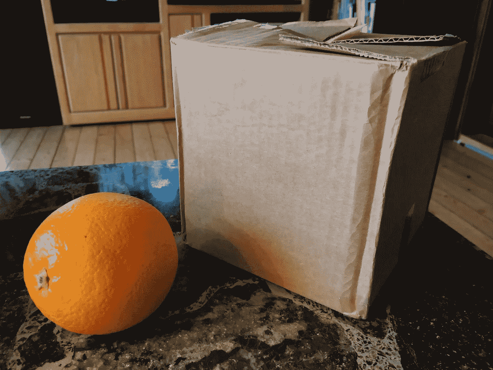

Orange for scale

最终，一个如此小的盒子来了，我想知道它会是什么。原来是所有的组件，以建立我的键盘！

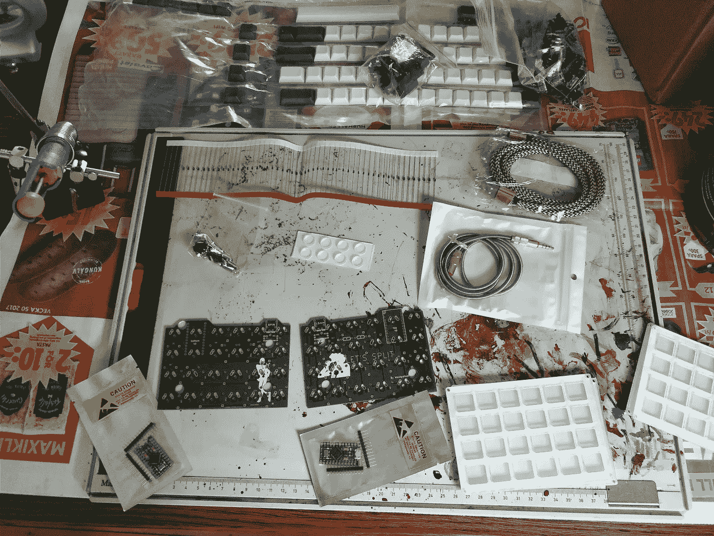

All the parts waiting to get assembled. I knew there’d be plenty of soldering involved, so I made sure to lay down adequate protection on the table

不过，在我们开始之前，您需要准备一些工具:

**必须有:**

*   烙铁，最好有一个细尖
*   焊料越薄越好
*   用于修整引脚和二极管的侧切割器

**很高兴拥有:**

*   焊料真空/泵，这是 IRL 版本的*撤销*
*   小螺丝刀，用于拧紧外壳上的螺钉
*   可调节的辅助手将物品固定到位
*   用于弯曲二极管的尖嘴钳
*   风扇吹走焊料烟雾😷

请记住，我下面的说明是对[官方指南](https://github.com/nicinabox/lets-split-guide)的补充，绝不是完整的。

第一步是安装二极管。注意:1)确保您没有忘记任何二极管；以及 2)确保二极管的黑色部分始终面向方形点。

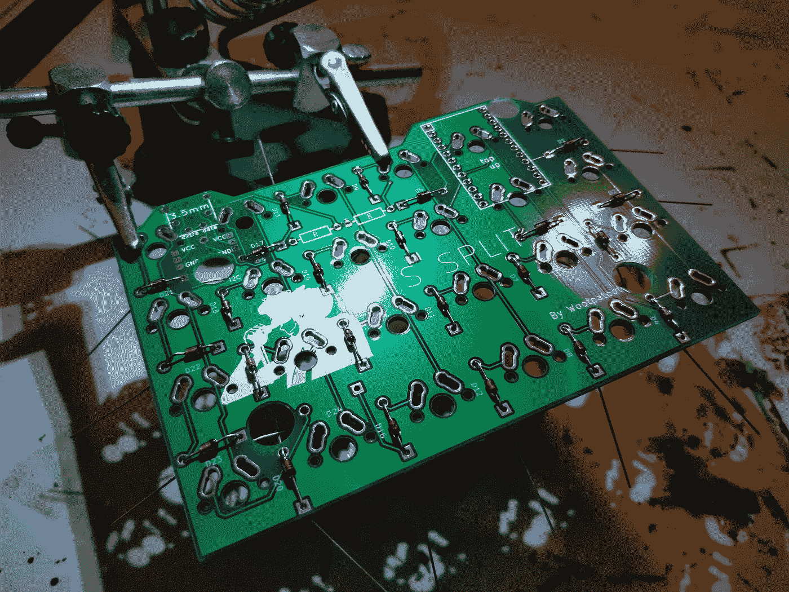

Bonus points if you can spot the mistake I made

接下来，把它翻过来，从后面把它们焊进去。

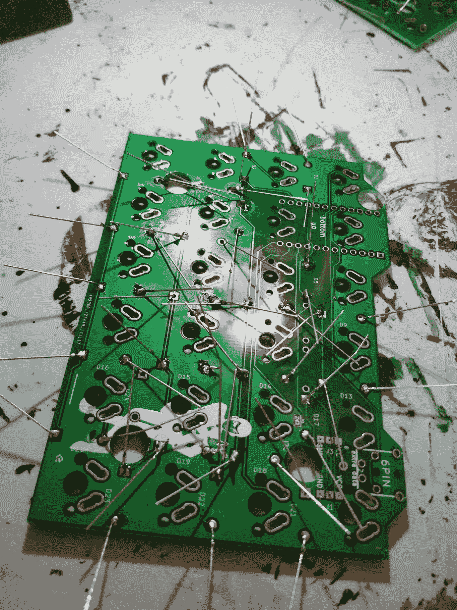

Spikey!

现在尽可能靠近板子剪下它们。我不得不进行两次焊接/剪切，因为我第一次无法完全接触到它们。

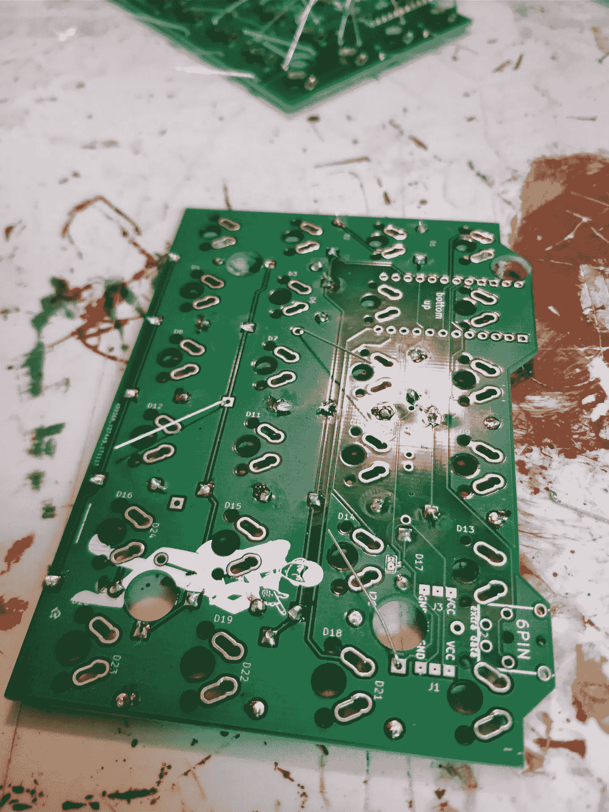

Fun fact: The purpose of these diodes is to ensure that the current only flows in one direction.

下一个是 TRRS 杰克。这将是两半之间的脐带连接点。

Protip: Ensure you have TRRS and not TRS jacks/cables.

接下来是准备我们的 Pro Micro 的未来家园。第一步是连接引脚。

Be careful to attach the pins on the correct side, as the two halves will be inverted.

现在，您需要连接前两个交换机。你现在就要这么做，因为 Pro Micro 将被放置在开关焊点上方。

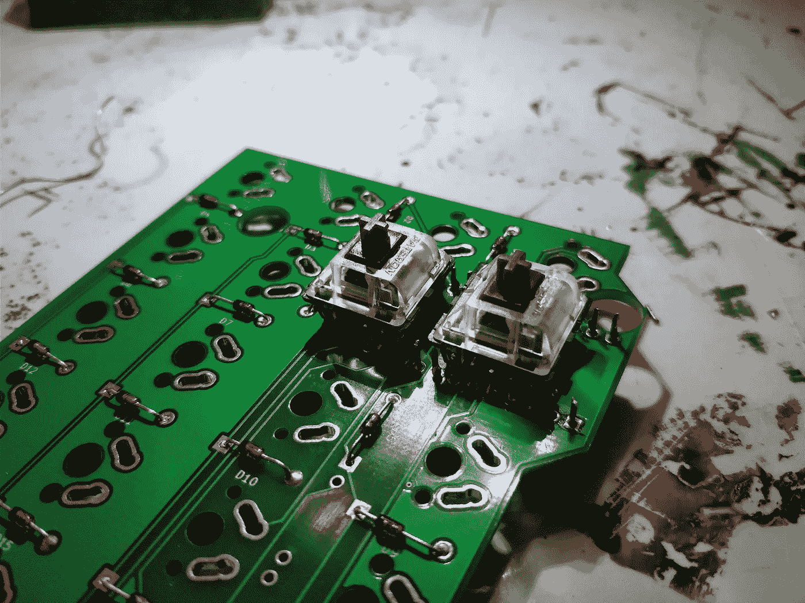

接下来，你需要通过闪入来准备 Pro Micro。官方指南建议在焊接之前这样做，因为这些芯片有时会有缺陷。Pro Micros 兼容 Arduino，我刷新了默认的 Let's Split Rev2 固件来自[量子力学键盘项目](https://github.com/qmk/qmk_firmware)。如果你觉得 CLI 有点令人畏惧，那么你可以试试 GUI [QMK 工具箱](https://github.com/qmk/qmk_toolbox/releases)。

需要记住的一点是，你需要在闪烁时触发重置。这可以很容易地做到，把你的二极管剪报弯曲成 V 形，并缩短标有 GND 和 RST 的点。

完成后，您就可以将它连接到 PCB 上了。

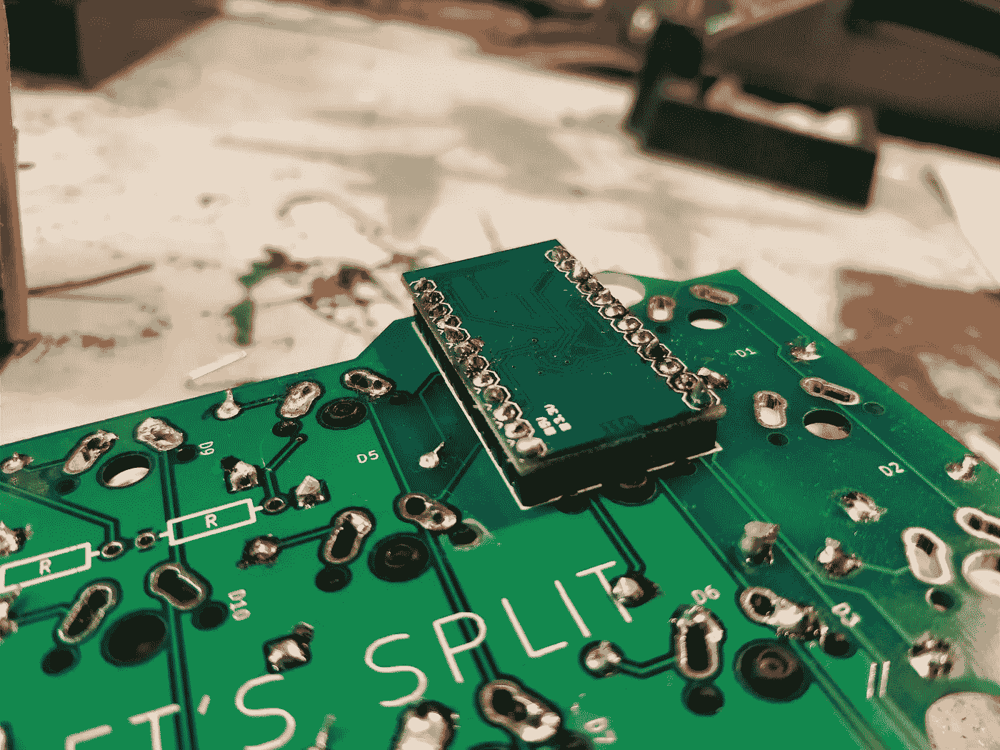

I certainly hope that your soldering skills are better than mine 😳

现在，我们可以开始测试电路板了。在修理了几个[冷接头](https://learn.adafruit.com/adafruit-guide-excellent-soldering/common-problems)之后，事情似乎开始运转了！🎉

我决定热情地焊接剩余的开关，并在外壳上进行尝试，然后我意识到我犯了一个巨大的错误。

盒子放在开关的下面，夹在按键和印刷电路板之间。多。接下来发生的是，我花了*个小时*吸入焊料烟雾，尽我所能使用焊料真空，试图移除我小心翼翼连接的 Pro Micro。

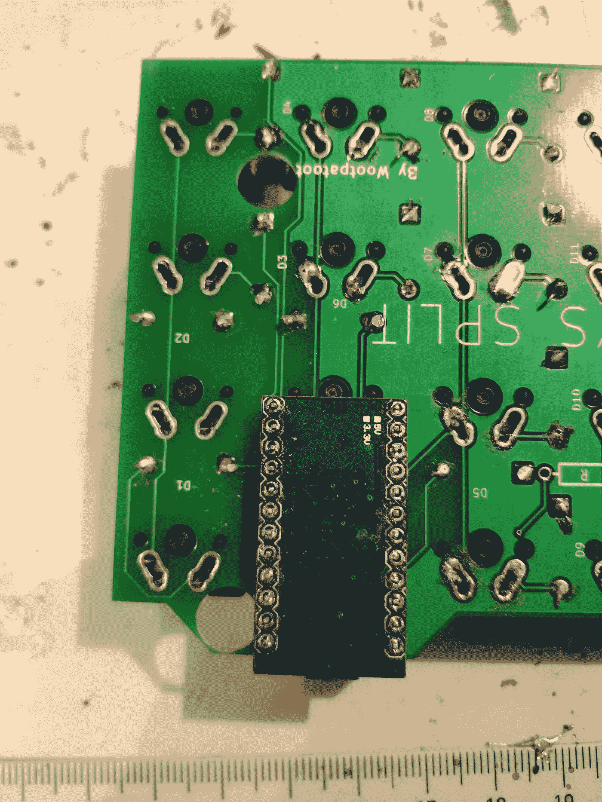

Most of the solder removed, still some left to go…

在尽可能多地移除焊料后，我能够利用侧刀非常小心地撬开芯片。不可思议的是，尽管有许多划痕和焊点/烧伤，Pro Micro 仍然完全正常工作。

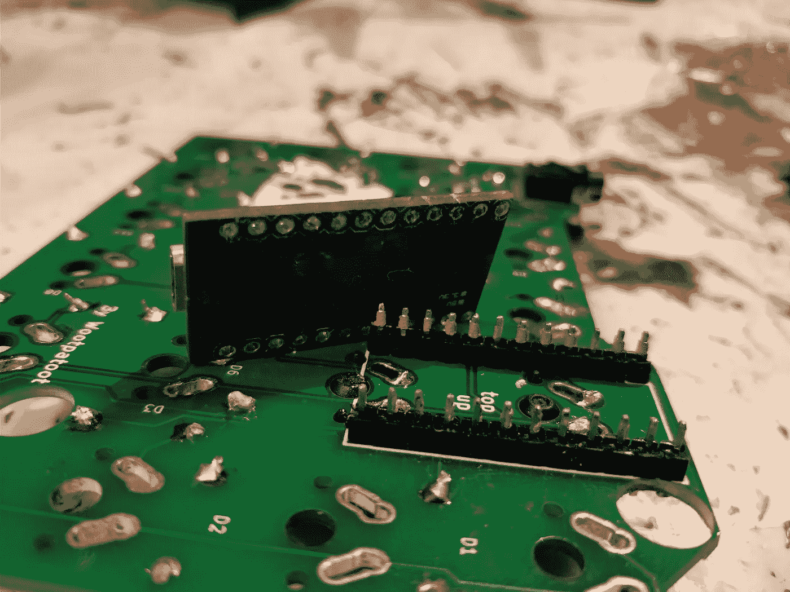

At last. I jumped up and danced around the room at this point to celebrate.

我现在可以移除开关，并将它们重新连接到外壳和 PCB 之间。

此后，我重复了之前的步骤:焊接前两个开关，然后焊接另一侧的 Pro Micro(再次)。

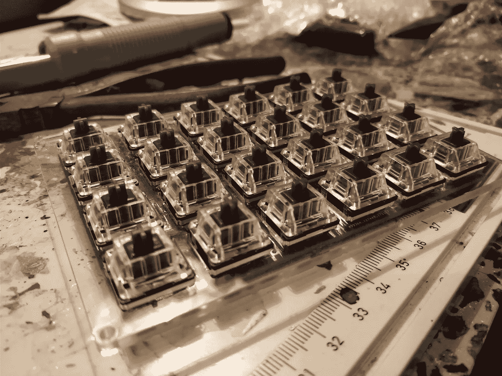

Sandwiched, as it should be.

焊接完剩余的开关后，我测试了这一半的完整布局。一把钥匙坏了，我的心沉了下去😨。Pro Micro 真的被我之前的失误损坏了吗？重新流了几个点，终于发现少了一个二极管！在这一点上，我没有办法再次拆下 Pro Micro，所以我决定将丢失的二极管放在反面，因为它在那里也会工作得很好。

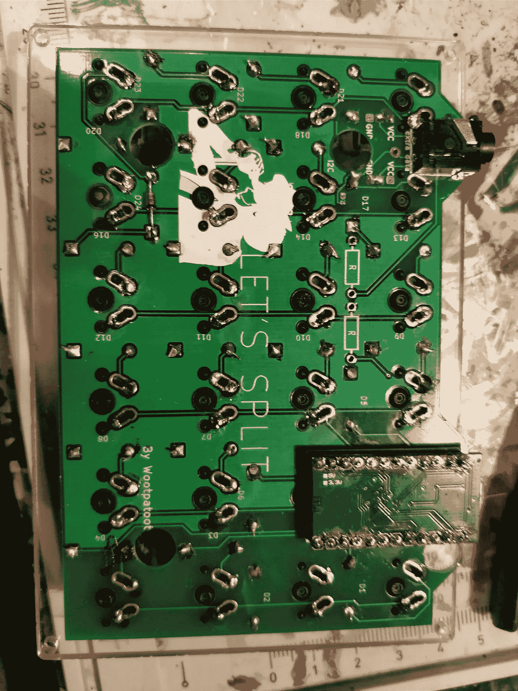

Top left near the corner, D24\. Note the gnarly Pro Micro.

满意地说，我有一个工作键盘，我附上了下半部分的情况。

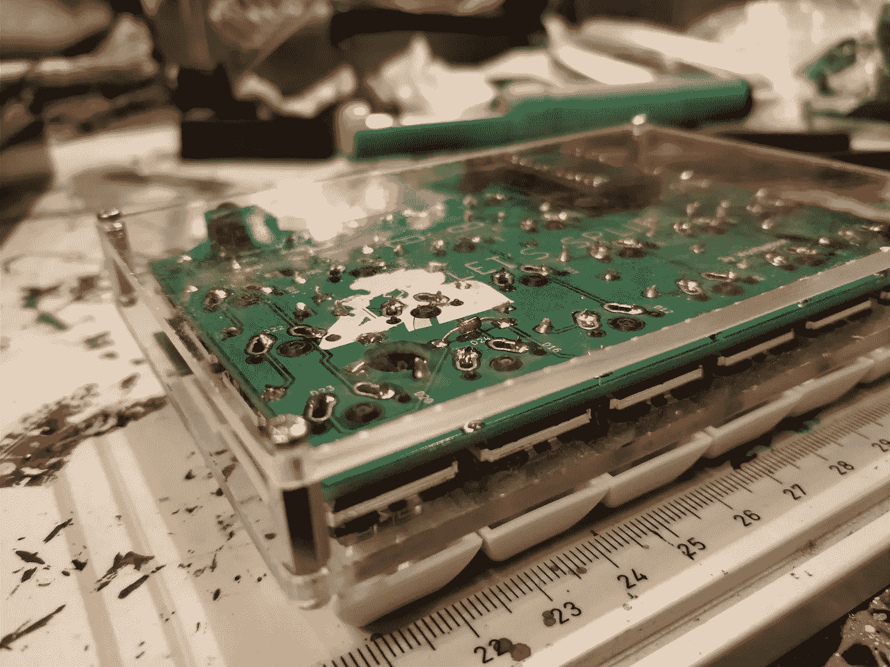

终于可以到好玩的部分了，键帽！

Almost as satisfying as bubblewrap, attaching the keycaps is definitely one of the highlights of the project.

现在剩下的就是在后半部分遵循同样的步骤，只是有些颠倒。前半部分花了很多时间，主要是由于微控制器崩溃，后半部分花了不到一个小时，我就开始运行了。

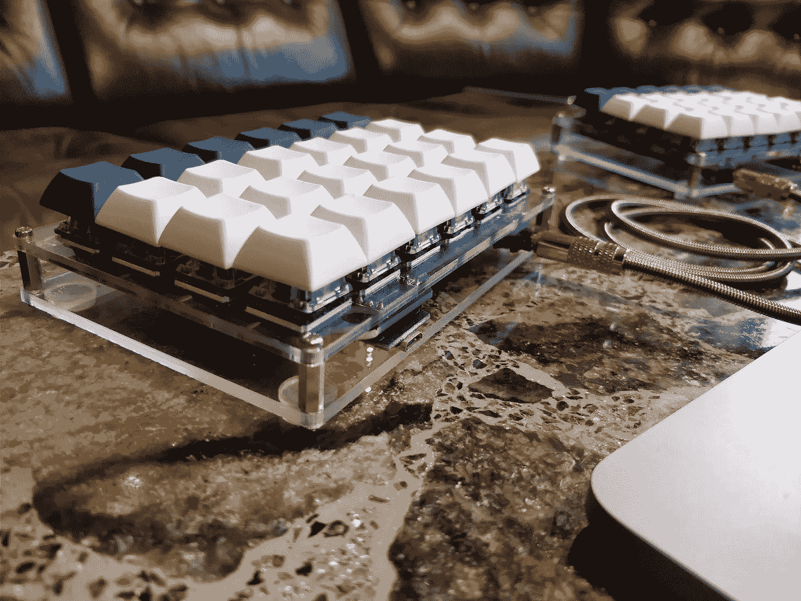

Cool red glow from the Pro Micro shining underneath

此时，键盘功能齐全，可以使用了。我又一次拧紧了外壳螺丝，然后在下面安装了橡胶缓冲器，让它更加稳定:光滑表面上的滑动减少了，这是一个巨大的变化！

那么下一步是什么？

*   编程和定制 QMK 默认键映射。也有一些值得探索的社区网站。
*   获取一些 LED 条，以提供可定制的[下发光](https://camo.githubusercontent.com/520594ec4d3678bdb9002f1ac4edf827cb6896c8/687474703a2f2f692e696d6775722e636f6d2f714658687575312e6a7067)。如果詹金斯开始失败，它会变成红色，如果我的公司出售，它会变成绿色，等等。

事后看来，我在得到空白键帽时可能有点过于自信了。在普通键盘上，这对我来说不是问题，但使用正交设计，我觉得我可能会给自己增加不必要的难度，因为习惯分层设计需要相当长的学习曲线。我看到自己在未来相当长一段时间内会玩[类型赛车](http://play.typeracer.com/)，以回到我通常的每分钟比赛。

另一件事，我会做不同的是，开始与罚款提示烙铁。我用的是手头上的一个旧的，最后升级到我在当地五金店找到的一个便宜的。在 Pro Micro 上工作时，它的作用是不分昼夜的🤯。

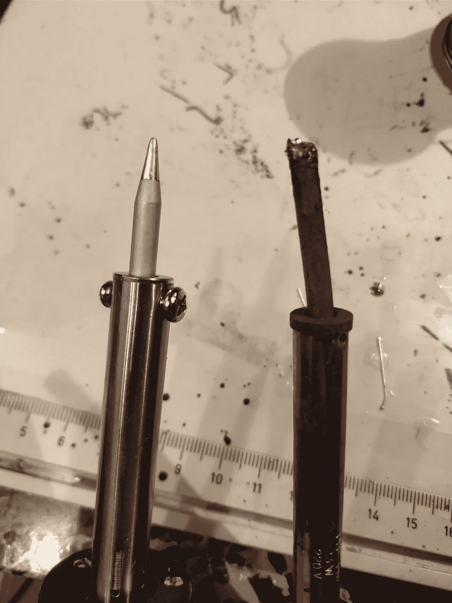

Make the investment in a small/fine tip if you can. It’s worth it.

我向任何对 DIY 计算机硬件感兴趣的人推荐这个项目。它不太贵，相当容易组装，并且包含相当数量的软件，以提供额外的编码和定制机会。尽管很简单，我还是学到了很多，并且从屏幕中获得了很多乐趣，在现实世界中构建了一些东西。

现在一切都完成了，我觉得我拖延的胃口被填满了，我终于可以回去给我一直推迟的[猴子测试](https://monkeytest.it)添加新功能了！🙊

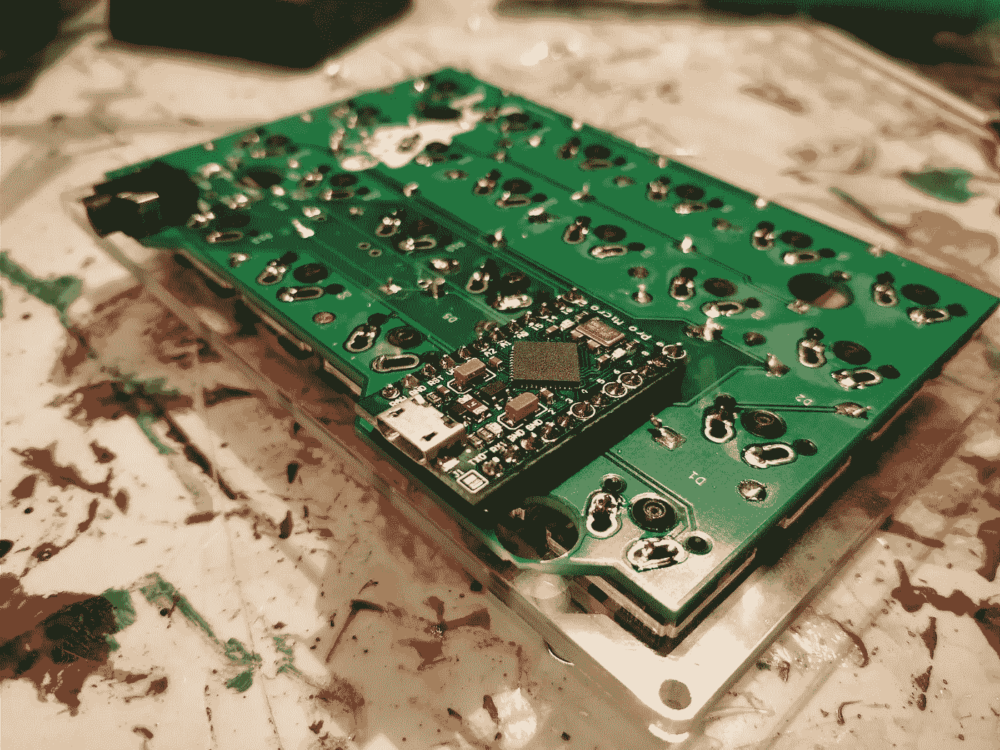

Thanks for reading and please leave a comment or send me a [tweet](https://twitter.com/jesperht) if you found this post interesting or useful!