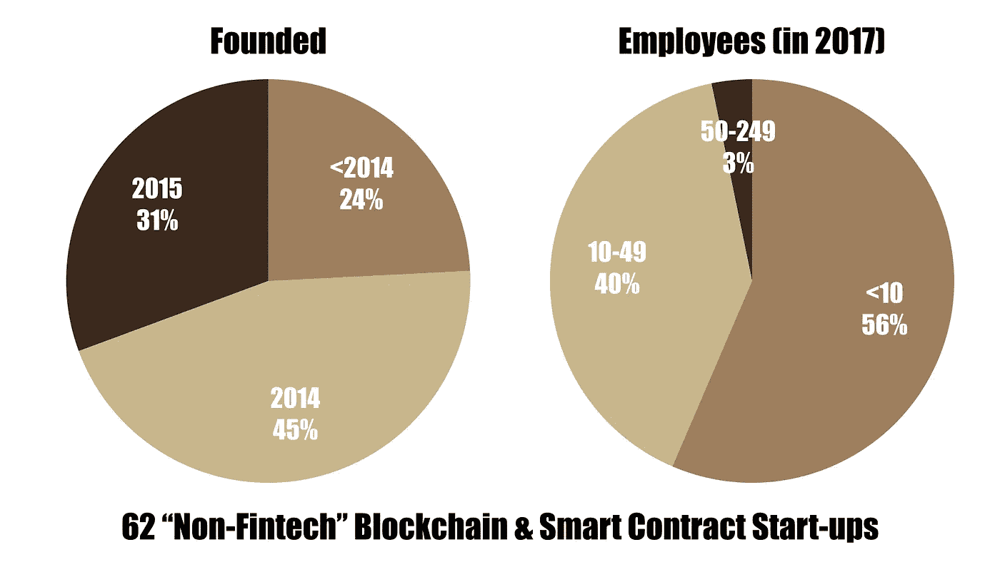

# 区块链革命缺少什么？

> 原文：<https://medium.com/hackernoon/what-is-missing-in-the-blockchain-revolution-4f6383d65dc7>

## 我们需要更多聪明的“奇怪夫妇”(想想史蒂夫和沃兹)

区块链和智能合约这几天很火。似乎每个人都在谈论这些新的“突破性”技术，以及它们将如何改变世界。

你不得不承认:在消除官僚主义、人为错误和欺诈的同时，数字化存储记录和交换价值的可能性听起来非常有吸引力。

区块链技术有可能改变我们的生活方式和商业运作方式。倡导者认为，它可以变得比互联网更大，互联网“只是”传输信息。

然而，区块链革命遗漏了一些重要的东西。这是确保区块链和智能合约发挥全部潜力的必要因素。

答案？我们需要更多技术专家和非技术专家的“奇怪组合”,一起向市场提供应用程序，提供有意义的体验，为企业和消费者增加价值。

想想史蒂夫·乔布斯和史蒂夫·沃兹尼亚克。没有“史蒂夫”的远见，“沃兹”只是一个在地下室组装电脑的电子呆子。没有“沃兹”的工程技术，“史蒂夫”是一个幻想家，梦想着建立世界上最大的公司。

在苹果和其他科技公司的成功中，科技和商业两个世界之间的创造性伙伴关系一直是至关重要的。

Steve Jobs and Steve Wozniak with an Apple I

# 区块链愿景

今年早些时候，我在纽约的联合国。促进创业和扩大规模已提上日程。我们讨论了有关商业登记、所有权的确认和转让、投票等问题。以及它们应该如何现代化和简化。

在聆听讨论时，区块链技术和智能合同似乎是初创公司和规模扩大公司在当今商业环境中遇到的许多问题和障碍的解决方案。

 [## 区块链革命(终于)成为现实的 3 个理由！

### 区块链和智能合同如何有潜力帮助联合国解决经济、社会、文化和…

medium.com](/startup-grind/3-reasons-why-the-blockchain-revolution-is-finally-becoming-a-reality-63bdd90c89e2) 

想想吧。经济和监管遗产使得创业和经营变得缓慢而官僚。对中介的需要只会增加建立和经营企业的麻烦。

这就是区块链技术的威力。分布式分类账/数据库的引入为企业及其利益相关者提供了一个透明、分散且安全的系统，该分布式分类账/数据库维护着一个不断增长的有序记录列表，每个人都相信该列表是准确的。

当我们考虑“智能合同”时，事情变得更有希望。如果计算机代码和协议能够自动验证、执行和实施某项商业协议的某些条款和条件，那么昂贵的中介机构的角色将真正变得过时。

区块链和智能合约的普及似乎可以极大地推动新产业和新技术的出现，如物联网、人工智能和大数据分析。

但这并不止于此。任何目前依赖于中央集权机构的行业或组织都很容易被颠覆。

共识、有效性、认证和信任的自动化似乎让越来越多的初创公司能够做一些曾经似乎不可想象的事情:颠覆传统行业。在这里，我们不仅要考虑“银行和支付行业”，还要考虑“供应链管理”、“保险”、“医疗保健”。“能源管理”、“零售”、“房地产”，甚至“政府”。

# 区块链现实

但围绕区块链科技和智能合约的讨论并不都是积极和建设性的。周围有很多怀疑。许多这种怀疑似乎是有道理的。

在我最近参加的大多数活动中，讨论最终都集中在与区块链应用程序相关的各种问题和挑战上。

首先，有**技术挑战**。区块链专家和爱好者越来越多地提到技术问题，特别是与计算能力和存储容量限制有关的问题。能源密集型的采矿和共识过程使得区块链技术和智能合同成为相对缓慢和昂贵的解决方案。具有讽刺意味的是，更快、更节能的超级计算机增加了区块链技术对黑客和欺诈的敏感性，引发了安全问题。

 [## 科学家可能已经找到了对抗量子计算机区块链黑客攻击的方法

### 简而言之，虽然量子计算机可以通过减少处理时间来改善世界，但它们也可能是理想的…

futurism.com](https://futurism.com/scientists-may-have-found-a-way-to-combat-quantum-computer-blockchain-hacking/) 

其次，还有**监管挑战**。监管风险通常是议程上的重点。正在为起草区块链特有的条例提出提案和建议。受误解的驱使，这些提案往往强调在与责任、隐私、数据保护和公平相关的领域进行监管干预的必要性。显然，比特币等加密货币的声誉、波动性和波动性增加了监管层的兴趣和担忧。

最后，还有**业务挑战。对于任何有意推动区块链的人来说，技术问题和监管风险都不是主要的担忧。迫切需要建立更多相关的商业案例，以便该技术能够为企业和消费者增加真正的价值。**

不应低估为区块链构建商业案例的挑战。至少，该领域初创企业的数据似乎表明了这一点。例如，仅仅将“区块链技术”引入现有的商业模式不足以与成功的平台公司竞争(并破坏它们)，如*亚马逊*、 *Spotify* 或 *Lyft* 。区块链技术不能简单地取代现有平台公司提供的社区感、亲切感和忠诚度。

因此，仔细观察区块链的初创公司就会发现，这些公司中的绝大多数都存在严重的规模问题，这就不足为奇了。

Source: Mattermark

显然，区块链导向的初创企业很难将其新业务转变为可持续发展的企业。

所有这些的要点是什么？区块链技术具有巨大的潜力，但技术、监管和——特别是——商业挑战似乎阻止了该技术的可扩展性和成功。至少目前，比特币等加密货币是个例外。

那么，应该做些什么呢？将区块链推向主流的缺失因素是什么？

# 缺失的成分

点对点音乐分享的发展是有指导意义的。

Napster 面临许多技术挑战，尤其是监管方面的挑战。然而，尽管有这些最初的挑战，音乐共享技术仍在发展，并最终找到了在不牺牲流媒体服务的便利性和可访问性的情况下向消费者收费的方法。该技术成功地与引人注目的业务逻辑相结合，提供了一种独特的服务，并在全球获得了成功。想想 Spotify。

区块链和智能合约需要经历类似的转变。因此，看看 Ujo Music 会发生什么很有趣。Ujo Music(2015 年与音乐人*伊莫金·希普*合作后)将于今年 7 月在区块链发布一个“音乐分享平台”。该平台使用以太坊区块链，允许艺术家“*拥有和控制他们的创作内容，并因与世界分享他们的音乐才华而直接获得报酬*”。

那么，如何在区块链的背景下促进这种转变呢？如何将一项目前面临多重挑战的技术带入主流？

嗯，首先，非技术人员需要更多地参与到关于技术如何被使用的讨论中。特别是，**非技术专家需要与熟悉技术的人进行公开对话，以便共同创造一个令人信服的商业逻辑来接受新技术。**

# “让我们拭目以待”

但是让非技术人员扮演更积极的角色，说起来容易做起来难。

首先，出于对“专家”技术知识的不恰当的尊重或顺从，非技术专家可能不愿意带头讨论以区块链为基地的相关技术。他们害怕谈论区块链和智能合约。他们觉得缺乏专业知识剥夺了他们的发言权。

对监管问题的更多认识也会助长这种消极的“让我们等着瞧”的态度。

但是这种被动是错误的。

为了开发一项新技术的令人信服的商业案例，它需要那些对技术没有深刻理解，但拥有不同技能的人的投入、远见和想象力，尽管这些技能是至关重要的。

# 我们需要更多的“奇怪夫妇”

区块链的技术人员需要区块链生态系统中其他利益相关方更积极主动的回应。

当前区块链的发明和想法通常不会超过一个 ICO(初始硬币发行)来开发一个 DAO(分散式自治组织)或 Dapp(分散式应用程序)。

 [## 一个区块链 VC 对 ico 和 Appcoins 的看法

### 注:以下是我个人的想法，不代表 DCG 在这些问题上的立场。

insights.dcg.co](https://insights.dcg.co/a-blockchain-vcs-perspective-on-icos-and-appcoins-3b2683f30683) 

其他区块链专家专注于在以太坊上编写智能合约，使他们能够将代币从一个账户转移到另一个账户，但未能为他们的成就增添任何真正的商业意义。

相反，非技术人员需要观察、学习和适应。对于那些活跃在商业、供应链管理、能源管理和法律领域的人来说尤其如此。他们需要与技术专家一起工作，就如何利用区块链技术形成一个愿景。这个愿景的技术实现可以留给技术专家。

这样，*非工艺师*和*工艺师*就成了一种“奇对”，类似于*史蒂夫*和*沃兹*。这些“奇怪的夫妇”能够将两个世界融合在一起，相互挑战，创造出新的有价值的想法。

# 一起变聪明

要让“奇数对”策略发挥作用，需要满足三个条件:

(1)技术人员和非技术人员都必须能够**欣赏彼此的语言**。至少，他们应该愿意倾听和相互学习。区块链技术目前的一个问题是人们相互不理解。更糟糕的是，大部分时间他们认为他们有。

 [## 这个区块链是什么东西？

### 我生活在区块链和智能合约的世界里。我听到人们使用的术语让我想起了我们…

medium.com](/startup-grind/what-is-this-blockchain-thing-a5d2abb99297) 

(2)技术专家和非技术专家都应该**认识到将“技术”和“非技术”(商业/管理/法律)结合在一起的机会和竞争优势**。这意味着欣赏开放和参与的伙伴关系的价值。

(3)**非技术人员需要学会创造性思维和“跳出框框”。特别是，他们应该无视“旧世界”的想法和概念。这并不是说这些想法/概念不能应用，但它们不应该成为讨论和协作的起点。**

作为一个非技术专家，使用旧世界解决方案的诱惑是显而易见的。但它几乎总是适得其反，因为它扼杀了创造吸引大众的新技术所必需的那种创造性合作。

如果这些条件得到满足，那么区块链技术的下一个重大用途将变得显而易见。

区块链技术和智能合同将能够更好地解决社会问题，满足社会需求。此外，还将创造一个对区块链更加友好的商业或监管环境。

这项技术的全部潜力才能实现。

*感谢您的阅读！请按下“心脏按钮”或留下评论。*

每周都有新的故事。因此，如果你关注我，你不会错过我关于颠覆性技术的指数增长如何改变我们生活和工作方式的最新见解。