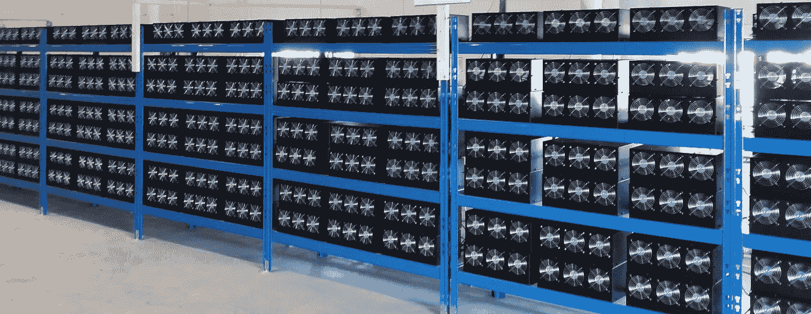

# 什么是利害关系的证明？

> 原文：<https://medium.com/hackernoon/what-is-proof-of-stake-8e0433018256>

随着以太坊从工作证明系统切换到这个系统，利益证明系统最近吸引了很多关注。股权证明是区块链交易验证的替代流程。它越来越受欢迎，并被几种加密货币采用。要理解利害关系证明，对工作证明有一个基本的概念是很重要的。在撰写本文时，工作证明方法被比特币、以太坊和大多数其他主要加密货币使用。

**工作证明**

工作证明是一个挖掘过程，用户安装一个功能强大的计算机或挖掘钻机来解决复杂的数学难题(称为工作证明问题)。一旦对各种交易成功地执行了几次计算，经过验证的交易就被捆绑在一起，并存储在分布式分类账或公共区块链上的新“块”中。采矿验证交易的合法性，并创建新的货币单位。

这项工作必须对矿工来说难度适中，但要便于网络检查。网络上的多个矿工试图成为第一个找到关于候选区块的数学问题的解决方案的人。第一个解决问题的矿工同时向整个网络宣布他们的解决方案，反过来接收协议提供的新创建的加密货币单位作为奖励。

随着更多的计算能力被添加到网络和更多的硬币被挖掘，创建一个新的区块所需的平均计算次数增加，从而增加了矿工赢得奖励的难度。在工作货币证明中，矿工需要收回硬件和电力成本。这给新生成硬币的加密货币价格带来了下行压力，从而鼓励矿工不断提高采矿设备的效率，并寻找更便宜的电力来源。

比特币是使用工作证明系统的加密货币的一个例子。

Mining rigs in a bitcoin mining facility.

**股权证明**

与工作证明系统不同，在工作证明系统中，用户通过执行一定量的计算工作来验证交易并创建新块，利益证明系统要求用户出示一定数量的加密货币单位的所有权。

新区块的创建者以伪随机方式选择，取决于用户的财富，也定义为“赌注”。在标桩证明制度中，区块被称为“伪造”或“铸造”，而不是开采。在该系统中验证交易并创建新区块的用户被称为伪造者。

在大多数股权证明案例中，数字货币单位是在货币发行时创建的，其数量是固定的。因此，伪造者不是使用加密货币单位作为奖励，而是收取交易费作为奖励。在少数情况下，可以通过增加硬币供应量来创造新的货币单位，伪造者可以获得新的货币单位作为奖励，而不是交易费。

为了验证交易和创建区块，伪造者必须首先将他们自己的硬币放在“赌注”上。把这想象成他们的财产存在一个托管账户中:如果他们确认了一个欺诈交易，他们就失去了他们的财产，以及他们未来作为伪造者参与的权利。一旦伪造者投入了他们的赌注，他们就可以参与到伪造过程中，并且因为他们投入了自己的钱，所以理论上他们现在被激励去验证正确的交易。

该系统不提供在加密货币的创建阶段处理硬币的初始分配的方法，因此使用该系统的加密货币要么从 ICO 开始并出售其预先开采的硬币，要么从工作证明系统开始，并在稍后切换到股份证明系统。

目前运行股份证明系统的密码有 BlackCoin、Lisk、Nxt 和 Peercoin 等。

Proof of work mining versus proof of stake forging.

**块选择方法**

为了使利益证明方法有效工作，需要有一种方法来选择哪个用户可以在区块链伪造下一个有效区块。仅凭账户余额的大小来选择伪造者，将会给那些决定押注更多加密货币单位的富裕伪造者带来永久的优势。为了解决这个问题，人们创造了几种独特的选择方法。这些方法中最流行的是“随机区组选择”和“基于硬币年龄的选择”方法。

*随机区组选择*

在选择的随机区组选择方法中，一个寻找具有最低散列值和他们的赌注大小的组合的用户的公式被用于选择下一个伪造者。由于赌注的大小是公开的，每个节点通常能够预测哪个用户将被选中来伪造下一个区块。Nxt 和 BlackCoin 是两种使用随机化分组选择方法的赌注加密货币证明。

*基于硬币年龄的选择*

基于硬币年龄的系统基于潜在伪造者投入的赌注的“硬币年龄”来选择下一个伪造者。硬币年龄的计算方法是将加密货币硬币作为赌注持有的天数乘以被下注的硬币数量。硬币必须持有至少 30 天才能竞争一个街区。已经下注旧的和更大的硬币组的用户有更大的机会被分配来伪造下一个块。一旦用户伪造了一个区块，他们的硬币年龄被重置为零，然后他们必须等待至少 30 天才能签署另一个区块。用户被分配在最长 90 天的时间内伪造下一个区块，这防止了具有非常老的和大的股份的用户控制区块链，从而使网络更加安全。因为伪造者成功的机会越大，他们不能造出一个方块的时间越长，伪造者可以更有规律地造出方块。这种机制促进了一个健康的、分散的锻造社区。Peercoin 是一种基于赌注证明系统的加密货币，它使用硬币年龄选择过程结合随机选择方法。Peercoin 的开发者声称，这使得对网络的恶意攻击更加困难，因为购买超过一半的硬币可能比获得 51%的工作证明哈希能力更昂贵。

大多数赌注证明硬币以交易费的形式支付报酬，用于验证交易和创建新区块，并设定目标利率，用户可以期望从赌注硬币中获得该利率。在伪造者创造新硬币的加密货币的情况下，这个比率也成为货币供应随着时间推移而膨胀的最大比率。

标桩验证系统更环保、更高效，因为电力和硬件成本远低于工作验证系统中与采矿相关的成本。鼓励更多的人经营节点并参与其中，因为参与这一系统既容易又负担得起；这导致了更多的权力下放。

这只是股权证明制度的一般指南。当每个加密货币发行者发行他们的货币或从工作证明系统转换时，他们很可能用他们自己的一套独特的规则和规定来定制这个系统。此外，这是一个快速发展的行业，除了工作证明和股份证明之外，目前还有其他几个正在测试和试验的交易验证和块创建系统和方法。

—

下一步:找出什么是[委托股权证明](https://hackernoon.com/what-is-delegated-proof-of-stake-897a2f0558f9)！

[沙安雷](http://www.shaanray.com/)

关注媒体上的 [Lansaar Research](https://medium.com/lansaar) ,了解最新的新兴技术和新的商业模式。

 [## 沙恩·雷

### 来自 Shaan Ray 的最新推文(@ShaanRay)。创造新价值和探索新兴技术| ENTJ | #科学…

twitter.com](https://twitter.com/shaanray)