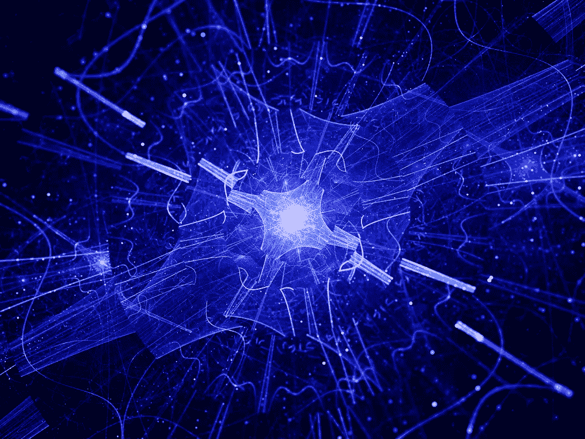
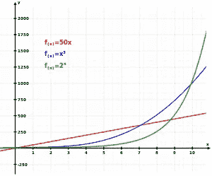

# 关于量子计算，IT 经理应该知道什么

> 原文：<https://medium.com/hackernoon/what-it-managers-should-know-about-quantum-computing-bdd6925086a8>

[Licensed from ShutterStock #325489403]

> 本文针对的是处理企业 IT 基础设施和战略的成熟分析型技术经理。这篇文章用与 IT 经理相关的术语解释了量子计算，并提出了利用这项新技术的未来商业机会。

另一波浪潮将影响全球信息技术(IT)。它被称为量子计算(QC)。好消息是 IT 经理在接下来的 3-5 年内不需要做任何事情。然而，他们现在应该开始以不同的方式思考 QC，尤其是如果他们是分析驱动型公司的一部分。本文的目标是回答这些问题:

*   IT 经理应该了解 QC 的哪些内容？
*   IT 经理应该如何为业务分析制定不同的计划？

# QC 很诡异

准备好以不同的方式——非常不同的方式——思考 QC 是如何运作的。感觉就像在黑白电视上看一集老的阴阳魔界。

经过一个世纪的理论物理剧变，科学家们现在得出结论，量子力学比经典牛顿物理学更“自然”。幸运的是，对于我们的理智来说，量子力学生活在它自己的世界里，处理非常非常非常小的事物。然而，小并不意味着无足轻重。人类所知道的一切，从键盘上的手指运动到星系的形成，都归功于量子力学的基本特性。它是我们感觉到的现实的基础，尽管这个基础超出了我们的直觉。

为什么 QC 对一个 IT 经理如此重要？答案通常是调用海森堡的测不准原理、纠缠、叠加、相干等的深度解释。如果你有时间，去上一学期的量子力学研究生课程。如果时间紧迫，请阅读下面的备忘单。

# 质量控制是关于量子位的

简而言之，IT 经理的关键概念是*量子位*，它就像经典计算机中的比特和字节。然而，这些量子位拥有怪异的超能力。

自 2016 年 5 月以来，IBM Quantum Experience 提供了一个 5 量子位系统进行实验，数十名研究人员和学生已经利用了该系统。[【3】](#411e)和 20 世纪 50 年代的早期计算机一样，这种系统不能支持实际应用，因为 5 位只能代表 32 种不同状态中的一种。与经典计算机不同，根据一个潜在的概率波函数，5 量子位可以同时代表所有 32 种状态**……不管那是什么！简单地说，考虑下面的类比。**

# **质量控制就像一次大规模的掷硬币**

**五十个人被要求在空中抛硬币。他们被紧紧地挤在房间里，并得到一枚特殊的硬币，硬币上有数字，不公平地偏向正面或反面。在 1-2-3，每个人把硬币抛向空中，让它们落在地板上。将每枚硬币的结果制成表格。**

**在一瞬间，所有 50 枚硬币的旋转通过气流或碰撞受到所有其他硬币的影响。这就像 QC 纠结。当硬币旋转时，问某个硬币是正面还是反面是没有意义的。这就像质量控制的不确定性。此外，硬币旋转得如此之快，以至于它的状态不是正面或反面，而是正面和反面的混合。这就像是 QC 叠加。最后，当硬币落地时，纠缠突然停止。这就像失去了质量控制的一致性，这是质量控制的一个关键设计问题。**

# **质量控制有指数力量**

**和所有的类比一样，大规模抛硬币并不符合真实情况。奇怪的事情开始了…**

**在掷硬币的过程中，两个硬币可能会相互作用。然而，两个硬币在旋转时只代表 4 种状态(00，01，10，11)中的一种。同样，3 个硬币代表 8 个州中的一个，4 个硬币代表 16 个州中的一个，依此类推。相比之下，由于叠加，3 个量子位同时代表了所有的 8 种状态。重点是:n 币系统代表 *n* 位信息，而 n 量子位系统代表*2^n(*2*t5】到 *n* 次方)位信息。起初当 *n* 较小时，两个系统差别不大。然而，随着 n 变大，n-量子位系统变得指数地更强大，以代表不断增加的复杂性。***

****

**WikiMedia image showing exponential growth in green**

**情况变得更奇怪了…如果它们纠缠在一起，量子位可以对其他量子位的变化做出即时反应，不管它们相距多远。如果这种纠缠以逻辑门的形式连接在一起，那么任何 2^n 复杂性的动态系统都可以被模拟(即基于当前状态预测未来行为)。此外，如果该连线包含搜索或优化逻辑，则可以预测系统的发现或增强。因此，QC 指数幂也可以是智能的。**

**警告…指数的力量是不直观的！尽管储蓄的复利和计算机的摩尔定律是指数幂的常见例子，但大多数人认为正常世界的变化是线性发生的。此外，指数变化的早期阶段似乎表现为线性，但随后，它的增长超出了人类的想象！当这些指数变化以惊人的方式爆发(或崩溃)时，人们会感到惊讶，并假设新的未知原因。**

**鉴于这种指数能力，对于“硬”算法，一台质量控制计算机最终将完全(完全、绝对……)胜过任何经典计算机。研究人员预测，当 50 或更多量子位的量子控制系统可靠地商业化时，这个转折点将在未来 3-5 年内发生。**

**相比之下，地球上沙粒的数量大约是 10 个⁹，整个宇宙中的恒星数量是 10 个⁰.一台 100 量子位的计算机(拥有 10 个⁰态)可以代表、模拟和优化任何可以想象的复杂系统，比如全国大型炼油厂之间的改进流程配置，或者特定通用型新药的创新分子结构。**

# **质量控制就像一个电力公司**

**IT 经理应该购买商业化的质量控制系统吗？大概不会，除非你是一个三个字母名字的大型政府机构。可能的答案是将质量控制视为由工业规模的公用事业公司提供的云服务，比如发电厂。**

**这将与通常的[数据中心](https://en.wikipedia.org/wiki/Data_center)不同，后者由许多相似服务器机架的过道组成。不同的是，QC 系统必须冷却到非常接近绝对零度，才能支持纠缠所需的量子相干性。有大量的设备需要这样冷却。**

**因为测不准原理正在积极地发挥作用，一个可靠的 50 量子位系统将需要相当大的误差修正，这就需要更多的量子位。有些估计是这个数字的一千倍，也就是说，如果加上误差修正电路，一组 50 个逻辑量子位元的可靠组合，可能需要 50，000 个物理量子位元。**

**因此，不要期望 QC 计算是小而便宜的…并且在短期内可行！**

# **QC 就像一个 GPU**

**另一种考虑使用 QC 的方式就像一个[图形处理器单元](https://en.wikipedia.org/wiki/Graphics_processing_unit) (GPU)。请记住 GPU 的发展及其对桌面计算的影响。最初，早期的处理器将字符推送到视频缓冲区，在电视监视器上产生光栅扫描。随着图形的发展，这一功能得到了独立 GPU 板的支持，为文本、图像和视频提供高清分辨率。想想【Windows 10 的 DirectX】。最近，新的接口允许使用 GPU 板进行快速矩阵计算，与图形处理无关。例如，像 NVidia CUDA 和 OpenCL 这样的接口为 GPU 提供了快速矩阵计算的接口。[【4】](#4f05)**

**同样，质量控制也不会取代经典计算。QC 将通过针对特定“硬”算法的 web 服务来增强经典计算。好消息是，从大型主机到移动智能手机都可以使用 QC 增强功能。对这些 QC 增强功能的访问将依赖于特殊界面(API)。**

**例如，IBM Quantum Experience 提供了一个[开源瘦 Python 包装器 QISKit](https://developer.ibm.com/open/openprojects/qiskit/qiskit-api/) ，它使用 HTTP API 在 IBM 的 5 量子位 QC 系统上执行 OPENQASM 代码。这些质量控制接口将成为获得质量控制增强好处的门户。**

****

**IBM QISKit Code Example , IBM developerWorks Open Tech Talk 2017–03–29**

**您何时需要这些 QC 改进？答案是:…当你需要处理一个“硬”算法时。**

# **QC 是针对硬算法的**

**这些“硬”算法是什么？就像使用 GPU 处理特殊的 3D 图形一样，QC 有可能找到解决没有简单算法的问题的方法。形容词“简单”和“困难”意味着找到解决方案所需的资源量(时间、处理、存储)的粗略衡量。**

**计算机科学家使用 O(n)、O(n)或 O(2^n 的概念对算法的复杂性进行粗略分级，这意味着复杂性分别以**线性**、**多项式**或**指数**的方式增加。简单算法是线性和多项式算法，而困难算法是指数算法。**

**只有硬算法的问题称为 NP 完全问题，其中 NP 表示“非确定性多项式时间”。硬算法通常是通过找到一种“足够好”的算法来避免的，这种算法可以产生最佳答案的启发式猜测。关键是找不到一种简单的算法来产生最优解。此外，我们无法知道存在任何简单的算法。这个主题有一个不断发展的文献。[【5】](#6eed)**

**对于从事大数据分析的公司来说，这是一个关键的区别。当问题复杂性增加时，IT 经理应该理解资源权衡。业务问题是…随着问题的扩展，所需的资源如何表现？对解决问题的时间有什么影响。此外，公司根据分析结果采取行动的速度有多快。**

**例如，假设一家公司为一家商店设计了一个分析应用程序的原型。当证明有用时，该公司计划在所有商店推广该应用程序。会发生什么？**

**一家商店有几千名顾客。但是对于所有的商店来说，都有几百万的顾客，意味着千倍的增长。如果分析应用程序的算法是线性复杂度，需要 10 倍于当前资源，IT 经理可能会将应用程序从小型服务器转移到大型服务器。问题解决了！如果算法是多项式的，需要 10⁶乘以当前资源(与大多数分析一样)，管理器将旋转 100 个弹性云实例。问题解决了！如果该算法是指数级的，需要当前资源的 2 倍⁰⁰⁰，则管理器已经碰到了“指数墙”。问题永远解决不了！**

**这个例子的一个重要转折是…如果能够找到更快的解决方案，商业价值会如何增加？**

**例如，假设另一家公司依赖于一个关键业务流程的分析应用程序。目前计算需要一个多小时，因此影响了日常业务周期。如果公司能在不到一秒钟的时间内完成同样的分析，会怎么样？如果是这样的话，该公司可以将这种分析嵌入到智能手机应用程序中，这样顾客就可以在逛商店时快速扫描产品条形码。这将改变客户与该公司的基本互动。这种大幅缩短分析行动时间的商业价值是什么？**

# **质量控制是为了实施分析**

**正如建议的那样，开始考虑大商业机会的质量控制，创造可持续的竞争优势，并可能改变你所在行业的性质。考虑让关键业务流程变得更智能。消除与客户和供应商互动中的摩擦。像亚马逊、优步和 Airbnb 一样，只需点击一下，交易就完成了。关键促成因素是使这些业务流程可操作化的分析。这不是你母亲的分析，两周的研究结果只有一个幻灯片。**

**关键原则是…分析使人能够概括已知数据以外的可靠性。已知(或可见)数据和未知(或不可见)数据之间有明显的区别。在许多形式中，分析分析已知数据(如来自数据仓库或数据湖的数据)以创建模型，该模型用于概括未知数据(如未来销售收入的预测、广告印象的点击率或电影或书籍的推荐)。**

**该模型使用已知数据进行训练。但是，一部分已知数据被“保留”(隐藏)以验证模型。最终模型的质量取决于训练数据与验证数据分开保存的仔细程度。一旦模型经过训练和验证，它就可以在业务流程中操作，以增强其“智能”。训练一个模型的努力可能是困难和昂贵的，但是一旦完成，模型的执行通常是快速和廉价的。**

**这种培训-验证范例与质量控制有什么关系？**

**十年来，业务流程的设计发生了转变，不再是静态数据的批处理流程，而是动态数据的流(或连续)流程。对于旧的批处理过程，假设在先前的批处理上训练的模型对于随后的批处理仍然有效，这些批处理可能在时间、地理、客户群和产品线方面有所不同。全球经济已经变得过于复杂，这种假设无法支持一键式交易。公司被迫不断进行培训，作为处理流数据的一部分。因此，用于分析的行动时间参数不断增加，并稳步超过经典计算的能力。**

# **QC 影响打包分析**

**公司可以通过两种方式使用分析应用程序:定制和打包。自定义分析是为某个公司开发的，用于解决特定的业务问题。开发可以通过多种方式完成，尽管所有方式都将使用传统 IDE(交互式开发环境)中的基本 QC API，例如在 Jupyter 笔记本中使用 Python。定制分析将是第一个紧急质量控制应用；然而，它们的影响将仅限于该公司。**

**当嵌入 QC smarts 的打包分析应用程序出现在广泛的用例中时，例如营销活动管理和制造质量控制，将会产生跨行业的重大影响。因此，请注意那些已经建立的应用程序供应商，他们会成为 QC 的有力采纳者，在他们的服务中嵌入硬分析算法。**

# **质量控制促进知识流动**

**从战略角度来看，全球财富积累方式发生了“重大转变”。财富的创造不是从知识存量(如专有秘密、专利等)中产生的，而是转移到基于公司检测、捕捉、提取和利用许多不同数据流的能力的知识流中。[【6】](#56da)**

**与当前的数据湖策略不同，只有在新知识被创造出来并回馈给社区的情况下，来自知识流动的财富才是可持续的。正如哈格尔、西利·布朗和戴维森在[所言，放弃股票，拥抱流动](https://hbr.org/2009/01/abandon-stocks-embrace-flows.html)，“知识流动倾向于集中在相互分享和学习的参与者中间。”这意味着深度学习算法的巨大计算需求，以正确消化流量和分享知识。质量控制可能是在全球范围内履行这一职能的唯一可行的方法。**

# **质量控制行动计划**

**质量控制是另一个具有高度不确定性的技术浪潮，但对于某些用例来说也具有很大的潜力。从 IT 经理的角度来看，问题不在于商业上可行的质量控制系统是否可用或何时可用。关键问题是:**

*   **人们可以通过 QC 产生哪些真正的商业影响？**
*   **QC 用例将带来哪些巨大的商业机会？**
*   **根据计算复杂性来管理关键业务流程是否有价值？**

**这里有一些实用的建议，让你为 QC 工具的到来准备好你的公司 IT 策略。**

1.  **将 QC 放在你的 5 年雷达上。提醒 IT 战略和规划人员注意 QC 潜力，以便所有人都能开始浏览出现在贸易出版物和活动中的 QC 材料。在《华尔街日报》上为任何关注质量管理业务影响的质量管理文章创建一个提醒。**
2.  ****监控当前分析应用的计算复杂性。**对您的分析应用进行一次全面的普查。每当应用程序向上扩展时，都要仔细观察。执行时间、存储需求和 I/O 带宽如何变化？此外，测量行动时间以考虑端到端的反应时间。如果您的算法具有线性或多项式行为，请放心！如果没有，认真对待 QC，在这些建议上投入更多的资源。**
3.  ****思考运营分析的巨大机遇。**戴上你的创新帽子。想象你是一个客户或供应商，或者是装配线上的一个小部件。你怎样才能让你的生活变得更好更快乐？**
4.  ****准备好您的数据科学团队。他们可能在太多的项目中埋头苦干。对他们来说，QC 是一个遥远的幻想，所以慢慢来。开始讨论机器学习算法的计算复杂性以及它们所依赖的云计算类型。****
5.  ****建立适当的技术合作伙伴关系。开始向你的战略技术合作伙伴询问他们的质量控制计划。如果他们的回答是干瞪眼，不要试图教育他们。寻找合作伙伴，这个问题可以激发有用的对话。对于 IT 基础架构和高级打包分析应用程序的战略供应商来说，这一建议尤其正确。****
6.  ****保持开放灵活的心态。** QC 很诡异，不直观。它需要从根本上脱离当前的 It 概念和技术。就像 20 世纪 60 年代开始的人工智能一样，质量控制技术会有许多起伏，多次运用 S 形曲线。在接下来的几十年里，它将看起来是死的，然后是人类最伟大的技术。为这一个在技术浪潮之上冲浪！**

> **非常感谢您对 IT 经理改进此行动计划的意见。谢谢你…**

# **笔记**

**[1] **IBM QC 公告**:2017 年 3 月 6 日 [IBM 公告](https://www-03.ibm.com/press/us/en/pressrelease/51740.wss)包含实质性内容，有几个有趣的视频。新的 Quantum API 在这个[开源 github](https://github.com/IBM/qiskit-api-py) 上可用。IBM 实验量子计算经理 Jerry Chow 在 2015 年 12 月的 TED 演讲中解释了一个实际的量子位板。来自 [Nature](http://www.nature.com/news/ibm-s-quantum-cloud-computer-goes-commercial-1.21585) 、 [Scientific American](https://www.scientificamerican.com/article/ibm-will-unleash-commercial-universal-quantum-computers-this-year/) 和 [MIT Technology Review](https://www.technologyreview.com/s/603699/quantum-computers-finally-go-head-to-head/) 对 IBM 的公告有实质性的评论。**

**[【2】](#7e30)**QC 背景介绍**:量子计算的[维基百科词条是一个很好的起点。轻松阅读，跟随众多链接中的几个(如](https://en.wikipedia.org/wiki/Quantum_computing)[QC 公司名单](https://en.wikipedia.org/wiki/List_of_Companies_involved_in_Quantum_Computing_or_Communication)——很多！).不要笑，但是卡恩学院有一个关于量子物理的[版块](https://www.khanacademy.org/science/physics/quantum-physics)。这是一个温和的介绍，其中有一堂关于海森堡测不准原理的好课。此外，最新一期的《经济学人》将其技术季刊用于此处、彼处和各处的文章。太棒了。但是要准备好八页厚的硬拷贝。**

**[【3】](#3127)**IBM 量子体验**:你愿意和 QC 动手吗？试试 [IBM 量子体验](http://research.ibm.com/ibm-q/qx/)，它不适合胆小的技术人员。在过去的一年里，这个网站获得了惊人的全球关注(4 万用户运行了 27.5 万个实验)。它还被用作 1，800 名学生的在线课程的一部分。Lev Bishop 的[存档网络研讨会是一个很好的概述，尤其是他的](https://developer.ibm.com/open/videos/qiskit-quantum-computing-tech-talk/)[演示](https://developer.ibm.com/open/wp-content/uploads/sites/50/2017/03/QISKit-Charts.pdf)中第 33ff 张幻灯片中显示的简单编码示例。**

**[【4】](#6606)**QC 接口**:对于 GPU 接口，请查看此[Nvidia CUDA 概述](https://en.wikipedia.org/wiki/CUDA)，以及 [Nvidia 的 CUDA 生态系统资源](http://www.nvidia.com/object/cuda_home_new.html)。开放的 GPU 接口是 OpenCL，由非营利组织 [Khronos Group](https://en.wikipedia.org/wiki/Khronos_Group) 在[本网站](https://www.khronos.org/opencl/)托管。**

****机器学习的 NP-完全算法**:在维基百科上，有一个关于 NP 复杂度的[概述，还有几个深入的条目，从](https://en.wikipedia.org/wiki/NP_(complexity))[NP-完全性](https://en.wikipedia.org/wiki/NP-completeness)开始，加上[时间复杂度](https://en.wikipedia.org/wiki/Time_complexity)。NIST 的斯蒂芬·乔丹的[量子算法动物园](http://math.nist.gov/quantum/zoo/)使用 QC 将计算复杂性与机器学习联系起来，列出了几十种硬算法。搜索“学习”页面，找到所有与机器学习相关的硬算法。很多！**

****大转变弃股，拥抱流动**:第一篇关于知识流动的文章是 HBR 的[弃股，拥抱流动](https://hbr.org/2009/01/abandon-stocks-embrace-flows.html)，紧接着是 HBR 的[大转变衡量变革力量](https://hbr.org/2009/07/the-big-shift-measuring-the-forces-of-change)。现在有相当多的关于这个话题的学术研究。**

**另外，请参见这些相关的媒体文章:**

*   **[**量子计算:入门**](/software-is-eating-the-world/quantum-computing-a-primer-580bc4160481)*by*[*Frank Chen*](https://medium.com/u/232fcbb483c?source=post_page-----bdd6925086a8--------------------------------)*(28 分钟的视频很精彩！)***
*   **[**三大量子神话和误解**](/quantum-bits/top-3-quantum-myths-and-misconceptions-2ae797550746) 作者[阿纳斯塔西娅·马尔琴科娃](https://medium.com/u/749235ee2082?source=post_page-----bdd6925086a8--------------------------------)**
*   **[**量子机器学习—阿伦森博士的《阅读小字》**](/quantum-bits/quantum-machine-learning-read-the-fine-print-525cb5fdb3a6) 作者[阿纳斯塔西娅·马尔琴科娃](https://medium.com/u/749235ee2082?source=post_page-----bdd6925086a8--------------------------------)**
*   **[**大规模颠覆——量子计算**](/abundance-insights/massive-disruption-quantum-computing-ee561c5c635f) 作者[彼得·迪亚曼迪斯](https://medium.com/u/deedc76c1c2?source=post_page-----bdd6925086a8--------------------------------)**
*   **[**什么是量子计算机，它们能跑马里奥赛车吗？**](/byspells-of-worldken/what-is-a-quantum-computer-and-can-they-play-mario-kart-92ff6954b622) 作者[詹姆斯·伍顿博士](https://medium.com/u/cd2ed3119495?source=post_page-----bdd6925086a8--------------------------------)**
*   **[**量子计算有可能发生在强 AI 之前吗？第一部**](https://blog.muneebali.com/is-quantum-computing-likely-to-happen-before-strong-ai-part-i-93bfcb6fc32b) 作者[穆尼布·阿里](https://medium.com/u/8dd3ab013f82?source=post_page-----bdd6925086a8--------------------------------)**

***原载于 2017 年 4 月 2 日*[*bolder.com*](http://bolder.com/blog/managers-know-quantum-computing/)*。***

************

> **[黑客中午](http://bit.ly/Hackernoon)是黑客如何开始他们的下午。我们是阿妹家庭的一员。我们现在[接受投稿](http://bit.ly/hackernoonsubmission)并乐意[讨论广告&赞助](mailto:partners@amipublications.com)的机会。**
> 
> **如果你喜欢这个故事，我们推荐你阅读我们的[最新科技故事](http://bit.ly/hackernoonlatestt)和[趋势科技故事](https://hackernoon.com/trending)。直到下一次，不要把世界的现实想当然！**

****