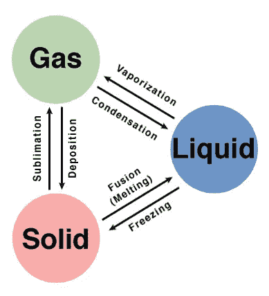

# 什么是好的测试

> 原文：<https://medium.com/hackernoon/what-makes-a-good-test-c9458f42b6b7>

测试用例旨在检查系统的健康状况，并在系统的某个部分没有按预期工作时发现问题。虽然这看起来非常明显和琐碎，但在实践中，这仍然是工程团队努力轻松实现的事情。可能会出现测试成功但系统不健康的情况，同样，失败的测试并不总是反映系统中的问题。尽管所有的测试都是出于好意，但并不是所有的测试都是好的。其中许多实际上在一段时间后变得毫无用处。

所以问题来了，是什么决定了一个测试的好坏。让我们来看看好的测试的一些标志:

## 一个好的测试本质上是决定性的:

一个测试用例的成功或失败应该能够有把握地判断一个系统或系统的一部分是好是坏。但是这不是很明显吗？实际上是这样，但是编写一个确定性的测试并不总是容易的。

什么会使测试变得不确定？

1.  **测试数据随机性**:

在许多情况下，数据的随机性是优选的。这样做的一个最主要的原因是减少总的运行时间。理论上，你可能有数以千计的测试数据组合，理想情况下，你想测试一切。但是测试也是资源密集型的，它消耗 CPU 周期，内存，最重要的是时间。

随机化是一种随机选取测试数据的某些变化并使用它们的方法。例如，假设你计划测试一个信用卡支付流程。你的主要目标是测试一些支付行为。现在你有很多信用卡可以选择，比如 Visa/MasterCard/Discover/Amex 等等。你不希望信用卡类型影响行为，但你也不太确定。一种选择是为所有的信用卡编写相同测试用例的变体。通过这种方式，您将能够说出每个用例的行为。但是因为你不希望它影响行为，所以你真的不想浪费 8-10 倍的资源和时间来测试可能不会发现任何不同的东西。相反，您选择另一个选项，在每次运行测试用例时，您随机选择一张卡片。这样，在一段时间内，你可以测试所有选项，也不会浪费很多资源。如果一些卡碰巧影响了行为，那么下次您只需添加特定的卡测试用例作为单独的测试。这是工业中非常常见的做法之一。

> 一个好的测试框架提供了用完全相同的值重复相同测试的方法，即使一开始它是随机的。

大多数框架使用一种叫做种子的东西来跟踪正在使用的随机值。因此，种子本身是随机生成的，但是如果某个特定的种子导致问题，并且您希望针对相同的行为重新运行测试，您只需将上次测试中相同的种子作为输入传递到您的测试中(种子通常是可选的)，它就会生成与上次测试完全相同的数据。因此，尽管测试数据的生成是随机的，但它提供了一种通过传递种子来重新生成完全相同的输入集的方法。

这就是它如何实现确定性的，尽管实际上是随机的。

**2。影响系统状态的测试**:

测试通常被编写为独立工作，但是被测试的底层系统可能基于测试的执行而改变其状态。因此，当您运行下一个测试时，先前的测试数据可能会影响下一个测试的结果。

例如，如果您有一个从账户 A 到账户 B 的支付测试，在测试之后，账户 A 的余额可能会更新，所以如果后续的测试用例使用相同的账户，它可能没有足够的余额来支付。

这给我们带来了一些有趣的选择:

一、测试用例的顺序:很多时候我们试图确保能够相互影响的测试用例按照系统状态不改变整体运行状态的顺序运行。

二。每个测试用例都有自己的设置和拆卸:这确保了所有的测试用例都从一个干净的石板开始。

选项 ii)看起来很合理，但通常很难维持，原因如下:

a.这是资源和时间密集型的:做整个设置，如创建一个帐户，添加融资工具等，增加了更多的测试开销。

b.了解整个系统是困难的:虽然一些众所周知的东西可能被很好地隔离，但挑战是要知道在一个有数百个子系统的大型应用程序中所有这样的状态变化并不容易。例如，尽管创建单独的帐户对于测试隔离来说似乎是足够好的步骤。我们真的不知道许多相似的描述是否会在测试数据中产生偏差。生产系统通常是为实践用例而编写的，但是在测试环境中，数据可能有点偏差。例如，在实践中，如果你记录所有账户持有人的生日，将会在很大的范围内有很好的分布。但是在测试环境中，您可能创建只有几个出生日期的帐户，或者在许多情况下有相同的出生日期。这扭曲了数据。因此，如果您尝试使用这种倾斜的键来加载数据，随着时间的推移，随着您运行越来越多的测试，加载性能会越来越差，导致测试的不确定性行为。在两个不同的时间运行相同的测试可能会导致不同的结果。

3 **。影响测试的外部系统**:

存在可能与外部系统交互的测试或被测系统。它们中的一些有时可能不可用，导致测试行为改变。

4.**并行测试执行**:

为了更快地执行测试，测试通常是并行运行的。虽然大多数时候这不是问题，但很多时候它们会干扰其他人。可能有多种因素会影响行为，如测试数据、测试框架本身的可伸缩性，有时受测试的底层系统本身可能无法并行处理用例。

## 好的测试完成得快，消耗的资源也少:

产品中每增加一个新特性，测试的数量就会呈指数增长。经过一段时间后，它增长得如此之快，以至于每次更改都运行它们变得太耗费时间/资源，而且由于时间的压力，它们中的许多甚至没有运行。一个耗费较少资源和时间的测试会非常方便，而且这些测试会持续更长时间。

## 一个好的测试不仅能告诉我们有问题，还能缩小到特定的组件/特性或代码路径:

尽管测试的目标是识别系统问题，但是测试的更大目标是帮助识别故障并快速修复。如果测试失败非常普遍，那么调试和发现导致延迟交付的实际问题将变得非常困难。测试失败点应该是集中的、具体的，并且应该包含足够的信息来调试问题。

## 一个好的测试很容易维护:

测试代码的预期寿命远远高于实际的产品代码。因此，其中很大一部分仍处于维护模式。产品行为的变化导致测试行为的相应变化。这种行为上的变化会导致测试代码的频繁变化。这些变化可以简单到改变一些预期的响应代码，也可以大到改变整个请求/响应，或者有时使测试代码变得完全多余。由于更改通常非常频繁，因此快速完成这些更改非常重要。任何维护成本高的测试注定会很快被跳过或忽略。

## 一个好的测试很容易在不同的环境下用最少的设置运行:

工程师通常对他们使用的语言和工具非常情绪化。团队越大，拥有不同偏好的机会就越大。面对如此多的工具和环境选择，重要的是所有的工具和环境都能够实现相同的目标，即在没有压力的情况下交付高质量的产品。有些人可能更喜欢在他们的桌面上运行测试，而许多人则希望按计划运行 Jenkin 作业。用最少的设置运行测试用例越容易，它被运行的机会就越高。类似地，更复杂的设置促使忽略这种影响整体质量的测试执行。

## 基于用例和失败点，很容易找到一个好的测试:

虽然大多数时候运行测试是为了发现问题，但很多时候却是相反的。您发现了一个问题，修复了它，现在想要验证修复是否正确。如果基于用例的测试不容易找到，很多时候人们倾向于运行整个测试套件，这不仅耗费时间和资源，而且对于所需的验证是否完成也没有足够的信心。这种担心导致人们运行更大的测试集，从而导致交付修复的巨大开销。容易发现的测试通常运行得更频繁，并能发现更多问题。

如果你一直在关注，你现在可能已经意识到，为什么编写一个好的测试是不容易的。你也可能已经观察过很多次了，不仅仅是孤立的测试，而是所使用的工具、框架和环境，共同构成了一个伟大测试的秘诀。

***感谢您阅读此文。如果你喜欢这个，并且认为其他人也会喜欢，你会按下绿色的“推荐”按钮或与朋友分享吗？***

> [黑客中午](http://bit.ly/Hackernoon)是黑客如何开始他们的下午。我们是 [@AMI](http://bit.ly/atAMIatAMI) 家庭的一员。我们现在[接受投稿](http://bit.ly/hackernoonsubmission)并乐意[讨论广告&赞助](mailto:partners@amipublications.com)机会。
> 
> 如果你喜欢这个故事，我们推荐你阅读我们的[最新科技故事](http://bit.ly/hackernoonlatestt)和[趋势科技故事](https://hackernoon.com/trending)。直到下一次，不要把世界的现实想当然！

