# 关于奥巴马的总统任期，真正的假新闻是什么

> 原文：<https://medium.com/hackernoon/what-real-fake-news-says-about-obamas-presidency-4bf42be71ff1>

## **奥巴马&洋葱**

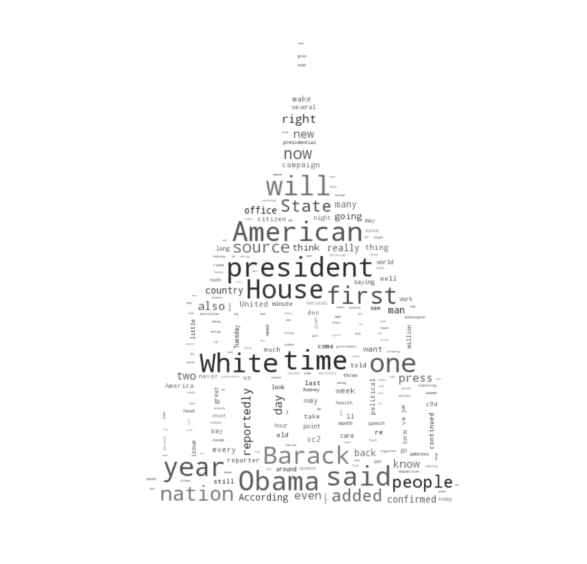

Generated using text The Onion wrote about Obama during his presidency

假新闻几乎是一种流行病。一些人认为[影响了选举](https://www.washingtonpost.com/news/the-intersect/wp/2016/11/17/facebook-fake-news-writer-i-think-donald-trump-is-in-the-white-house-because-of-me/?utm_term=.5c283fb079c8) ( [其他人不同意](https://www.poynter.org/2017/did-fake-news-help-elect-trump-not-likely-according-to-new-research/445724/))，脸书[投入了大量注意力](https://www.nytimes.com/2016/12/15/technology/facebook-fake-news.html)以最小化其传播，病毒式错误信息[影响了金融市场](http://www.businessinsider.com/fake-news-impact-on-financial-markets-2016-12)。

但是假新闻并不总是这样的恶棍。即使是故意制造的假新闻也包含对时事和娱乐的深刻评论。尤其是政治讽刺，在言论自由中扮演着重要的角色。

Generated using text The Onion wrote about Obama during his presidency

为了说明这一点，我收集了《洋葱报》在奥巴马总统任期内写的每一篇故事，由他们最终的《奥巴马告别》决定， [*黑人做了 8 年*](http://www.theonion.com/interactive/obama) 。《洋葱》可能是政治讽刺作品的中坚力量，也是我认为的“真正的假新闻”:娱乐性强，但虚假性好。(尽管这也值得一个星号，因为现任白宫新闻秘书肖恩·斯派塞最近删除了一条赞扬《洋葱》杂志一篇文章的推文。)

虽然《洋葱》在他们的特写中包括了 322 篇关于奥巴马的作品，但我缩小了分析范围，只包括书面报道，因此省略了总共 60 篇图片和视频作品。在剩下的 262 篇报道中,《洋葱》以相当一致的速度报道了奥巴马。

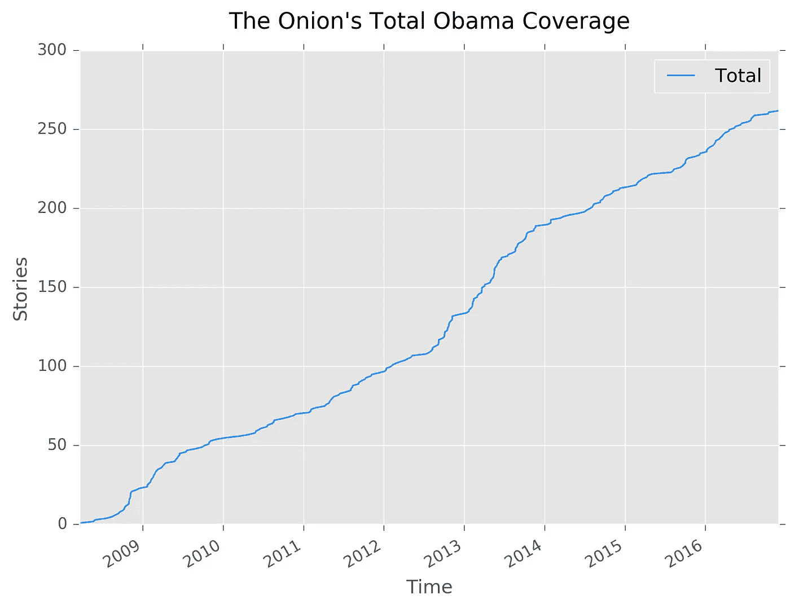

在最初的 2008 年民主党初选和随后的 2008 年总统选举之间有一个显著的早期增长，这遵循了从初选到大选候选人的传统覆盖模式。洋葱喜欢他们的选举写作，因为在 2012 年底奥巴马第二次总统选举之前，报道迅速增加。这个时代的头条新闻反映了这一点，包括 [*奥巴马在辩论中期用无人机攻击罗姆尼*](http://www.theonion.com/article/obama-takes-out-romney-with-mid-debate-drone-attac-30055) 和 [*这可能不是政治上的理想时刻，但现在是时候谈赔款了*](http://www.theonion.com/blogpost/this-may-not-be-the-ideal-moment-politically-but-i-30203) 。在整个 2013 年，故事继续以很高的速度出现，记录了奥巴马在应对叙利亚不稳定局势时遇到的困难，以及聚焦于米歇尔·奥巴马和奥巴马家庭的生活方式故事。

《洋葱报》发布的每篇报道都包括多达五个不同的标签，编辑人员会根据报道内容确定这些标签。虽然使用了 89 个独特的内容标签，但前十个内容标签占总标签的 79%。换句话说，相似内容非常集中(由洋葱使用的标签决定)。

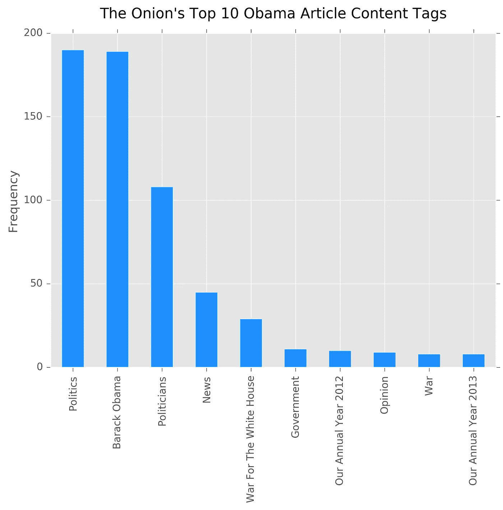

这是合理的。标签的目的是将信息整合到一组连贯的列表中。使用的具体标签并不令人吃惊:“政治”、“巴拉克·奥巴马”、“政治家”和“新闻”甚至占据了十大最常用描述符的大部分。然而，《洋葱》认为他们对奥巴马的报道是最好的，至少在他任期的中期。“2012 年我们的年度”和“2013 年我们的年度”，这是头条新闻的综述，都出现在十大标签中。

每当洋葱开始一个故事时，他们会在位置后面加上一个长破折号。我从每个故事中抽出地点，却发现华盛顿占了所有故事的 73%。然而，在列出的地点中有耐人寻味的异常现象，需要进一步调查。

1.[同时在时空各处](http://www.theonion.com/article/obama-makes-surprise-visit-to-quantum-branching-mu-29763)

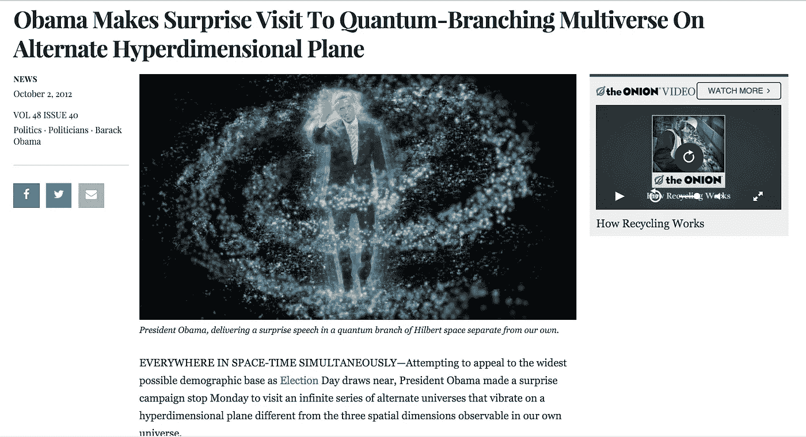

2.[巴基斯坦瓦纳](http://www.theonion.com/article/obama-takes-excited-daughters-out-for-day-of-drone-32702)

3.[衣阿华州卡洛纳](http://www.theonion.com/article/obamas-aunt-sends-him-article-mentioning-united-st-20734)

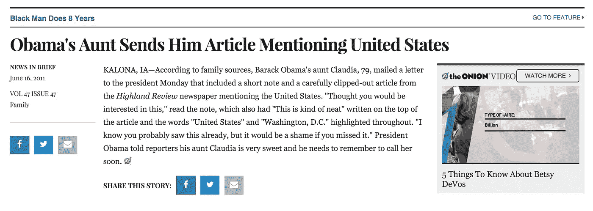

(Yes, of course I included Iowa)

4.[耶路撒冷](http://www.theonion.com/article/palestinians-israelis-come-together-to-mock-obamas-31767)

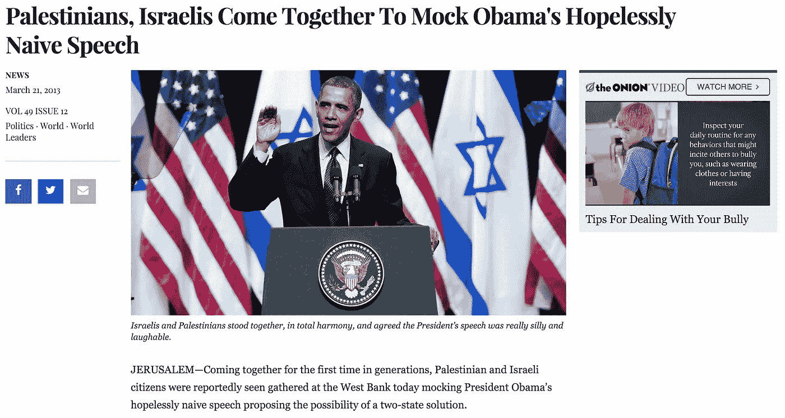

5.[阿富汗喀布尔](http://www.theonion.com/article/us-continues-quagmire-building-effort-in-afghanist-2837)

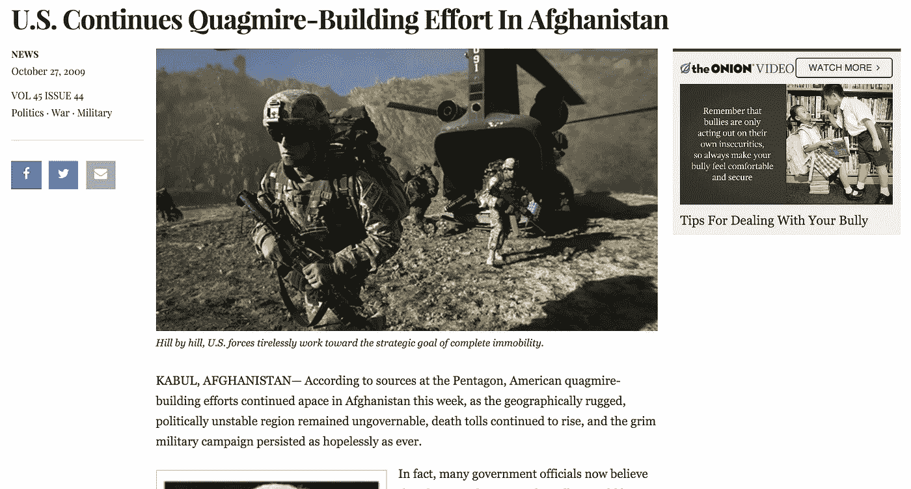

有时候，离群值也挺好玩的。

## **文本分析**

给定 623，270 个单词和 262 个独特故事的数据集，我应用了一系列文本分析技术。我完成了一个称为计数向量化的过程，这是我计算给定单词在故事中出现频率的一种奇特方式。我删除了任何频繁出现的术语([停用词](https://en.wikipedia.org/wiki/Stop_words))，这些术语不会增加对故事所讨论内容的洞察力(例如，this、a、or、an)。我还提供了字数统计功能，可以将两个连续的词考虑在内，但作为一个整体进行统计。例如，“白宫”是两个词，但这两个词经常相邻出现，所以实体(称为二元模型)是所有故事中最常用的。最后，我将计数分为奥巴马的第一和第二任期:134 个故事来自奥巴马的第一任期，128 个写于他的第二任期。我将奥巴马的第二任期定义为从他的第二次就职典礼开始:2013 年 1 月 20 日(尽管他是在 1 月 21 日公开宣誓就职的)。

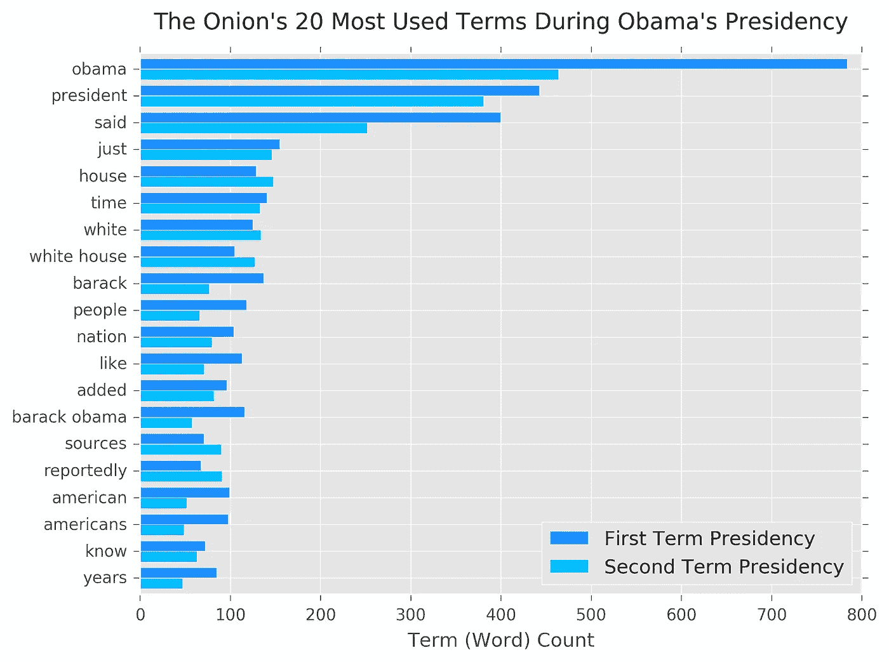

《洋葱报》在报道奥巴马八年总统生涯时使用的词汇没有太多惊喜。第一届总统任期的字数经常超过第二届，这不仅是因为在第一届任期内有 6 个以上的故事，更重要的是，因为平均故事长度为 212 个单词，而奥巴马第二届任期为 163 个单词。尽管如此,“White House”和“House”这两个词在用法上还是稍微挤掉了第一个词。

然而，有一点很重要。根据“美国人”在关于奥巴马第一任期和第二任期的报道中的使用次数,《洋葱》显示，与第一任期相比，奥巴马第二任期的美国人数量减少了一半。(按此逻辑，他也被半称为“巴拉克·奥巴马”和“年”。)

> "《洋葱》显示，与第一任相比，奥巴马在第二任期间有一半美国血统."

我调查了奥巴马第一个任期和第二个任期的真正区别，正如《洋葱新闻》中的话所描述的那样。为了做到这一点，我建立了不同的模型来最准确地预测任何给定的故事可能是以哪个术语写成的。我在一个随机收集的故事上训练了我的模型，它可以学习奥巴马第一或第二任期的文章中最有可能使用的单词。然后，我测试了我的模型，选择了一个独立的随机故事集，这些故事是我以前没有见过的，并让我的模型尽可能地猜测这篇文章是在哪个总统任期内写的。

President Obama’s [portrait](https://commons.wikimedia.org/wiki/File:Official_portrait_of_Barack_Obama.jpg) recreated out of the words The Onion used to describe him

我最好的模型达到了 80%的准确率——比随机猜测提高了大约 30%。(对于喜欢数学的人来说，这个模型是一个多项朴素贝叶斯分类器。)然而，这种特殊的模型使得查看哪些词最能定义一个总统任期与另一个总统任期颇具挑战性。因此，我还建立了一个单独的模型，叫做[随机森林](http://scikit-learn.org/stable/modules/ensemble.html#forest)，这是一种寻找最佳可能决策树的奇特方法。决策树使得查看奥巴马第一任期和第二任期之间哪些词分裂了我们的故事变得相当透明。

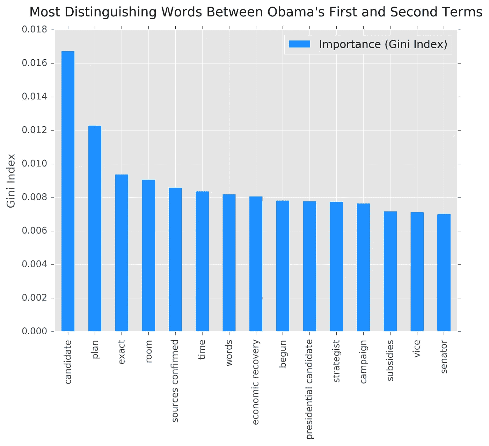

在上图中，我用[基尼系数](https://en.wikipedia.org/wiki/Decision_tree_learning#Gini_impurity)确定了奥巴马第一任期和第二任期之间最有特色的 15 个词(模型有 5825 个词)。平均而言，word 或 bigram(两个词的集合)基尼指数越高，就越能更好地界定奥巴马的第一和第二任期。在这种情况下，与竞选活动有关的词相当强烈。这是有道理的:奥巴马的两次竞选都发生在他的第二次就职典礼之前。然而，这些结果并不完美。这个随机森林达到了 64%的平均准确率。

## **情感分析**

讽刺是文本处理中一个众所周知的困难领域。想想看，破译朋友讽刺性的短信是多么具有挑战性。即使考虑到所有的情况和你对你朋友的了解程度，误解还是会发生。这个问题在计算中被放大了，因为计算机[学习](https://hackernoon.com/tagged/learning)上下文是一项巨大的努力。

尽管如此，我还是使用了一个标准的情绪评估工具来分析《洋葱》对奥巴马的报道。这个特殊的 [Python 库](https://textblob.readthedocs.io/en/dev/)将预先确定的单词计数制成表格，并分配一个分数。例如，像“恶心”和“糟糕”这样的词会降低文档的分数，而像“快乐”和“惊人”这样的词会提高文档的分数。情感得分介于-1(负)到+1(正)之间。

我计算了一段时间内十层楼的情绪滚动平均值。换句话说，我给十个故事的感悟打分，然后给那十个故事标绘一个点。我不断重复这个过程，加入新的故事，去掉最老的。滚动平均线有助于平滑无法解释的波动。

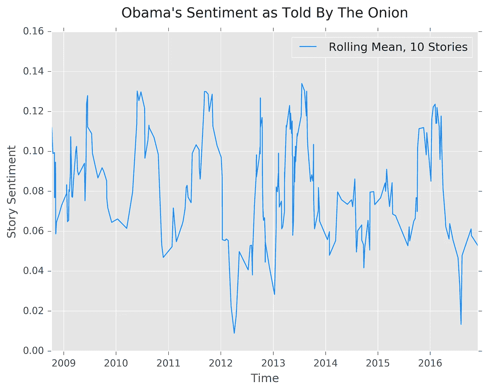

即使是我的滚动平均仍然是相当可变的。尽管如此，看到十层楼的滚动平均线永远不会跌到零度以下，还是很有见地的。也就是说，覆盖率通常是积极的。各种各样的故事[比如奥巴马希望看到勒布朗在芝加哥](http://www.theonion.com/article/president-obama-mentions-hed-like-to-see-lebron-ja-17512)或者[白宫雇用小丑](http://www.theonion.com/article/white-house-jester-beheaded-for-making-fun-of-soar-17495)推动了 2010 年初的积极性飙升。2011 年末和 2012 年初的负面影响包括关于奥巴马的重大过失[忘记“低调处理”](http://www.theonion.com/article/in-major-gaffe-obama-forgets-to-dumb-it-down-26820)和关于[医疗改革的报道](http://www.theonion.com/article/backup-health-care-plan-involves-nation-sharing-on-27847)。

我还根据之前讨论的洋葱内容标签计算了平均情绪。

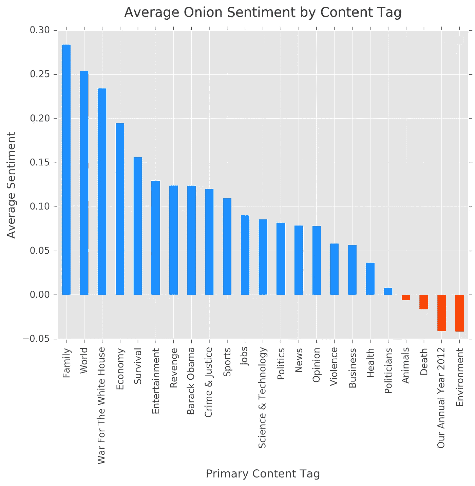

尽管具有讽刺意味，但最受欢迎的标签与关于美国总统的一个常见假设相符:家庭通常是不礼貌用词的禁区。然而，尽管这个潜在的真实世界远离假新闻，奥巴马最糟糕的情绪话题领域是“环境”，然而他却因在这个领域的成就而受到称赞。此外，对“我们的 2012 年度”的负面情绪与奥巴马在 2012 年相对较高的支持率相矛盾。

最后，我选择了奥巴马最正面和最负面的故事。奥巴马的[最积极的故事](http://www.theonion.com/article/obama-praises-own-strength-resilience-face-hardshi-52152)获得了 0.323 的情感分数，紧随他的最后一份国情咨文而来。

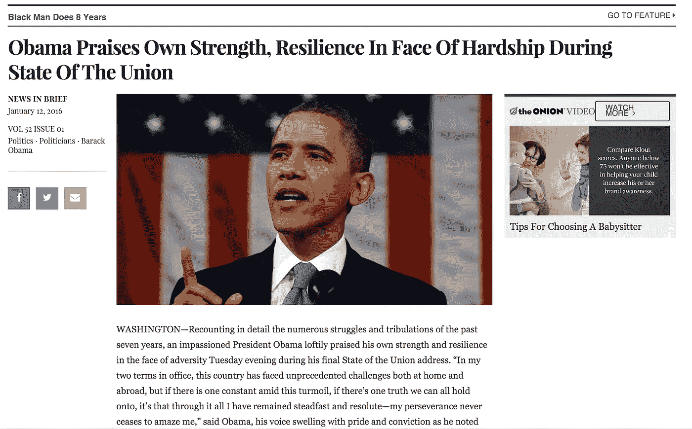

Obama’s most positive Onion story is Obama talking about… Obama

《洋葱报》的[最负面情绪故事](http://www.theonion.com/article/obama-returns-from-india-with-these-gross-candies--18468)获得了-0.226 的情绪得分，并在奥巴马 2010 年印度之行后发表。

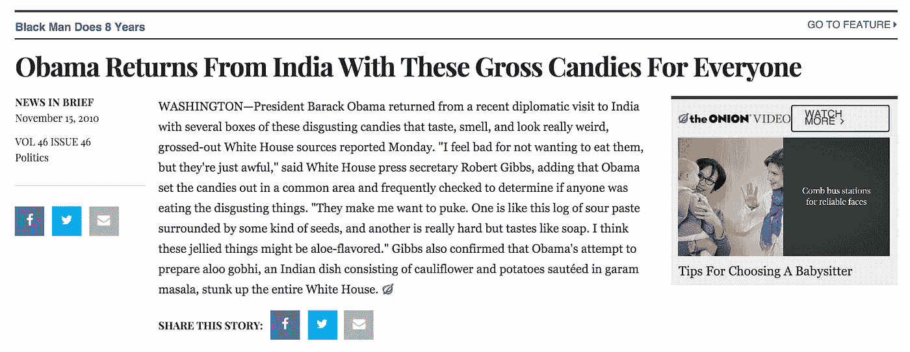

The Onion’s most negative story includes mentions of “gross,” “awful,” and “bad.”

奥巴马的八年为洋葱提供了巨大的素材:他迅速通过了刺激方案，彻底改革了国家的医疗保健系统，并保持了相对年轻的形象。洋葱出色地平衡了[对他的成功](http://www.theonion.com/article/defeated-man-victorious-30281)、[的间接赞扬，对他的错误](http://www.theonion.com/article/obama-hoping-jim-lehrer-doesnt-bring-up-us-economy-29782)的调侃，并让他[显得更有亲和力](http://www.theonion.com/article/frustrated-obama-sends-nation-rambling-75000-word--18516)。

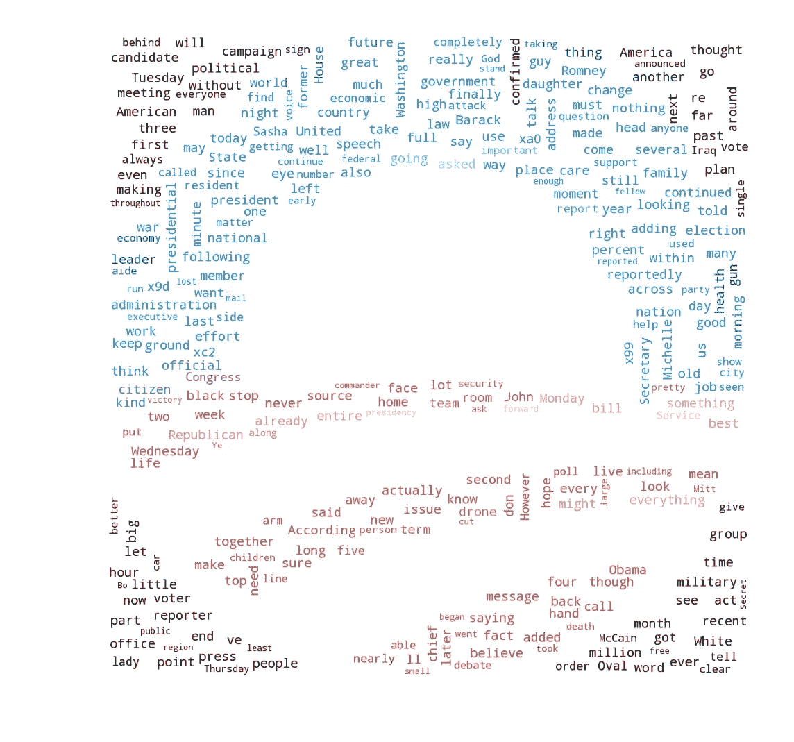

Generated using text The Onion wrote about Obama during his presidency

最终，假新闻需要代表读者保持警惕，并需要越来越多的工具来阻止其传播。尽管如此，蓄意讽刺，尤其是来自《洋葱》这样的经典出版物的讽刺，提醒人们消除所有假新闻会威胁到娱乐和诙谐的评论。虽然《洋葱报》承认最近选举的不可预测性使得讽刺新闻具有挑战性，但我期待看到他们如何报道下一届总统选举。它会成为伟大的数据。

*我的完整分析，包括本文未涉及的数据集和方法，可以在我的*[*Github*](https://github.com/josephofiowa/zenzic/tree/master/obama-onion)*上找到。如果你想了解我是如何完成的教程，请注册熵:*[*www.josephofiowa.com/entropy*](http://www.josephofiowa.com/entropy)*如果你想成为一名数据科学家，请查看大会的* [*数据科学*](https://hackernoon.com/tagged/data-science) *沉浸式，这是我目前正在教的。*

如果您喜欢这个故事，请选择下面的心形图案，这样其他人也会发现这个内容。

> [黑客中午](http://bit.ly/Hackernoon)是黑客如何开始他们的下午。我们是 [@AMI](http://bit.ly/atAMIatAMI) 家庭的一员。我们现在[接受投稿](http://bit.ly/hackernoonsubmission)并乐意[讨论广告&赞助](mailto:partners@amipublications.com)机会。
> 
> 如果你喜欢这个故事，我们推荐你阅读我们的[最新科技故事](http://bit.ly/hackernoonlatestt)和[趋势科技故事](https://hackernoon.com/trending)。直到下一次，不要把世界的现实想当然！

