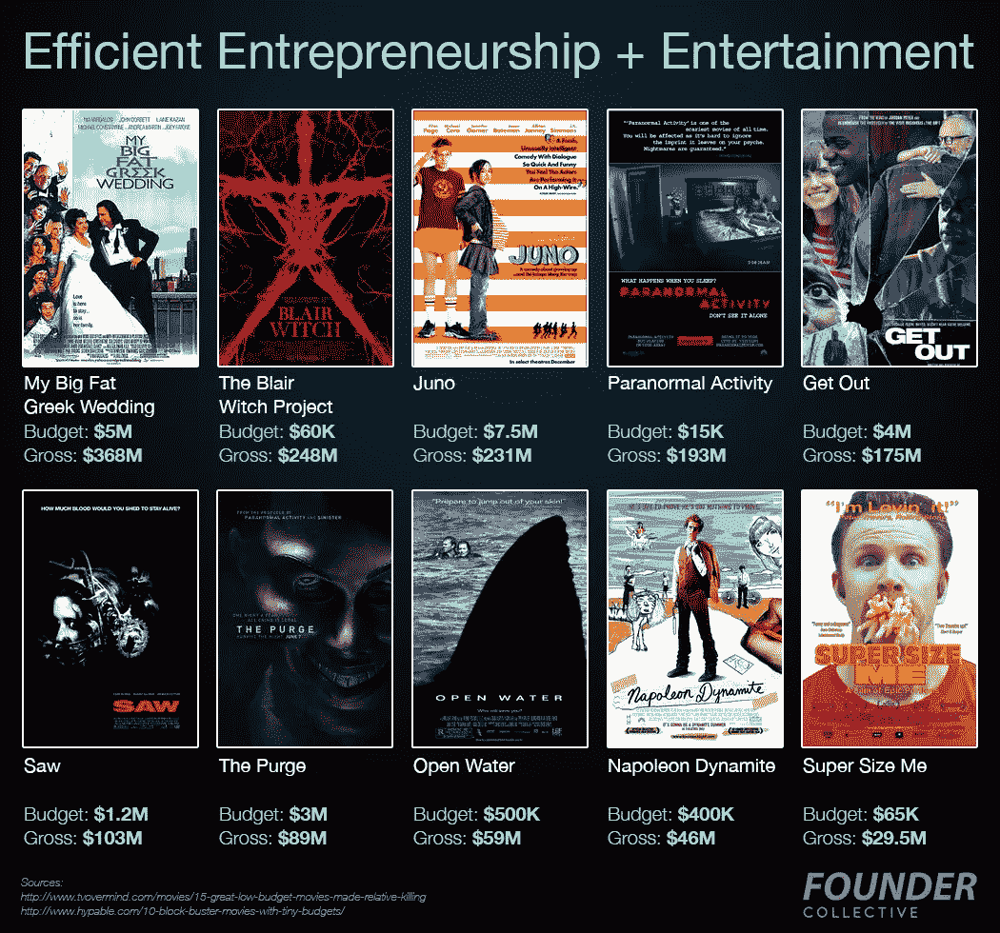

# 创业公司和风投能从印第安纳琼斯身上学到什么

> 原文：<https://medium.com/hackernoon/what-startups-vcs-can-learn-from-indiana-jones-bd6c1bb3de2c>

*由* [*米卡·罗森布鲁姆*](https://twitter.com/micahjay1) *，管理合伙人*

我们已经写了许多关于筹集过多风险资本的危险的故事，证明筹集更多的资金并不会使创业更成功，1 亿美元的退出值得庆祝，但是实现“高效创业”的想法可能很困难。早期创业公司疯狂地试图找出如何获得牵引力，而成熟的创业公司感到被锁定在一个烧钱速度和一系列行动中。

对于创始人来说，将自己视为导演而非企业家可能是一种有益的练习。电影制作人和创始人都是有创造力的专业人士，但导演不得不面对一个资本是固定数额，而不是看似无穷无尽的世界。

导演必须对他们的产品有一个愿景，粗略了解实现这个愿景的成本，然后在这些限制下执行。相比之下，初创公司的创始人总是有可能筹集到新一轮资金。

对电影制作人的严格限制导致了许多独立项目，由不知名的创作者以微薄的预算制作，可以与众星云集的好莱坞大片相媲美。例如:

This list is far from exhaustive and doesn’t include movies like Slumdog Millionaire and The Kings Speech which had $15M+ budgets and mid-nine-figure grosses, due in part to better known stars and directors.

这些都是职业生涯的项目，把明星和口号，在地图上。所有这些都是由 A 轮融资完成的。是什么让这些低成本电影如此成功？似乎有一些共同的主题:

## **瞄准服务不足的利基市场**

糟糕的恐怖电影没有赢得奥斯卡奖，但它们一直是有利可图的，并代表了一半的电影。在创业领域，Veeva 筹集了 400 万美元，专注于为一小群生命科学公司开发 SaaS 工具，并获得了 50 亿美元的市值。

## **拥抱约束**

灵异活动的创造者没有太多资源。尽管如此，这部电影的高概念弥补了明星力量的不足。与企业家相比，Jon Oringer 是一名软件工程师和业余摄影爱好者。他并不容易获得风险投资，但他将自己的爱好和学术训练结合起来，在没有筹集任何外部资金的情况下，创建了 Shutterstock，这是一家位于 2B 的美元公司。

## **证明创意营销获胜**

*布莱尔女巫项目*利用一个新生的在线人群来散播对其真实性的怀疑。 [Outcome Health](http://mailchi.mp/foundercollective/scrappy-strange-the-founder-collective-newsletter-june-11-2017?e=233ad15bc9) ，目前估值 55 亿美元，由一对破产的大学生创立。他们买不到广告，所以他们在医生的办公室里放置电视，并在上面销售广告。

从这些电影中最重要的收获是提醒人们，资本不是成功的决定性因素。2003 年，同年*公开水域*产生了 100 倍的投资回报率，本·阿弗莱克/詹妮弗·洛佩兹的车*吉利*首次亮相。后者拥有当时地球上最大的两颗恒星(还记得“ [Bennifer](http://www.dailymail.co.uk/tvshowbiz/article-4037800/Ben-Affleck-looks-flop-Gigli-blames-Bennifer-romance-uproar.html) ”？)，5400 万美元的预算，但仍然只在全球范围内取得了 730 万美元的票房。今年的*上映*，400 万美元的预算和鲜为人知的演员阵容将比最近的大预算、明星云集的壮观场面*、*、*龟壳里的幽灵*和*忍者神龟*加起来还多。

对于企业家来说，导演模式可能是一笔惊人的交易。电影制作人只有一次机会来制作他们的产品，但一旦他们实现盈利，初创公司的创始人可以无休止地重复。此外，电影工作室经常从创作者，尤其是新手那里拿走一部成功电影的大部分利润。拥有“艺术之家”预算的成功创始人，在创作出能引起共鸣的作品时，可以获得丰厚的财务回报。

风险投资模式仍然最适合大片，但不清楚更大的预算是否会在电影或金融领域带来更好的回报。如果一个人知道在首次公开募股前只能筹集 500 万美元来建立一家公司，他会如何经营自己的创业公司？

# 风投可以从印第安纳·琼斯身上吸取教训

好莱坞也给风投们上了一课。在风投开始试图圈住独角兽之前，电影大亨们追逐大片。花了大量的钱试图支持特许经营权，结果却在首映之夜遭遇惨败。

迪士尼前首席执行官迈克尔·埃斯纳以注重预算而闻名，因为这个世界崇尚过度。有一次，他批准了第一部《印第安纳·琼斯》电影，这部电影的预算超过了正常水平，成为了热门电影——当时的独角兽。他不想让工作室的人认为这部电影的成功标志着他策略的改变。他写了一份后来成为传奇的备忘录，解释了在担任派拉蒙电影公司总裁期间如何考虑投资电影，该备忘录被摘录在《T2》*迪士尼乐园* 一书中:

> 艾斯纳以保持适度的成本为荣；有些人认为这近乎痴迷。对于艾斯纳来说，故事的质量才是最重要的，而不是高价的导演和明星。他寻找具有引人注目的人物、清晰的冲突和解决方案、三个容易识别的“行为”以及可以用一两句话概括的普遍主题的故事。这种方法，在好莱坞的说法中被称为“高概念”，产生了许多模仿者，但很少有像艾斯纳和迪勒那样成功的。
> 
> 尽管他很节俭，艾斯纳有时还是愿意承担财务风险。在其他两家工作室因高昂的预计成本而犹豫不决，甚至迪勒也以财务为由反对该项目后，艾斯纳与《星球大战》编剧乔治·卢卡斯、导演史蒂文·斯皮尔伯格和演员哈里森·福特签约，制作《印第安纳·琼斯》和《夺宝奇兵》。凭借 2.4 亿美元的美国票房收入，它成为了一个“特许经营”，一个巨大的成功，催生了一系列高利润的续集。
> 
> *然而，艾斯纳狂热地保持低成本以赚取利润，这在好莱坞是一种奇怪的打破传统的观点，好莱坞有着悠久而根深蒂固的传统，在任何人对股东给予更多考虑之前就奖励人才、代理人、经理和工作室高管。在《夺宝奇兵》获得巨大成功后，艾斯纳将他的哲学记录在一份 21 页的宣言中，分发给派拉蒙的高管们。他在信中指出，1981 年以来，该公司几乎所有的利润都来自《夺宝奇兵》(Raiders)，这在艾斯纳佳能中是一个昂贵的异常现象，他不希望派拉蒙的任何人认为他偏离了他久经考验的策略，即高概念和低预算相结合。“通常一部轰动一时的电影会带来巨大的成功，”他写道。“一鸣惊人的陶醉感会让人很容易觉得运气会一直保持下去。在过去的五年里，派拉蒙在电影行业不是排名第一就是第二。成功往往会让你忘记是什么让你成功，就在你最不怀疑的时候，这个大错误改变了游戏。成功会让我们陷入致命的悲剧吗？”*

# 轰动一时的成功所带来的陶醉感会让人很容易感觉到好运会一直持续下去

> *艾斯纳继续阐明他自己的优先事项。“我们没有义务创造艺术。我们没有义务创造历史。我们没有义务发表声明。但是为了赚钱，创造历史，创造艺术，或者发表一些有意义的声明往往是很重要的……为了赚钱，我们必须总是制作娱乐性的电影，如果我们制作娱乐性的电影，有时我们会可靠地创造历史，艺术，声明，或者三者都是。我们甚至可能获奖……我们不能指望无数的成功，但如果每部电影都有一个原创和富有想象力的概念，那么我们就可以有信心有所突破。”*

# *“我们不能期待无数的成功，但如果每部电影都有一个原创和富有想象力的概念，那么我们可以相信会有所突破。”*

把“电影”这个词换成“创业公司”，把“独角兽”换成“大片”，艾斯纳的建议实际上很好地映射了创业公司的世界。他基本上是在倡导一种投资组合的电影制作方法，并且取得了辉煌的回报(在一段时间内)。)

这种节俭的想法也在创业数据中得到了证实。过去五年中，20 家最好的创业公司中有 6 家筹集了 5000 万美元。一个什么都没筹到。如果更多的企业家和风投听从艾斯纳的建议，也许我们会有更少的创业恐怖故事和更多的幸福结局。

> [黑客中午](http://bit.ly/Hackernoon)是黑客如何开始他们的下午。我们是 [@AMI](http://bit.ly/atAMIatAMI) 家庭的一员。我们现在[接受投稿](http://bit.ly/hackernoonsubmission)并乐意[讨论广告&赞助](mailto:partners@amipublications.com)机会。
> 
> 如果你喜欢这个故事，我们推荐你阅读我们的[最新科技故事](http://bit.ly/hackernoonlatestt)和[趋势科技故事](https://hackernoon.com/trending)。直到下一次，不要把世界的现实想当然！

