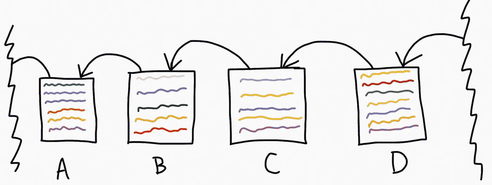
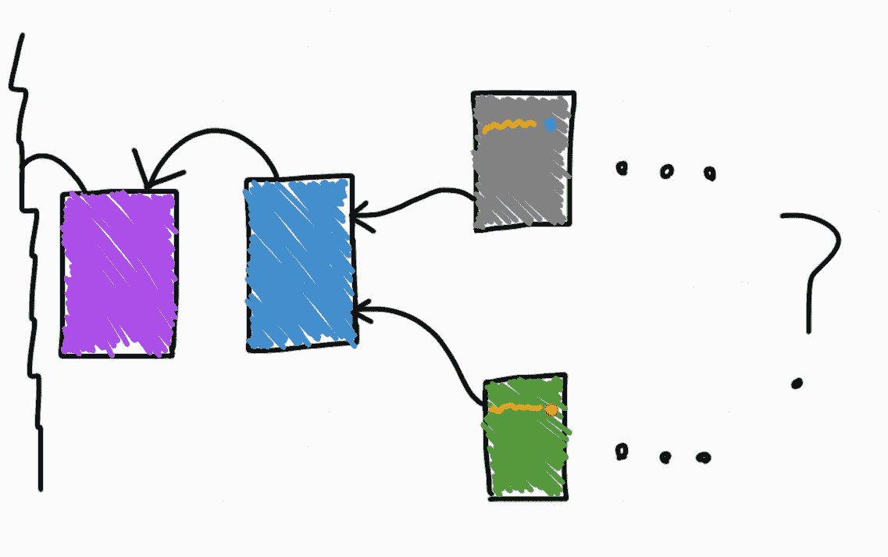

# 什么叉子？许多锁链的故事。

> 原文：<https://medium.com/hackernoon/what-the-fork-a-tale-of-many-chains-72ba11ee8987>

## 概述什么是区块链分叉以及它们对生态系统的意义

如果你一直在关注加密新闻，那么围绕比特币和其用户的各种派别已经有了很多活动，他们正在“分叉”协议，产生了许多不同的“比特币”:比特币现金，比特币黄金，(和比特币白银？)以及即将到来的比特币 Segwit1x vs Segwit2x 的市场份额决斗。我想从区块链及其用户的角度简单解释一下分叉的含义。最后，我将思考为什么我们会看到如此多的分叉，并解释这种决策中固有的权衡。

总的来说，加密货币为我们提供了一种方法来跟踪潜在的相互不信任方之间的一些共享状态。这种共享状态通常用一种叫做区块链的数据结构来实现。回顾一下，这个上下文中的数据结构只是组织二进制数据的一种特定方式；一类特殊的共识算法与这种类型的数据结构一起使用，以获得加密货币的独特属性。我们可以分解“区块链”这个词来更好地理解这里发生的事情:拆开来看，区块链只是一个“块”的“链”。链条概念反映了你在自行车或栅栏上看到的链条——一系列链环一个接一个地连接在一起。这里的块包含加密货币交易(例如，“向我的朋友发送 1 BTC”)，并且在维护网络的计算机都同意交易应该进入链上的特定块之前，加密货币交易不应该被认为已经发生。这种网络范围的协议流程为我们提供了单个区块的总排序(每个区块都有一批交易)，因此我们拥有加密货币用户的单一活动历史。有一个单一的历史是什么让我们避免像双重消费的问题，因为你不应该能够花费一个特定的令牌超过一次。这种属性遵循我们对传统货币(例如，法定现金)的直觉。

下面是一幅区块链某个地方的漫画。我们看到四个字母为 **A** - **D** 的区块。图中的箭头表示该块中的一些数据包含对它所指向的块的引用。这一系列的参考文献赋予了区块链“链条”——我们可以清楚地看到“区块链”。每个块上的曲线代表该块中的事务(例如，“从该地址向该地址发送 1 个 BTC”)。

some blockchain

借用计算机科学中的一些术语，我们将区块链中某个块之前的块称为其**父块**。父块之后的块是父块的**子块**。在这里，我们可以说块 **B** 是块 **A** 的子块，块 **B** 的父块是块 **A** 。块 **D** 是块 **C** 的子块。

这里需要记住的重要一点是，公开的加密货币是*无许可的*。这一事实意味着任何参与的计算机都可以提出一个新的事务块。当网络上的多台计算机发出对具有相同父块的子块的提议时，我们在链中得到一个**分支**。分叉可能由于各种原因而发生；一些是操作区块链的预期部分，而一些考虑了对协议的攻击。例如，由于与协议相关的时间上的一些随机性，小分叉在公共系统中相当频繁地出现——你可能真的认为该轮到你添加新块了，只是因为你还没有听说其他人实际上是“第一个”添加下一个块。

加密货币被设计成以这种方式工作，使得这些分叉在给定协议的共识规则的名义时间量内自然解析。当创建了未通过网络共识解决的分叉时，攻击的机会就出现了。在这种情况下，一个恶意的参与者故意导致一个分叉，现在根据协议有两个冲突的历史记录。您可以开始看到这种情况对加密货币的信任有多危险，因为这种恶意行为者可以在一个分支机构进行交易，导致收到一些昂贵的商品，而另一个分支机构的相同交易实际上只是将资金发送回攻击者。如果网络在商品交换后决定接受替代分支，卖家可能会有巨大的损失。比特币(和其他验证工作的加密货币)的设计方式是，它需要网络上的大部分计算能力来成功实现这种攻击(“51%攻击”)，只要有诚实地应用大部分计算能力的激励，网络就会保持安全。

让我们研究一下另一幅漫画的 51%攻击执行的双重花费攻击。

which is the road more traveled?

我们在这个链中看到两个有序的区块，紫色和蓝色区块，直到我们到达一个有两个选择的分叉，灰色和绿色区块都是蓝色区块的子区块。重要的是，请注意，在从同一发送者(金线)到两个不同接收者(蓝点和红点)的块之间有两个事务。在这种情况下，这意味着网络的某个部分认为下一个块是灰色的，而网络的其他部分认为下一个块是绿色的。只要网络上的大多数计算机选择一个分支而不是另一个分支，这个分叉将被及时解决，并且所选择的块将成为进入网络上事务的单个一致历史的块。

在这个协议发生之前，哪个交易是“正确的”交易是不明确的，攻击者可以利用这一点来为自己谋利，就像刚才描述的那样。为了使这种攻击具体化，考虑一个想要用比特币购买一辆特斯拉的攻击者。攻击者创建了两个略有不同的交易，在上图中是金色的。一笔交易将比特币发送到用蓝点表示的特斯拉经销商的地址。另一个带有红点的交易将比特币发送到攻击者控制的地址。当特斯拉经销商暂时相信诚实交易已经包含在区块链中并交出车钥匙时，攻击就展开了。然后，攻击者使用他们在网络上的多数权重来指示另一个块实际上是正确的块。如果发生这种情况，特斯拉经销商可能对小偷没有任何追索权。

事实证明，改变协议的某些部分会导致分叉，就像 51%攻击一样。如果你改变你用来达成共识的信息类型，或者你改变你解释这些信息的方式，你将得到遵循不同规则的网络的不同子集——根据定义，共识失败。如果你关注媒体上的报道，你会发现给定加密货币的不同派别的用户希望以某种方式添加或更改某些功能(如每个块的大小)，而这与现有协议不兼容。当我们在协议中有不一致的消息时，我们得到一个分叉。

现在，你会认为不必要的分叉是一件坏事——你是对的。如果持久的叉子是常见的，那么就很难用区块链来代表货币，因为有多少叉子就有多少不同类型的货币。一个过度分叉的链不能给我们一个价值储存的记录，这一事件将反映一个快速减少的市值。这种恐惧是围绕叉子的大部分焦虑的驱动力:一个坏的叉子极大地威胁你的链的合法性。比特币凸显了这种危险，目前其市值约为 1000 亿美元。大量的资本处于风险之中，并推动了前面提到的媒体报道。另一种选择——不做更改或非常缓慢的更改——也不是特别可行，因为它会阻碍货币的继续采用，无论是由于可伸缩性限制还是缺乏向其他链中的用户提供的功能。实验主义和保守主义之间的矛盾引发了关于是否分叉的争论。

那么我们能做什么呢？我们应该承认，在加密货币中引入新功能是非常危险的，因为升级代码中的一些错误可能会导致共识失败。这种风险减缓了区块链新功能的试验，并提高了给定加密货币项目的技术债务累积率。在一天结束时，出于正确原因的分叉对于给定的加密货币来说可能是一件好事，这一基本原理支持了分叉比特币并生产所有你听说过的克隆货币的团队。区块链跨越空间和时间组织人类的能力是一种技术范式的转变，现在说我们已经找到了公共链的最终答案还为时过早。因此，实验是一个非常理想的结果，分叉是目前我们解决这个问题的最佳工具。如果我们致力于作为一个团体步调一致地前进，我们将能够在一个糟糕的分叉中生存下来，并能够继续朝着接下来的方向建设。下次见，叉上！

1:这里有一个技术上的区别，即*硬*和*软*叉。一个*硬*分支是这样一个分支，其中每个分支都有一组冲突的规则，因此用户必须选择其中一个分支。一个*软*分支以类比的方式命名，指的是添加一些额外特性但仍然与没有升级到新规则集的用户兼容的变化。