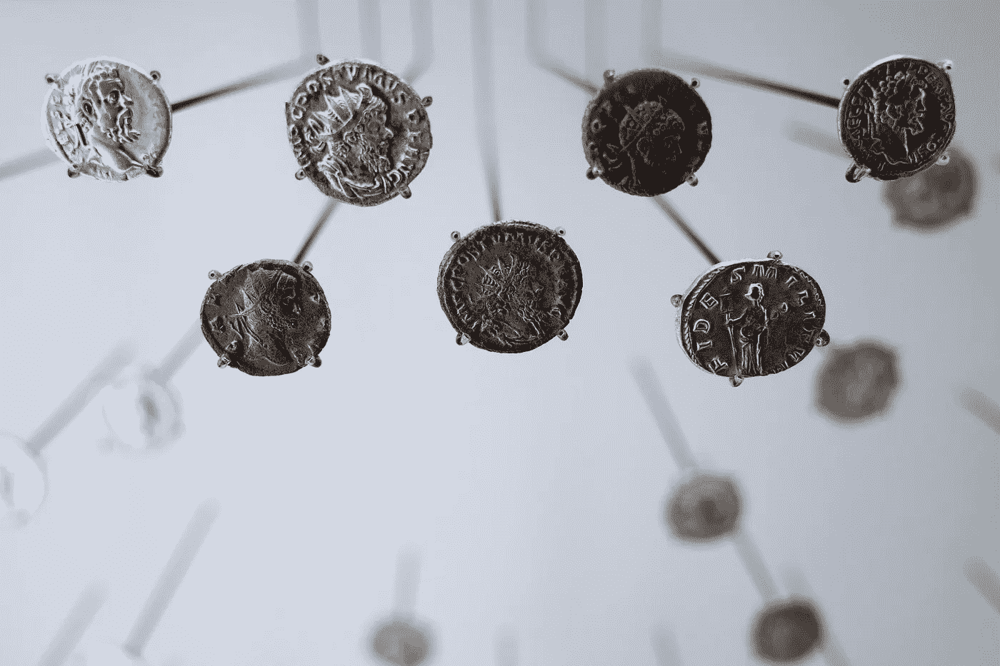
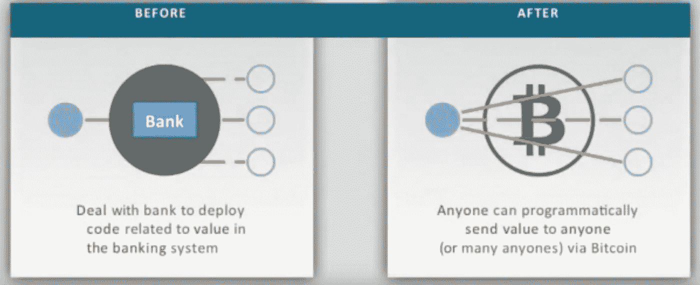
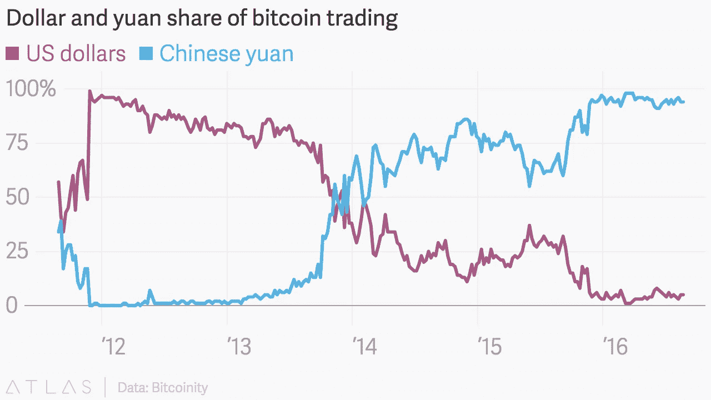
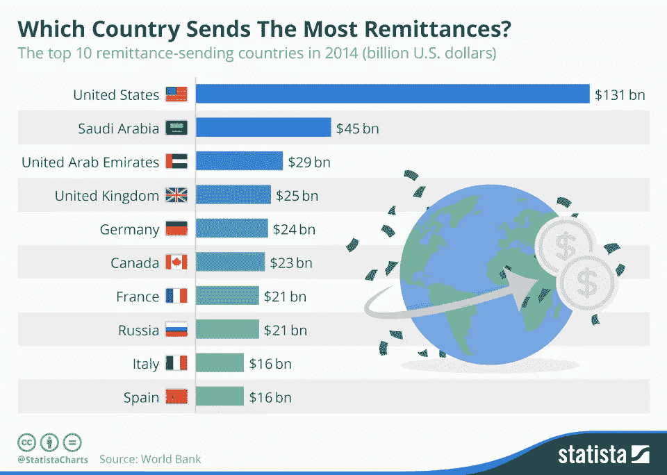
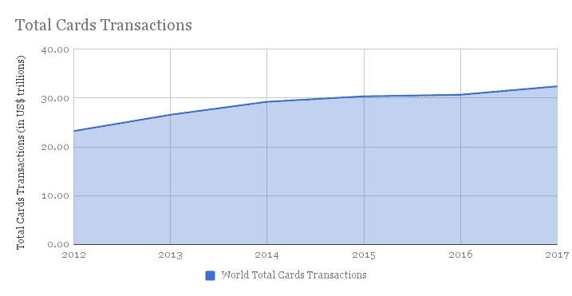
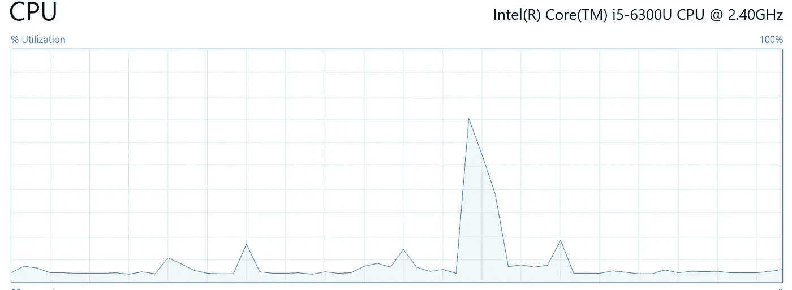

# 加密货币的真正价值是什么？

> 原文：<https://medium.com/hackernoon/whats-the-true-value-of-cryptocurrencies-4409bd8528b0>

*这是识别加密货币价值来源系列文章的第一篇*

Image: Nikita Andreev

> 贝壳:100000+ yrs
> 黄金可穿戴:3800
> 黄金&银币:2400
> 纸白条换黄金&白银:250
> 纯法币:47
> 加密货币:avail。现在
> ——尼克·萨博

最近硬币发行的趋势，包括 Tezos 的大规模融资，已经引起了人们对加密货币的关注。最近，世界领先的加密货币[比特币](https://hackernoon.com/tagged/bitcoin)的估值超过了 1000 亿美元。加密货币是否被高估并需要修正？也许吧。

在这个系列(1/3)中，我将尝试确定加密货币的需求来源，并开发一个框架来研究它们的价值。对加密货币的需求来源于其作为“交易媒介”和“价值储存手段”的属性。它们还不是有用的记账单位，但这种情况可能会改变。

在这篇文章中，我将探讨加密货币作为交易媒介的价值，特别是作为*货币互联网*的推动者，以及这一点对其价值的影响。

[**“货币互联网”的兴起**](/p/4409bd8528b0/#3669)

加密货币最基本的用途是它们开始在互联网上扮演交易媒介的角色。

**a .点对点支付(VOIP:Talk::加密货币:支付)**

加密货币正在为大规模扩大点对点支付创造机会。首先，它们可以降低交易成本。他们可以通过取消中介和开发一个低成本的共识系统来验证交易来做到这一点。这与集中的“可信”支付基础设施相反，后者对于转移价值一直是必要的。这种涉及多个中介的分层交互增加了价值转移的成本。

Source: Balaji Srinivasan/a16z

其次，它们可以消除交易中的摩擦，为同行之间无缝的价值转移创造机会。仔细想想，贝宝最初的创新——能够通过电子邮件向 T21 汇款——的核心是让支付变得无摩擦(而且安全)。

事实上，加密货币主流化的第一个“杀手级应用”已经是国际汇款。当中国实施资本管制，迫使用户发挥创造力，利用加密手段跨境转移资金时，这种技术开始发挥作用。

*Dejavu* Napster? — the use of bitcoin to move money

**评估加密作为交易媒介的价值**

鉴于上述背景，我们现在可以尝试根据密码货币作为互联网交换媒介的属性来计算其总价值。出于这一目的，让我们看看全球货币转移量，并尝试看看密码货币可以从哪里获取价值。我们看到，2014 年全球跨境汇款接近 6000 亿美元。

即使我们假设全球汇款市场没有增长，并且全球五分之一的汇款是由一个稳定的大型密码货币网络处理的，该网络每年仍将传输 1，200 亿美元的价值。如今，价格最低的中介收取的佣金约为 1%。如果密码货币网络能够获得甚至 0.1%-0.2%的利润，该网络每年获得的佣金将在 1.2 亿至 2.4 亿美元之间。这只是全球汇款市场。

现在，让我们看看全球数字支付的数量。根据 Euromonitor 的数据，预计 2017 年的信用卡交易总额可能会超过 30 万亿美元。即使其中 10%的交易可以在一个加密网络上处理，这也意味着 3 万亿美元的价值转移。同样，假设这一数量的佣金为 0.1%-0.2%，这很容易意味着每年最大的加密网络的佣金为 30-60 亿美元。

Source: Euromonitor

因此，仅看 2017 年全球汇款量的 20%和全球卡交易量的 10%，一种密码货币就可以获得约 30 亿至 60 亿美元的佣金。即使人们认为与这个加密网络相关的现金流需要遵循非常高的贴现率(~25%)和 15%的增长率，人们也可以仅针对一个用例(假设 45 亿美元的佣金)得出 450 亿美元的网络估值。难怪人们对密码货币感到兴奋。下面，由密码估价专家 Chris Burniske 绘制的图表，展示了以太网上的交易和相应的网络价值之间的相关性。非常合乎逻辑的是，交易和价值的增长有很强的一致性。

Source: Chris Burniske‏

像 zCash 这样的专用加密货币同样可能专注于特定用户组或特定用例的资金转移，并获取部分价值。

**b .互联网或机器支付网络不断发展的货币化模式**:

作为汇款渠道的密码货币是第一个“杀手级应用”。然而，在最近的一次 T2 谈话中，巴拉吉·s·斯里尼瓦桑描述了网络货币化的本质是如何演变的。如今，当前消费者网络中占主导地位的赚钱商业模式是广告。2016 年，谷歌 88%的收入和 Facebook 97%的收入来自广告销售。他们的许多 API 都是公开的，通过让用户(人类)接触广告来赚钱。

然而，基于广告的盈利模式并不适合应用编程接口([API](https://hackernoon.com/what-are-web-apis-c74053fa4072?-aditya-medium))。API 不能因为“看广告”而得到补偿。此外，当前的模型通过给(API)交互增加摩擦(想想入职和注册过程)来抑制商业。加密货币有可能简化 API 或任何代理之间的商务。在机器支付网络中，加密货币取代广告(或人类注意力)成为网络的主导货币，并允许 API 到 API 或机器到机器的交易，而无需人工干预，基于低成本的合同。

由于 API 到 API 或机器到机器的事务，会发生多少事务？估计一个合理的数字需要另一个帖子，但它肯定会涉及数十亿的交易。

从结构上来说，空间中这种占主导地位的加密网络的架构可以被拆分，通过计算强度较低的过程来促进较低票额的交易，以确保即使非常小的票额交易也受到鼓励。

**c .互联计算和存储资产的优步化**

加密货币作为交易媒介的第三个用例来自计算和存储资产的货币化。

虽然资产的“Uber 化”不再是一个新现象，但在个人甚至专业计算领域，它在很大程度上是未经探索的。我们的计算和存储资源没有得到充分利用。基于加密证明的货币为释放未充分利用的资源提供了一个绝佳的机会，让这些资源发挥作用并从中赚取收入。这在“供应方”起作用，并通过鼓励越来越多的用户跳到供应方来提供挖掘和/或交易处理来控制价格。从长远来看，人们会期望通过超级专门化节点和未充分利用的资产的混合来提供挖掘。这有助于建立加密货币的供应方案例。

A typical PC is using only a fraction of its computational resources while active

将互联资产和专业化采矿分别视为屋顶太阳能和公用事业规模太阳能。公用事业规模太阳能在投资回报率的基础上是高效和有利可图的，并继续扩大规模，但屋顶太阳能对许多用户来说是有吸引力的。这一点的重要性不可低估。我们可能即将迎来一场太阳能式的计算革命。随着加密货币变得更加主流，许多真正分散的计算和存储资源可能会上线，并与传统云服务竞争。

Hash rate of the Bitcoin network (source: blockchain.info)

鉴于对比特币的兴奋，所有加密货币矿工的 hashrate(以每秒计算次数衡量的计算能力)已经超过谷歌等互联网巨头的同等计算能力就不足为奇了。根据 Bitcoinist 的数据，截至 2017 年 1 月，比特币网络的总计算能力超过了 500 强名单上每台超级计算机总和的 4.3 万倍。

因此，我们看到对加密货币作为交易媒介本身的需求非常高，这可以解释为什么人们押注单个加密货币的价值可能高达 1000 亿美元。

这是否意味着所有加密货币的当前价值都是合理的？不完全是。相反，我的观点是，加密货币游戏的赢家——在我提到的一些用例(以及我将在后续帖子中介绍的其他用例)中，第一种真正找到产品市场适应性的货币(或多种货币)将足够大，价值不菲。也许甚至 GAFA 大！

这篇文章是关于加密货币作为交易媒介的。我将在下一篇文章中讨论加密货币作为去中心化应用和契约的基础。感谢爱德华·拉塞尔和莎尔娜·特洛塔审阅了这篇文章的手稿。

参考

1.【https://github.com/ethereum/wiki/wiki/White-Paper 号

2.【https://bitcoin.org/bitcoin.pdf 

3.[https://strate Chery . com/2017/tulips-myths-and-cryptocurrences/](https://stratechery.com/2017/tulips-myths-and-cryptocurrencies/)

4.[http://offers . world pay global . com/RS/850-JOA-856/images/globalpaymentsreportnov 2015 . pdf](http://offers.worldpayglobal.com/rs/850-JOA-856/images/GlobalPaymentsReportNov2015.pdf)

5.[https://medium . com/@ cburniske/crypto asset-evaluations-AC 83479 FCA 7](/@cburniske/cryptoasset-valuations-ac83479ffca7)