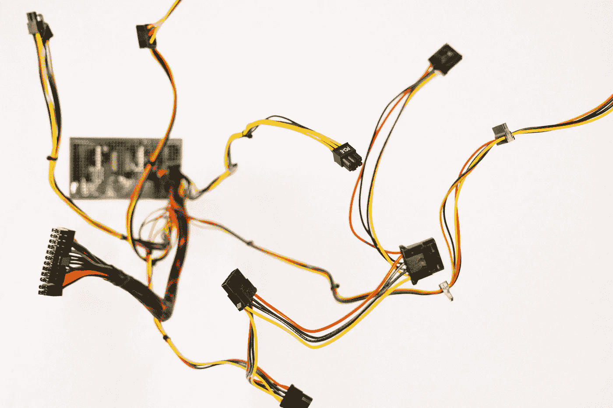
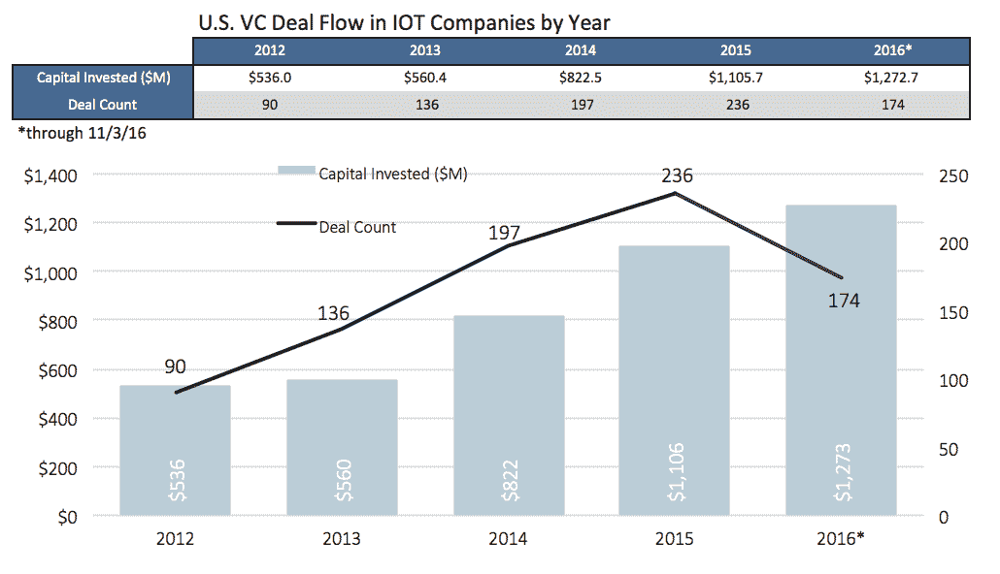
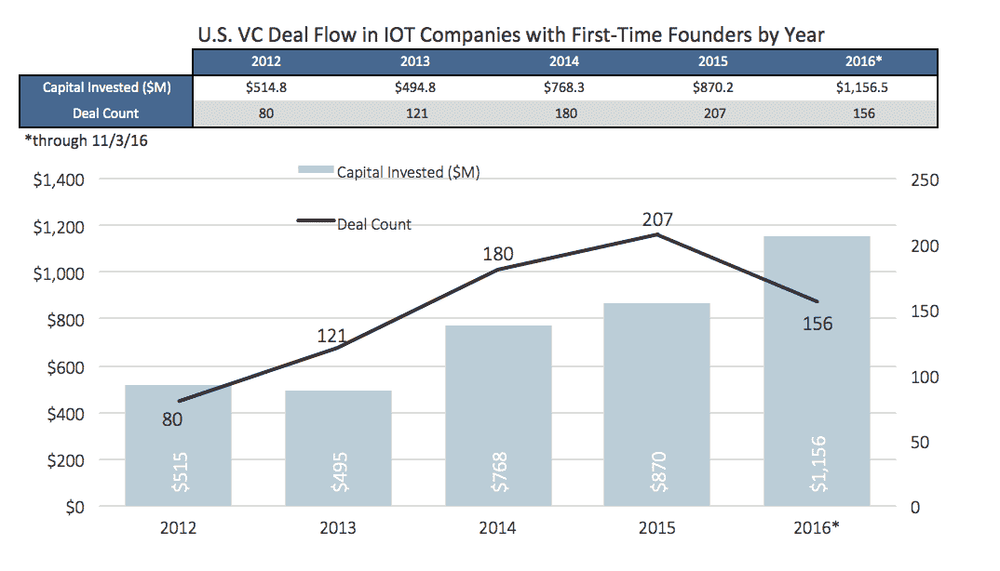

# 物联网风险投资的趋势是什么？对更少的公司进行更多投资

> 原文：<https://medium.com/hackernoon/whats-trending-in-iot-venture-capital-more-investment-in-less-companies-fb987944c234>

*本文原载于*[*TechCrunch*](https://techcrunch.com/2017/01/06/as-connected-hardware-matures-investors-pour-more-funding-into-fewer-companies/)*。*

*创始人兼 CEO 史蒂夫·迈尔斯*[*mind tribe*](http://www.mindtribe.com/blog)*。*

在过去的四年里，互联硬件领域无疑经历了一场复兴，风投在 2012 年至 2016 年间将资金增加了近两倍。融资模式的变化已经在行业中以多种方式感受到，包括公司的生存能力、典型跑道和资本化。这些是影响初创公司决定如何经营业务和开发产品的根本性变化，因此理解它们至关重要。

今年，我们从 Pitchbook 收集了一些关于物联网风险投资的新数据，以定量了解该领域的投资是继续增长还是持平。以下是我们学到的…

# 资金总额上升了，但融资轮数下降了

截至 2016 年 11 月初，物联网融资已经超过了 2015 年的总额，达到 12.7 亿美元。然而，接受资金的公司总数有所下降，从去年同期的 200 家下降到今天的 174 家。如果目前的速度持续到 2016 年底，这将比 2015 年下降 10%，而联网硬件公司的总资金将增长近 40%。

这是什么意思？首先，我们可能会看到这个领域走向成熟。我们听说过这种传闻，但数据表明:更多的资金流向了更少、更有前途的公司。尽管物联网领域已经出现了一些公开的挫折(尤其是围绕众筹硬件——Skully、Coin 等。)，显然对空间的信心依然存在。

其他数据也表明投资市场正在走向成熟…

# 物联网投资者获得更多经验

上面的图表显示了风投和天使首次投资物联网公司的年份。我们在这里可以看到，进入互联硬件领域的首次风投和天使越来越少，首次参与融资轮数从 2014 年的峰值下降。

对我们这些业内人士来说，这标志着一个正确的方向。

在过去几年里，我看到初创公司遇到的一个问题是，传统上一直在软件领域投资互联硬件的风投。泡沫和炒作吸引了资本——这很好——但这意味着与越来越多的投资者打交道，这些投资者在互联硬件领域及其复杂性方面几乎没有经验。

有经验的投资者是无价的，因为他们可以帮助公司度过漫长的开发周期。额外的跑道和繁重的发射前测试需要投资者更大的耐心。相反，初创公司看到了来自缺乏耐心、缺乏经验的风投的压力，这是一种适得其反的力量。

有趣的是，今年创业公司也看到更多的投资者提出了更尖锐的问题。问题依然存在，但首轮尽职调查似乎越来越严格。希望创办一家互联硬件公司的创始人应该预料到，问题会围绕着一个工作原型的愿望展开，这个原型可以解决围绕产品可行性的基本问题；对潜在发展挑战的认识；了解你的产品将使用的技术，以及你为什么选择这些技术；以及制造商愿意为你的产品工作的早期迹象。

这些都是关键的复选框，在硬件泡沫期间，首次投资者被掩盖得太快了。越来越多的投资者持健康的怀疑态度，这是因为他们经历了无休止的延期或产品永远不会发货。他们也更清楚危险信号，比如低质量的时间表，其中没有显示集成学习、ID 迭代或应急计划的缓冲区。风投们总是更愿意看到一个现实可行的场景，而不是一个让公司看起来不错但不切实际的场景。

越来越高的期望和越来越严格的尽职调查的趋势让人们认为，菜鸟硬件创业公司的创始人将更难获得资金。但是你错了…

# 首次创业者并不处于劣势

尽管上面的图表让首次创业者看起来似乎在硬件领域度过了一个不利的 2016 年，但事实上，他们的表现在平均水平上下。从 2012 年到 2016 年，80%到 90%的物联网创业公司是由第一次创业的人创建的。

令人惊讶的是，2015 年是异常的一年，连续创始人加入了竞争，并获得了该领域总融资的 22%。否则，第一次创业者倾向于收集 90-95%的硬件资金。

这显然只是联网硬件行业的一个快照，但它说明了一个长期稳定的健康市场的创建，边缘地带的“泡沫”较少，创始人和投资者不再把他们的一切都扔向墙壁，看看什么会坚持下来。

这是件好事。

> [黑客中午](http://bit.ly/Hackernoon)是黑客如何开始他们的下午。我们是 [@AMI](http://bit.ly/atAMIatAMI) 家庭的一员。我们现在[接受投稿](http://bit.ly/hackernoonsubmission)，并乐意[讨论广告&赞助](mailto:partners@amipublications.com)机会。
> 
> 如果你喜欢这个故事，我们推荐你阅读我们的[最新科技故事](http://bit.ly/hackernoonlatestt)和[趋势科技故事](https://hackernoon.com/trending)。直到下一次，不要把世界的现实想当然！

