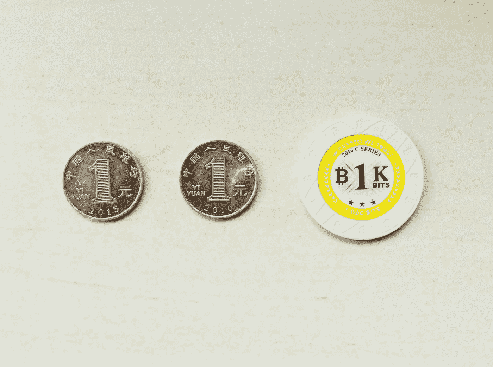

# 国家加密货币是怎么回事？

> 原文：<https://medium.com/hackernoon/whats-up-with-national-cryptocurrencies-262929ccf9cb>

***一些国家的高级政府官员，特别是*** [***中国***](https://futurism.com/china-becomes-first-countrchina-becomes-first-country-in-the-world-to-test-a-national-cryptocurrencyy-to-test-national-cryptocurrency/) ***和*** [***俄罗斯***](https://www.cryptocoinsnews.com/putins-orders-russia-will-national-cryptocurrency-cryptoruble/) ***，纷纷表示他们的国家即将发行国家加密货币。许多加密界的人对此感到困惑。***

比特币——最初的加密货币——的主要原因是创造一种不受政府干预的货币。政府肆意膨胀法定(纸币)货币。自 2008 年以来，中国、欧洲和美国都以“量化宽松”的名义将货币供应量增加了一倍或两倍。这远远高于实际经济增长，实际上是将 2008 年危机的银行损失社会化，但没有政治反弹。黄金应该是一种政府不能通货膨胀的货币，但由于黄金体积庞大且容易被发现，政府仍然可以干预其运输，或者干脆收购，这实际上否认了黄金的货币效用。(黄金还有其他问题，比特币也解决了)。

但是政府控制的加密货币呢？这听起来有点矛盾。那会是什么样子呢？如果他们要像菲亚特一样膨胀，那还有什么意义呢？你不需要加密货币来进行电子支付，我们已经有了贝宝和支付宝。

有几点。比特币不仅仅是一种分布式数字通胀保值货币。(比特币也会膨胀，但根据数学公式是可以预测的，而不是围绕选举周期。)比特币和其他加密技术一样，也是一种提供彻底透明性和自动多签名钱包和智能合约(包括令牌化)等功能的技术。这些都不是今天菲亚特的特色，尽管你可以用挤满了人、律师和官僚机构的建筑来伪装它。正因为它已经存在，但效率很低，所以它对政府并不构成威胁(尽管它可能对银行构成威胁)。相反，举例来说，政府喜欢透明(人的透明，而不是他们的透明)。

在一个经常被引用的例子中，如果我在市中心的餐馆里把装在袋子里的 100 万美元现金交给你，没有人可能会知道这件事，即使是国家安全局也不会知道，除非他们正在积极跟踪你或我。如果我用一种加密货币，比如说比特币，给你汇去 5 美元，整个地球上的人都将能够看到它流过，或者永远查找它。大多数人不会知道(或关心)这是你和我，但[那里](https://www.chainalysis.com/)T4 是政府机构可以用来将地址与人联系起来的技术工具，特别是因为他们还可以访问大规模电子监控系统，以捕捉交换比特币地址的人。单单这一点就是现金所没有的非常好的加密功能，这对于政府来说就像猫薄荷一样。有些参与非法活动的人今天选择使用比特币而不是现金，这有点讽刺。也许这就是为什么他们中的许多人现在在监狱里服长期徒刑。

如果不太可能的话，一些政府也很有可能想要阻止比特币和其他密码，或者在未来对它们进行非常非常严厉的监管。对这些政府来说不幸的是，我预测在未来的几十年里禁止加密将会像禁止互联网一样:它将会把你放逐到朝鲜的地位。但是，专家们可能会说，中国已经表明，你可以严格监管互联网接入，同时仍然拥有充满活力的经济。然而事情并没有那么简单。

中国的社会和政治面貌在过去几年里发生了很大的变化，尽管有严格的监管，这在很大程度上是因为——我称之为——中国互联网的存在。在 2017 年，你可能仍然无法像 2001 年那样组建政党，但中国人今天的联系比那时或任何时候都要紧密。例如，迟至 2005 年，如果你想组织一个 5 人以上的团体——收集豆豆娃——你需要在当地警察局登记，填写一份表格，并接受关于你的意图和政治正确性的询问。正如你所想象的，没有多少人经历过这个练习。如今，几秒钟之内，你就可以在一个微信群中组织数百人，而无需警方注册。当然，你的微信账户与你的手机相连，手机与你的身份证相连——而电信公司是一家国有公司——所以实际上你是在向政府注册，这对你和政府来说都是无缝的，而且效率更高。此外，政府当然会监控这些团体，他们喜欢这样，因为现在他们不仅知道谁与谁有联系，还知道人们在说什么，这比他们回到省警察局时还带着纸质表格。他们现在可以在全国范围内追踪这个。完美。

另一方面，在中国已经发生了几次“迷你”[的网络起义](http://shanghaiist.com/2017/07/27/panda-abuse.php)“这是中国共产党政府传统上回避的事情，政府已经设法用审查制度来压制它——但它也被迫采取行动。我们知道现在在中国有确凿的异议，因为我们已经在网上看到了。中国人自己也看到了。这种“不止我一个人有这种想法”会对中国未来的政治格局产生什么影响，还有待观察。

不管怎样，客观地说，毫无疑问，今天中国的政治自由度比 2005 年时高得多。这并不是因为中国共产党召开了一次会议，决定给予中国人民这些自由。不，我可以肯定地告诉你，这样的会议从来没有发生过。事实是，这些自由还是冒了出来，部分原因是因为 Chinternet，中国政府允许这些自由，因为他们现在有工具来确保这些自由不会推翻他们。

> 我认为加密也会发生类似的事情:它将“解放”金融，国家加密货币将成为安抚政府允许其存在的工具。“国家加密货币”就是“Chinternet”。

如果你是一个意识形态密码爱好者，你的下意识反应可能是“这太可怕了”。但是你应该知道，技术带来的东西并不总是像最初的理论家想象的那样完美。如果你在上世纪 90 年代身处硅谷，当现代互联网的基础被挖掘的时候，你会从许多自由主义技术爱好者那里听说，除了让亚马逊、Youtube 和网飞成为可能，互联网还会让世界各地甚至美国的社会民主化。任何人都可以与任何人交谈，不受审查地发表自己的想法，或者通过出版商、好莱坞工作室甚至立法者等形式的把关人。几年后，当阿拉伯之春期间，一个又一个国家的人们使用 Twitter 来组织自己并推翻政府时，许多同样的民主狂热者欢欣鼓舞。然而，在[唐纳德·川普在脸书](https://www.wired.com/2016/11/facebook-won-trump-election-not-just-fake-news/)赢得总统职位后，这些人中的许多人现在宣布民主正受到攻击，并呼吁“[回归像 CNN](https://www.ted.com/talks/christiane_amanpour_how_to_seek_truth_in_the_era_of_fake_news) 这样受信任的品牌”。

技术有各种各样的影响。不管你在政治上处于什么位置，你都会喜欢一些而不喜欢另一些。事实上，你可能会喜欢一些人，但当他们不再对你有利时，你就会开始讨厌他们。现实是，最终没有人，包括没有政府，能够预测或完全控制其所有影响，尤其是更多的社会影响。同样的情况也可能发生在 crypto 上。虽然政府将试图通过监管和国家加密货币来挑选功能，但长期来看，事情并不是这样。虽然国家加密货币可能是对加密的原始精神的亵渎，但我认为它们实际上会帮助加密向大众提供原始思想家设想的许多好处。

— — — — — — — — — — — — — — — — — — — — — — — — — — — — — — —

你可以自由地重新发布这些内容，只要你注明出处并提供这篇文章的链接。