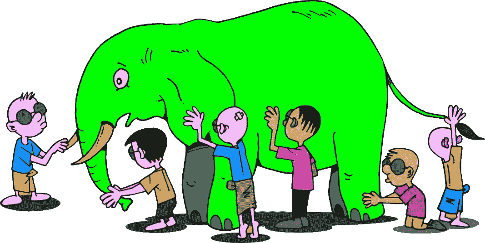

# 当一家科技巨头有兴趣收购你的初创公司时…

> 原文：<https://medium.com/hackernoon/when-a-tech-giant-is-interested-in-buying-your-startup-beb7769fb856>

> 披露: [mabl](https://goo.gl/7ZKSvU) **，**ML 驱动的测试自动化服务，之前赞助过黑客 Noon。

[**大卫·斯穆克**](https://medium.com/u/7f91547ce9c9?source=post_page-----beb7769fb856--------------------------------) **:** 你创办了自己的公司(Stackdriver)并在不到两年的时间里将其出售给谷歌，这对一家公司来说是相当快的生命周期，而且出售给了一家科技巨头。所以我想问你，当与这些有兴趣收购他们公司的科技巨头交谈时，你会给下一位企业家什么建议来做出正确的决定？

****联合创始人&首席执行官** [**丹·贝尔彻**](https://goo.gl/czfR5L) **:** 我的第一条建议是，当你开始时，不要把注意力放在退出上。相反，专注于打造一个伟大的产品，一个伟大的团队，以及一个从长远来看将会成功的公司，如果运气好的话，退出就会到来。为特定类型的退出建立一家公司也是有风险的，因为其中很多都在你的控制之外——你的潜在收购者内部正在发生什么，他们的优先事项是什么，谁在负责，他们还做了哪些交易，等等。**

**就你与谷歌、微软或亚马逊这样的公司接触的程度而言，我的建议是，将潜在的收购视为你的团队和产品旅程中的另一个主要阶段。在您同意进行这一飞跃之前，您应该花大量时间来研究该阶段的细节，从每个团队成员将扮演的角色，技术集成将如何工作，谁将向谁报告，等等。我认为很多事情通常会在交易结束后解决，但在交易结束前解决这些问题符合每个人的利益——尤其是考虑到你在谈判过程中比谈判结束后拥有更多的优势和注意力。我认为，通常是整合，而不是交易本身，将决定收购对你、你的团队和收购方是否成功。**

> **“把潜在的收购看作是你的团队和产品旅程中的另一个重要阶段。”**

**大卫:是啊，这是一个很好的视角……我的意思是，如果它不是一家成功的公司，没有人会想买它。**

**丹·贝尔彻:是的，我认为这很大程度上是关于人的，你知道赞助这笔交易的人，你将与之共事的人，你在新公司的团队，等等。财务方面是一回事，但你真的想确保每个人在 2、3、4、5 年后都觉得这是收购后的一个职业亮点，而不是一个大事件。**

> **阅读采访其余内容:[mabl 联合创始人丹·贝尔彻的创业之旅](https://hackernoon.com/the-entrepreneurial-journey-of-mabl-co-founder-dan-belcher-2f780620d805) & [mabl 利用 AI 将软件测试带入 DevOps 时代](https://hackernoon.com/mabl-uses-ai-to-bring-software-testing-into-the-devops-era-98a45f52525e)。**
> 
> **访问 mabl.com了解更多关于消除片状 QA 测试的信息。**