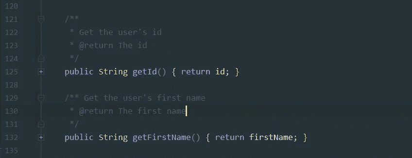

# 我大声反对代码注释

> 原文：<https://medium.com/hackernoon/where-i-rant-against-code-comments-5e1ca65f6fc2>



我讨厌代码注释。我讨厌看评论，也讨厌写评论。这是我在一个新项目中首先注意到的事情之一，通常是代码质量的一个危险信号。

我知道有些人相信代码注释。如果代码没有被广泛地注释，他们会感到无助。他们通常有几个理由来解释为什么需要注释。

> 我必须解释方法是做什么的。

```
/**
 * Retrieves the registration info of the user
 * @param args The user's id
 */
public String getInfo(int args){
  ...
}
```

我同意`String getInfo(int args)`不是一个没有注释解释它实际做什么的方法。但是为什么不用一个更好的名字呢？重命名它不会花费您任何成本:

```
/**
 * Retrieves the registration info of the user
 * @param userId The user's id
 */
public String getRegistrationInfo(int userId){
  ...
}
```

哇！看起来评论已经不需要了，是吗？这实际上是复制信息，违反了[干燥原则](https://en.wikipedia.org/wiki/Don't_repeat_yourself)。

可悲的是，这种多余的注释在实际代码中太常见了。很多时候添加注释是因为愚蠢的编码风格规则要求每个方法都要被注释。而一个可怜的[程序员](https://hackernoon.com/tagged/programmer)能做什么呢？加个评论就满足法律了…

```
/**
 * Set the user's name
 */
public void setName(String name){
  ...
}
```

如果我每删除一条这样的评论就能得到一美元，我可能会靠删除无用的评论谋生。

> 但这没什么坏处！

除了让代码更难阅读，是的，它没有任何害处。暂时如此。但是我向你保证，在将来的某个时刻，有人将需要不同的方法来获取/设置名字和姓氏。他们很可能会使用 IDE 的重构[工具](https://hackernoon.com/tagged/tool)并重命名方法，同时忘记重命名注释:

```
/**
 * Set the user's name
 */
public void setLastName(String lastName){
  ...
}
```

嘭！误导性的评论。推断几年后，你会开始慢慢变得疯狂。

> 但是如果我不能为一个方法找到一个好名字呢？

```
/**
 * Display an error message to the user, log the error
 * and navigate to the login screen
 * 
 * @param exception The exception
 */
public void handleError(Exception exception){
  ...
}
```

我同意，[给事物命名很难](http://martinfowler.com/bliki/TwoHardThings.html)。从写下你能想到的最好的名字开始。如果`displayAndLogErrorThenGoToLogin()`没有准确说出，问问自己为什么。啊，你说动词太多了？可能是因为方法做的事情太多了吧？我可以提醒你一件小事，叫做单一责任原则吗？为什么不分成 3 个小方法:`displayErrorMessage(Exception e)`、`writeToLog(Exception e)`和`navigateToLoginScreen()`？

> 我需要用不明确的参数来记录这个方法

```
/**
 * Display a dialog at a certain position on the screen
 * 
 * @param type One of Dialog.ALERT, Dialog.ASK or Dialog.NEGATIVE
 * @param isBlocking True if the dialog should block the UI
 */
public void showDialog(int x, int y, int type, boolean isBlocking){
  ...
}
```

哦，男孩…我从哪里开始？

布尔参数？99%的情况下，这是一个请求被一分为二的方法。`showBlockingDialog()`和`showNonBlockingDialog()`怎么样？

您必须记录参数的支持值。是什么阻止了某人进入 [42](https://www.google.ro/search?q=what%27s+the+answer+to+life+the+universe+and+everything) ？还是`Integer.MIN_VALUE`？创建一个枚举来保存可能的值，并限制任何人传入错误的值。或者考虑使用工厂来创建不同类型的对话框。

> 但是你看，我有一个奇怪的技巧需要记录…

```
...
Blob blob = getLastUsedBlob();
// the blobs are spread out in memory to make attacks difficult
int nextAddress = blob.getMemoryAddress() >> blob.getByteSize();
Blob nextBlob = Blob.getFromAddress(nextAddress);
```

我同意，这是那种需要记录的晦涩难懂的知识。有时将这些知识封装在一个单独的方法或类中会有所帮助。在这个具体的例子中，将它封装在`Blob`类本身中是有意义的:

```
/**
 * Find the next blob
 */
public Blob getNextBlob(){
  // the blobs are spread out in memory to make attacks difficult
  int nextAddress = getMemoryAddress() >> getByteSize();
  return Blob.getFromAddress(nextAddress);
}
```

现在，您不仅使任何使用 blobs 的人的生活变得更加容易，还使您的代码更加安全。不再是偶然的`<<`而是`>>`。耶！

代码可以是如此美丽的东西。像大多数美丽的东西一样，需要努力才能创造出来。不幸的是，很容易写出糟糕的代码。而[不良代码*需要*注释](https://books.google.ro/books?id=5wBQEp6ruIAC&lpg=PA29&ots=n5npfteIqX&dq=the%20pragmatic%20programmer%20bad%20code%20requires%20comments&hl=ro&pg=PA29#v=onepage&q=the%20pragmatic%20programmer%20bad%20code%20requires%20comments&f=false)。但是不要删评论，说你的代码漂亮。一开始就用不需要注释的方式写。

所以继续编码吧(不带注释)！

> [黑客中午](http://bit.ly/Hackernoon)是黑客如何开始他们的下午。我们是 AMI 家庭的一员。我们现在[接受投稿](http://bit.ly/hackernoonsubmission)并乐意[讨论广告&赞助](mailto:partners@amipublications.com)机会。
> 
> 要了解更多信息，请[阅读我们的“关于”页面](https://goo.gl/4ofytp)、[喜欢/在脸书给我们发消息](http://bit.ly/HackernoonFB)，或者简单地说， [tweet/DM @HackerNoon。](https://goo.gl/k7XYbx)
> 
> 如果你喜欢这个故事，我们推荐你阅读我们的[最新科技故事](http://bit.ly/hackernoonlatestt)和[趋势科技故事](https://hackernoon.com/trending)。直到下一次，不要把世界的现实想当然！