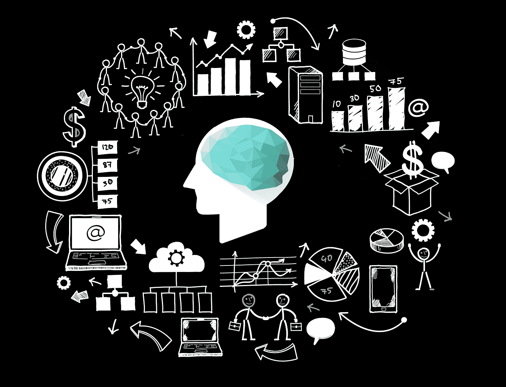

# 为什么人工智能是营销的未来

> 原文：<https://medium.com/hackernoon/why-ai-is-the-future-of-marketing-5783e62cdb08>

人工智能(AI)不是一个外来名词；已经很多年了！也有许多关于人工智能的能力和未来范围的预测，但只是最近它才出现了大规模的繁荣。据说 2016 年是人工智能最重要的一年。这种说法的核心是谷歌的程序，该程序在战略棋盘游戏**Go**的五局比赛中击败了 18 次世界冠军李·塞多尔。这一突破使人工智能得以进军技术和创新的前沿。

人工智能在大多数垂直行业都有无数的应用。在这篇文章中，我们将谈论它在市场营销中的应用，以及为什么我们可以自信地说人工智能是市场营销的未来。但首先，让我们看看人工智能需要什么。

# AI 是什么？

> 人工智能是一种旨在模仿人类心理和智力的技术。

虽然它有一个非常广泛的定义，但它基本上是指执行需要人类智慧和直觉的任务的软件。到目前为止，这项技术已经执行了语音识别、图像识别、行为模式映射和机器学习等功能。

一些人工智能营销应用已经走得很远，为客户的询问提供即时自动回答。它还被用来创造新的销售线索，通过有趣的内容留住现有客户，并提高客户参与度。

这些年来，人工智能在市场营销方面取得了一些令人印象深刻的进展。让我们来看看迄今为止人工智能在营销中的各种用途。

# 人工智能在市场营销中的应用

人工智能在市场营销中的应用范围已经扩大。随着数字营销和互联网革命的到来，大众媒体广告退居二线，而消费者行为、偏好、搜索历史跟踪、搜索引擎优化、内容营销、语音识别等则成为重中之重。我们来看一些 AI 的营销应用。

# 内容生成和管理

这适用于直接的、没有偏见的、有明确事实和数据的内容。人工智能写作程序可以起草即将到来的事件、财务报告或一些市场趋势的内容。然而，它不能写一篇关于当前政治形势或如何处理心碎的帖子或观点文章。内容生成人工智能程序的一些例子是 Wordsmith、Contentop、Articolo 和 WordAi。

内容监管意味着向客户展示相关内容，以更好地吸引他们。例如，显示与最近阅读的文章相关的博客、基于最近购买的项目的建议以及网飞的电影推荐。

# 语音和文本识别

人工智能让用户对着设备说话，获取相关信息。语音识别技术是一项人工智能创新，应用广泛，非常受欢迎；正在开发更多的程序和软件来增加其功能。

文本识别意味着在文本框中键入文本并获得结果，或者能够与其他人交流，俗称聊天机器人。

语音和文本识别的一些著名例子是 Amazon Echo、Facebook Messenger 和 Google Hangouts Messenger。

# 个性化营销

品牌正在改变策划建议，以便在更深层次上与客户建立联系。简单地展示基于预测分析的广告已经不够了。根据用户与品牌的对话，理解用户的情感来源，有助于制定更好的回应。这也有助于未来的推荐和建议更加个性化和有针对性。

# 了解用户行为

用户以 cookies 和网络足迹的形式留下他们使用互联网的痕迹。AI 帮助网站跟踪用户偏好，甚至搜索历史，以了解他们的行为。这使得网站能够了解特定用户喜欢什么、想要什么、会寻找什么，以便提供更有针对性的建议。

# 优化销售

了解用户行为对于优化销售和提高整个流程的效率非常重要。销售主管执行从研究到锁定潜在客户的任务，了解用户行为，然后推销获得转化的正确方法。使用人工智能可以使这一切变得更容易，算法过滤可以节省时间和精力，这些都可以在其他地方得到最好的利用。

HubSpot 的联合创始人 Dharmesh Shah 表示，基于人工智能的销售和营销自动化将在未来加速发展。这将优化预测性潜在客户获取、了解客户行为和个性化推荐等活动。

# 人工智能在市场营销中的其他一些应用包括:

*   [再营销和重新聘用](https://onlinesales.ai/blog/dynamic-remarketing-must-e-commerce/)
*   运行[强大的个性化电子邮件活动](https://onlinesales.ai/email-marketing/)
*   [营销自动化](https://onlinesales.ai/blog/cede-control-speed-up-marketing-ai/)
*   [聊天机器人](http://onlinesales.ai/sofie)
*   个性化网页和应用
*   最终确定销售线索
*   [优化广告定位](https://onlinesales.ai/blog/pro-tip-create-ad-groups-boost-campaign-ctr/)
*   预测分析

# 未来我们能期待什么？

相对于人工智能，营销的未来将变得更加创新和自动化。国际软件开发组织 Pega 强调了人工智能在未来支持市场营销的一些方式。

人工智能将帮助公司，此外，首席营销官建立一种以客户为中心的企业文化，并帮助优化营销目标，如个性化，[了解客户行为以定制参与](https://onlinesales.ai/email-marketing/)和推介流程，进行更准确的预测分析，并节省寻找和转换线索的时间。

简而言之，它将帮助公司节省成本，优化预算，使员工的任务更加简化，通过自动化销售流程减少时间，并在整个购买周期中个性化客户体验。

# Pega 还陈述了人工智能的更多未来应用:

1.  [虚拟助手](http://onlinesales.ai/sofie)(例如 Siri、Alexa、Watson)将变得更加智能，并增强聊天机器人的功能。
2.  通过客户决策中心，定制的用户推荐将成为可能，并丰富用户体验。
3.  付费数字营销活动可以得到更好的管理和自动化，以节省时间和费用，同时利用人工智能提高投资回报率。
4.  自然语言处理(NLP)将变得更加“直观”,根据客户与公司的书面对话来判断客户的情绪和意图。
5.  人工智能甚至可以向实体店的销售代表提供建议，告诉他们如何迎合客户以获得最佳效果。

HubSpot 的联合创始人 [Brian Halligan](https://www.linkedin.com/in/brianhalligan/) 和 [Dharmesh Shah](https://www.linkedin.com/in/dharmesh/) 在最近举办的 [Inbound 2016](https://www.inbound.com/inbound16/speakers) 活动中，对人工智能进行了更多预测，作为营销未来的一部分。

1.  他们说，2017 年机器人的使用将会有很大进步。哈利根说，人们将逐渐转向与机器人软件交流，而不是通过网站和应用程序导航。然而，他说，机器人不会取代网站，而是为它们提供动力。
2.  同样，Shah 说，客户和组织之间通过聊天和短信进行的对话将很快被用户和机器之间的口头对话所取代。他说，由于语音输入的诸多好处，它将很快比文本输入更受欢迎。
3.  算法将定期开发，许多组织可以使用现有的算法进行构建。
4.  谷歌的链接图、亚马逊的产品图和脸书的社交图将被参与度图取代。这将意味着高质量的内容，以获得更多的参与。

哈利根和沙阿说，最重要的因素是内容和数据。

# 最后

如今出现了一种新的消费者群体——快节奏的知识型消费者。他们期望在购买之前*从商品中获得价值。他们需要知道品牌*关心*他们和他们的需求。*

消费者希望品牌在决定冒险之前知道他们想要什么。他们现在需要[的建议、提示、答案和帮助](http://onlinesales.ai/sofie)*。*

*这是不会改变的。只会越来越多。人工智能是公司跟上不断增长的客户需求和期望的唯一途径。*

*可以肯定地说，人工智能是营销的未来。它将人类的体验与技术及其诸多进步拉近的距离是无限的。*

> ***相关岗位***

*   *[放弃控制权—借助营销人工智能加速发展](https://onlinesales.ai/blog/cede-control-speed-up-marketing-ai/)*
*   *[整合活动带来一场【营销】超级碗！](https://onlinesales.ai/blog/integrated-campaigns-deliver-a-marketing-superbowl/)*
*   *[为什么您应该使用算法方法进行预算管理](https://onlinesales.ai/blog/algorithmic-approach-budget-management/)*

## *关于 OnlineSales.ai*

*OnlineSales.ai 是一个人工智能驱动的[电子商务营销平台。由前亚马逊人领导的这个平台是由零售商为零售商打造的。](http://onlinesales.ai)*

*OnlineSales.ai 是零售商的用户获取、留存和货币化的操作系统。*

*该平台的核心是收集和挖掘数十亿个数据点，以构建产品目录智能、用户角色和零售经济动态。*

*这种系统智能与在线销售平台上的技术自动化相结合，该平台现在在单个平台上托管跨营销、用户体验和数据技术的互联应用。*

**原载于 2017 年 8 月 31 日*[*online sales . ai*](https://onlinesales.ai/blog/ai-future-marketing/)*。**