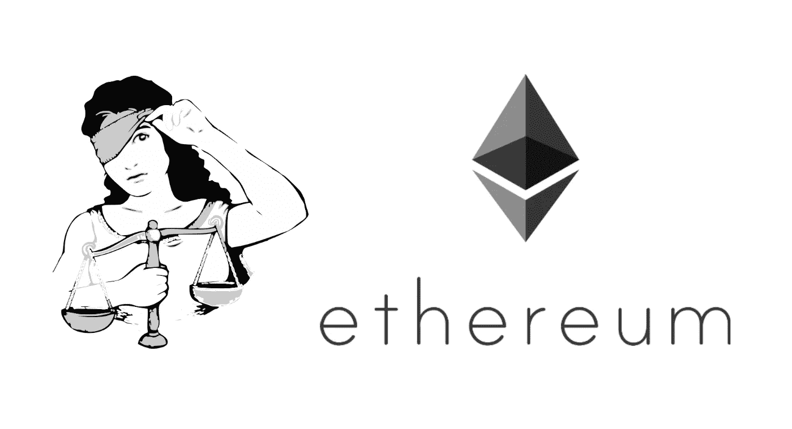

# 为什么需要对 ICO 进行监管

> 原文：<https://medium.com/hackernoon/why-cryptocurrencies-and-tokens-should-be-regulated-349b920b62c8>

越来越多的涉及以太坊代币和其他平台上的初始硬币发行(ICO)的骗局浮出水面。更多的骗局尚未被揭露。在这篇文章中，我认为我们今天在 crypto 中看到的问题是由道德风险引起的，法律是一个可能的解决方案。然而，实施监管的方式至关重要，因为法律不应该成为创新的(过多)负担。

> “监管者介入只是因为政府害怕失去权力！”

这似乎是大部分(或非常响亮的少数)加密社区的观点。当然，考虑到 crypto 的“密码朋克”根源，这是可以理解的。不管这种说法是否合理，我想提出一个不同的观点:我认为监管不仅是好的，甚至是这个空间长期繁荣的必要条件——我们甚至应该尽我们所能帮助监管者。

那么，我为什么这样说呢？

# 法律的运作

第一，要明白法律是让我们社会整体运转的油。它提供了各方之间的信任，减少了道德风险。信任允许人们彼此做生意，而不必在一方不诚实时诉诸暴力。毕竟，在这种情况下，我们可以依靠我们的法律制度。

道德风险是一个经济学概念，它意味着如果某人行为的成本被社会化，他们更有可能从事对社会有风险的行为。人们并不总是做正确的事；他们可以做对自己最有利的事情。如果他们看到了谋取私利的机会，他们可能会做出道德上有问题的行为。任何这样的机会都是道德风险。

我们的法律体系通常试图通过惩罚不道德行为来减少道德风险。一些通常倾向于对自己的道德风险采取行动的人，如果不得不权衡可能的惩罚，会三思而行。这是法律的一个重要功能，因为，没有它，只有道德才能阻止某人为了自己的利益去伤害他人。

/sarcasm

# 密码中的道德风险

在这个领域，存在大量的法律不确定性。Crypto 发现自己处于法律的灰色地带，已知的法律分类、规范和法律很难适用。此外，由于权力下放的全球性质，在适用法律方面有许多复杂的管辖问题。

因此，许多人认为我们正处于一个法律的“蛮荒西部”，正常的规则不适用或不能适用。然而，这是*错了*。

虽然法律可能是枯燥的，技术可能是令人兴奋的，但法律的影响不能简单地希望消失。适用的复杂性也不意味着法律不适用。法律的不确定性并不等同于狂野的西部。

> 许多人认为我们处于一个合法的“蛮荒西部”，但这是错误的。

可悲的是，狂野西部的观念已经广泛传播。当人们相信他们不会因为道德风险而受到惩罚时会发生什么？是的…休斯顿，我们有麻烦了:

*   Scamcoins:例如 Paycoin、OneCoin、S-coin、EarthCoin、REcoin、DRC 或许多其他尚未出现的货币。
*   其他骗局&庞氏骗局:查看此列表。
*   交易所不可靠，不透明。看看 [Mt. Gox](https://en.wikipedia.org/wiki/Mt._Gox) 、 [BTC-E、](https://www.coindesk.com/is-btc-e-back-troubled-exchange-enables-user-log-ins-weeks-after-crackdown/) [Bitfinex](http://neocashradio.com/blog/ep-219-scam-warnings-bitfinex-tether-empire-card/) 的故事。
*   [抽排方案](https://en.wikipedia.org/wiki/Pump_and_dump):电报、[网站](https://pumpmycoin.com/)等上的大量[组。](https://t.me/reliable_pump_advise)
*   订单欺骗是[常见的做法](https://hackernoon.com/meet-spoofy-how-a-single-entity-dominates-the-price-of-bitcoin-39c711d28eb4)。
*   黑客攻击:在过去的 12 个月里，通过黑客攻击或网络钓鱼，估计价值 2 . 25 亿美元的以太坊被盗。
*   许多通过首次公开募股筹集资金的项目对他们的项目及其未来做出未经证实的声明，这误导了投资者，导致了不正常的投机行为。

# 保护投资者

说到底，这些问题都是道德风险造成的。这些个人采取的行动对整个社区来说是一个问题:成本是社会化的。

我们也不是第一次看到这些问题。事实上，骗局、庞氏骗局和其他金融欺诈在导致 1929 年华尔街崩盘进而引发大萧条的过程中扮演了重要角色。当时，人们决定应该阻止这些做法，因此，美国政府颁布了《证券法》和《证券交易法》。

从本质上讲，这些法律降低了证券发行者的道德风险:它们确保投机或欺诈行为的空间更小。突然间，发行人现在必须对其证券透明，因为某些信息披露是强制性的，任何虚假陈述都将导致发行人承担责任。

我认为没有人会不同意与 ICO 相关的道德风险在很大程度上是一个可以解决的问题。代币发行的强制性透明度和对不道德行为的惩罚，在这里可以起到与传统证券相同的效果。由于投资者的利益需要保护，代币市场可以也不会长期不受监管。

*   “但是加密投资者不需要保护！他们可以自己思考！”

尽管这一观点似乎很有道理，但历史表明事实并非如此。(这种新古典经济理论的)问题在于，它假设投资者完全理性。然而，事实并非如此，学术界已经在很大程度上[远离了](https://papers.ssrn.com/sol3/papers.cfm?abstract_id=2040946)理性投资者的概念，转向了基于[行为金融学的概念化:](http://www.sciencedirect.com/science/article/pii/S0927538X03000489?_rdoc=1&_fmt=high&_origin=gateway&_docanchor=&md5=b8429449ccfc9c30159a5f9aeaa92ffb&ccp=y)投资者试图变得理性，但实际上他们受制于各种[非理性行为](http://www.investopedia.com/articles/05/032905.asp)。

因此，他们应该被保护(在某种程度上)免受自己的非理性，因为其他人不应该被允许滥用它。上周，理查德·塞勒获得了诺贝尔经济学奖，他在很大程度上改变了投资者理性的学术叙事。

*   “我不在乎这个泰勒和他的理论！加密投资者比普通投资者聪明，我们不需要保护！”

那么，为什么我们会看到如此明显的投机泡沫出现？区块链的潜力是复杂的，投资者缺乏知识很容易被一些炒作的词语所利用。事实上，投资者经常被提供过于乐观的信息，甚至是关于即将到来的代币发行的虚假陈述。作为回报，项目获得了不合理数量的资金，这刺激了其他机会主义者去碰碰运气，建立一个网页，写一份充满天花乱坠的模糊白皮书，然后笑着走向银行。我认为加密投资者比其他人更需要保护。

*   “所以你关于为什么监管对这个领域有益的整个理论是基于你认为我们正处于泡沫之中？”

好吧，如果我们不是在泡沫中，那么我很乐意有人向我解释为什么没有概念证明、像样的商业计划或工作项目的初创公司估值会达到数千万。然而，监管的好处不仅仅是保护投资者。

# 区块链法规的优势

## **1。投资者保护**

我认为这一点非常清楚。简短的总结:

*   在某些司法管辖区，许多代币可能会被归类为证券。
*   这使得强制性披露要求适用于代币发行。
*   强制性披露给投资者更多的信息，让他们能够理性地做出决策。
*   提供给投资者的信息将更加可靠，因为开发商将对其项目的虚假陈述负责。
*   开发者将不得不实际做他们声称要做的事情。
*   此外，交易所现在还必须遵守证券交易的相关法规。
*   这将对交易所施加强制性的透明度和质量标准。
*   随着交易所在出售证券时必须遵守更严格的法规，转储计划和订单欺骗将变得不那么普遍。

## **2。减少与非法行为的关联**

如果 crypto 在西部呆的时间足够长，普通投资者可能会开始将这个空间与他们听到的问题联系起来:非法行为、诈骗等。这将使人们对该领域的兴趣迅速下降。

了解你的客户(KYC)和反洗钱条例在这方面也有帮助。这些规则的明确实施将有助于 crypto 摆脱加密货币和代币仅由罪犯和恐怖分子使用的说法。

## **3。提高空间投资的质量**

监管不确定性是许多(机构)投资者的担忧。如果情况得到缓解，我们将会看到更多天使投资者、(企业)风险资本家和对冲基金的投资。这些团体带来了知识和行业联系——这是这个领域成熟所需要的。此外，他们将为空间提供合法性，这将启动一个积极的反馈循环。

然而，我不得不说，一个活跃在这个领域的风险投资基金向我表明，他们喜欢目前的法律不确定性。我相信他们喜欢它，因为它减少了这个他们知道最终会繁荣的领域的竞争。

## **4。监管确定性降低进入壁垒**

“如果你无法估计你的企业的风险，那么你就是一个敢于尝试并取得成功的勇敢者。”

如果规则明确，法律风险就可以解决。目前，这些风险只能估计。减少监管的不确定性将降低所有不适应当前法律环境的人的准入门槛。

例如，想象一个交易。目前，交易所可能会受到 SEC 关于证券交易所、替代交易系统(ATS)、经纪交易商、转账代理和清算机构的监管，以及金融犯罪执法网络在各州和 KYC/AML 的[汇款法](https://coincenter.org/entry/what-is-money-transmission-and-why-does-it-matter)。我甚至还没有谈到其他司法管辖区！能够在合规性方面做出明智的决策会使进入市场变得更加容易。

新的法规和法律沙盒还可以大大减轻试图应用各种现有法规的监管负担

Legal compliance is an incredibly tricky issue in crypto, with more than one possible outcome.

# 监管的最大缺点

可以理解，有人担心监管会扼杀创新。如果监管过于严格，实际上可能会增加许多公司的准入负担。必须遵守全球所有的证券法规将给初创公司带来巨大的成本——这是他们无法承受的。

此外，像 crypto 这样创新的空间中的规则通常不会过时:它们可能与未来的创新不兼容。这是一个很大的问题，因为监管者可能没有完全理解分布式账本技术的潜力。

然而，有两点值得考虑。

*   监管机构意识到了这一点。事实上，这就是为什么他们这么长时间以来一直采取观望态度的原因。他们对扼杀创新不感兴趣。他们知道，如果他们在自己的国家制定过于严格的规则，创新者将转移到更“创新友好”的司法管辖区，这在经济上是不可取的。
*   这种意识导致了辖区内关于谁能制定最佳监管的竞争(例如，见毛里求斯、澳大利亚和英国监管沙盒的出现)

换句话说，监管机构将不得不在保护既得利益(例如保护投资者)和制定尽可能最有利于创新的监管之间寻求平衡。

# 自我调节

上述论点并没有消除对糟糕立法的所有担忧。监管者可能没有完全理解某些创新的潜力。他们还可能受到不太热衷于颠覆的传统行业的游说。因此，这取决于密码社区积极参与教育监管机构，并在思考和起草法规方面合作。这一点非常重要，这也是为什么我非常欣赏像[货币中心](https://coincenter.org/)这样的聚会。

此外，我们还应该考虑如何消除监管者的痛点。再以 ICO 的投资者保护为例，密码行业应该共同努力建立一个合理的最佳实践或标准框架。例如，这可能涉及为不同的令牌(加密货币、协议令牌、实用令牌等)起草分类系统。)和各自的自愿遵守制度，以增加透明度，保护投资者免受各方道德风险的影响。

# 结论

道德风险导致了密码领域的许多问题，这反过来引起了监管机构的注意，监管机构将寻求解决这些问题。

*这不是一件坏事，*只要处理得当。

目前，道德风险意味着一些人的“不道德行为”的成本被社会化到我们这个行业的所有人身上。就在人们开始接受比特币是一种不仅仅被恐怖分子使用的数字货币时，Crypto(再次)开始名声不佳。

解决监管者的痛点是必要的，因为这些痛点是有根据的。理想情况下，我们应该致力于保护立法者利益、不给创新带来任何负担的监管。然而，这并不像听起来那么容易，因为它涉及到在(部分)不一致的利益之间进行极其困难的平衡。

因此，作为一个行业，我们有责任在这一过程中协助监管者，在必要时对他们进行教育，并共同思考可能采取的方法，包括自我监管。毕竟，如果我们作为一个群体不花时间来充分理解和解决监管者的痛点，那么他们为什么要花时间来考虑我们的问题呢？

***关于作者:***

*Thijs Maas 是一名法律系学生，他对分布式账本技术带来的创新浪潮所带来的法律挑战有着浓厚的兴趣。他最近推出了*[*www . lawondblockchain . eu*](http://www.lawandblockchain.eu)*，一个充当该主题信息、见解和学术研究中心的网站。*