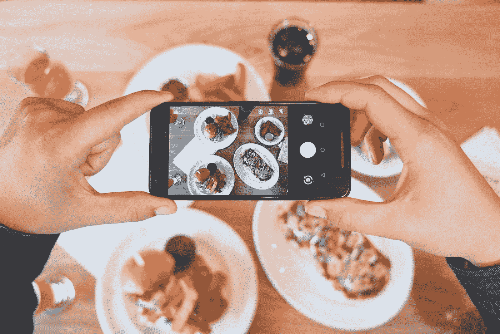

# 你为什么不再在脸书上发帖了？

> 原文：<https://medium.com/hackernoon/why-did-you-stop-posting-on-facebook-8c791d6dba88>

我的许多朋友已经不再在脸书上发帖了。一些人卸载了应用程序，其他人甚至删除了他们的账户。

他们也没有在 Twitter 上发帖，更短暂的 Snapchat 也没有在我最亲密的朋友中达到临界量。

Instagram 是唯一一个我还能看到我最爱的人最私密的一面的地方，但我得说只有 20%的网友积极使用它。

是什么原因导致某人停止在社交媒体上分享？过了 30 岁是很自然的一部分吗？还是平台存在实际问题？通过与其中的 12 个朋友交谈，我了解到有几个群体。

“Person takes a picture of their brunch on their smartphone” by [Eaters Collective](https://unsplash.com/@eaterscollective?utm_source=medium&utm_medium=referral) on [Unsplash](https://unsplash.com?utm_source=medium&utm_medium=referral)

第一，**厌倦了表面实证主义的人**。这是社交媒体的一个话题:众所周知，人们倾向于分享他们最好的，而不是最坏的。作为一个社会，我们重视实证主义并赞扬成功，但我们经常与消极情绪做斗争，我们不知道如何对心理健康或抑郁症等复杂问题做出反应。

当你的朋友发布的所有东西都属于“完美快乐”类别时，就很难表达失败、不安全感、悲伤等情绪。这种挫败感会对平台产生不信任……直到你停止使用它。

第二，**厌倦消极的人**(与上述群体截然相反)。鉴于总统选举的疯狂，这可能是一种更具体的美国趋势，但这一群体的人无法再忍受对国家状况或我们不确定的未来的咆哮。

[脸书缺乏一种适当的方式来控制你在新闻提要](https://geekonrecord.com/2016/11/24/i-broke-facebook/)中看到的帖子类型，例如，几乎不可能阻止所有新闻网站谈论特朗普最新推文的共享链接。对于只对个人状态更新感兴趣的用户来说，这可能会令人沮丧…直到他们离开。

第三，**担心自己隐私的人**。这个群体的人对复杂的隐私设置感到困惑，或者他们只是对投入必要的时间来控制谁能看到什么不感兴趣。*截至 2018 年 4 月 2 日的更新*:最近剑桥分析公司的隐私丑闻[可能已经将更多的人推到了这个群体中，隐私终于成为首要问题。](https://hackernoon.com/fixing-facebooks-privacy-problem-ee12f9adaec1)

不管你觉得自己属于哪一个群体，都有一种滚雪球效应，可以被归类为第四类:你的朋友因为这样或那样的原因停止发帖，你也开始失去发帖的动力。"*如果我最亲密的朋友大部分都看不到，为什么要把这个分享给熟人？为什么要分享呢？*

我发现自己处于前两类人之间，但我确实感觉到滚雪球效应对我的在线状态影响最大，并提出了更深层次的问题:我为什么要在网上分享我生活的任何一部分？

你呢？你为什么不再在脸书上发帖了？你为什么要开始？

你喜欢这篇文章吗？ [**订阅**](https://geekonrecord.com/subscribe/) **通过邮件获取新帖。**

*最初发表于*[*geekonrecord.com*](https://geekonrecord.com/2017/02/18/why-did-you-stop-posting-on-facebook/)*。*