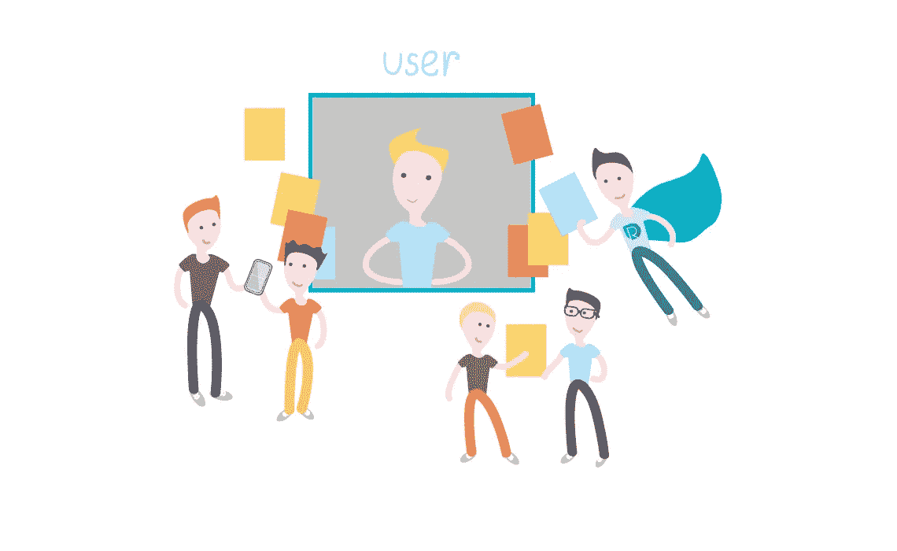

# 我们为什么需要 UX 设计:以人为中心的设计框架

> 原文：<https://medium.com/hackernoon/why-do-we-need-ux-design-human-centered-design-framework-5bff859aebb8>

UX 设计是一种时尚还是一种创造性解决问题的概念？这仅仅是当今工作的一种趋势或标准吗？UX 是干什么的？为什么我们需要用户体验？

当我们想与您分享一个有用的信息，可以增加您的业务利润，甚至通过实施过程保存您的整体想法，我们不能绕过 UX 设计。实际上，我们所有的知识都是基于用户体验的。好吧，总的来说——人类文明的每一个重要步骤都是因为用户体验而完成的。而每一次跌倒都是因为忽略了用户体验。哦，天啊！那是真的！如今，光有好的产品是不够的。你应该为你的特定客户提供最好的产品。这种以人为中心的方法是什么？宠坏顾客有危险吗？不。我们需要使用以人为中心的方法，因为市场的噪音。如果我们想让我们的客户看得见、听得见，我们应该知道什么对我们的用户来说是有价值的、舒适的。如果我们想让我们的用户愉快地使用我们的产品，我们应该知道客户使用产品的完整路径。设计、可用性工程和认知科学领域最伟大的专家 Don Norman 这样评价 UX:它是与你的产品体验相关的一切。用户体验不仅是发现用户的机会，也让你更好地了解你的业务和产品。好的 UX 必须解决人民和商业的任务。因此，在这一章中，我们将找到问题的答案:

*   什么是 UX？
*   为什么 UX 在生命周期产品开发中很重要？
*   UX 如何评估风险和降低成本？
*   如何使用 UX 来改进 KPI 和优化业务流程？
*   什么是 HCD 框架，如何使用它？

# UX 和多学科

唐·诺曼发明了一个术语“UX”，因为他认为“可用性”和“用户界面”这两个术语太狭隘了。

我想涵盖人们对系统体验的所有方面，包括工业设计、图形、界面、物理交互和手册。(1)

一般来说，用户体验是一个人对产品、系统或服务的使用或预期使用的感知和反应；

这个过程中的用户体验涉及多种学科。甚至很难相信，一个人能在所有这些话题上受到如此良好的教育，如此聪明。这应该是一种真正的百科全书式的思维，具有很高的情感智商。我们将向您展示 UX 设计师面临的学科:认知心理学、神经营销、商业分析、视觉传达、信息架构、交互设计、UX 评估、图形和字体设计、人类工程学、语义学、符号学、哲学、价值理论和伦理学、计量经济学、消费者行为、数据管理和社会学

因此，正如你所看到的，UX 设计师不仅仅是一个有头脑并知道如何使用它的平面设计师。对于 UX 设计师来说，用 axure 制作一个可点击的原型是不够的。没有。一个人应该是一个真正热情的人，准备好探索诸如行为、行为模式、思维方式等困难。为了更好地理解用户体验过程，我们提供了一个用户体验设计师在启动项目时可能承担的责任列表。

# UX 的责任

在 UX 设计器的工作流程中有三个主要阶段:研究、原型和测试。但是每一步都有很多步骤。

当项目只是一个概念，团队能够接受未来实施的信息时，UX 设计师对用户进行人种学研究，调查，焦点小组管理，非直接和背景采访，心理建模，卡片分类，情绪板，竞争分析和背景调查。

当这一阶段的研究完成后，就该进行启发式分析、专家评估、创建人物角色和场景、系统映射和原型制作以及可用性测试了。当一个项目似乎已经完成，UX 设计师正在进行 A/B 测试和额外的线框图，作为测试和微调的结果。

# 全周期产品开发中的 UX

这位 UX 设计师不断提醒他的团队终端用户。开发人员经常忘记真实的世界，而用户在购买或使用产品之前每天都要面对这个世界。团队中设计师的束缚就像是用户自己的存在，能够根据他的特定需求定制服务，解决他的特定问题。

# UX 如何评估风险和降低成本？

用户体验可以给你一个评估风险的可能性，但是什么样的风险以及如何评估呢？在一个项目中有太多的风险是可能的，但是缺乏管理层的支持和利益相关者的同意通常是最主要的。(2)此外，范围问题和集成过程中的失败经常发生。在 UX 设计中最好的事情是，你可以真正评估他们，因为研究和分析，原型和测试。用户对产品或服务的接受度——这才是最重要的，对吗？所以，UX 设计正在检查这个。此外，UX 给你一个机会，节省金钱，你想花在无用或不需要的功能。有一种所谓的“越差越好”哲学——这意味着人们可能更喜欢一种对专业人士来说似乎更差的产品，因为它缺乏功能和复杂性。(3)但这是现实——用户希望产品简单有用，仅此而已。

如果我们希望我们的用户快乐，我们应该小心，至少不要伤害他们。例如，有很多东西你想放入你的网站。但并不是所有的都能给你带来很好的转化。或者像 manipulinks 一样，它可以以客户的坏情绪为代价带来小的转换。

这些让用户感到羞耻的标签被称为 manipulinks(史蒂夫·科斯特洛创造的一个聪明的术语):它们采用了通常被称为确认羞辱的做法——让用户对选择退出某项服务感到不舒服(从逻辑上讲，这种做法可能更好地被描述为拒绝羞辱)。(4)

# HCD:基本原则

以人为中心的设计或以用户为中心的设计是一个可以在每一个商业策略中使用的框架。这对任何想创造高利润的愉快生意的人来说都很有帮助。HCD 可以通过将人的视角融入到过程的每一步来找到解决方案。

“这种整体设计方法从真实的人那里获得灵感，在市场和技术限制下工作，并将每个产品接触点视为给用户带来惊喜、愉悦和利益的机会。”(5)

HCD 的基本原则是:

*   用户及其任务的准确定义
*   问正确的问题
*   考虑你的产品使用的环境和背景
*   让用户参与设计和开发
*   让用户反馈成为惯例
*   多学科团队和迭代过程

# HCD 循环过程

HCD 有一个循环顺序，当你使用它来满足任何你想要的需求，直到你得到真正的结果。过程包括 6 个步骤:观察，构思，快速原型，用户反馈，迭代，实现。让我们借助 IDEO 的解释更仔细地看看。(6)

# 观察

关于:识别您的最终用户的痛点、兴趣、爱好和日常需求

目标:完全理解你的用户

# 思维能力

关于:头脑风暴关注用户需求

目标:获得尽可能多的想法

# 快速原型

关于:为你的想法建立一个简单的原型

目标:给用户一个原型

# 用户反馈

关于:尽快获得第一个用户的反馈

目标:确保你正在努力实现你的目标

# 循环

关于:使用反馈信息并再次测试原型，直到您找到更好的解决方案

目标:获得最佳解决方案

# 履行

关于:当你确定你得到了正确的解决方案时，你可以进入下一步，实施你的想法。当然，你应该回到观察的第一阶段，一遍又一遍地重新开始。

目标:将你最好的想法公之于众

正如你所看到的，HCD 框架在整个生命周期的产品开发中非常有用，因为它由具体的阶段组成，每个阶段都给你更多的机会来改进你的产品。

UX 是一个过滤器，可以从空心中去除颗粒，并帮助您找到最适合您的客户的功能。这是提高 KPI 和优化业务流程的方法，因为当你知道什么对你的用户有价值时，你会直接行动并完全集中精力。以人为本的设计是满足用户需求和寻找解决方案的最佳方式，能够同时满足客户和企业的需求。

**参考文献:**

1.  UX 设计定义。更多信息请点击这里:[http://uxdesign.com/ux-defined](http://uxdesign.com/ux-defined)
2.  130 项目风险。更多信息请点击
3.  理查德·p·加布里埃尔。越差真的越好吗？更多信息:【http://dreamsongs.com/WorseIsBetter.html 
4.  停止羞辱你的用户微转换。凯特·梅尔，金·弗莱厄蒂。更多信息请点击这里:[https://www.nngroup.com/articles/shaming-users/](https://www.nngroup.com/articles/shaming-users/)
5.  戴夫·汤姆森。为什么以人为中心的设计很重要？更多信息:[https://www . wired . com/insights/2013/12/human-centered-design-matters/](https://www.wired.com/insights/2013/12/human-centered-design-matters/)
6.  IDEO 的 6 步以人为中心的设计过程:如何让人们想要的东西。更多信息请点击此处:[https://www . user testing . com/blog/2015/07/09/how-ideo-uses-customer-insights-to-design-innovative-products-users-love/](https://www.usertesting.com/blog/2015/07/09/how-ideo-uses-customer-insights-to-design-innovative-products-users-love/)

来源:[Redentu.com](https://redentu.com/why-do-we-need-ux-design-a-human-centered-design-framework-keyword-ux-design)