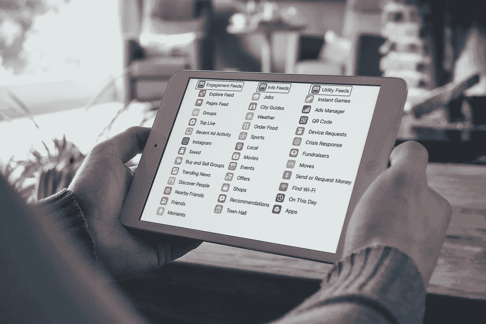
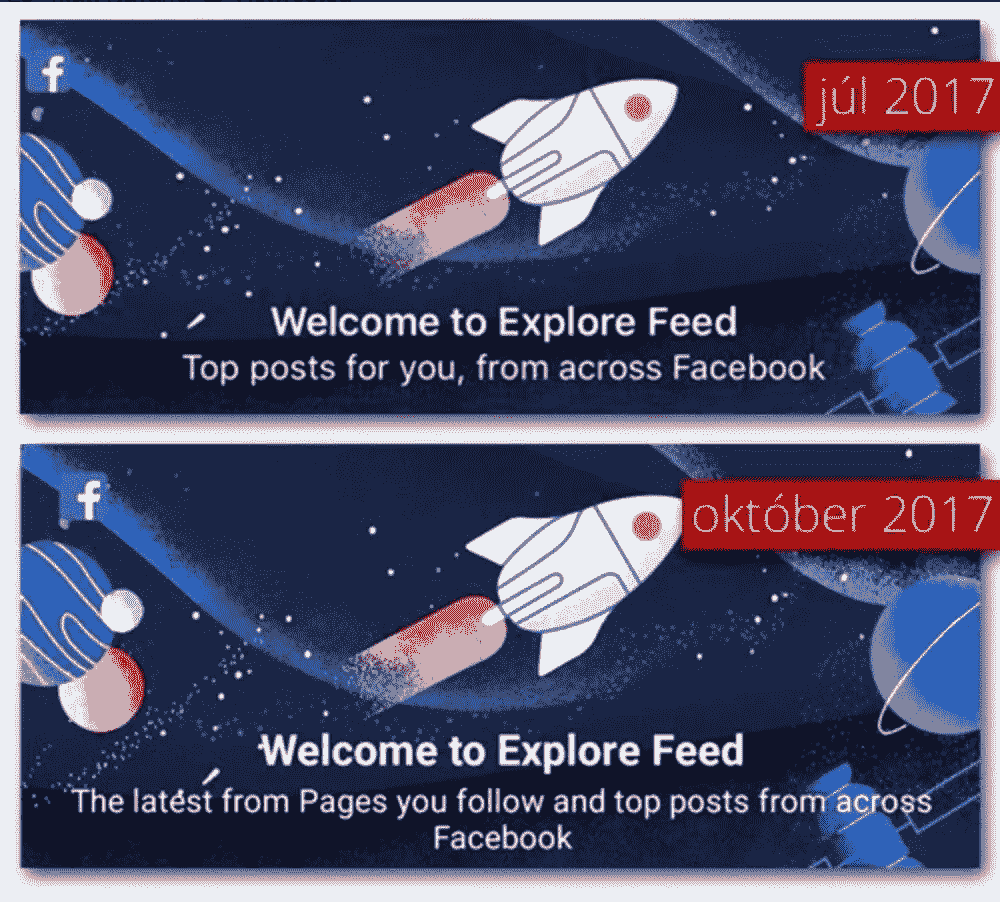

# “为什么脸书讨厌我？”或者“我应该在一英里外就能看到这一切。”

> 原文：<https://medium.com/hackernoon/why-does-facebook-hate-me-or-i-should-have-seen-this-coming-from-a-mile-away-24ca4d11888e>

在过去的这个周末，社交媒体社区注意到脸书已经开始测试一种新的方式，让帖子转到品牌页面。更具体地说，这篇文章来自菲利普·斯特鲁里克:[我们见过的有机脸书河段的最大跌幅。](/@filip_struharik/biggest-drop-in-organic-reach-weve-ever-seen-b2239323413)

这项测试目前正在欧洲 6 个不同的国家进行，并可能在接下来的几周内扩展到北美。

以下是我们目前从这些测试中了解到的情况:

常规的脸书新闻源不再显示你关注的页面上的帖子，除非它是一个赞助帖子(广告集或 boost ),因为它试图通过关注朋友的帖子来给它更多的个人感觉。

他们正在测试多个名为“探索提要”和“页面提要”的新提要。

根据您所在的位置,“探索订阅源”有几个不同的选项。其中一些只是脸书各地帖子的集合，而另一个版本既有你关注的页面，也有它根据你的用户行为认为你会感兴趣的脸书各地的帖子。

Photo via [Matt Navarra](https://twitter.com/MattNavarra)

另一方面，Pages feed 只是一个新闻 feed，由您关注的所有品牌页面组成，因此没有来自朋友的个人帖子。

社交媒体社区也有传言称，有机分享的帖子也没有出现在常规的新闻提要中。

脸书将他们的订阅源和内部应用分成了三类:参与订阅源、信息订阅源和实用订阅源。

这就把一些事情推到了前台——你的脸书广告预算和你的发帖行为策略。

现在，请将您的赞助帖子视为脸书信使中的特色。当他们开始设置广告时，这让许多用户感到不安，因为 messenger 更像是一个与朋友和家人交流的个人空间。

如果新闻提要发生了变化，并使常规新闻提要变得更加个人化，那么就需要以这种方式对待，不要把产品广告塞进消费者的喉咙，而是实际上提供点击广告的激励，而不是侵扰。

虽然所有这些看起来是一个很大的变化，但有几件事是真的，应该从你的战略开始。

在过去的几年里，广告预算已经是一项要求，但是如果你还没有分配资金，现在你别无选择，只能这样做。

你需要提供一种价值，让你成为消费者日常生活方式的一部分。他们需要感觉到如果他们看不到你，他们会去找你。

在你的赞助帖子中有一个激励，这将对在被他们朋友的帖子包围的新闻源中看到它的观众产生积极的影响。记住，如果它变成了一个私人空间，你需要让消费者觉得你在亲自帮助他们。

了解你的观众的需求。如果你在没有正确定位的情况下为产品做广告，你会让用户点击看不到更多这样的广告，然后你就永远失去了领先优势。

实际上，这应该在你的脸书游戏计划中，但是最近的变化很可能在不久的将来发生，你没有选择。