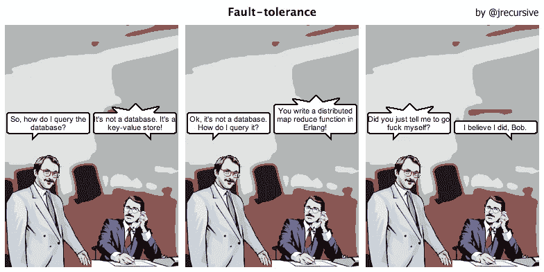

# 为什么工程师制造蹩脚的产品

> 原文：<https://medium.com/hackernoon/why-engineers-build-crappy-products-6558eedcf0c1>

看起来像是工程师设计的！

有一种特定的用户界面，当你第一次看到它时，你会大叫这是由工程师设计的。

designed by an engineer

(via [大胆火球](http://daringfireball.net/) [本周用户界面](https://www.google.com/search?client=safari&rls=en&q=daring+fireball+user+interface+of+the+week&ie=UTF-8&oe=UTF-8))

为什么会这样？在[工程](https://hackernoon.com/tagged/engineering)或[软件](https://hackernoon.com/tagged/software)开发过程中，是什么导致用户界面无法实际使用？

# 用户不满的完美风暴

简而言之:

*   工程师工作中最有趣的部分是痴迷于解决方案空间中的可能性——你能让计算机做的所有酷事。
*   工程师不想做出限制功率和灵活的选择。
*   工程师更重视增加潜在功能，而不是消除不必要的复杂性。
*   工程师们想通过工程来解决设计问题。

# 成为一个受欢迎的人

思考新产品的过程始于试图理解软件应该做什么，也就是说，它始于指定一个问题的解决方案。这是假设问题本身被正确地框定，而事实往往并非如此。这些规范通常以用户故事和线框的形式出现，它们是指定用户试图做什么以及用户将用来实现这些目标的特定界面的方式。

这隐含着对技术能力的理解。有时候，尤其是对于一个有着新颖技术解决方案的产品，人们并不完全了解什么技术能够做到这一点。不管解决方案是否在已知的问题空间中，在构建某个东西时，总会有不同的挑战出现。构建软件其实很难。

鉴于这一事实，工程将着眼于设计，开始思考解决方案的总体形状，并围绕产品中看起来风险最大的部分(技术上最具挑战性的部分)来组织开发工作。如果我们可以用原型证明这些部分可以工作，或者用一种模拟界面使其功能化，那么也只有到那时，清除产品的其余部分才有意义。

# 工程的分形本质

这是有趣的部分。每个工程师都喜欢绿地开发，因为它允许他们探索地形，而不必处理现有代码的权衡、约束和混乱。这个过程是一个探索的过程，能够探索一个充满可能性和潜力的技术空间。这真是太棒了，也是工程学有趣的一大原因。

这种体验就是建造小东西，以新颖的方式把它们组合在一起，然后建造越来越强大的东西。这导致工程师将旋钮、按钮和小发明放在不同的功能上，以便更容易探索它能做什么。展示所有这些很酷的东西是有社会价值的，不仅仅是它没有什么，还有它能做什么。专注于 it 的技术层面会让人们在呼吸和动力方面优化功能。

# 界面狂喜

Engineers Keeping it Real: Go Fuck Yourself

问题是产品与技术无关。技术是必要的，但不足以制造产品。技术只是管道，是使之成为可能的东西，但实际上并不是人们关心的东西。

可能性的狂喜与生产优雅的产品相冲突，因为产品从根本上讲是关于做出选择和围绕非常复杂的事物创造清晰。这不仅仅是只见树木不见森林；这两种努力的理想和愿望是直接矛盾的。

# 例子:我又做了一件蠢事

我们最近在开发一款产品，将电子邮件作为界面接触点。规范本身并没有真正解释当一个用户试图与另一个只设置了部分帐户的用户交互时应该发生什么。我们只是在玩一些东西，所以指责规范含糊不清是不公平的；就像在建造一些东西时经常发生的那样，我们最终陷入了比任何人预想的都要深的困境。

从边缘情况的角度来看这个问题，也就是说，在关注工程实现和基于可能发生的事情建立响应的健壮性的同时，我的直觉是开始构建处理这个问题的代码。它还使用 slack 作为端点，在这种情况下，它做了一些聪明的事情，所以自然电子邮件也应该做一些聪明的事情。

我开始走上能够存储部分请求的道路，这些请求将排队等待，并在用户界面中等待将来解决。我开始走上创建一整套功能的道路，因为我从技术的角度考虑问题，其他界面有一些“优雅”的东西，我想建立一些完整的东西。疯狂正悄悄进入界面，因为我在寻找一个技术解决方案。

这不是产品的核心。实际上没人在乎。在这种情况下，答案真的不是大量的技术解决方案。我认为不存在问题，但技术解决方案并不是解决问题的最有效方式。其实是设计问题。

# 技术是容易的部分

如果团队没有整合，如果设计团队“完成”他们的工作，然后将它抛给工程团队，这种对话将采取工程要求设计“错过了，我们需要解决”的东西的形式。可能已经错过了，但不需要解决。在这种情况下，解决方案根本不是“解决它”，而是重新构建问题。而这种重新架构把它放到了一个工程师不喜欢的地方。这并不是要建立一个完整的部分完成的请求排队系统，用户可以解决，提醒未完成的任务或任何事情，而是简单地保持简单的电子邮件界面，并将它们重定向到网站上的主流程。

简而言之，工程师往往是蹩脚的产品设计师的原因是

*   工程师工作中最有趣的部分是痴迷于解决方案空间中的可能性——你能让计算机做的所有酷事。
*   工程师不想做出限制功率和灵活的选择。
*   工程师更重视增加潜在功能，而不是消除不必要的复杂性。
*   工程师们想通过工程来解决设计问题。

*(原载于*[*【willschenk.com】*](http://willschenk.com)*)*