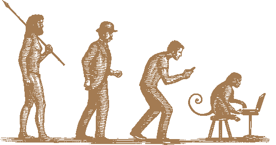

# 我为什么喜欢编程

> 原文：<https://medium.com/hackernoon/why-i-love-programming-c0985e261b4f>

如果你真的对某件事感兴趣，你肯定会被邀请

> 你为什么爱 X？

一直都是。这个问题乍一看似乎很简单。如果你整天做一件事，你怎么会不知道为什么？！？

然而，它常常令人惊讶地难以表达。当你真正热爱某件事时，你不会经常去想*为什么*——你只是*做*。

如果你了解我，你知道我写了一个的 [lot](https://segment.com/sources) 和[关于](/@tejasmanohar/on-golangs-defer-936af46a49da)的代码。当我被问到这个问题时，我通常会采取简单的方式，用类似这样的话来回答

> 我可以用代码构建任何我想要的东西！

大多数人对此着迷。

> 哇哦。我做不到。听起来很酷。

1.  很酷吗？是的。
2.  有回报吗？绝对的。
3.  …但是，这真的是我喜欢[编程](https://hackernoon.com/tagged/programming)的原因吗？咩。

多年后，我终于破解了代码——我喜欢编程，因为我喜欢抽象。这和我喜欢[分析](/@tejasmanohar/pitfalls-of-node-js-c4055dfecd8e) [代码](/@tejasmanohar/on-golangs-defer-936af46a49da)，[阅读](http://paulgraham.com/articles.html) [关于](https://www.producthunt.com/) [创业](http://www.joelonsoftware.com/)以及最近学习数论是一个道理。

> 抽象概念，是吧？不就是做 app 吗？

信不信由你——一个优秀的“软件工程师”的工作不仅仅是敲键盘和输出代码，还包括管理(和消除)复杂性。

## 管理复杂性

限制复杂性的一个常用方法是缩小范围，但是如果范围已经缩小了，事情真的很复杂怎么办？

取决于你在和谁说话。一般的开发人员可能会告诉你，这就是为什么他们在那里解决困难的问题，然后，产生一个复杂的，不可维护的解决方案。然而，熟练的“软件工程师”知道，越来越复杂的系统不是越来越复杂的代码的借口，正确的方法是抽象。

## 抽象中有什么？

抽象的概念很简单。你把复杂的东西，简化它，隔离它，围绕它建立一个友好的，通用的界面，给它起一个很酷的名字，并在其他地方引用它。

虽然不是纯技术的，但这里有一些抽象的真实世界的例子，你可能经常思考，甚至没有意识到:

1.  当你把 *X* 和 *Y* 相乘的时候，你会想到对 X 的 Y 个集合求和吗？没有。这就是乘法存在的原因，对吧？
2.  当我们在[细分市场](https://segment.com/)向客户收费时，我们是否想过这些钱是如何从他们的银行转到我们的银行的？没有。我们的朋友[条纹](https://stripe.com/)有。
3.  当你在亚马逊上买东西的时候，你会想它是如何在 2 天内送到你家门口的吗？没有。他们的朋友 UPS 有。

事实证明，这些抽象可以有多种构建方式，并且需要大量的计划来使它们正确…甚至错误。

抽象的最大挑战是它们很少是静态的。客户的需求以及系统都在不断发展，抽象需要适应这一点。例如，由于移动购物的兴起，像 [Stripe](https://stripe.com/) 这样的支付处理器被迫不仅支持银行的借记卡和信用卡，现在还支持 Apple Pay 这样的移动服务。幸运的是，Stripe 的工程团队不必重写他们的整个系统来实现这些重大变化。取而代之的是，他们开发了一个接口，每个[支付源](https://stripe.com/docs/api#sources)实现这个接口来执行常见的操作，比如“向客户收取 X $Y”。

一个好的抽象是

*   *灵活*。一个抽象应该能够适应或者很容易适应不断变化的需求。
*   *简单的*。记住，抽象的目的是降低复杂性。
*   *可读*。使用抽象而不用担心实现细节容易吗？很容易弄清楚它是如何工作的吗？

相反，一个糟糕的抽象至少违反了上面的一条。最后，最糟糕的抽象类型是[不应该](http://c2.com/cgi/wiki?TooMuchAbstraction) [存在](http://www.joelonsoftware.com/articles/fog0000000049.html) [在](http://www.sandimetz.com/blog/2016/1/20/the-wrong-abstraction) [所有](https://zedshaw.com/archive/indirection-is-not-abstraction/)的抽象，因为它们引入了不必要的间接性，损害了生产力。

## 结论

显然，在创建抽象的过程中会有很多问题，但是管理这些问题是不可避免的，因为抽象对于[生产力](https://hackernoon.com/tagged/productivity)至关重要。简而言之，编程是创造更好抽象的艺术和科学。这就是为什么它如此具有挑战性。那是我大脑的养料。

像往常一样，我将以引发这篇文章的想法来结束我的发言

> 技术肯定会解决我们所有的问题，但在这个过程中，它会创造全新的问题。但是没关系，因为你对生活的最大期望就是解决越来越好的问题。
> ——[斯科特·亚当斯](http://blog.dilbert.com/)，[呆伯特](https://en.wikipedia.org/wiki/Dilbert)的作者

> [黑客中午](http://bit.ly/Hackernoon)是黑客如何开始他们的下午。我们是 [@AMI](http://bit.ly/atAMIatAMI) 家庭的一员。我们现在[接受投稿](http://bit.ly/hackernoonsubmission)并乐意[讨论广告&赞助](mailto:partners@amipublications.com)机会。
> 
> 如果你喜欢这个故事，我们推荐你阅读我们的[最新科技故事](http://bit.ly/hackernoonlatestt)和[趋势科技故事](https://hackernoon.com/trending)。直到下一次，不要把世界的现实想当然！

