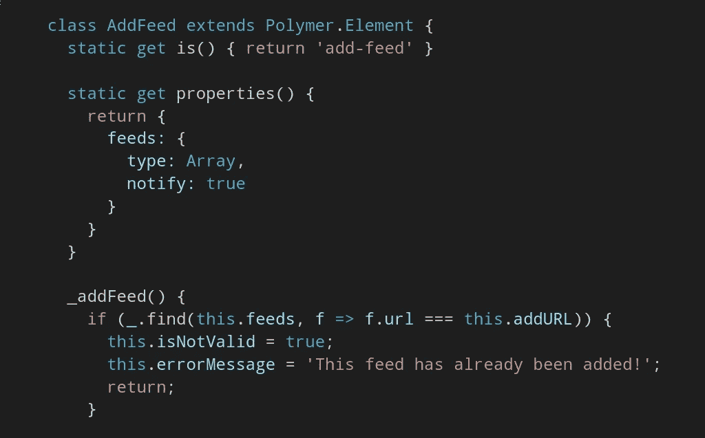

# 为什么我要转向 Web 组件而不回头

> 原文：<https://medium.com/hackernoon/why-im-moving-on-to-web-components-and-not-looking-back-aa8028c99c83>

尽管我只做了四年的 web 开发，但这似乎是这个学科历史上最混乱的四年。当我开始时，像 Angular 和 Ember 这样的一体化框架风靡一时。开发人员避开了将各种库、jQuery 插件和轻量级模块化解决方案(如 Backbone)缝合在一起的模式。这些框架的承诺是，它们将创建自己的兼容组件生态系统，包含所有可能的功能。

与此同时，node.js 的激增催化了 web 开发复杂性的爆炸。Web 开发人员开始用 JavaScript 编写开发工具。由于对古老语言的局限性不满意，这些开发人员工具经常将更新的或替代的语法“编译”成“普通的”JavaScript。JS 的新“风格”出现了，如 CoffeeScript、TypeScript 和 JSX，以及被称为“ES6”或“ES2015”的新兴 ECMAScript 标准。CSS 也有了自己的一套新风格，SASS/SCSS 和 Less 成为了许多项目的标准。此外，更多的预处理程序成为标准，如缩小、用于旧浏览器的聚合填充，以及用于浏览器兼容样式的前缀自动插入。在 JavaScript 中创建了专门的开发服务器和任务运行器，以便在开发过程中根据需要执行这些转换，并更新浏览器。

每一层复杂性都为更多问题的出现创造了机会。生成的代码现在需要一个“源映射”文件，这样当错误在运行时发生时，可以精确定位导致错误的实际用户代码。像 React 这样的库在内部链接了如此多的函数调用，以至于当开发人员出错时，他们可能会在浏览器中看到 30 层深的堆栈跟踪，这甚至不包括他们自己编写的任何代码。当运行的代码实际上与开发人员编写的代码不同时，JavaScript 产生的已经令人困惑的错误会变得更加令人困惑。

现在的 JavaScript 生态系统鼓励一种“货物崇拜”的心态。包含一个库是如此容易，以至于开发人员可以忽略这样做的性能或复杂性问题。一个流行的身份验证即服务提供商(匿名)发布了一个库，其中显示了与他们的服务相关的登录模式。尽管 modal 只包含少数几个输入和按钮，但它包含了整个 React 15 库。如果您的项目不使用 React，您必须包含整个框架。如果您的项目使用 React，在 15 版本之外的版本中，当您通过 NPM 安装它时，您的依赖链将会断开。在这种情况下，您必须在项目中包含两个完整版本的 React，其中一个与它们发布的库捆绑在一起，另一个通过 NPM 方法。

React 以类似 HTML 的语法和面向对象的开发风格提供模板和数据绑定功能，就像定制元素一样。替代的 CSS 语法提供了变量和新特性的使用，而没有厂商前缀，就像 CSS3 一样。这些特性是在 web 浏览器标准中提出的，但是它们只在不稳定的发布渠道中部分可用，并且浏览器供应商之间有太多的分歧。直到现在。

ES2015 和自定义元素现在在大多数主要发布渠道(甚至是臭名昭著的 IE 和 iOS)都支持。许多 CSS 过渡和转换可以在所有主流浏览器中使用，无需供应商前缀。fetch API、localStorage 和 IndexedDB 等新特性也可靠地出现了。与现代应用程序开发人员相关的功能终于可以在普通用户的设备上使用了，这很棒。

对我来说，用 web 组件编写应用程序的经历就像是窒息多年后苏醒过来。没有预处理器。类语法、承诺、lamdba 函数、CSS 变量——一切都在那里。没有生成任务管理器，因为没有要执行的生成任务。抛出的异常直接指向我自己的错误，而不是深入到某个编译库中。代码可以在浏览器控制台中测试，因为我使用了与实际运行在浏览器中相同的名称空间和语法进行开发。我导入和使用的几个库都是通过全局脚本标签来完成的。多么野蛮。我发现自己又爱上了 web 开发。

当然，还需要几年时间，大公司才会放心大胆地终止对没有更新浏览器的用户的支持。但是当他们这样做的时候，一个真正美好的世界在等着他们。我希望我的预测是正确的，web 开发中的复杂性和代码激增，在增长了许多年之后，将会急剧下降。这些库和框架提供的特性已经出现在“操作系统”本身 web 浏览器中。现在没有预处理器。只是代码。

> [黑客中午](http://bit.ly/Hackernoon)是黑客如何开始他们的下午。我们是 [@AMI](http://bit.ly/atAMIatAMI) 家庭的一员。我们现在[接受投稿](http://bit.ly/hackernoonsubmission)，并乐意[讨论广告&赞助](mailto:partners@amipublications.com)机会。
> 
> 如果你喜欢这个故事，我们推荐你阅读我们的[最新科技故事](http://bit.ly/hackernoonlatestt)和[趋势科技故事](https://hackernoon.com/trending)。直到下一次，不要把世界的现实想当然！

