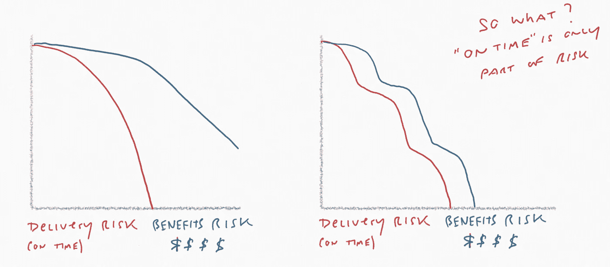
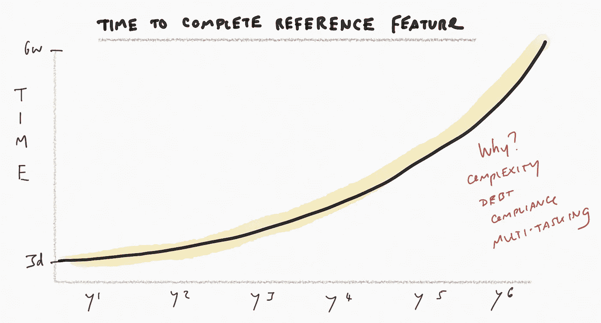

# 为什么敏捷不起作用？

> 原文：<https://medium.com/hackernoon/why-isnt-agile-working-d7127af1c552>

## 几张画…

几年前我去拜访一个亲戚。我可怜的表弟(一家保险公司的 CEO)被卖给了敏捷银弹，他很生气。他说了这样的话:

> 这是假的！我们改变了我们做事的方式。我们请来了顾问。我们雇佣了这些项目经理。什么都没用！没什么区别。没有责任。我得到的都是借口

我忘了我是怎么回应的，但我知道今天我会怎么回应。我会画一些图，甚至不提敏捷这个词。我需要向他传达几个核心概念…

## 1.流动效率

首先，如果我们看看交付周期——从我们想出一个主意到它到达客户手中的时间——你会注意到大部分时间都花在了“等待”上。15% *流程效率*(工作时间/提前期)正常。很疯狂，对吧？然而，我们关注的是(相对)可见的东西……实际完成工作所花费的少量时间。T2 最好的 T3 公司达到了 40%。简而言之，要走得更快，你需要解决等待时间的问题。

## 2.计划外工作和多任务处理

团队为计划外的工作和任务转换支付 75%的“利息”并不少见。该团队甚至可能没有支付原则。它实际上是架空的，而且通常在售票系统中不会被跟踪。最有可能的是，团队抱怨这一点(这是一个非常令人沮丧的情况)。但被忽视的时间够长了，他们就接受了这个令人沮丧的现实。

现在想象一下，如果这是一个“共享服务”，团队负责解决生产问题，或者在做“项目”的同时提供新的基础设施。突然你有一个瓶颈。

教训:解决计划外工作的来源，量化共享服务的经济影响。共享服务有直观的意义，但它们通常会激发大量昂贵的预先规划。

## 3.s，M 和 L

这是一个有趣的把戏。绘制大、中、小工作项目的完成时间。尝试提升一个层次，专注于对客户有实际价值的项目(而不是任务)。你会注意到，在许多组织中，工作的“规模”与完成时间没有关系。为什么？有太多其他因素会影响完成工作所需的时间(例如，依赖性、未计划的工作、大量工作正在进行等)。)

## 4.利益实现

这么多的努力都花在了降低我所说的“交付风险”上。如果你交付定制项目，客户货到付款，这是有意义的。在 SaaS(软件即服务)，我们交付工作时没有得到报酬。好处随着时间的推移而增加。我称之为“利益风险”(工作将成为无用之物的风险)。

大型组织采用敏捷很常见，但是看不到任何经济利益。为什么？开发速度更快，但这与 1)做出正确的产品决策，以及 2)努力实现收益没有关系。敏捷的全部意义在于降低风险。在项目工作中，风险是“按时/在范围内”。在产品工作中，风险是“这个东西不工作”。这就是 PO“接受”一个特性交付的全部谬误。没有带来任何好处！

许多公司采用左边的模式。很少有人采用右边的模式。当他们得到糟糕的结果时，他们试图把更多的工作塞进系统，这带来了一个伤害的世界。

## 5.不受控制的复杂性

最后。取一个很好理解的*参考特征*，并通过你的产品开发系统。如果不管理复杂性/重构/自动化，每年要花更长的时间来完成这项功能。即使你的团队保持不变。从 3 天到 6 周的事情并不是没有听说过。

## 敏捷

这让我想到了敏捷。敏捷毫无价值，除非它成为持续改进的催化剂。Scrum 和 SAFe 没有价值，除非它们成为持续改进的催化剂。为什么？因为那些让你慢下来的因素，仅仅部分是由于你是否在冲刺，写用户故事，和做两周一次的演示。我认为这些事情相对来说是次要的(一旦你接受了逐步降低风险的想法)。

为了“保持敏捷”，您需要在以下方面花费大量的金钱和精力:

*   做真正重要的工作(利益)。做得更少。
*   自动化、工具、部署管道、特性标志等。(DevOps)
*   改变你的管理文化
*   调整您资助计划的方式。转向增量的、基于任务的资助，而不是资助项目
*   分配资源以管理复杂性(定期重构和重新架构)
*   绘制价值流图，将您的业务视为服务生态
*   对共享服务的新看法

没有灵丹妙药。你必须做这项工作。当心任何不这么说的人。