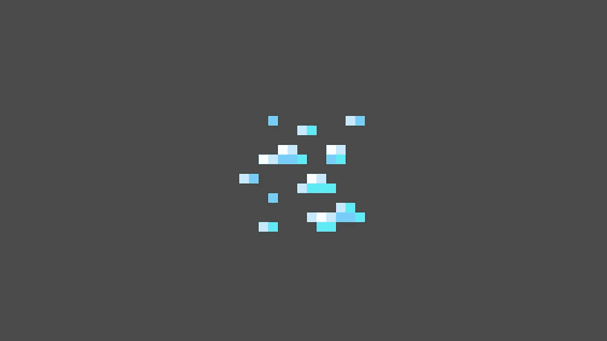

# 为什么平台是新的堆栈

> 原文：<https://medium.com/hackernoon/why-platforms-are-the-new-stacks-4f71c11e86dd>

“堆栈”是应用程序“运行”的任何组件或服务。它实际上可以由任何东西组成，但通常至少包含四个关键组件:

*   操作系统
*   网络服务器
*   一个数据库
*   apl 语言

## 开始的时候…

在 70 年代和 80 年代，大多数软件是捆绑在其他软件(如操作系统)中发布的，或者附有许可证，并且是“闭源”的，这意味着开发人员不能贡献或共享核心代码库。

然而，在 90 年代早期，随着互联网的普及和“网络”的爆炸，出现了“开源运动”。尽管像微软和 IBM 这样的公司怨声载道，开发人员还是开始让每个人都可以使用他们的项目和源代码。

随着越来越多的软件被发布，开发人员开始寻找最好的工具并一致地一起使用它们。就在那时，第一批啤酒开始酿造。

1991 年，Linus Torvalds 发布了 Linux 操作系统，接着在 1995 年发布了 Apache web 服务器和 PHP 编程语言。到 1996 年 MySQL 发布，LAMP 栈诞生了——Linux、Apache、MySQL、PHP。

## 堆栈解决方案

虽然有*和*其他玩家，但多年来，LAMP 一直是所有筹码中的王者。它免费且易于运行，因此成为许多企业和初创公司的热门选择。

然而，到了 21 世纪初，情况开始发生变化。

近十年来，PHP 一直是后端网络的主要语言。直到 2004 年推出 Ruby on Rails 和 2009 年推出 Node.js，PHP 的受欢迎程度才开始下降。

2002 年 Nginx 发布，并迅速成为 Apache 的流行替代品，作为 web 服务器和反向代理。

2008 年，MySQL 被 Sun Microsystems 收购，后者后来被甲骨文收购。在这一点上，MySQL 不再是开源的，必须找到替代品。

有一些 MySQL 的分支，即 MariaDB，也是在这个时候，由于 2007 年发布的 MongoDB，NoSQL 趋势变得流行起来。

## 堆栈爆炸

随着开发领域发生的所有变化，出现了“堆栈”的爆炸式增长。堆栈的整个概念都变了。

2013 年推出了非常流行的 MEAN stack——MongoDB、Express.js、Angular.js、Node.js。

关于 MEAN stack 有趣的事情是，四个组件中有三个是用 JavaScript 编写的。传统上，栈由四个不同的部分组成，其中之一是语言。这种语言现在扮演了其中的三个角色。

在这一点上，很明显你可以用任何东西来做一个“stackronym ”,只要它引人注目并且基于运行你的应用程序的组件。

# 平台:新的堆栈

一般来说，平台是软件执行的任何地方(比如操作系统或浏览器)。

基本上，一个应用程序“运行”在一个堆栈上，而一个堆栈“运行”在一个平台上。堆栈提供了应用程序运行的一切，而平台则为堆栈提供了环境。

这种方式已经运行了很多年，但是随着最近像 Docker 这样的东西对虚拟化和容器化的改进，我们有能力再次改变现状。

## 一个平台应该做什么

您不想要一个难以管理堆栈的平台。您也不希望平台不具备您的应用所需的灵活性。

你会遇到像 AWS 或 DigitalOcean 这样提供基本服务的“困难”平台。配置和管理基础架构的知识量和工作量非常惊人。

在寻找避免困难平台的方法时，您会遇到“不灵活”的平台，并最终采用平台即服务(PaaS)。虽然 PaaS 消除了底层基础设施的所有困难，但这是以灵活性和控制为代价的。

你真正想要的，可能和我想要的一样，这也是大多数开发者想要的。这是一个平台，它可以为您做所有的事情，但您可以根据需要灵活地进行配置。

# 这一切意味着什么…

这意味着您的平台和堆栈是同一个东西。或者更确切地说，一个好的平台应该完全取代你的堆栈，让它过时。

不是在你的本地机器上安装你的栈，而是把它安装在一个虚拟机上，你的平台，并在其中工作。然后，您可以与任何人共享您的环境，并随时随地部署它。

我喜欢称这个 [*微* -PaaS](https://hackernoon.com/what-is-micro-paas-and-why-its-the-future-of-app-development-3aa30d086703) (μPaaS)。你的应用程序的平台与你的应用程序共存。无论是在本地开发过程中，还是在生产服务器上。

## 开发人员的理想平台

在我看来，理想的平台不仅要为我提供一个开发环境，还要为我提供一个将应用程序部署到生产环境的好方法。

在大多数情况下，开发人员要么将他们的应用程序交给某个 DevOps 工程师来部署和管理，要么他们必须自己尝试完成这个角色。

我不想处理创建、配置和管理基础设施的复杂性，也不想让中间人替我做这件事。

我想要一个工具，让我成为 DevOps 工程师，或者只是为我做所有的事情，这就是为什么我在过去的两年里一直为 [Nanobox](https://nanobox.io/) 工作，帮助创建这样一个工具。

Nanobox 用户可以创建即时隔离的开发环境，这些环境是可共享的、可靠的，并且可以在任何地方部署到生产中。

在我看来，这是一个完美的平台，无论我使用什么堆栈都没有关系。

> [黑客中午](http://bit.ly/Hackernoon)是黑客如何开始他们的下午。我们是 [@AMI](http://bit.ly/atAMIatAMI) 家庭的一员。我们现在[接受投稿](http://bit.ly/hackernoonsubmission)，并乐意[讨论广告&赞助](mailto:partners@amipublications.com)机会。
> 
> 如果你喜欢这个故事，我们推荐你阅读我们的[最新科技故事](http://bit.ly/hackernoonlatestt)和[趋势科技故事](https://hackernoon.com/trending)。直到下一次，不要把世界的现实想当然！

