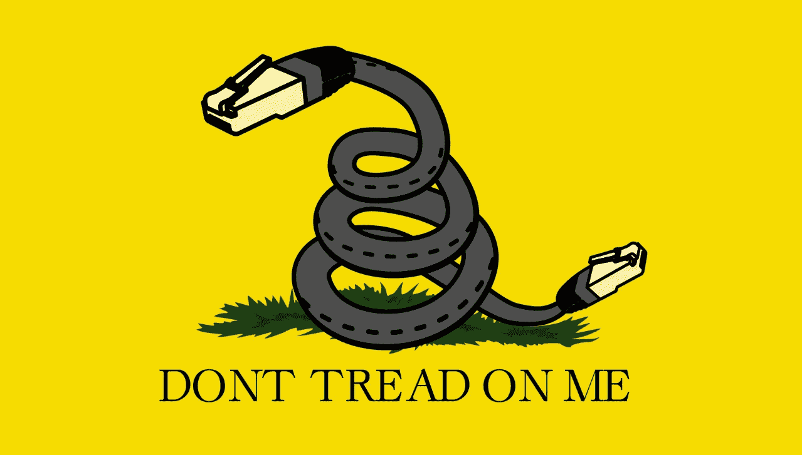
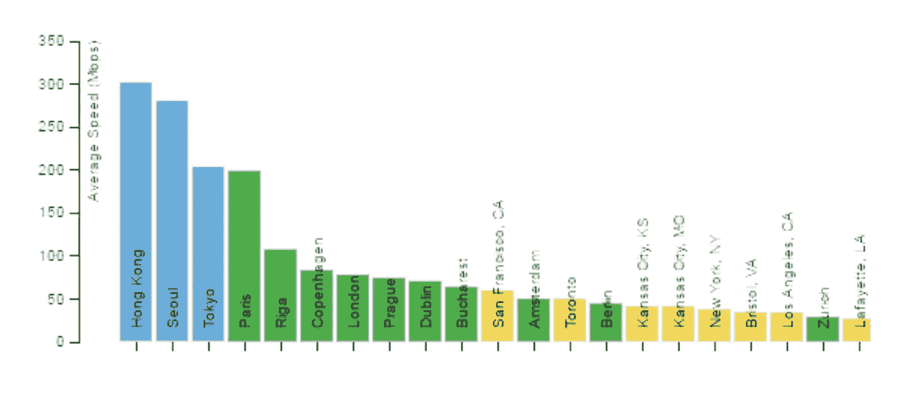
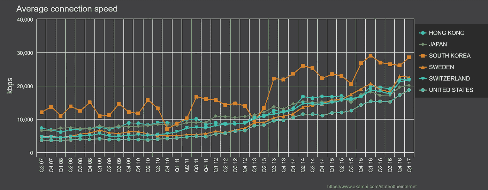
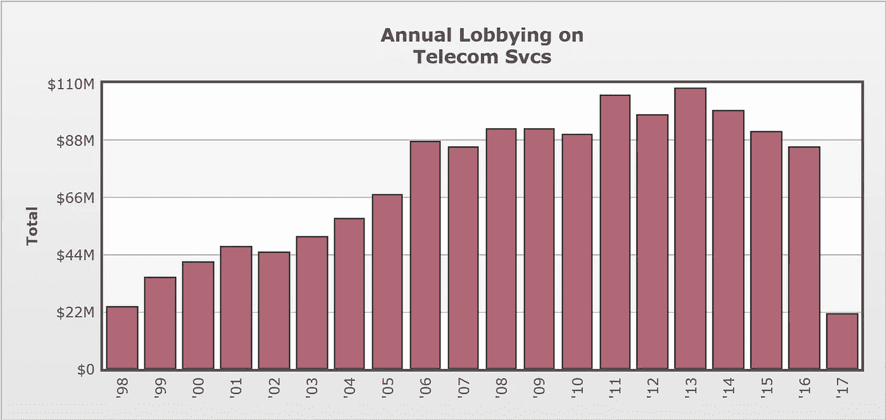
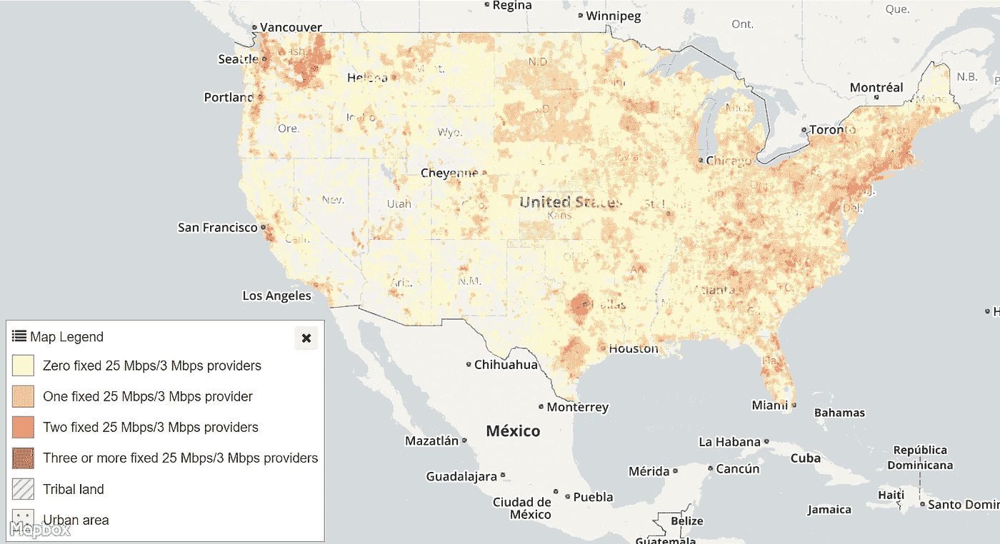

# 为什么支持网络中立不是反对自由市场

> 原文：<https://medium.com/hackernoon/why-pro-net-neutrality-is-not-anti-free-market-3b1994a33522>

感觉好像是几个月，而不是几年，因为技术社区最后一次团结起来支持网络中立，并取得了对宽带提供商的前所未有的胜利。

然而，我们又一次被迫为一个更自由、更公平的互联网而战，一个互联网提供商不能利用他们在市场中的地位来压制我们日常使用的竞争服务的互联网。

在川普政府的领导下，网络中立再次受到威胁，现任互联网服务提供商和[联邦通信委员会](https://hackernoon.com/tagged/fcc)主席 Ajit Pai 本人都认为网络中立法律代表着繁重的监管，并扼杀自由市场竞争。我甚至看到为网络中立而战的误导消费者承认这一点，特别是自由主义者和其他关注大政府的人，好像为网络中立而战违背了他们的核心信条之一。

然而，这完全不是事实。我们只需要钻研一下宽带行业黑暗、混乱的历史就能明白。

## 电信业的起源

正如我们今天所知，宽带产业是通过 1984 年的有线通信政策法案诞生的，也称为 1984 年有线法案。该法案的通过意在澄清市政当局和有线电视提供商之间的关系，目标是逐步改善整个美国大陆的有线电视扩张。

实质上，该法案允许地区有线电视提供商有权投资当地有线电视基础设施，作为交换，成为该地区的唯一提供商。在这一点上，市政和其他供应商不再能够竞争。

随着时间的推移，这些本地供应商开始与邻近的本地供应商合并，随着合并规模越来越大，直到最后市政当局发现自己与数十亿美元的公司谈判，并失败了。

虽然国会后来通过了旨在纠正 1984 年《有线电视法》所产生的一些问题的附加立法，但此时当地提供商已经合并到一些现在领导反对网络中立的相同宽带公司中。

有线电视公司成长为我们这个时代最强大的电信和媒体公司，在发展过程中几乎没有遇到任何竞争。

## 当今的保护主义和竞争

尽管美国在互联网的研究、发展和进步中发挥着至关重要的作用，但就网速或成本而言，美国远非最佳国家。我们预计，在一个健康的竞争环境中，市场力量将推动价格下降，宽带接入增加。

不幸的是，*这个国家对于宽带* *没有健康的竞争环境* *。*

相反，当我们考虑到每月 50 美元可以在世界各地买到的平均下载速度(以 Mbps 为单位)时，美国城市的情况相当糟糕。

抛开成本不谈，美国的平均连接速度仍然落后于其他发达国家。

与宽带垄断竞争的尝试主要来自市政府和希望提供更好互联网接入的能源合作社，特别是在主要电信提供商不愿意去的农村地区。

然而，这些尝试遭到了现有互联网服务提供商的强烈反对，他们积极游说并成功阻止了几个州市政府的竞争。毫不奇怪，电信业最活跃的游说者是网络中立的一些最大的反对者，他们在这些努力上花费了数千万美元:

Courtesy of [OpenSecrets](https://www.opensecrets.org/lobby/indusclient.php?id=B09&year=2015)

毫无疑问:在极少数情况下，当竞争对手*成功进入由这些现有企业之一主导的市场时，一些真正的奇迹就会发生。在位者不仅大大提高了网速，还降低了价格。当谷歌宣布计划在堪萨斯城和北卡罗来纳州夏洛特安装谷歌光纤时，这两个城市最近亲身体验了这种影响。*

竞争有利于客户，迫使现有企业与众不同，以更低的价格提供更好的选择。这是一场大多数互联网服务提供商没有准备好的战斗，一场他们从来没有特别担心的战斗。

## 这对网络中立意味着什么？

这意味着互联网服务提供商从来没有依赖过自由市场。他们不是从自由市场中诞生的，他们没有通过自由市场发展到目前的规模，他们也没有通过自由市场维持他们的客户或市场份额。

如果美国的互联网接入市场是真正自由和竞争的——如果 48%的美国人对宽带没有唯一的选择——那么也许市场可以激励网络中立所要求的那种行为。

事实并非如此，基础设施的成本是一个巨大的挑战。现有的互联网服务提供商仍然不愿意扩展到许多农村地区，甚至谷歌在许多大城市地区建立光纤也遇到了困难。回想一下，当有线电视公司最初的任务是建立基础设施时，他们至少可以期待暂时的独家经营权。

今天吗？你所能期待的就是激烈的竞争，可能还有游说者的反对。据我们所知，开办 ISP 在经济上不再可行。

我们不能回到过去，简单地否定有线电视提供商的政府强制垄断，他们正是在这种垄断下取得成功的。今天我们能做的是认识到美国一些最令人憎恶的公司诞生的独特环境，承认历史在它们成功中所起的作用，并开始像对待公用事业公司一样对待它们，它们本应如此。

简而言之:

**有线电视公司从未遵守过自由市场的规则；他们不应该得到它的好处。**

*Marcello Miranda 是一个技术迷，经常写关于创业公司的文章。关注他的* [*中*](/@marcelloecm) *和* [*推特*](https://twitter.com/marcelloecm) *，如果你喜欢这个内容，* **留下一些掌声** *来帮助传播这个消息！*