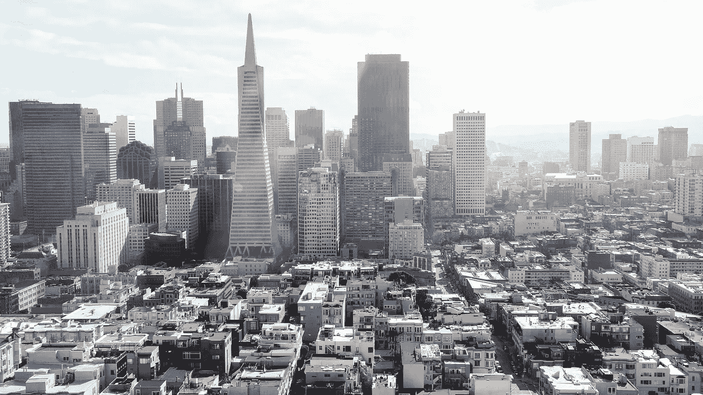

# 为什么硅谷的科技泡沫会破裂，创新者将何去何从

> 原文：<https://medium.com/hackernoon/why-silicon-valley-s-tech-bubble-will-burst-and-where-innovators-will-go-31529b30d367>

Photo by Lili Popper ([https://unsplash.com/photos/71cd1rWqO8M](https://unsplash.com/photos/71cd1rWqO8M))

如今，科技企业和初创公司最热门的地方在哪里？当你问大多数人时，他们可能会回答旧金山或硅谷。是的，湾区确实已经诞生了一些商界最著名的名字。脸书、苹果和推特的总部都在这里，数千家其他公司也在这里起步。

然而，五年后，这个问题的答案可能会有非常不同的反应。相反，下一个脸书或 T2 谷歌 T3 可能会建在美国的另一边，纽约市的布鲁克林科技三角区。为什么创新中心会很快转移到东海岸？

# 生活费用上涨

既然湾区已经成为高收入公司的圣地，生活成本也在飙升。根据房地产中介 JLL 的一份[报告，加利福尼亚州的圣马特奥县拥有全美最高的技术工资，工人的年收入估计为 240，663 美元。2014 年，旧金山员工的平均年收入增长了 12.8%，达到 176，275 美元。](http://www.sfchronicle.com/business/networth/article/Tech-wages-rents-still-soaring-in-Bay-Area-6671315.php)

虽然这听起来是一大笔钱，但即使是在这个行业工作的人也开始感到压力。在旧金山大型科技公司工作的人的工资是全国最高的，但房租花费了他们支出的 50%。

# 房租和房价飙升

过去十年甚至最近几年租金价格的变化是巨大的。旧金山租金价格上一次大幅上涨发生在“网络泡沫”时期。现在，它们比那时高得多。根据一份报告，在 1980 年，一套两居室公寓的价格是每月 1300 美元多一点。今天，同样的公寓可能要贵 5 到 6 倍。

吸引更多的企业通常对周围的社区有益。然而，当人太多而没有足够的住房来容纳增加的人口时，这就成了一个问题。硅谷的人口已经达到 750 万，是 40 年前的两倍。一些[社区成员已经开始批评科技繁荣使该地区](http://www.mercurynews.com/business/ci_28585609/bay-area-rental-crisis-squeezing-out-middle-class)中产阶级化，使得那些在那里生活了大半辈子的人难以承受价格上涨。

# 对本地人才的激烈竞争

高昂的生活成本并不是企业的唯一障碍。科技行业招聘本地人才的竞争变得异常激烈。许多公司报告招聘了数百名新员工，几乎每个人都收到了多份聘书。

人才危机是如此严峻，以至于许多公司从其他地方引进员工，并支付大笔费用让他们搬迁。例如，脸书[最近为员工提供高达 15000 美元的薪酬，让他们搬到离位于门洛帕克的总部](http://www.entrepreneur.com/article/254223)更近的地方。

# 这种转变已经发生了

由于不断变化的商业环境及其带来的挑战，一些公司已经开始从该地区迁出。由于奥克兰日益增长的费用和限制，拼车服务公司优步最近在奥克兰购买了办公空间。像 Pandora 和 Lyft 这样的公司正在跟随他们的脚步，在美国的其他地方增加办事处。

# 布鲁克林科技三角:新硅谷

如果湾区的科技泡沫即将破裂，那么创新者会把他们的商业想法带到哪里去？纽约市，尤其是布鲁克林区，正在成为新的创新中心。

2013 年，[布鲁克林技术三角](http://map.brooklyntechtriangle.com/)由当地组织联盟成立，旨在增加该地区的业务和创新。从那时起，它帮助经济从 35 亿美元增长到 53 亿美元。报告还预测，[到 2025 年，通过这些发展计划，经济将增长到 155 亿美元](http://www.brooklyneagle.com/articles/2015/11/9/report-impact-brooklyn-tech-triangles-innovation-economy-reach-155-billion-2025)。像 [Etsy](https://www.etsy.com/about/) 和 [MakerBot](http://www.makerbot.com/) 这样的本地成功故事正在激励其他企业家采取行动。

出于多种原因，该地区正迅速成为科技人才和创新的孵化器。其中一个原因是，它为企业家建立了一个强大的支持系统。前市长迈克尔彭博建立了“我们在纽约制造”组织，帮助纽约地区的创新者将他们的想法转化为成功的业务。数字、电影和媒体制作是“纽约制造”项目的基石，该行业现在占当地经济的 87 亿美元。

布鲁克林已经有了社区支持和融资机会。此外，像市长比尔·白思豪这样的公职人员正在与科技公司合作，以促进当地的教育和培训机会。2017 年，一个新的[康乃尔科技校园将在邻近的罗斯福岛](http://tech.cornell.edu/future-campus)开放。此外，[科技就业学院](http://techjobsacademy.com/)，一个由微软组织的为期 16 周的强化技术培训项目，[科技人才管道](http://www.techtalentpipeline.nyc/)，以及[纽约城市大学的纽约城市技术学院](http://www.citytech.cuny.edu/)于今年年初启动。有了更多的技术培训机会，本地公司将有更多的人才可以招聘。

与其他宣称将成为下一个大型创新中心的大都市不同，纽约已经具备了培育科技企业的基础和框架。由于湾区的条件使得创新者更难进入，许多人正在寻找不同的地方发展业务。在过去的几年里，布鲁克林技术三角已经成为创新的主要竞争者。在接下来的五年里，它可能是东海岸版的硅谷。

马塞洛·马尔克蒂

> [黑客中午](http://bit.ly/Hackernoon)是黑客如何开始他们的下午。我们是阿妹家庭的一员。我们现在[接受投稿](http://bit.ly/hackernoonsubmission)并乐意[讨论广告&赞助](mailto:partners@amipublications.com)机会。
> 
> 如果你喜欢这个故事，我们推荐你阅读我们的[最新科技故事](http://bit.ly/hackernoonlatestt)和[趋势科技故事](https://hackernoon.com/trending)。直到下一次，不要把世界的现实想当然！

