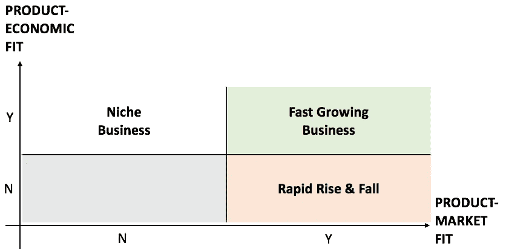

# 为什么创业公司在产品符合市场后会失败

> 原文：<https://medium.com/hackernoon/why-startups-fail-after-product-market-fit-f8c558e4f1f8>

Watchmen Vol 1 #1\. By Alan Moore, Dave Gibbons & John Higgins.

> 当一个以卓越而闻名的管理层处理一个以糟糕的经济状况而闻名的企业时，保持完整的是企业的声誉。—沃伦·巴菲特

## 快速上升和下降

2010 年，Groupon 被《财富》杂志誉为[收入达到 10 亿美元最快的公司](http://www.forbes.com/forbes/2010/0830/entrepreneurs-groupon-facebook-twitter-next-web-phenom.html)。 [Groupon](https://hackernoon.com/tagged/groupon) 拥有每位创始人梦寐以求的产品市场契合度。对消费者和企业都有惊人的吸引力,“35，000 家公司争着要加入它的名册。只有八分之一的申请者能晋级。”但同一篇文章指出了问题所在“任何人都可以复制它。美国出现了 200 多个山寨网站，海外还有 500 个，其中 100 个在中国。仅仅 3 年后，创始人兼首席执行官辞职了。

Groupon followed a common pattern for companies that can’t achieve Product-Economic Fit

## 产品与市场的匹配

一个产品需要做好两件事:创造价值和获取价值。当资本充足时，这两个阶段之间可能会有几年的时间。

将你所有的精力集中在产品的市场契合度上，让顾客喜欢你的产品通常是个好建议。在向客户证明之前，赚钱是没有意义的。此外，它还允许在商业模式不明显的地方开发产品(例如 Google Search 和 AdWords)。

传统的观点是，如果一个团队是“基本胜任的，并且产品基本上是可接受的”，那么在产品与市场匹配之后，你将会获得成功。如果是这样的话，**为什么那么多实现产品-市场契合的创业公司会苦苦挣扎并失败？**还有为什么有些产品类别的创业公司都失败了？

## 产品-经济匹配

还有另一个同样重要的组成部分:产品-经济匹配。这是由产品类别的整体经济状况和公司在该产品类别中的地位决定的。**产品经济匹配是指产品在规模上实现有吸引力的经济效益的能力。**

假设在产品-市场匹配之后，你最终会找到产品-经济匹配。然而，这错误地抓住了这种关系。产品与市场的匹配并不能保证产品与经济的匹配。事实上，它们是完全正交的。

The relationship between product-market fit and product-economic fit.

每个产品类别都有自己的类别经济学。从长远来看，没有一个伟大的产品能够逃脱糟糕的类别经济学的引力。

一旦一家公司证明他们能够实现产品与市场的契合，竞争对手很快就会出现。随着竞争的冲击，你是否有产品经济适合很快变得明显。这种竞争冲击在优惠券(Groupon，Living Social)，闪购(Gilt，Fab)，拼车(优步，Lyft)，送餐(Eat24，Caviar，GrubHub)等类别中显而易见。

If the whole category suffers from lack of Product-Economic Fit, all companies will struggle. If the category has Product-Economic Fit, the leaders are likely to have a very attractive business.

## 熟悉的模式

对于无法实现产品经济匹配的公司来说，这个故事是如何一次又一次上演的:

1.  有人发现了一个有趣的机会，似乎引起了许多客户的共鸣。如果公司执行得很好，他们会磨练产品，最终开始加速。产品-市场契合度！
2.  这些指标讲述了一个具有强烈客户需求和增长率的伟大故事。他们声称他们的优势之一是在市场上领先。该公司被誉为一项突破。这是筹集资金的好时机。
3.  该公司甚至可能开始将客户货币化。他们可以实现健康的利润，因为他们是第一个适应市场的产品。这家公司预计会有非常光明的未来。这也是销售的最佳时机。
4.  其他人注意到公司的吸引力和动力。如果产品类别的进入门槛低，那么许多公司会走上同样的道路。有时它们是直接的复制品，有时有一些细微的区别。
5.  竞争对手现在出现了，他们针对该公司进行营销和推销。客户很难真正说出这些产品之间的区别。也许他们报名参加了多个。如果有[的低转换成本](https://en.wikipedia.org/wiki/Switching_barriers)，价格战就会开始，导致利润率下降。
6.  公司增长放缓，盈利能力崩溃，投资者和媒体对这家有前途的公司如何迷失方向感到惊讶。
7.  为了解决问题，可能会更换首席执行官、战略和名称。但问题不是执行力，是产品-经济契合度。

完成这些阶段可能需要多年时间。让这一点变得特别阴险的是，该公司一直在获得所有正确的信号。顾客吸引力，顾客欲望，支付意愿。检查检查检查。

## 结论

最初关注产品与市场的匹配通常是个好建议。然而，产品团队应该知道还有第二个障碍等待着他们，那就是产品的经济适应性。这是由产品类别的整体经济性和公司在产品类别中的地位决定的。

等待考虑你的产品类别的经济学还有一个额外的问题。一旦你锁定了适合市场的产品，你就没有多少自由度了。对于基于某种产品方法筹集了大量资金的公司来说，很难容忍方向的改变。

产品团队应该关注产品与市场的匹配，但是优秀的产品团队会考虑如果他们成功了会发生什么。

> [黑客中午](http://bit.ly/Hackernoon)是黑客如何开始他们的下午。我们是 [@AMI](http://bit.ly/atAMIatAMI) 家庭的一员。我们现在[接受投稿](http://bit.ly/hackernoonsubmission)，并乐意[讨论广告&赞助](mailto:partners@amipublications.com)机会。
> 
> 如果你喜欢这个故事，我们推荐你阅读我们的[最新科技故事](http://bit.ly/hackernoonlatestt)和[趋势科技故事](https://hackernoon.com/trending)。直到下一次，不要把世界的现实想当然！

