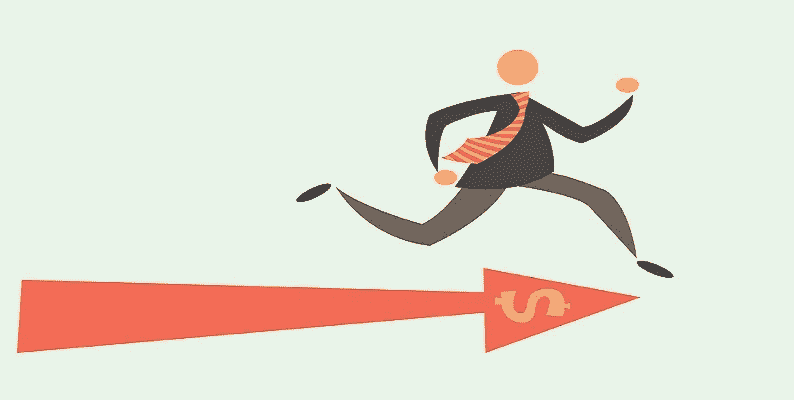

# 为什么短跑能最大限度地提高人类生产力

> 原文：<https://medium.com/hackernoon/why-working-in-sprints-maximizes-human-productivity-e01c605ec296>

## 快讯:我们是人，不是高速计算机。

我们不应该长时间、持续地高速奔跑。相反，当我们在消耗能量和间歇地更新[能量](https://hackernoon.com/tagged/energy)之间移动时，我们会以最佳状态[表现](https://hackernoon.com/tagged/performing)。

我们生活在一个所谓的振荡宇宙中，其特点是在活动和休息之间有节奏的波动。想想每天太阳的升起和落下，潮汐的涨落，季节之间的运动。同样，这个星球上的所有生物都遵循节奏。这也包括人类。

你和我，我们被节奏所指引。

我们坚持的最著名的节律是昼夜节律。我们以 24 小时为周期生活。我们醒着 16-18 个小时(消耗能量)，然后睡 7-9 个小时(补充能量)。

一段时间的活动之后是一段时间的休息。一段时间的能量消耗(活动)之后是一段时间的能量更新(休息)。

我们的能源不是无穷无尽的。我们不能在 10-20 秒内 100%冲刺。我们无法连续几个小时集中注意力。在我们的表现直线下降之前，我们不能保持清醒超过 18-20 个小时。

迟早我们需要补充能量。这意味着，如果我们想尽可能地高效，我们需要过有节奏的生活，一段时间的剧烈活动之后是一段时间的剧烈休息。我们需要像一系列短跑一样生活，而不是永无止境的马拉松。

# 要么完全接合，要么战略性地分离

想象一下一个典型的长跑运动员的样子:骨瘦如柴，面色蜡黄，形容憔悴，身体不健康，精力不太充沛。现在想象一下像尤塞恩·博尔特这样的短跑运动员:强壮、健康、强壮、精力充沛、意志坚定。

短跑运动员看起来好多了。

为什么？因为他在振荡。他开了又关了。他全力以赴，然后休息一段时间。他要么完全投入，要么战略上不参与。他遵循大自然的节奏。

像短跑运动员一样，我们希望我们的生活是一系列的短跑，在激烈的参与和同样激烈的更新之间摇摆。完全说得通，对吧？

然而，这并不是我们大多数人的生活方式。相反，我们大多数人都处于能量不断保存的状态。我们从来没有完全投入，也从来没有完全停止。从未完全投入，也从未完全脱离。我们过着线性的生活，而不是振荡的生活(这是完全相反的)。

以一个典型的工作日为例。你曾经完全放松过吗？你曾经完全脱离你白天正在做的事情吗？你经常休息吗？你曾经完全集中精力，把你所有的 100%都投入到一个特定的任务中吗？很可能你什么都不做。

例如，我们大多数人认为休息是虚弱的标志，相反，我们会连续几个小时保持精力充沛的状态。即使我们很累，几乎无法集中注意力，我们还是继续前进…

…直到最后时钟指向下午 5 点，我们才能回家，在那天剩下的时间里看电视。(顺便说一下，看电视既不能算作完全投入，也不能算作完全脱离。这只是一种低能量的状态。)

这既不是我们自然的也不是我们理想的生活方式。

所以请记住，当你在活动和恢复之间摇摆时，比你一直踩着刹车线性生活时，你会过得更好。你要么完全投入，要么战略性地脱离。

# 超节奏

托尼·施瓦茨和吉姆·罗尔是《全力投入的力量》《T2》《T3》的作者。我已经从那本书中学到了我在这篇文章中所写的大部分内容(你可以在这里查看我的摘要)。在这本书里，他们描述了一种叫做*超日节律*的现象:

> 这些超日节律有助于解释我们一天中能量的消长。在周期的第一阶段，心率、荷尔蒙水平、肌肉紧张度和脑电波活动等生理指标都会增加——警觉性也是如此。大约一小时后，这些指标开始下降。在 90 到 120 分钟之间，身体开始渴望一段时间的休息和恢复。信号包括想打哈欠和伸懒腰，饥饿感，紧张感增加，注意力难以集中，有拖延或幻想的倾向，以及更高的出错率。

超日节奏是一个在一天中重复无数次的循环。大约 90 分钟内，你处于高性能模式。你的警觉性、专注力、创造力、情绪恢复力和精神耐力都在他们的游戏中名列前茅。然后，在大约 20 分钟的时间里，你的身体需要时间休息和补充能量。

这给了我们一个简单的处方来优化我们一天的精力和生产力:为了最大限度地利用你的工作日，全力以赴 90 到 120 分钟(完全投入)，然后休息 15 到 20 分钟(有策略地脱离)。

就这么简单。您努力工作，并在 90 至 120 分钟内达到极限。然后休息一下，放松 15 到 20 分钟。重复一遍。

*(注意:我们可以通过召唤战斗或逃跑的反应，向我们的身体注入压力荷尔蒙来超越这些自然周期，这些压力荷尔蒙是用来帮助我们应对紧急情况的。然而，从长远来看，这是一个糟糕的想法。毒素和应激激素会在我们的系统中积累，并随着时间的推移对我们的身体造成伤害。过度依赖咖啡因、尼古丁、可卡因和苯丙胺不是一个长期的解决方案。)*

Source: [http://www.deeperdish.com/90-minute-energy-advice-i-cant-usealone](http://www.deeperdish.com/90-minute-energy-advice-i-cant-usealone)

# 不再“做一些工作”

我觉得到目前为止我还不够清楚，所以让我更强烈地声明:你要么像个疯子一样工作——全力以赴，全力以赴，全神贯注，全神贯注于你的任务——要么你正在休息。

真正的生产力意味着要么完全开启，要么完全关闭。这意味着要么全力以赴，完成一大堆工作，要么战略性地退出，以补充能量。

中间没有。再也没有“做一些工作”了。当你工作的时候，就没有能量了。再也不会因为你累了或者什么的而半途而废了。

你要么工作(你超有效率)，要么不工作(你在休息)。您要么处于工作冲刺阶段，要么正在恢复精力。

相信我:你在一次 90 到 120 分钟的工作冲刺中会比大多数人一整天做的更多…

(注意:工作短跑的长度可能会因您的能量消耗情况而有所不同。如果你处于一个很好的工作流程中，仍然有很好的注意力和集中力，那么你可以超过 90-120 分钟。如果您使用咖啡因和其他智能药物等人工帮助，您也可以走得更远。关键是要意识到当你有点累了或者不能再集中注意力的时候…那时候你想休息一下，恢复精力和注意力。)

*这是从一本关于我的 7 个最佳工作效率黑客的电子书中摘录的。您可以在这里免费获得***所有的东西。**