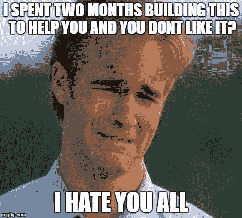

# 为什么你应该停止在你的代码上花费这么多时间

> 原文：<https://medium.com/hackernoon/why-you-should-stop-spending-so-much-time-on-your-code-4e3b20d7d3de>

对于企业家来说，新企业的开始是一个非常激动人心的时刻。他们设想的是一个很酷的产品，完美的产品市场匹配，以及广泛的采用和成功。在这个阶段，大多数创始人倾向于卷起袖子，埋头编写他们的酷产品，以便尽快上市。然而，在大多数情况下，这是最低效的步骤。

那是我大学三年级春季学期的开始，在一个创业暑期学校度过了上一个夏天，并在门洛帕克的一家伟大的[初创公司](https://hackernoon.com/tagged/startup)工作之后，我知道是时候将我解决问题的热情投入到我自己的创业中了。

我在春天上的一门课是市场营销，在那里我学习了消费者心理、营销方法和最佳渠道。当了解到[营销](https://hackernoon.com/tagged/marketing)的投资回报率时，我恍然大悟——如果大公司都不知道他们的营销努力有多有效，那 2800 万小企业呢？

带着问题和解决问题的想法，我招募了我的两个朋友，开始为小企业建立一个“独特的”微影响力平台。我们不停地编码。几天变成几周，几周变成几个月，直到我们终于有了一个可展示的产品。我们欣喜若狂！

我们为我们的产品感到非常自豪。它花的时间比我们预期的要长，但是它看起来很棒，有一些非常酷的功能。我们在营销课上展示了它，每个人都喜欢它，认为它是天才之作。在我们的脑海中，我们已经在想象我们的火星科技帝国。

# 一个“帝国”的衰落

是时候进行我们的第一次试金石测试了——真正的客户。我很快花了一些时间学习销售技巧，并带着销售资料和产品演示去了附近的一些当地企业。紧张，但乐观。然而，在我们第一次见面的时候，我就知道有些不对劲。

我的第一次会议持续了 25 分钟。像一个优秀的销售人员一样，我花了一些时间了解他们的营销痛点，以证实我的假设，即他们现有的营销流程不充分。然后，我自豪地展示了我的产品，并解释了它的好处。然而，与我期待的惊讶和兴奋相反，迎接我的是不确定的一瞥和困惑的表情。

我大吃一惊，不停地喋喋不休地解释这个产品，强调它的好处，大肆宣传它的潜在影响，但都无济于事。会议以一句*“我可能会考虑一下”*结束，我在路上一直在想哪里出了问题。

几个星期过去了，每次会议都以同样的方式结束——*“我会打电话给你，让你知道”、“也许很快”、“有意思，让我想想”——*但甚至没有一个客户真正做出回应。尽管不断跟进，我们没有取得任何进展，客户开始忽视我们。

> **我们开始讨厌我们的顾客。**

我们花了这么多时间来开发这个产品，以至于我们确信它是可行的。但是当顾客忽视我们的时候，我们没有责怪产品，而是责怪顾客。

# 责怪你的产品

终于有一天，我带我网络中的一个小企业主出去喝咖啡，向他展示这个应用程序。我告诉他要完全诚实地对待他的反馈。

> 他说，‘看起来很棒，但是我怎么用它？’

我很困惑。我认为这个应用程序很明显，很容易使用。此外，他说他不明白我们的应用程序将如何与他们现有的营销工作相结合。我意识到事实并非如此。我走进一些企业，要求他们放弃所有现有的营销努力，转而使用一款对他们来说毫无意义的应用。我们的产品是失败的，但这仅仅是因为我们花了大部分时间来编码产品，然后怨恨我们的客户不喜欢它。

> 我们的流程是创意→产品→定价→客户。本来应该是理念→客户→产品→客户→定价→客户

通过积极地让客户参与到迭代过程的每一步中，您降低了产品的风险，并使其长期实现和迭代成倍地加快。一旦我们想通了，我们的怨恨就变成了解脱。我们躲过了一劫。如果我们继续沿着这条路走下去，对我们产品的优越性和有效性有一种错误的感觉，那将会是更令人沮丧和不安的。你花在构建产品上的时间越多，就越难接受它的缺点。

> 快速移动并打破东西。
> 
> **马克·扎克伯格**

# 第 2 轮——SimplyStow

在关闭影响者营销平台并带着新发现的智慧离开后不久，我有机会对它进行测试。

> 当我们开始将有额外空间的人与寻找储物空间的人匹配起来时，我们甚至没有在第一个月开始编写任何代码。相反，我们的“MVP”是一个 GroupMe，我们在这里建立联系，匹配用户。

在花时间观察 GroupMe 上的交互，了解客户和他们的需求以及他们如何进行交易(知识和金钱)之后，我们终于开始编码。但是，我们没有编写应用程序，而是进行了每周的功能冲刺，我们构建了一个功能，并与客户一起进行了测试。

客户的反馈是如此有价值和有洞察力，以至于它减少了我们 70%的开发时间，使得迭代更快更好。

我们的客户对我们的 alpha 很满意，尽管它很难看，因为它以一种有意义的方式解决了一个主要问题。即使是部分功能正常的产品，我们也能帮助两位顾客存放他们的物品。

我知道，当你有数百名客户时，这个过程会变得更加困难。然而，我认为理想的方式是创建一个“客户委员会”,由来自每个客户群的代表性客户组成，以不断测试功能，并确保您设想的产品是客户需要的产品。

结果，我们在一个月内就从想法变成了产品，因为我们让客户在我们的开发过程中扮演了积极的角色。

> **我们了解到，我们的客户并不关心我们的代码，而是关心他们的感受。**

**一旦你意识到这一点，你就要学会在客户体验上花更多的时间，在代码上花更少的时间。我们不知道旅程结束时会接触到多少客户，但我们现在有信心为我们接触到的客户创造独特的价值。这一次，我们的顾客会为我们担保。**

**Paraj 注:** *关于早期产品迭代过程，你最大的收获是什么？你认为客户关心产品的底层代码吗？请在下面的评论中告诉我你的想法和反馈。如果你喜欢这篇文章，把它分享给你网络中你希望看到成功的早期创业创始人。如果你讨厌它，就和竞争对手分享。*

[**帕拉伊·马图尔**](http://parajmathur.com) 是 [SimplyStow](http://simplystow.com) 的联合创始人，也是富兰克林&马歇尔学院的大四学生。通过他的推特和播客跟随他。