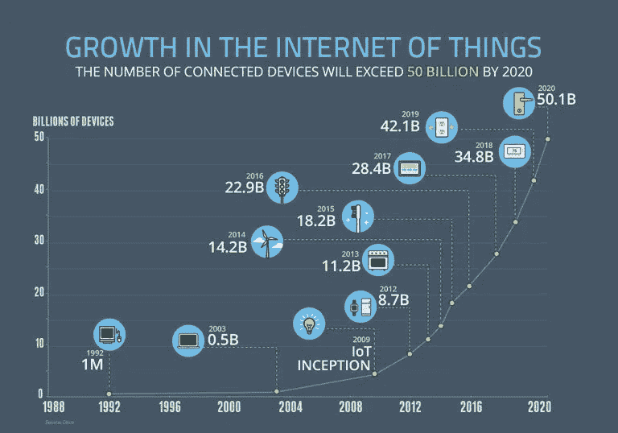
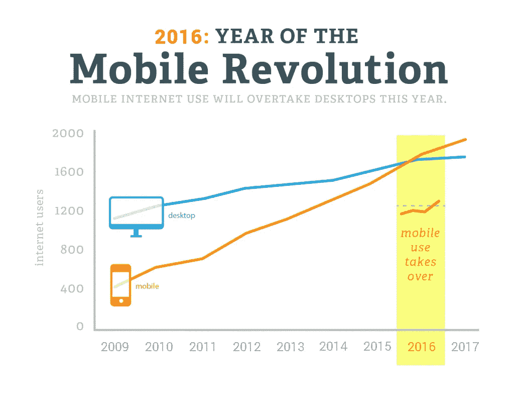

# AI 创业公司会给网络安全带来革命吗？

> 原文：<https://medium.com/hackernoon/will-ai-startups-revolutionize-cybersecurity-61686285b0e7>

保护您的数字资产是任何企业和个人的明确需求，无论您是希望保护您的个人照片、公司的知识产权、客户的敏感数据，还是可能损害您的声誉或业务连续性的任何其他方面。随着生成和聚合数据量的爆炸式增长，这种需求将在未来几年内继续大幅增长( [IDC](http://www.computerweekly.com/news/2240217788/Data-set-to-grow-10-fold-by-2020-as-internet-of-things-takes-off) 预测，到 2020 年，数字数据量将达到 44zb，即 10 亿字节。

在[网络安全](https://hackernoon.com/tagged/cybersecurity)的所有学科中，最大的挑战是能够有效地识别新的威胁，而不依赖于任何签名或容易绕过试探法，这依赖于已知的、以前见过的恶意活动。支持这一趋势的是，尽管在网络安全上花费了数十亿美元(根据 [Garter](http://www.gartner.com/newsroom/id/3404817) 的最新估计，全球信息[安全](https://hackernoon.com/tagged/security)支出将在 2016 年达到 816 亿美元)，我们每天都看到越来越多的报告的网络攻击和更高规模的违规，例如最近公布的高规模网络违规——[雅虎](http://fortune.com/2016/09/22/yahoo-hack-qa/) 5 亿账户数据违规是历史上最大的，Dropbox 证实 6800 万账户信息泄露。

在许多网络安全领域，利用人工智能的预测能力可能会让安全供应商和我们所有人，个人和企业占据上风。下面总结了人工智能初创公司网络防御创新的关键领域。

**检测&拦截被黑客攻击的物联网设备**

思科预测，到 2020 年，全球联网设备的数量将从今天的 150 亿增加到 500 亿。英特尔甚至更乐观，声称到那时将有超过 2000 亿台设备联网。

IoT devices will cross 50 billion by 2020 (Image source: www.[enterpriseirregulars.com](https://www.enterpriseirregulars.com/wp-content/uploads/2016/01/growth-iot.jpg))

由于硬件和软件资源有限，这些数十亿台互联设备中有很大一部分没有基本的安全措施或具备这种能力。最近针对 [KerbsOnSecurity](https://krebsonsecurity.com/2016/09/krebsonsecurity-hit-with-record-ddos/) 发起的大规模拒绝服务攻击生动地展示了被黑客攻击的物联网设备的威力。更可怕的是，用于发起攻击的 [Mirai 未来组合](https://krebsonsecurity.com/2016/10/source-code-for-iot-botnet-mirai-released/)恶意软件的源代码很快就被公之于众，现在可以用来攻击任何企业或个人。物联网安全问题比业务连续性更严重，可能意味着现实生活中的威胁事件，因为以类似的速度，医疗设备和交通工具将高度互联，黑客可以到达(Telefonica 估计，到 2020 年， [90%的汽车](https://iot.telefonica.com/blog/90-of-new-cars-will-be-connected-by-2020)将联网)。物联网安全是人工智能技术最突出的领域之一。基于人工智能的轻量级预测模型甚至可以在低计算能力的设备上自主驻留和运行，可以在设备或网络级别实时检测和阻止可疑活动。一些有趣的初创公司为物联网安全挑战实施了人工智能技术，其中包括[CyberX](http://cyberx-labs.com/en/home/) 、 [PFP 网络安全](http://www.pfpcybersecurity.com/)和 [Dojo-Labs](https://www.dojo-labs.com/) 。

**防止恶意软件&文件的执行**

基于文件的攻击仍然是主要的网络攻击载体之一。用于基于文件的网络攻击的最常见文件类型是可执行文件()。exe)，Acrobat 阅读器()。pdf)和微软办公文件。单个代码行中的微小更改可能会生成具有相同恶意意图但具有不同签名的新恶意文件，其行为的微小更改会欺骗传统的基于签名的防病毒，以及更高级的基于启发式的高级端点检测和响应(EDR)解决方案，甚至是通常部署在网络级别的沙箱解决方案。有一些初创公司通过利用人工智能来解决这个问题。他们利用巨大的能力，查看每个可疑文件的数百万个特征，甚至检测最轻微的代码突变。实施基于文件的人工智能安全的领导者是[cylince](https://www.cylance.com/)、 [Deep 本能](http://www.deepinstinct.com/)和[因文西](https://www.invincea.com/)。

**提高安全运营中心(SOC)运营效率**

安全团队的一个关键问题是，由于每天收到的安全警报过多，他们会感到警报疲劳。北美企业平均每天处理 [10，000](http://www.securityweek.com/enterprises-generate-10000-security-events-day-average-report) 安全警报！在许多情况下，这使得恶意指标尽管被标记为可疑，但仍能被忽视。需要通过在多个信息源之间运行高级关联、集成内部日志和监控系统以及外部威胁情报服务来对事件进行自动分类。这个网络防御前沿非常热门，因为它是运营自己的 SOC 的最大企业的问题。一些利用人工智能技术实现这一目标的初创公司有 [Siemplify](https://www.siemplify.co/) 、 [Phantom](https://www.phantom.us/) 、 [Jask](http://jask.io/) 、 [StatusToday](https://www.statustoday.com/) 和[cyber discovery](https://www.cyberlytic.com/)

**量化网络风险**

量化组织的网络风险是一项具有挑战性的任务，这主要是因为缺乏历史数据和大量需要考虑的变量。如今，对量化其网络风险感兴趣的组织(以及希望评估这些组织的第三方，如网络保险公司)正在经历繁琐的网络风险评估流程，该流程主要基于自行填写的问卷，用于衡量对可用网络安全标准、组织治理和风险文化的合规性的定性测量。这种方法不足以真实反映一个组织的网络风险状况。人工智能技术处理数百万个数据点并生成预测的能力可以成为组织和网络保险公司最准确的网络风险估计的制胜之道。一些初创公司正在着手这项任务，其中包括 [BitSight](https://www.bitsighttech.com/) 、[安全记分卡](https://securityscorecard.com/)和 [myDRO](http://www.mydro.co) 。

**网络流量异常检测**

由于每个组织都有其独特的流量行为，因此检测可能指示恶意活动的异常流量的挑战是巨大的。在不依赖侵入式深度数据包检测的情况下，查找协议之间的相关性需要分析组织内部和外部网络流量中发出的无尽元数据之间的数千个相关性。一些初创公司正在使用人工智能技术来应对这一挑战，其中包括 [Vectra Networks](http://www.vectranetworks.com/) 、 [DarkTrace](https://darktrace.com/) 和 [BluVector](https://www.bluvectorcyber.com/) 。

**避免鱼叉式网络钓鱼攻击**

鱼叉式网络钓鱼攻击通常基于包含恶意内容的电子邮件，它可以是重定向到恶意代码执行或下载的链接。这是进入组织最成功的途径。根据 SANS Institute 的调查，95%针对企业的成功网络攻击都是鱼叉式网络钓鱼成功的结果。由于此类电子邮件的许多变量和变化，预测电子邮件是否是网络钓鱼企图是一项复杂的任务。一些初创公司正在通过提供集成解决方案来解决这一问题，这些解决方案结合了员工网络钓鱼意识培训、内置报告功能和基于人工智能的预测。其中有 [PhishMe](https://phishme.com/) 、 [Agari](https://www.agari.com/) 和 [Area1 Security](https://www.area1security.com/) 。

**授权数据访问管理**

数据泄漏预防(DLP)解决方案已成为处理文件访问授权管理的常见做法。使用这些解决方案的最大障碍是需要对每个文件进行分类，这是一种严格的低效做法。利用人工智能功能对信息进行自动分类可能会带来新一代 DLP，从而在大型组织中获得更高的采用率，并且现在与缺乏资源来管理信息的小型组织相关。一些创业公司正在通过使用人工智能技术推出新一代 DLP，其中包括 [harvest.ai](http://www.harvest.ai/) 和 [Neokami](https://www.neokami.com/) 。

**自动化安全编码过程**

每天都有新的安全漏洞暴露出来。这些漏洞是什么？它们只是程序员的代码错误或在开发操作系统或应用程序时被忽略的特殊情况。从攻击者暴露漏洞到安全社区意识到这是一个问题，直到相关供应商发布补丁并分发给最终用户，这之间的时间窗口可能需要几个月！显然需要自动安全代码审查技术，该技术可以在代码发布之前在最低层扫描代码，并预测跨编程语言、平台和操作系统的可能的安全漏洞。有一些创业公司致力于解决这个问题，其中有 [Checkmarx](https://www.checkmarx.com/) 和 [QuantifiedCode](https://www.quantifiedcode.com/)

**恶意移动应用检测**

据爱立信称，智能手机在全球已突破 25 亿台，预计到 2020 年将达到 60 亿台。这种移动性的高速增长并没有跳过商业领域。根据 [Ponemon Institute](http://aa-download.avg.com/filedir/other/Smartphone.pdf) 的调查，近 85%的人将同一设备用于工作和个人用途，而明确的自带设备(BYOD)安全政策并不存在，也没有明确定义的移动访问限制。

Mobile use takes the lead in 2016 (Image Source: [www.mobiloitte.com](http://www.mobiloitte.com))

查看排名前 100 的 iOS 和 Android 应用， [Araxan research](https://www.arxan.com/resources/document-download-center/) 发现，在过去，56%的顶级 iOS 应用和 100%的顶级 [Android 应用](https://www.peerlyst.com/tags/android-apps)被[黑客攻击](https://www.peerlyst.com/tags/hacked)。考虑到 Google Play 和 Apple App Store 这两家领先的应用商店在其商店中的可用应用数量都超过了[200 万](https://www.statista.com/statistics/276623/number-of-apps-available-in-leading-app-stores/)，强调了对移动应用进行高度准确的自动分类的必要性。这种分类方法必须对最轻微的混淆技术敏感，区分恶意和良性应用程序。它可以通过使用先进的人工智能技术的尖端分类能力来交付。很少有公司在这个竞技场上领跑枪头，其中就有[深度本能](http://www.deepinstinct.com/)、[瞭望移动安全](https://www.lookout.com/)和[检查站](https://www.checkpoint.com/products/mobile-threat-prevention/) (Lacoon 移动安全)。

> [黑客中午](http://bit.ly/Hackernoon)是黑客如何开始他们的下午。我们是阿妹家庭的一员。我们现在[接受投稿](http://bit.ly/hackernoonsubmission)并乐意[讨论广告&赞助](mailto:partners@amipublications.com)的机会。
> 
> 如果你喜欢这个故事，我们推荐你阅读我们的[最新科技故事](http://bit.ly/hackernoonlatestt)和[趋势科技故事](https://hackernoon.com/trending)。直到下一次，不要把世界的现实想当然！

