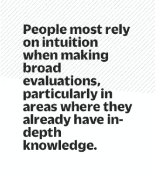
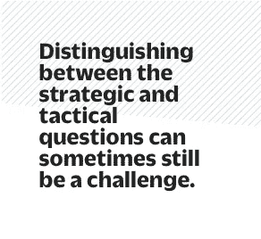

# 数据科学会让你的商业直觉变得无关紧要吗？

> 原文：<https://medium.com/hackernoon/will-data-science-make-your-business-instincts-irrelevant-90faf9fa0160>

[Photo: Flickr user [Naomi](https://www.flickr.com/photos/mariko1/14099026784/)]

现在数据比以往任何时候都多，你需要知道这些来平衡你的直觉和数据。

无论如何，直觉在数据分析时代依然存在。在 [2014 年普华永道调查](http://www.forbes.com/sites/gilpress/2014/09/10/new-surveys-on-big-data-big-decisions-analysis-and-intuition/#50fc323f7739)中，只有约三分之一的高管报告称，他们的上一个重大商业决策首先依赖数据。至于其他方面，同事的建议和传统的直觉都发挥了重要作用。

人们在进行广泛的评估时，尤其是在他们已经有深入知识的领域，最依赖直觉。

这也难怪，是吗？领导者倾向于取得他们现在的成就，至少部分是基于他们良好的判断力，这种判断力一次又一次地引导他们走向成功。如今，随着大量新的数据见解比以往任何时候都近在咫尺，涉水而过可能会显得势不可挡，甚至令人分心。我们仍处于大数据和商业数据科学的早期阶段，因此主观测量仍占据主导地位可能并不奇怪。

这不一定是件坏事，但有时的确是。为了让你的直觉和冷酷无情的数字保持平衡，你需要知道以下几点。

## 直觉会过时吗？

值得一问的是，我们最终是否能够将本能和直觉从我们的决策过程中完全去除，即使我们想这样做。

网飞创始人雷德·哈斯汀斯在创办这家视频公司之前是一名人工智能工程师，他警告说，人的因素仍然至关重要。“我们从数据开始，”他最近告诉 VentureBeat ，“但是最后的决定总是直觉。这是明智的直觉。”

虽然专家们发现直觉是强大的，但它经常会把我们引入歧途。总的来说，即使是我们当中最有经验的决策者也常常是非理性的，做出不符合我们最佳利益的选择，凭冲动行事，对看不见的偏见视而不见。

成功来自于[将我们的情感自我和系统思考之间的点](http://www.fastcompany.com/3028086/leadership-now/how-to-map-out-your-decision-making)连接起来，这些点可以被量化地检查。关键在于你如何将数据、预测分析和久经考验的直觉结合起来。

## 直觉帮助我们挖掘得更深

要获得这种平衡，首先要了解现实世界中的哪些情况需要更多或更少的主观评估，而不是定量评估。

2012 年，莱斯大学的研究人员埃里克·戴恩和乔治·梅森大学的凯文·w·洛克曼[发现](https://www.sciencedaily.com/releases/2012/12/121220144155.htm)人们在进行广泛评估时最依赖直觉，特别是在他们已经对该主题有深入了解的领域——通常称为“领域专长”

今天，组织可能有大量的数据要分析，但挑战是定义他们可以从任何数据分析工作中合理地期望什么。在定义要问哪些问题以获得可操作的见解时，直觉仍然发挥着作用。以下是一些例子:

*   追逐什么市场
*   开发什么产品和服务
*   采用什么商业模式
*   追求什么样的伙伴关系

判断和经验——通常以直觉的形式——应该也确实会让商业领袖在适当的时候提出这些问题。但是数据分析可以帮助回答他们的具体问题，比如:

*   市场分割
*   客户和产品的可移植性
*   客户保持策略
*   运营和绩效管理
*   所需资源

可以肯定的是，这是一个有意的宽泛且远非全面的细分。但是区分战略和战术问题有时仍然是一个挑战；直到最近，两者都受到基本相同剂量的直觉。虽然市场研究长期以来一直是一个主要内容，但只是在最近，数据分析才开始重塑企业如何获得后一种类型的洞察力。

## 验证是强制性的

今天，大量数据被实时收集，这使得“人与机器”(而不是“人与机器”)的公式变得更加重要。算法和系统可以比以往更高效、更准确地处理信息，从而显著提高信息的业务相关性。

过去的决策是基于历史先例，如客户满意度调查和销售模式，而现在机器可以创建包含假设情景的预测模型、模式和趋势。以下是《T2 大数据:使用智能大数据、分析和指标做出更好的决策并提高绩效》一书的作者 [Bernard Marr 最近在 LinkedIn 上总结了这一转变的](https://www.linkedin.com/pulse/20131113065157-64875646-the-awesome-ways-big-data-is-used-today-to-change-our-world):

> “美国零售商 Target 现在能够非常准确地预测他们的一位顾客什么时候会有孩子。利用大数据，电信公司现在可以更好地预测客户流失；沃尔玛可以预测什么产品会畅销，汽车保险公司了解他们的客户实际驾驶情况。”

但这也暗示了一个相反的必要条件——这一点更容易被忽略:正如我们现在可以用比以往任何时候都更可靠的指标来检验我们的直觉一样，我们也需要让我们的预测模型——数据告诉我们可能发生的事情——与我们最知情的预感相对照。关于正在发生或已经发生的事情的信息可能是让我们的本能与之对抗的可靠基线，但当涉及到未来时，数据可能能够引导我们前进，尽管直觉(至少到目前为止)仍然在很大程度上引领着我们。

当然不会一直这样。随着数据创新的加速，我们将直觉与数字相结合的方式将继续发展。

但正如他们所做的那样，量化和主观领域不太可能完全相互排斥。组织面临的挑战和机遇是——并将继续是——如何最好地利用他们的联合力量。当然，这是一门科学，但也是人类的科学。

版权所有(c) 2016，作者 Faisal Hoque。保留所有权利。

**原创文章**[***@ fast company***](http://www.fastcompany.com/3060675/how-to-keep-your-business-instincts-relevant-as-data-science-evolves)**。**

*连续创业者* [*费萨尔·霍克*](http://www.fastcompany.com/user/faisal-hoque) *是* [*沙多卡*](http://www.shadoka.com/) *的创始人，使创业、成长和社会影响成为可能。他著有《* [万物互联:如何在创造、创新和可持续发展的时代进行变革和领导》》、《T26》(麦格劳-希尔)等书。免费使用](http://everythingconnectsthebook.com/) [*万物互联领导 app*](http://app.everythingconnectsthebook.com/login.php)*。*

> [黑客中午](http://bit.ly/Hackernoon)是黑客如何开始他们的下午。我们是 [@AMI](http://bit.ly/atAMIatAMI) 家庭的一员。我们现在[接受投稿](http://bit.ly/hackernoonsubmission)，并乐意[讨论广告&赞助](mailto:partners@amipublications.com)机会。
> 
> 如果你喜欢这个故事，我们推荐你阅读我们的[最新科技故事](http://bit.ly/hackernoonlatestt)和[趋势科技故事](https://hackernoon.com/trending)。直到下一次，不要把世界的现实想当然！

