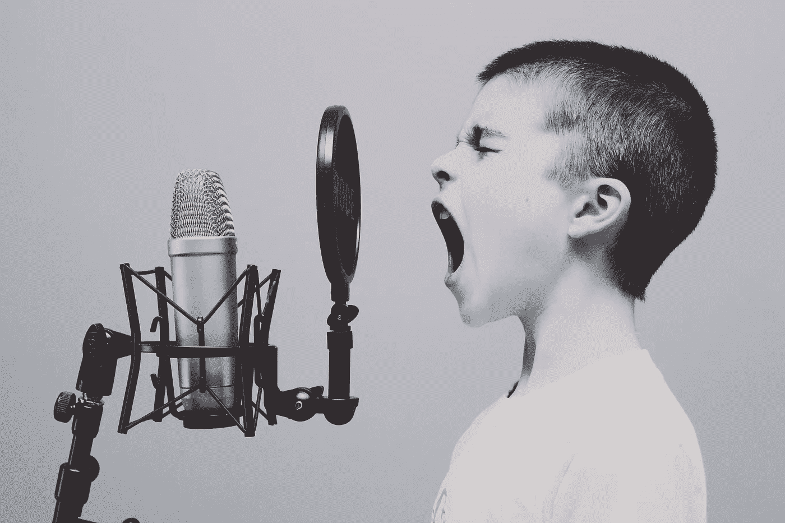

# 音乐行业会接受声控技术吗？

> 原文：<https://medium.com/hackernoon/will-the-music-industry-embrace-voice-controlled-technology-ccc56db4717a>

对于那些关注科技行业趋势的人来说，许多专家将 2017 年称为“**声音之年**”并不奇怪。随着虚拟现实和人工智能的出现，语音识别有可能成为非常有意义的长期发展。我们不再通过应用程序控制一切，而是现在可以与虚拟助理交谈，控制从我们的电脑到我们的汽车，再到我们的家。

继亚马逊的 Echo 智能家居设备和该公司的 Alexa 个人助理以及苹果的 Siri 和其他举措取得成功后，科技行业越来越专注于开发语音控制设备和服务的改进和创新。事实上，真正让语音控制平台成为主流的是亚马逊。

音乐产业也在探索声控技术的可能性。最近的报道表明，Spotify 可能会在不久的将来进入硬件业务，因为早期的工作帖子称，该公司希望建立“类似于 Pebble Watch、亚马逊 Echo 和 Snap Spectacles 的类别定义产品”，这将“影响世界体验音乐和谈话内容的方式”。尽管 Spotify 计划的细节尚不清楚，但招聘清单称，该设备将连接互联网，并直接来自 Spotify，从而表明它不会是与另一家公司设备的简单集成。

语音和音乐领域的主要参与者之间的竞争正在快速增长。亚马逊已经推出了一项名为 Amazon Music Unlimited 的音乐流媒体服务，可以通过该公司的 Echo 智能家居设备进行控制，允许用户通过语音命令查找和播放音乐。这项服务相当先进，能够要求 Echo 智能中心根据情绪、推出的十年、歌词或最近发行的音乐来查找音乐。Apple Music 也可以通过 Siri 用语音命令来控制，以查找和播放歌曲，而亚马逊的 Echo 已经支持 Pandora、iTunes 和 Spotify。

当然，语音控制技术还远非完美，但自从这项技术诞生以来，它已经走过了漫长的道路。特别是，语音识别系统的单词错误率从 1995 年的 43%下降到今年的 6.3%，现在与人类持平。自然，我们很快就会看到音乐行业和其他行业的重大进步。

认知服务和语音界面的成熟发展也将在不久的将来带来更高级别的聊天机器人。这些新技术正以创新的方式结合在一起。例如，中国的 Vinci 智能耳机具有 Alexa 风格的语音控制助手，可以学习用户的听力偏好并跟踪他们的活动。

除了人工智能，语音识别还有可能实现非常有意义的长期发展。在这里，软件，而不是硬件，将在很大程度上决定市场的成功。随着语音控制技术的改进，公司向公众提供更复杂和创新的产品，免提控制音乐搜索和收听可能会成为大多数消费者的标准。根据 VoiceLabs 的一份报告[显示，消费者已经急切地采用基于扬声器的语音助手，预计 2017 年谷歌 Home 和亚马逊 Echo 扬声器的出货量将增长三倍以上，达到 2450 万。](http://voicelabs.co/2017/01/15/the-2017-voice-report/)

I语音技术的创新有可能从根本上改变消费者搜索和聆听音乐的方式。能够简单地说出您正在寻找的内容，而不是手动搜索特定的专辑、歌曲或情绪，这使得过程更快、更直观，预计未来会有越来越多的音乐粉丝希望利用这些功能。目前的功能水平可能只是未来发展的开始。

*由* [*谢尔盖·布多夫*](https://www.linkedin.com/in/sbludov/) *媒体与娱乐高级副总裁* [*数据艺术*](https://www.dataart.com/industry/media-and-entertainment?utm_source=medium.com&utm_medium=referral&utm_campaign=m-regular&utm_content=da-hn-sbludov-voicecontrol)