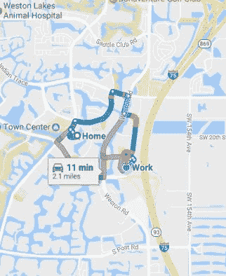
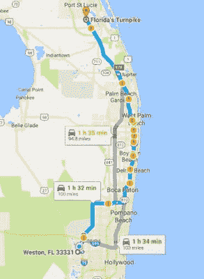

# 我们会成功吗——汽车、地图和软件项目(持续的重新预测)

> 原文：<https://medium.com/hackernoon/will-we-make-it-cars-maps-and-software-projects-continuous-reforecasting-795217a87bcb>

你多久预测一次你的项目是否会按时完成？一次，项目刚开始的时候？每个月？每两周一次？每天？每隔 15 分钟怎么样？对于我工作的团队来说，我们每 15 分钟预测一次我们的成功概率。现在，这可能看起来有点过头了，但是我们将在这篇文章的稍后部分回到这个话题。首先，一个关于重新预测的真实生活轶事。

通过一些规划和很多运气，工作和家，对我来说，都在同一个城市。这意味着两件事。首先，在大多数日子里，我一整天都是在半径 2 英里的范围内度过的。第二，我一周中几乎所有的驾驶都是城市驾驶。这两件事在工作日是真的，但在星期天不是。参加地区体育联盟意味着要走出我的 2 英里舒适区。这也意味着要在高速公路上开很多次车。

我最远的一次开车去了佛罗里达州东海岸的一个城市，名叫圣露西港。它离我在佛罗里达州风景如画的韦斯顿郊区的家几乎正好 100 英里。最近的一个周日早上，当我正准备离开时，汽车仪表板上的显示屏告诉我，我有足够的汽油行驶 120 英里。我的选择是要么现在加油，要么在从地面返回的路上加油，这样我就有足够的油来完成往返旅程。我决定选择后者。不知何故，当我到达一百英里外的目的地时，汽车的预计行驶里程从 120 英里变成了 98 英里。我已经行驶了 100 英里，但只用了行驶 22 英里所需的汽油。从外面看，这可能是一个物理学奇迹，或者是我的车在我开始旅程时骗了我。

似乎宝马的工程师们(除了创造一些漂亮的跑车)已经发现了许多项目经理、scrum 大师和团队领导很难发现的问题。不管你最初的估计或期望有多好，随着你获得更多的信息，你必须调整你的预测和重新预测。当我在旅途中时，车上的电脑发现我燃烧燃料的速度与我最近旅行时大不相同。这是有充分理由的-

*   城市驾驶被高速公路驾驶取代，少了很多走走停停。
*   我每天都充分利用运动模式驾驶，但我决定不这样做，因为我正在削减距离旅行距离很近的剩余英里数。
*   我通常在城市中驾驶时将敞篷车蓬放下，这样会增加风阻，而在高速公路上驾驶时，我通常会将车顶打开。

随着旅程的进行，所有这些因素都会影响燃料的消耗率，汽车的计算机会重新预测油箱中的燃料可以行驶多少英里。不管计算机最初的估计如何，它都考虑到了现有的新信息，并逐渐调整了它的预测。最有可能的是，投影算法没有改变，但是计算机使用的底层数据模型改变了。这些预测对每行驶一英里都有反应。每一点新信息都被汽车用来重新预测汽车能够行驶的里程。

NOAA(国家海洋和大气协会)在预测飓风时也做同样的事情。每当他们收到新的信息时，他们就调整他们预测的飓风行进路线。当飓风形成时，他们不会只发布一个单一的预报，而让它保持不变。在生死攸关的问题上，美国国家海洋和大气管理局对每一条新信息做出反应，重新调整他们对飓风方向的预测。

> 制图应用程序意识到，它们的准确性在很大程度上取决于是否拥有最新信息，并使用这些信息来更新它们的预测。当您预测项目或发布的结束日期时也是如此。

这同样适用于任何提供方向和预计到达时间的“地图”应用程序。谷歌地图、Waze、优步、Lyft 等都在不断改版。当他们有新的信息时，他们不仅会重新预测，而且会积极寻找信息来做预测。制图应用程序意识到，它们的准确性在很大程度上取决于是否拥有最新信息，并使用这些信息来更新它们的预测。当您预测项目或发布的结束日期时也是如此。

现在，回到为什么我们每 15 分钟运行一次团队预测。在一个有 30 个团队的组织中，假设这 30 个团队中的一个有一些新的信息，导致他们改变范围或移动日期。我们希望这些决策的结果能够在团队做出这些改变后立即提供给他们。事实上，我们希望任何感兴趣的人都能看到这些变化，而不仅仅是团队。这就是为什么，就像宝马一样，随着每一英里的流逝，我们希望能够重新规划和预测我们的可能性范围。每天都有新的信息出现，我们应该在它出现的时候重新预测。

> 从新信息到可行预测的反馈回路应尽可能小…预测、早期预测和经常预测

我们想尽早知道我们最初的假设何时被证明无效。这就是问题的症结所在。我们的第一次预测包含了许多假设。我们的系统及其规则越不稳定(运动模式对舒适模式，活顶向上对向下)，随着项目(或行程)的进展，我们的假设失效的机会就越大。我们系统中导致这种情况的可变性是不可避免的，然而可以避免的是我们对可变性视而不见。

敏捷的很大一部分是建立反馈循环。它是关于寻找新信息，然后对其做出反应。我们的系统(组织、团队、汽车、飓风等。)不断为我们提供新的信息。从新信息到可行预测的反馈回路应该尽可能小。这就是为什么我们不等待两周或一个月来重新预测，而是不断重新预测的主要原因。

除非我们已经在运行一个非常稳定的系统，否则我们最初的估计是不准确的。我们，不管“我们”是指团队还是业务，只要我们想生活在现实世界中，就需要接受这一点。随着我们取得进展，获得新信息，不确定性范围开始缩小，我们将能够做出更好的预测。当新的信息可用时，重新预测不仅是一件好事，也是一件负责任的事情。适用于代码签入的规则也适用于预测，即尽早并经常签入。预测，早期预测和经常预测。