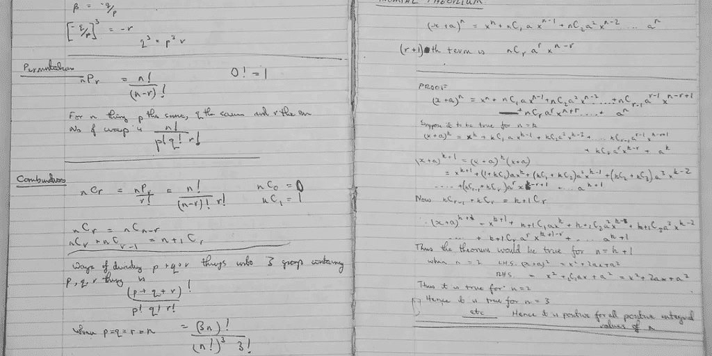

# 像数学证明一样写代码

> 原文：<https://medium.com/hackernoon/writing-code-like-a-mathematical-proof-f5838fc27382>

从我早年的软件开发开始，我就对形式数学与编写代码的相似之处感兴趣。在数学课中，我们学习了证明的概念，以及如何从一组公理和定义出发，逻辑地构建真陈述来证明一个猜想。一旦被证明，一个猜想就变成了一个定理，然后就有可能用这个定理来证明其他猜想。

这种解决证明的方法遵循软件开发中类似的一系列步骤。我们从一组定义(if 语句、for 循环等)和已经被证明的定理(标准库、第三方库等)开始，然后尝试结合这些元素来解决我们自己的问题。软件中语句的组合是从字面上理解的。在程序运行期间，计算机代码中的每一行都被视为一个逻辑指令序列。

下面这段引自数学分析入门教材的话描述了写作证明和论文写作之间的比较。《理解分析》的作者史蒂文·阿博特写道:

> “[……]证明是一种论文。这是一套精心制作的指示，当遵循时，应该让读者绝对相信所讨论的命题的真实性。要做到这一点，证明中的步骤必须在逻辑上遵循前面的步骤，或者由一些其他商定的事实证明。除了有效之外，这些步骤还必须连贯一致，才能形成令人信服的论点”

证明写作和论文之间的这种比较形成了我关于证明写作和编写代码之间的争论的基础。在我们开始之前，我想指出，我不会试图说服读者从数学上证明他们的代码。相反，我想使用编写好的证明的概念，并将其转化为编写好的代码。这篇文章涵盖了其中的一些相似之处；当试图编写高质量的代码时，提供额外的视角。

为了确保证明的一致性，我们来看一个例子。假设我们想证明*两个连续整数的和总是奇数*。如前所述，我们希望从定义(或之前证明的定理)开始，结合一系列逻辑陈述，并将它们构建为真实的结果。以下是一个示例证明:

**定理*定理*定理**

如果 *a* 和 *b* 是连续整数，那么 *a + b* 之和就是**奇数**。

***证明***

假设 *a* 和 *b* 是连续整数。根据定义，奇数被写成 *2k + 1* 其中 *k* 是任意整数。

因为 *a* 和 *b* 是连续的我们知道 *b = a + 1* 。

因此，和 *a + b* 可以重写为:

*a+b*=*a+(a+1)*=*a+a+1*=*2a+1*

由于 *a* 是整数，那么 *2a + 1* 是奇数，因此**和 *a + b* 是奇数**。

# 了解你的受众

让我们来分解一下关于证明的一些重要部分，以及关于受众的一些假设。首先，我假设这篇文章的读者理解什么是整数(由于编程文章的性质，这是一个安全的假设)。接下来，我假设读者对整数代数很熟悉(对整数的操作大多很直观)。最后，我没有假设读者知道奇整数的正式定义，而是在证明中定义它，以确保作者和读者之间的心理模型一致。在声明了每个假设和定义后，我使用严格正确的语句构建了最终结果，并成功地证明了预期的结果。

对你的读者作出必要的假设永远是正式校样写作的必要步骤。有多种方法来编写示例证明。一种方法是假设读者知道偶数和奇数整数的正式定义。通过放弃这个定义，它使证明简短明了，但牺牲了明确性。相反，我认为这篇文章的读者可能从来没有上过纯数学课，或者，如果他们上过，可能已经忘记了这个定义。

好的校样作家知道他们的目标受众是谁。如果他们正在为一本介绍性的教科书写校样，提醒读者基本的定义将有助于他们轻松地进入材料。如果他们正在为一个特定的数学分支写一篇期刊文章，那么他们可能会抛弃定义，理所当然地假设高级数学家会跟随他们。采取正确的观众假设将导致更好的校对体验。

就像写证明一样，我们在写软件的时候也应该做同样的假设。当大多数开发人员编写软件时，他们只是试图编写可执行代码。不幸的是，仅仅坚持可执行性的必要性并不能保证代码的可读性。仅仅因为你的代码执行了，并不意味着有人就可以很容易地遵循执行路径。当您试图测试您的代码时，这非常有用，但是如果您试图维护一个持久的团队管理的代码库，这就不合适了。

要编写可理解的代码，总是要问你的受众是谁。他们有什么水平的经验？在阅读这个函数之前，他们应该知道的先决条件是什么？编程语言之间甚至在语义上也有差异，因此了解最佳实践和语言编码风格将确保您用该语言为开发人员编写可读的代码。

当坐下来写下一个函数时，要注意你选择的描述变量和方法的词。考虑你所做的假设，以及你如何组织你的注释和代码。创建或遵循项目风格指南也可以让代码库的新手和老手理解您的代码。通过遵循这一原则，您的代码不仅读起来更好，而且会减少您的开发伙伴在遵循时的精神负担。

# 写得清楚简洁

当编写代码时，我们有现代化的便利来检查编译错误、运行时异常和自动化单元测试形式的语句的有效性。写作证明不包含这些便利。数学家的答案检查者是他们的读者伙伴，他们必须被证明的结果所说服。为了让读者相信结果是真实的，校对者必须用最清晰简洁的方式表达出来。努力理解冗长、不连贯和多余的陈述会让读者感到沮丧，无法理解证据。

因为编写代码经常是在团队中完成的，所以我们应该意识到读者。我建议我们以这样一种方式编写代码，不仅执行正确的结果，而且让读者相信陈述的真实性。就像一个好的证明一样，代码应该写得深思熟虑、小心翼翼；我们必须确保删除对读者没有额外好处的多余语句。

为什么要用 100 行代码来完成用 80、60 或更少的时间就能完成的事情呢？死代码，就像死句子一样，会消耗读者的短期记忆，迫使他们画出一个超出所需的思维导图。通常情况下，你解决问题的第一次尝试会选择最长的执行路径。回去试着编辑你写的东西，降低它理解的复杂度。

然而，请注意，我并不提倡在你的整个项目中刷一个通用的“减少代码”。将这一建议推向逻辑极端将弊大于利。有时候，实例化一个新的、潜在冗余的变量可能会提供一个更好的名称来增强读者的理解。

# 测试所有案例

解决一个证明的一般策略是从使用一个例子开始，然后逐步发展成一个一般的陈述。在我们的示例证明中，我们可以使用整数 2 和 3 的示例，并看到它们的总和将为 5——一个奇数。使用这个例子，我们可以推断出这个模式是如何继续应用的。

我们正在寻找一个通用的解决方案，但这并不意味着我们不能使用实际的例子来实现我们的目标。然而，如果我们过于关注实际例子，就会出现问题。有时我们可能会忘记测试一个特定的案例，这可能会破坏我们的一般解决方案。在我们的例子中，我们只看了两个正整数。负整数呢？用整数的加法恒等式(也叫 0)怎么样？

幸运的是，对于连续整数的例子，如果我们尝试添加负数或零，我们不会看到问题。不幸的是，情况不会总是这样。假设我们试图证明一个整数的每个平方根都存在于实数中。如果你试过√2、√4，甚至√0，你会相信结果是真的。然而，如果我们试图找到√-1，或者任何负整数的平方根，就存在一个问题。

事实上，数学家不得不创造一组全新的数字——复数——来寻找负整数的平方根！通过引入一个看似简单的负整数，数学史永远地改变了。这在数学中甚至不是一个罕见的例子，面对新的要求，数学已经改变了无数次。

在软件中，我们将恼人的或者不明显的需求标记为**边缘情况**。软件开发人员都遇到过边缘情况，尤其是在编写接受用户输入的函数时。令人沮丧的是，必须确保该函数适用于空数据、过多的数据或用户能够想到的任何疯狂的输入。软件工程师总是抱怨边缘情况，许多人忽略了那些导致程序崩溃的边缘情况。虽然边缘案例的命名试图将它们标记为罕见事件，但它们仍然是必须考虑的有效案例。

我提出了软件开发人员经常忽视测试所有情况的两个原因:

1.  他们不知道这个案子的存在，或者
2.  他们知道案例存在，但是不编写处理它的代码

第一点是一个棘手的问题，但是就像校对人员一样，软件开发人员也有代码审查来仔细检查他们的测试用例。还有一些方法可以使用单元测试、集成测试或者像 TLA+这样的模型检查器来测试你的代码。我们也可以从经验中学习，为我们提供更多关于潜在测试用例的知识。随着您编写更多的软件，您将会遇到更多的情况，并且这些知识可以传递到以后的实现中。

回到我的两个原因，虽然第一点是一个无知的问题，但第二点更加阴险。当开发人员知道可能会发生边缘情况，但没有采取任何措施来预防时，就会发生这种情况。这要么是因为项目时间限制，赶出来一个功能，要么就是纯粹的懒惰。每一个合理化都源于在项目中投入额外时间的机会成本，或者发布带有已知 bug 的代码。不管合理化与否，这应该**永远不要**出现在我们的代码库中。

这不仅反映了你所开发的软件的糟糕，而且忽视它们在逻辑上是错误的**。虽然我可以理解开发人员在发现新案例时会意识到额外的时间负担，但我不能坐视错误代码被故意发送出去。就像数学家必须通过包含负整数来创建一个全新的数学分支一样，一个伟大的开发人员必须花时间在他们的代码中构建边界情况解决方案。重新构建这些测试用例，从处理恼人的边缘情况，到构建逻辑上正确的软件，就像一个证明，将在任何情况下保持强大。**

## 概括起来

我已经尽我所能找到了从写好证明到写好软件的三个最佳映射。虽然这三点并没有穷尽所有可能的映射，但是我发现它们是编写代码时最有用的。这两个世界没有什么不同，你可能会惊讶地发现，学习纯数学有助于你将来编写更好的软件。

如果你对这些观点感兴趣，也许你应该打开一本关于证明的初级书籍，尝试几本。希望，像我一样，当你从零开始解决你的第一个证明时，你会发现同样的感觉:你从编写正确的代码中得到的熟悉的快感。