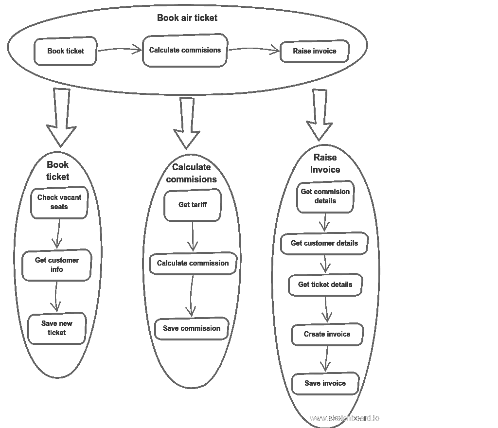
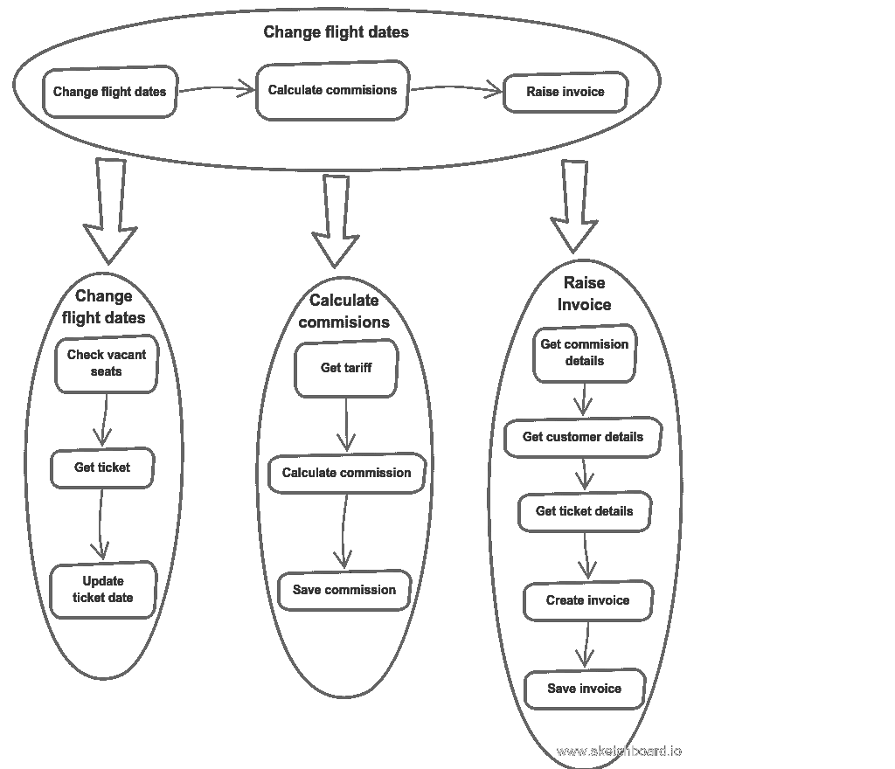
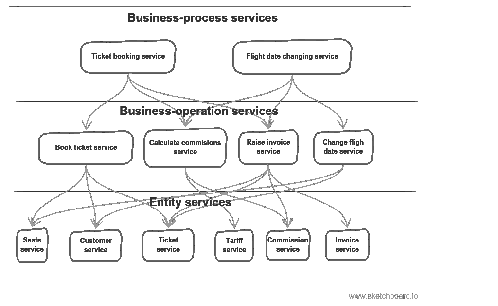
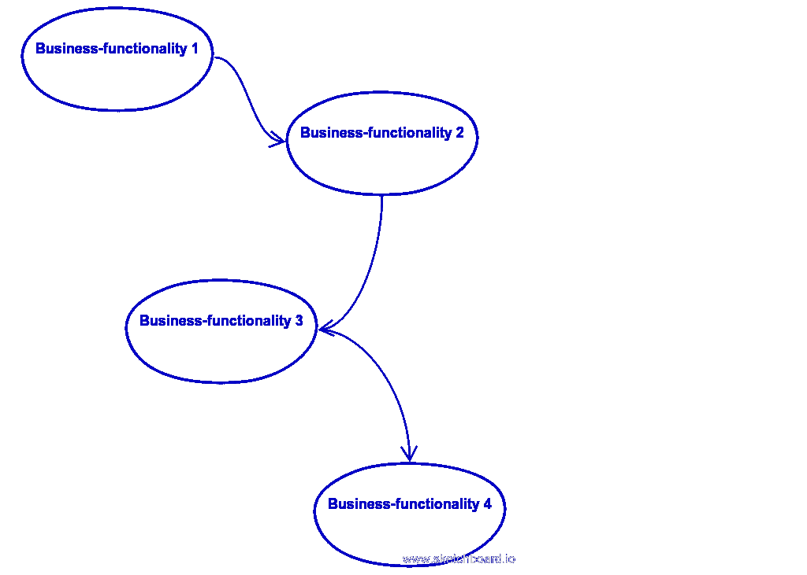
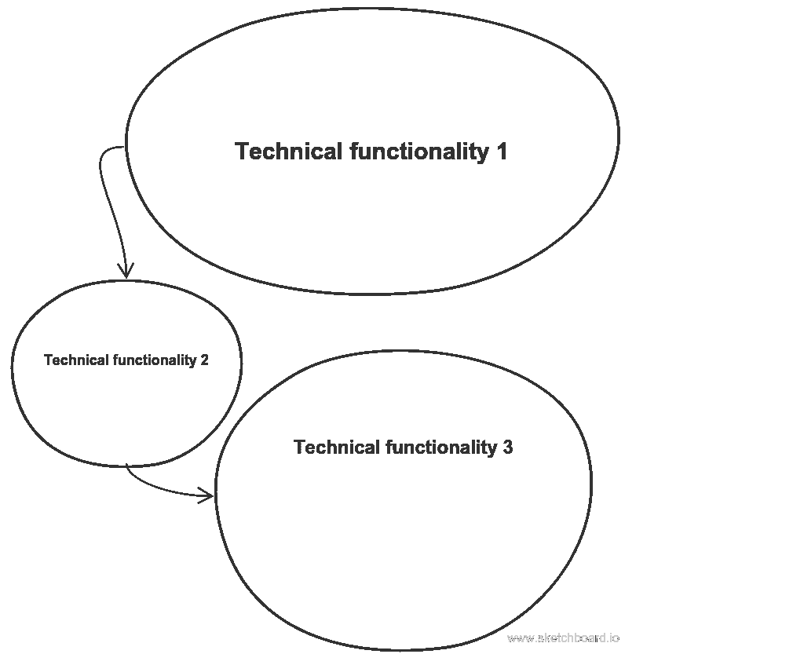
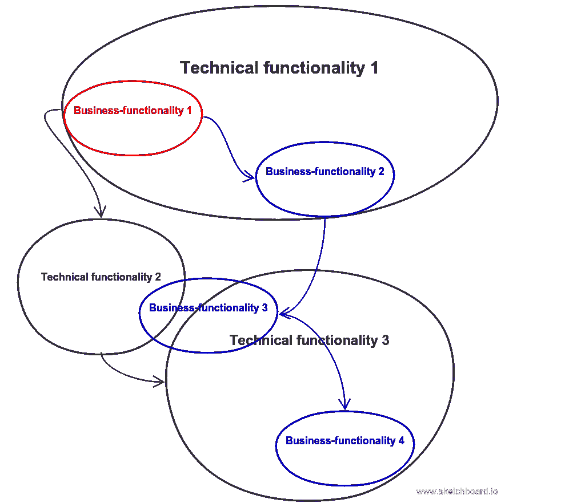
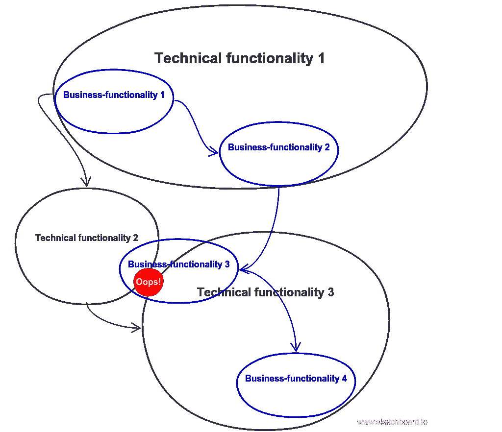

# 定义服务边界的错误方式

> 原文：<https://medium.com/hackernoon/wrong-ways-of-defining-service-boundaries-d9e313007bcc>

在上一篇文章中，我写道，要战胜复杂性，你需要分割整体。在这篇文章中，我将描述这样做的错误方法。我可以更进一步，称下面的方式为整体分割的反模式，或者服务边界定义的反模式。

## 错误重用

我见过的一个项目的开发人员设定的目标是使他们的服务尽可能可重用。部分服务是由他们在自己的领域中能够识别的所有名词定义的。这些服务的接口很粗糙:通过一些子句获取查询和更新。对应于原子和重用操作的逻辑位于与那些“名词服务”或“实体服务”通信的独立服务中。这种“操作服务”被用于与业务流程相对应的更高级别的服务中。他们也应该被重用，完成一个开发者的天堂。

这就是机票预订业务流程的样子:

Service composition in ticket booking process

现在我们来看看航班日期更改流程:

Service composition in ticket date changing process

在这些业务流程中,“重用”了两个操作服务。现在，让我们看看当遵循这种方法时，系统的静态造型是什么样子的:

Overall system service composition

那么这里有什么弊端呢？

1.  非常紧密的耦合。如果一个服务被改变，你需要测试整个系统。
2.  这种服务是非常细粒度的，因此有大量的内部交流。
3.  作为细粒度的结果，有许多服务。系统越来越难理解，查询越来越难追踪。
4.  实体服务封装得很差:没有检查任何业务规则，这个逻辑在操作服务中。因此，任何服务都可以调用任何实体服务，并使用其接口中的通用更新查询来更新其数据。这种类型的实体服务通常被称为以数据为中心，而不是以流程为中心、以行为为中心的服务。
5.  这些服务之间的通信本质上是同步的。所以选择的传输方式很可能是 http。因此，我稍后会谈到它的所有缺点。

这种拆分的目标是重用，但是在实践中，除了前面提到的问题，这种重用是行不通的。一旦服务“A”为多一个具有自己的需求和期望的客户提供服务，服务“A”就有可能需要一些改变。

反思一下你的代码，想想努力实现重用会导致多少问题。其实不少，以至于成了[谬论](http://udidahan.com/2009/06/07/the-fallacy-of-reuse/)。服务重用也是一种谬误。

我对 Sam Newman 在他的书[构建微服务:设计细粒度系统](https://www.amazon.com/Building-Microservices-Designing-Fine-Grained-Systems/dp/1491950358)中所写的内容感到有些担忧:

> 分布式系统和面向服务的架构的一个关键承诺是，我们为功能的重用提供了机会。借助微服务，我们可以针对不同目的以不同方式使用我们的功能。

我真的希望他不是指我刚才描述的建筑。或者至少我希望人们理解这些线条，这样就不会产生这样的架构。

## 模糊的服务责任

每个服务都必须有特定的责任，任何开发人员都应该知道并完全理解。否则，概念上的完整性就丧失了，而这是任何系统的主要特征，《T2》一书的作者 Frederick Brooks 认为。

但是责任并不总是清晰明了的。我认为有几个原因。

在谈论第一个之前，我应该提到什么是业务架构。下面是[维基百科](https://en.wikipedia.org/wiki/Business_architecture)所说的:

> **业务架构**被定义为“企业的蓝图，它提供了对组织的共同理解，并用于调整战略目标和战术需求。

换句话说，它是企业做什么，企业如何实现它，组织结构单元之间的通信路径是什么，它的驱动力是什么，它的业务规则、业务政策是什么。

因此，企业失去概念完整性的原因之一是模糊的业务架构。只是在这种情况下很难确定具体的服务责任。因此，应用了严格的技术方法，这很少有机会满足实际的业务需求。所以不可避免的导致服务责任模糊。

第二个原因是，IT 部门可能对业务架构一无所知，当然前提是它确实被定义了。这个常见问题是业务人员和 IT 人员之间沟通不畅的结果。

最后，IT 可能知道业务的长期计划和战略，但他们认为这无关紧要，不会影响技术服务的界限。

所有这些都与任何企业的圣杯背道而驰— [业务-IT 一致性](http://www.cio.com/article/3040867/it-industry/what-do-we-mean-when-we-say-business-it-alignment.html)。会有什么后果？

让我们来看看任何企业的首席执行官都能轻易在脑海中想象出的过于简化的形象。它代表了企业主要部分的沟通。实际上，有很多方法可以将业务架构可视化——我刚刚提到了其中的一种。

Business architecture

现在让我们来看看通过技术服务表达的 IT 架构:

显然他们的界限不一致。业务架构服务和 IT 服务有不同的基础数据、不同的驱动力、不同的功能和不同的通信路径。当(*当*，而不是【T2 如果)首席执行官说“业务-功能 1”所代表的功能将被外包时，会发生什么？因此，我们将面临拆分技术服务技术功能 1”的问题。

当我们需要在图像中标记的区域做一些改变时会发生什么呢？是的，就在两个技术服务的交界处？

这将导致“技术功能 2”和“技术功能 3”在这个领域紧密结合。最终，我们的分布式系统变成了一个分布式的整体。

## 具有同步通信的服务

当发送请求的服务等待接收请求的服务完成时，通信被认为是同步的(或阻塞的)。为什么不好？有一大堆问题。

**不可靠** 如果只有一个服务宕机，那么整个系统都会宕机。
人们甚至可以根据服务计数来计算系统变得不可用的次数——当然，如果不采取额外的措施，例如，网络错误没有被捕获，请求没有被完成。
让我们把包含 *N* 个服务的系统中一个服务宕机的概率设为 *P* 。所有服务都不停机从而系统正常运行的概率是*(1p)ᴺ*)。因此，至少有一个服务关闭的概率是*(1(1p)ᴺ)*。例如，当有两个服务时，即 *N = 2* ，包含 2 个服务的系统失败的概率和包含 1 个服务的系统失败的概率的划分为
*(1(1p))/P = 2p*。假设 P 很小，我们将得到系统不可用的次数是分裂前的两倍。一般来说，对于服务数量 *N* ，取决于服务数量的“故障率”函数看起来像*f(n)=(1(1p)ᴺ)/p*。
这里是它对于 *P = 0.01%* 的曲线图。如我们所见，对于可行的 *N* ，依赖性几乎是线性的:

Almost linear dependency of system “failure ratio” depending on the number of synchronous services

系统可能会以不一致的状态结束
这里有两种选择。你要么抗争，要么面对。如果你想打架，你可以使用分布式事务。

*分布式交易*

首先让我们来看看经典的事务— [两阶段提交](http://the-paper-trail.org/blog/consensus-protocols-two-phase-commit/)。以下是它的缺点:

**一个**。两阶段提交事务本质上是脆弱的。例如，交易的一个参与者可能会失败——此外，在两个阶段中的任何一个阶段。或者在协调者和其中一个参与者之间可能有一些网络问题。因此，分布式事务将挂起。你当然可以用超时来解决这个问题，但是如何选择呢？它不应该太小，因为交易需要一些时间来处理。它也不应该太大，因为我们不希望我们的整个业务操作挂起。所以这是两阶段提交事务的基本问题:不可能区分失败和长处理时间。

**b** 。可用性越来越低。如果其中一个子事务不成功，则整个事务也不成功。结果，企业经营也不成功。
甚至没有提到 2PC-coordinator 是单点故障。

**c** 。这是额外的操作复杂性。请询问您的系统管理员。

**d** 。网络通信正在发展。首先，因为与参与者数据库的通信要通过协调器。其次，根据定义，在分布式事务中有多个数据库。第三，任何两阶段提交事务显然都有两个阶段。因此，总吞吐量在下降，延迟在增加，这就产生了扩展问题:如果你不修改具体功能的运行方式( [Y 轴可伸缩性](https://www.amazon.com/Art-Scalability-Architecture-Organizations-Enterprise/dp/0134032802))——我的意思是你坚持 2pc，这个问题与分区或分割无关( [Z 轴可伸缩性](https://www.amazon.com/Art-Scalability-Architecture-Organizations-Enterprise/dp/0134032802))，那么你只剩下一个轴——克隆轴， [X 轴](http://microservices.io/articles/scalecube.html)。它在这里完全没有价值，无论您复制什么以及如何复制，延迟仍然存在。如果您购买一些昂贵的服务器，它可能会下降，但您无法通过 X-scaling 永远解决这个问题。

**e** 。资源锁在第一阶段获得，在第二阶段释放。因此，锁的生命周期是不使用分布式事务时的几倍。除此之外，2pc-coordinator 随时都可能失败。在第一阶段可能会失败。如果是这样，所有被锁定的资源将保持锁定状态。它可能会在第二阶段失败。在这种情况下，由于未提交事务而未被释放的所有资源也将保持锁定。锁是主要的可伸缩性问题之一，因为没有其他事务可以在锁定的资源上操作。让我们假设您有一个将某个资源锁定 100 毫秒的命令，因此此类命令的最大数量不能超过 10。进一步增加机器的数量没有任何意义。

为了公正起见，我应该提到分布式事务中使用的其他协议。此外，我将列出它们与 2pc 交易相比的优势。

如果使用 [3 阶段提交事务](https://en.wikipedia.org/wiki/Three-phase_commit_protocol)，任何参与者都可以完成分布式事务。因此，我们不用担心 2pc 事务中的主要问题——单节点故障块。这是通过使用一个额外的步骤，即预提交阶段来实现的。之后，所有的参与者都知道他们投票的结果。这样就解决了永远锁定资源的问题。这有利于可伸缩性，但由于有三个步骤，而不是两个步骤，延迟会增加。

但是在网络划分的情况下可能会出现问题。考虑这样一种情况，所有收到“准备提交”消息的参与者都在一个分区中，而所有没有收到该消息的参与者都在另一个分区中。每个分区要么提交事务，要么回滚事务。因为它们彼此不了解，所以有可能第一个分区中的事务提交，而第二个分区中的事务回滚，反之亦然。因此，系统的状态会不一致。

而 [Paxos](http://the-paper-trail.org/blog/consensus-protocols-paxos/) 就是解决这个问题的人。这是它与以前协议的不同之处:

**一个**。可用性更好。大多数参与者，而不是他们中的每一个人，会确认一个同意的消息就足够了。第二阶段也是如此。也没有单一的协调员。它给出了以下优点:
**b** 。没有永远锁定的资源。

[这里](https://www.quora.com/Distributed-Systems-What-is-a-simple-explanation-of-the-Paxos-algorithm)很好的描述了这三种类型的分布式协议。

此外，一些[工作](https://www2.eecs.berkeley.edu/Pubs/TechRpts/2015/EECS-2015-168.pdf)正在进行，旨在使用分布式事务提供高一致性的交换消息数量的最小化。

*补偿逻辑*

如果你不想处理分布式事务，你应该写请求重发逻辑，可能是[断路](https://martinfowler.com/bliki/CircuitBreaker.html)逻辑，最可能是回滚可用服务中发生的动作的逻辑。有可能在这种情况下，当您不依赖系统的弹性时，相反，您预计会失败，这种回滚逻辑将是业务驱动的。您将处理业务人员可以理解的错误，而不仅仅是像“服务不可用”这样的纯技术错误。

**同步通信是资源密集型的** 接收请求的第一服务等待第二服务的响应，第二服务等待第三服务的响应，等等。因此，只要其余服务完成它们的工作，第一个服务就会等待。如果某些服务变慢，情况会变得更糟。结果，由于可用资源刚刚用完，整个系统速度变慢，吞吐量急剧下降。

**昂贵的扩展** 因为通信是同步的，所以你需要扩展每一项服务。正如我在上一章中所展示的，在系统入口点接收请求的服务等待的时间最长，因此它们比其他服务更需要伸缩。

**分布式计算的 8 个谬误** 无论如何我都应该提到它，但我不会深究这个问题，我只是让 Arnon Rotem-Gal-Oz 发言，他做了[详细的评论](http://www.rgoarchitects.com/Files/fallacies.pdf)。

## 具有异步通信的服务

这种服务只解决同步通信固有的技术问题，如弹性和资源成本。但是也有一些比较严重的问题比如逻辑耦合。这与命令消息遇到的问题完全相同，让我在下一章中讨论这个问题。

## 具有命令消息通信的服务

所以希望我们已经发现通常用 http 实现的同步通信是不好的。让我们看看消息传递基础设施能提供什么。Hohpe 和 Woolf 在他们的书[企业集成模式](https://www.amazon.com/Enterprise-Integration-Patterns-Designing-Deploying/dp/0321200683)中谈到了三种消息:[命令消息](http://www.enterpriseintegrationpatterns.com/patterns/messaging/CommandMessage.html)、[事件消息](http://www.enterpriseintegrationpatterns.com/patterns/messaging/EventMessage.html)和[文档消息](http://www.enterpriseintegrationpatterns.com/patterns/messaging/DocumentMessage.html)。
命令消息传递缺乏同步通信的上述缺点，它非常接近那些习惯于它的人的心态。但是命令消息以及同步和异步通信有一个共同的问题:产生的服务是紧密耦合的。
当服务 A 告诉服务 B 做某事时，服务 A 显然知道服务 B。因此，如果服务 A 必须告诉服务 C 做一些工作，我们肯定必须修改服务 A。基于这种通信的本质，服务 B 在服务 A 的上下文中执行一些工作。因此，如果对服务 A 的需求会改变，那么我们也必须修改服务 B。
现在让我们假设服务 D 想要使用服务 B 的功能。但是服务 D 有自己的上下文和自己对服务 B 的要求，服务 B 很可能需要一些修改来满足服务 D 的要求。完成后，我们需要确保更改不会破坏服务 A 的功能。

## 集中式数据

有时，一个系统可能不像在“错误的重用”一章中那样采取不正当的形式，但在精神上是相似的。关键是，所有与某个概念(通常是类似名词的概念)相关的数据都位于一个地方，在一个服务中。试图去中心化它，把它放到操作这些数据的服务中，这些服务是这些数据的真正所有者，这被认为是恶意的。我经常听到有人说这违反了真理的单一来源原则。或者，“我为什么要拆分与一个概念相关的数据？”但是通常这些人甚至不知道他们在谈论什么，因为正确的服务边界识别原则仍然适用。稍后我会谈到这一点。不过现在让我们来看看这种方法的缺点:

*   当使用集中式数据更改服务逻辑时，您可能会破坏请求它的其他服务。通常有相当多的客户。
*   当一个服务负责大量服务的数据存储、创建、更新和表示数据逻辑时，复杂性达到了极限。
*   这些服务本质上是同步，因为它们经常用于数据提供。为什么这是我之前在“同步通信服务”一章中写的反模式。
*   很可能您需要在一个业务操作中更新几个实体。很有可能您最终会得到跨越几个实体的分布式事务，因此会得到几个服务。我之前也写过他们。
*   几乎是同一点——很可能您需要获得与几个实体相关的数据。并且它们很可能位于不同的服务中，这导致了闲聊式的交流。

我认为好的服务和好的课堂有共同之处。其中一个共同特征是[数据和行为放在同一个地方](https://martinfowler.com/bliki/AnemicDomainModel.html)。这导致随机数据突变不可能绕过类接口提供的行为。同样的原则也适用于服务。
通过集中我们的数据，我们粗糙化了服务的界面。我们将行为和它的数据分开，将一个集中的数据服务变成一个数据库。我们忽略了自 [Smalltalk](https://www.amazon.com/Smalltalk-Best-Practice-Patterns-Kent/dp/013476904X) 时代以来建立起来的复杂的系统设计最佳实践，这使我们自己注定要陷入程序性编程的地狱，但这是系统范围的。

一个生动的例子，这种系统的边缘情况是一个整体。通常一个概念在一个数据库表中的一个类中表示。因此，当您需要改变同一个数据库记录时，有许多独立的场景——物理上，但不是逻辑上，相同的数据单元。在一个所有东西都交织在一起的庞然大物中，这可能会很快失去控制。这导致鳞状贫血。无论您添加多少应用程序节点，添加多少数据库实例，都没有任何意义，因为某一部分数据被锁定，并且无法并行处理请求。

## 服务编排

编排服务看起来像一个有很多依赖项的类，但是每个依赖项只有一个实现——被调用的服务本身。因此，该服务与所有与之交互的服务紧密耦合，从而产生闲聊式的通信，很可能是用同步请求-应答实现的。

当这个管理机构编排的服务数量增加到 10 个时，会发生什么情况呢？二十？一百？商业逻辑不可避免地会出现漏洞。这个能力中心决定调用什么服务以及何时调用的事实已经说明了这一点。我们真的需要这样一个错误成本太高的复杂服务吗？能把整个系统搞垮的错误！从另一方面来说，如果我们故意使它简单，完全没有业务逻辑，那么应该问的问题是——我们需要它做什么？因此，我们发现自己陷入了一个第二十二条军规的困境。

除此之外，逻辑不可避免地分布在两个服务上:中央管理服务和被调用服务，因为我刚才提到了一个问题—它们之间的同步通信性质。例如，如果发生这种情况(顺便说一下，很有可能),你需要增加一些服务，你必须改变能力中心。[这里的](https://martinfowler.com/eaaDev/EventCollaboration.html)就是一个很好的证明。

实际上，这样的计划就像我的[智能管道](https://martinfowler.com/articles/microservices.html#SmartEndpointsAndDumbPipes)——马丁·福勒反对的那种沟通方式。毕竟，这种服务的唯一目的是消息路由，但是根据定义，它包含一些逻辑。不太好。

我让[Nic Ferrier](http://nic.ferrier.me.uk/blog/2013_12/what-is-service-choreography)在编排棺材上敲下最后一颗钉子。

## 全系统[有限状态机](https://en.wikipedia.org/wiki/Finite-state_machine)

通常这种方法与编排密切相关。重点是定义一个单独的服务来跟踪某个实体的状态，或者一堆实体的状态。所以这个服务知道当前实体的状态。它知道什么状态可以是下一个状态，什么状态不可以。因此，这种服务的行为是改变实体状态，作为对入站请求的反应，无论它是同步的还是异步的，是消息还是事件。因此，所有其他服务都执行由 FSM-service 发起的工作，并在完成时通知它——而不是遵循所有可能的实体状态本身的某个子集。
有时*真的*接近于编排，所以我对这类服务使用的另一个名称是系统范围的[流程管理器](http://www.enterpriseintegrationpatterns.com/patterns/messaging/ProcessManager.html)或系统范围的工作流。

这种方法经常与我在“错误的重用”一章中给出的例子相结合，在“错误的重用”一章中，部分服务是由名词定义的，在“集中式数据”一章中，这种集中式数据服务可能是一个全局有限状态机，或者是一个全局流程管理器。

我假设在一天结束时，正确的系统边界可以采取接近前面提到的形式。但是从这个角度出发*开始*识别服务边界是绝对错误的。

## 沿着组织结构定义服务边界

只有当这个[结构有明确的职责](http://udidahan.com/2014/05/26/people-politics-and-the-single-responsibility-principle/)时，使用组织结构来寻找服务边界才有意义。一方面，创建了一个组织结构来有效地解决业务问题。另一方面，往往是自负的人的私利干扰，出现一帮对立的帮派，发生暗箭伤人，阴谋无处不在，等等，也就是说，这是政治。此外，业务单位可能会发生变化，一些新的单位可能会出现，一些可能会被淘汰，而组织结构通常保持不变或变化速度较慢。此外，一些业务可以外包。因此，基于这种脆弱的、不断变化的特征的服务边界是不稳定的。

考虑到这一点，我们不应该从盲目地沿着组织结构定义我们的服务边界开始，尽管它可以给我们一些线索。

牢记[康威定律](http://www.melconway.com/Home/Conways_Law.html)，用它为你自己谋福利。了解你的领域，确定它的沟通途径，如果你需要并且可以的话，改变一个组织结构。就这样吧，只有在这之后，才能根据组织结构定义您的服务边界。

## 围绕图层定义服务

拆分服务的主要目的是降低整个系统的耦合度。首先，如果我们将我们的系统划分为不同层次的服务，我们不会降低它的耦合度:服务之间的通信量不会改变，但它会通过网络进行。其次，从组织结构的角度来看，这似乎并不明智:如果你想在 UI 表单中添加一个字段，你可能需要修改所有的层:UI 本身、控制器、业务逻辑和数据存储。现在，假设您的团队围绕服务保持一致(如果服务边界正确，这是一个好主意)，考虑跨团队沟通的数量和误解的可能性。意义重大。

一般来说，类和服务必须拥有的主要特征是相同的:它们都应该是松散耦合和高度内聚的。因此，假设层的固有紧密耦合，我甚至不会试图将它们分开。试图分割不可分割的部分是没有意义的。想代替[的垂直切片](http://blog.christianposta.com/microservices/carving-the-java-ee-monolith-into-microservices-perfer-verticals-not-layers/)。按照这种方法，您可以获得包含所有层的内聚功能，从 UI 到数据存储。

## 摘要

*   不要一开始就想着重用。
*   了解你的领域。
*   不要做同步交流。如果你认为你真的需要它，很可能你的界限是错误的。
*   不要做异步通信。
*   不要做命令消息通信。
*   不要把你的数据集中起来。
*   不要编排你的服务。
*   不要在头脑中用有限状态机来定义你的边界。
*   不要相信一个组织结构，它可能有缺陷。
*   不要围绕图层创建服务。

为了理解您应该使用什么标准来定义您的服务边界，我将首先讨论我希望我的服务拥有的特征。不要错过我的[下一篇](/@wrong.about/what-characteristics-my-services-should-possess-ca22294bbea6)。