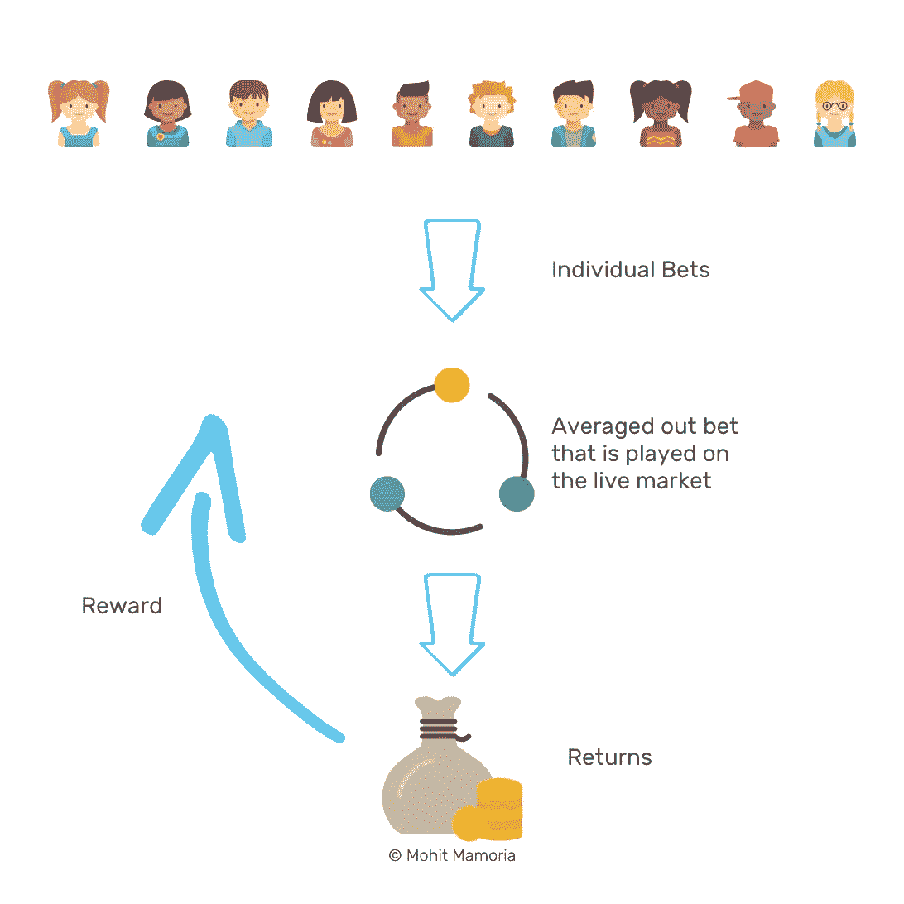

# WTF 是分散式对冲基金？

> 原文：<https://medium.com/hackernoon/wtf-are-decentralized-hedge-funds-e8f628d51700>

## …就好像传统对冲基金很容易理解一样。

B **锁链，加密货币，交易，采矿。**其中，一个新的热门词汇开始出现——对冲基金。这个通常出现在金融市场的术语已经出现在科技领域。工程师们在建立、管理和扩大所谓的对冲基金。它们被推荐为投资加密资产的最佳方式。我们剩下的问题是——“什么是对冲基金，如何挑选好的对冲基金？”让我们找出它。

> 顺便说一下，我是每周时事通讯的编辑， [Unmade](https://unmade.email) ，它将一个创业想法发送到你的收件箱。

# 首先，什么是对冲基金？

> 这是一种投资工具。

**抛开法律部分，**你可以把对冲基金想象成各种比例的资产池，由被称为基金经理的人管理。股票市场中一个典型的对冲基金为几家公司管理各种证券，以创建一个总池。

因为资产池是多样化的，这意味着没有一种资产占主导地位，所以风险会降低。换句话说，风险被对冲，因此，名称。

# 所有的对冲基金都一样吗？

> *大多数情况下，所有成功的对冲基金都建立在基金经理对市场的独特洞察力之上。*

这让他们能够利用以前没有人利用的某个市场机会。在这个市场机会的基础上，对冲基金可以吸引投资者将他们辛苦赚来的钱交到基金经理手中。

两家对冲基金的不同之处在于，它们都有独特的洞察力，以及基金内部的决策过程。

# 决策过程是否不止一个？

> *是的，两个。传统的和分散的。*

对冲基金的标准决策策略是雇佣聪明人，把他们放在一个房间里，让他们在市场上下注。

每个人在市场上都有自己的赌注，根据自己的决定，基金的价值会上升或下降。这些决策者(或基金经理)的可变激励与他们为基金带来的回报成正比。

一个一贯做出正确决策的经理比一个经常下错注的经理赚得更多。这是对冲基金做出决定的传统方式。平均而言，一家对冲基金雇佣 200 至 250 名基金经理来管理基金和投资者的资金。

这样的基金，和基金雇的 200 个人一样好。我们中聪明的人开始问，“200 人够吗？我们能大规模利用人们的智慧吗？”答案导致了决策的分散形式。

# 分散决策是如何运作的？

> 分权之风并没有影响对冲基金的管理。

**区块链告诉我们**如果可以有一种协议或方法将大量陌生人组织在一起，并有适当的激励来促进网络中正确的行为，那么一个组织就不必局限于它可以雇佣的少数人。

对冲基金的分散决策是设计这种协议的一个很好的例子。简单地说，看起来是这样的:

这个过程始于数百人，甚至数千人根据他们自己对市场的研究来投票。然后，对冲基金在特定时期内在实时市场上进行每一项单独的押注。一旦这段时间过去，赌注将根据他们的回报进行评估。然后，参与者根据他们的赌注回报获得相应的奖励。

# 分散决策看起来如此简单。真的这么简单吗？

> *基础经济学就是这么简单。*

然而，细节决定成败。像所有传统的对冲基金一样，分散的协议也必须在一个别人很难重复的独特市场机会上运行。

这里有一些有趣的例子，比如[numeri](http://numer.ai/)，用一个协议来组织数据科学家，或者 [**God Token**](https://godtoken.org) ，用它的分散协议来组织成千上万的矿工。

尽管在现实世界中，分散协议可能没有这么简单，但就我们的目的而言，这就是分散对冲基金的工作方式。

除了技术之外，经济因素也推动了这一协议的每一步。

# 分散决策必须具备哪些经济因素？

> *我们可以将相关的经济学分为三个部分——网络效应、参与和报酬分配。*

**让我们逐一破解**。

## 网络效应

向全世界开放任何决策的唯一目的是吸引大量的人参与进来。网络效应意味着随着更多人的加入，系统会变得更好，必须成为整个经济模式的一部分。

经济学的设计不能让参与者开始将彼此视为竞争对手。如果出现这种情况，他们将试图让新进入者难以进入，并努力排挤现有的进入者。没有人希望出现这种情况——无论是基金组织还是投资者。

理想的经济学应该是当前的参与者邀请更多的参与者加入网络。如果不是完美的，一个不会让一个成员与其他成员竞争的经济学也是可行的。

## 参与

说到网络，网络中没有两个成员是平等的。每个成员都有不同的贡献，这就是他们应该得到的待遇。

一个流行的想法是维护网络中每个参与者的声誉，并根据他们的声誉对他们的投票(赌注)进行评估。与具有较低声誉的成员相比，具有较高声誉的成员将为他/她的赌注获得更多权重。一个零信誉(或者最低门槛)的等于没有。

另一个流行的想法是允许每个参与者在下注的同时下注一部分赌注(收入)。他们赌注的大小将直接反映出他们对自己的赌注有多有信心。如果一个赌注收益率返回一个积极的结果，一个把它的人将得到奖励。如果为负，他/她下注的金额将被销毁。

赌注越高的赌注可能会被赋予更多的权重，因为这意味着参与者不只是随机猜测。

## 奖励

正如没有两个成员是平等的，也没有两个奖励是平等的。奖励可能是参与者的声誉、他/她下注的赌注或他/她的赌注产生的回报的函数。

—

***关于作者***

[https://twitter.com/mohitmamoria](https://twitter.com/mohitmamoria)

*莫希特·马莫里亚是*[***【godtoken.org】***](https://godtoken.org)*的首席执行官，也是一份每周时事通讯*[*un made*](https://unmade.email)*的编辑，将一个来自未来的创业想法送到你的收件箱里。他定期为世界上最大的出版物撰稿，包括 HackerNoon、TechCrunch、TheNextWeb、CoinTelegraph 等。*

*有反馈吗？莫希特在推特上可用***。**

**这个故事最早出现在 CoinTelegraph* *上* [*。*](http://— About the author  Mohit Mamoria is the CEO of godtoken.org and editor of a weekly newsletter, Unmade, which delivers one startup idea from the future to your inboxes. Have feedback? Mohit is available on Twitter.)*