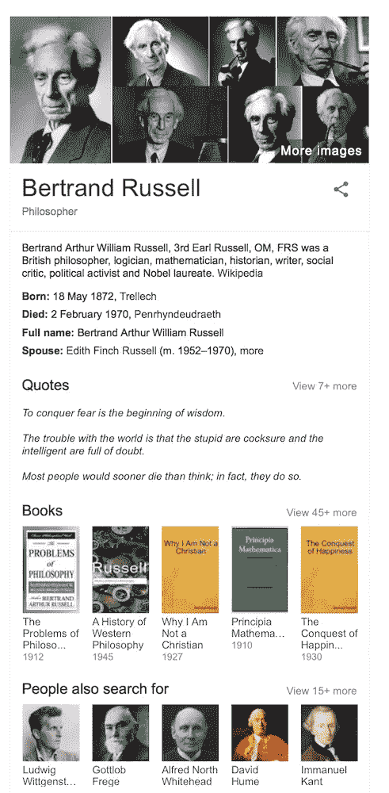
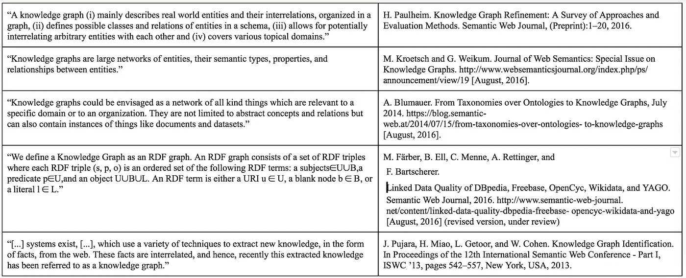

# WTF 是知识图？

> 原文：<https://medium.com/hackernoon/wtf-is-a-knowledge-graph-a16603a1a25f>

## 解开术语的纠结，总结出它的语义、智能和活力。

“[Uncertain Journeys](http://www.blainsouthern.com/exhibitions/2016/uncertain-journey)”. [Photo by designmilk on Flickr](https://www.flickr.com/photos/designmilk/29887952246). [CC BY-SA 2.0](https://creativecommons.org/licenses/by-sa/2.0/)

我在科技行业工作了 20 年，其间发生了很多变化。但是有一件事没有发生，那就是那些不熟悉的术语被使用、滥用和误用，通常是在一系列不同的上下文中。如今，[查找新行话的定义](https://sidewaysdictionary.com/)比以往任何时候都容易，但是，我偶尔会碰到一个短语，让我陷入[谷歌](https://hackernoon.com/tagged/google)搜索和打开浏览器标签的循环中。一些短语似乎无法清晰描述:我已经在之前的一篇文章[中介绍过“本体论”。](https://blog.grakn.ai/what-is-an-ontology-c5baac4a2f6c#.9l6kxiu1x)

在这里，我的目的是简化另一个这样的例子。你可能也听说过“知识图表”这个词，并求助于谷歌来寻找它的含义。你解决过吗？如果没有，请继续阅读。一切都会得到解释…

# 谷歌的知识图谱

一个肤浅的搜索将提供关于一个单一产品的信息:谷歌知识图，它增强了谷歌搜索的结果。它是结果页面右侧的框(移动设备上搜索的顶部)。

The output of Google’s Knowledge Graph following a search for Bertrand Russell

在 2012 年的知识图谱介绍中，谷歌宣布

> “…我们一直在研究一种智能模型，用极客的话来说，就是一种“图形”，它能够理解现实世界中的实体及其相互关系:事物，而不是字符串。”

关于谷歌的知识图谱到底是如何工作的，没有官方信息，但它利用了维基百科等公共资源，也收集了人们在网上搜索的数据。到 2016 年底，它[显然](http://www.theverge.com/2016/10/4/13122406/google-phone-event-stats)包含了 700 亿个关联事实。

# 知识图没有单一的定义

回到搜索知识图的一般定义，而不是搜索谷歌同名产品的信息。维基百科没有关于这个主题的页面，但是有链接:

*   它的[本体页面](https://en.wikipedia.org/wiki/Ontology_(information_science))，复杂得令人痛苦
*   一个关于语义网络的页面…我们甚至不去那里。

那么，知识图是关于关联数据和语义技术的东西…某种基于图的知识表示？但不清楚这是什么，也不知道我能用它做什么。

幸运的是，其他人最近也注意到缺乏一个明确的定义。一篇[最近的论文](http://ceur-ws.org/Vol-1695/paper4.pdf)指出有几个描述，并且很有帮助地将它们列表:

From “[Towards a Definition of Knowledge Graphs](http://ceur-ws.org/Vol-1695/paper4.pdf)”.

好的。相当大的范围——从相当透明到完全不透明。在同一篇文章中，在概述了上述各种定义之后，作者接着提出了知识图的以下定义，强调推理是一个关键特征:

***知识图获取信息并将其集成到本体中，应用推理机导出新知识。***

# 消化不良？

有可能让这个定义更清楚吗？让我们看看在上面不同定义的表格中看到的共同因素，看看这是否会导致对“知识图”的更深入理解。

## 这是一个图表

这是术语知识**图**和知识**库**之间的主要区别。这些术语可以互换使用，但不一定是同义词。虽然每个知识图都是一个知识库，或者使用一个知识库，但关键在于“图”这个词。

知识图被组织成图[和图](https://en.wikipedia.org/wiki/Graph_(abstract_data_type))，这并不总是适用于知识库。图表的主要好处是数据中的连接(关系)是一等公民，当新数据项被注入到数据池中时，您可以轻松地连接它们，最后，您可以轻松地遍历链接以发现域中的远程部分如何相互关联(链接信息有巨大的价值)。图是最灵活的正式数据结构之一，因此您可以使用通用工具和管道轻松地将其他数据格式映射到图。

## 这是语义

术语警报！对于“语义”，我的意思是数据的*含义以本体的形式与图中的数据一起被编码。知识图是自我描述的，或者简单地说，它提供了一个单一的地方来查找数据*和*了解它的全部内容。*

还有一个额外的好处是，您可以使用熟悉的领域词汇表，以更接近自然语言的方式提交查询。也就是说，数据的含义通常用实体和关系名称来表示，这些名称是对给定领域感兴趣的人所熟悉的。这实现了更智能的搜索、更高效的发现，并缩小了数据提供商和消费者之间的沟通差距。

## 很聪明

知识图的基础是本体，它规定了数据的语义。本体通常基于逻辑形式，支持某种形式的推理:允许隐式信息从显式断言的数据中导出。一些推断出来的信息很难被发现。

从正确的数学意义上来说，知识图是实际的图，允许应用各种图计算技术和算法(例如，最短路径计算或网络分析)，这些技术和算法为存储的数据增加了额外的智能。

随着时间的推移，它们很容易扩展，因为模式不像 SQL 那样严格或禁止，这就把我们带到了最后一点…

## 它是活的

正如我已经描述过的，知识图具有灵活的结构:随着新数据的到来，本体可以被扩展和修改。如果您有定期更新和数据增长很重要的用例，特别是当数据来自不同的异构源时，这使得在知识图中存储和管理数据变得很方便。知识图可以支持持续运行的数据管道，不断向图中添加新知识，并在新信息到达时对其进行提炼。

知识图还能够捕捉各种元数据注释，如出处或版本信息，这使它们非常适合处理动态数据集。现在越来越需要说明数据的来源并将其包括在内，以便消费者能够从可信度和可信赖度方面对知识进行评估。知识图可以回答它知道什么，以及它如何和为什么知道它。

# 我为什么要使用知识图表？

一些潜在的应用包括:语义搜索、自动欺诈检测、智能聊天机器人、高级药物发现、动态风险分析、基于内容的推荐引擎和知识管理系统。如果像我一样，你的首选学习方式是一头扎进去，亲自尝试，那么这里有一个使用 [GRAKN 的知识图表平台的](https://grakn.ai)[潜在项目](https://grakn.ai/pages/documentation/examples/projects.html)列表。AI 。

GRAKN。AI 是一个知识图形式的数据库，它使用机器推理来简化 AI 应用程序的数据处理挑战。它灵活地存储数据，并以一种允许机器在其关系的完整上下文中理解信息的含义的方式存储数据。查看 [GRAKN。AI](https://grakn.ai) 了解更多信息。

# 摘要

好了，我已经在术语上开辟了一条道路。我认为，关于知识图表，需要注意的要点是:

**咄——这是一个图表**。关系是一等公民，数据之间的链接增加了巨大的价值和灵活性。

**它是语义的**或者自我描述的，有一个类似自然语言的表示，使得查询和探索变得容易。

**很聪明**。推理可以揭示对人类认知来说过于复杂的隐藏知识，而作为一个图形意味着您可以应用各种图形计算技术和算法。

**它还活着**。您可以使用知识图以易于重用的形式存储信息。

让我知道你认为我在消除困惑方面做得如何…以及我下一步应该做什么！

非常感谢我在 [GRAKN 的同事。AI](http://ceur-ws.org/Vol-1695/paper4.pdf) 帮助我写这篇文章，特别是 [Szymon Klarman](https://medium.com/u/38bb887e3940?source=post_page-----a16603a1a25f--------------------------------) 帮助我找到一条通过概念和难词的路径。

