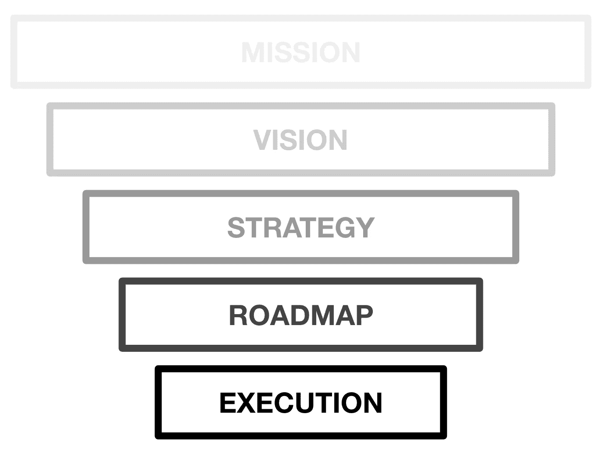
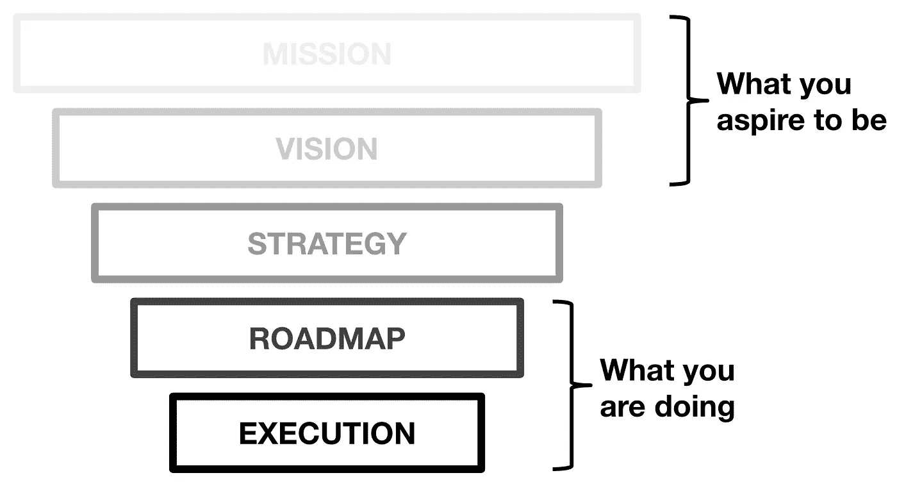
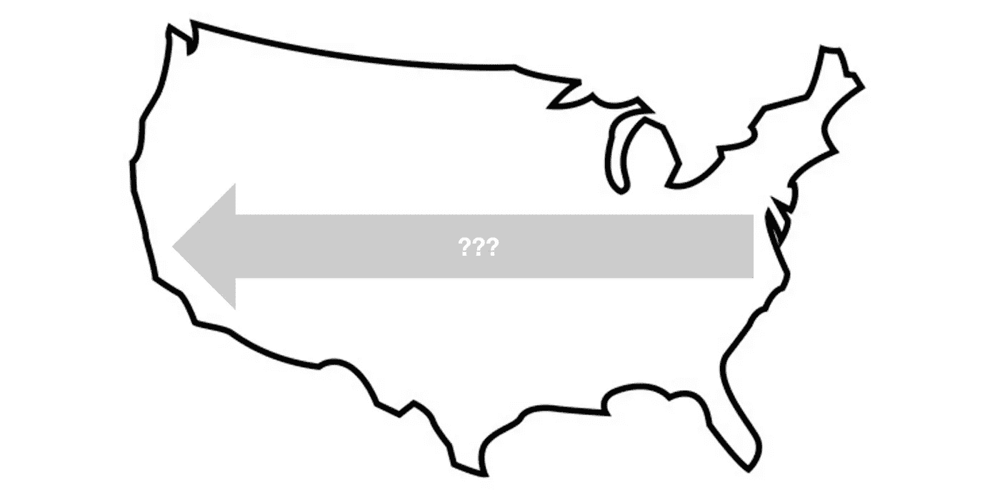
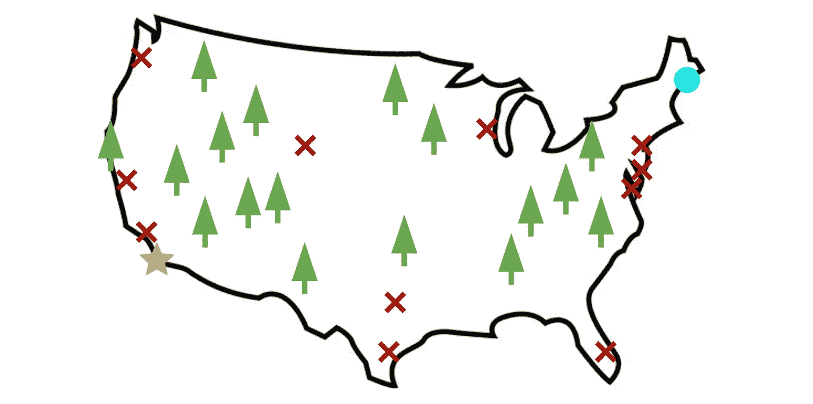
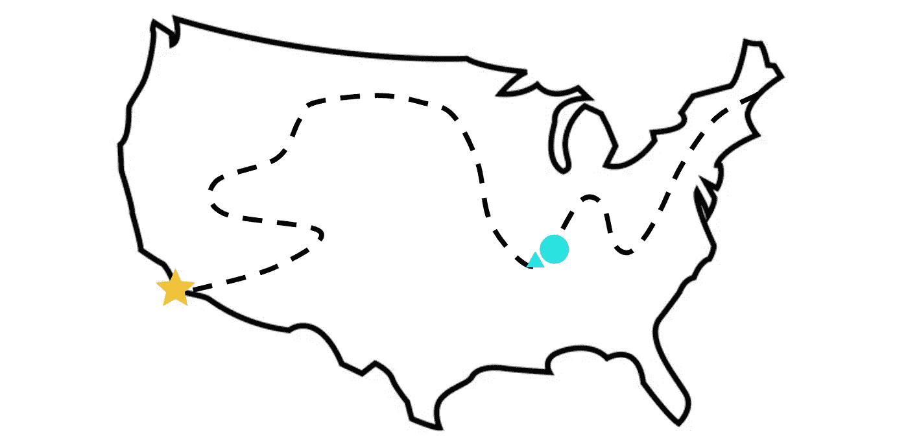
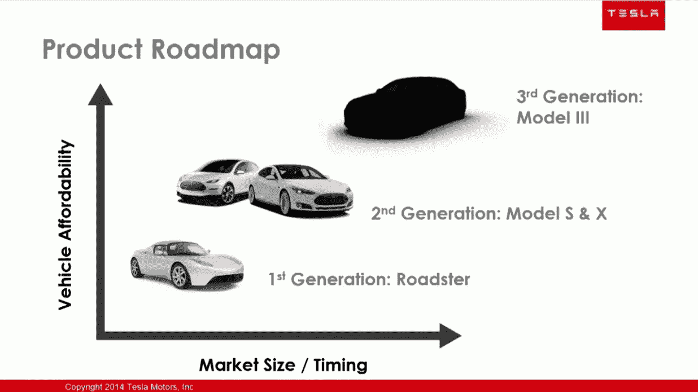
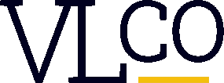

# WTF 是战略？

> 原文：<https://medium.com/hackernoon/wtf-is-a-strategy-bcaa3fda9a31>

## 通俗易懂的战略入门

*也看看这个我为大会写的关于* [*产品愿景*](https://www.vincelaw.co/blog/beginners-guide-to-product-vision) *！*

“策略”——人们喜欢用这个词来强调自己的重要性。“我们需要一个策略…”或者“策略是什么？”一位高管可能会说。房间里的每个人都点头表示同意。“是的，我们需要一个更好的策略。”除了一半的人不能描述什么是策略或者如何得到一个策略。

玩笑归玩笑，策略其实很重要。

对于那些不经常思考或没有接触过很多的人来说，战略往往往好里说是令人困惑，往坏里说是令人畏惧。由于其抽象的本质，策略也很难教授和传授给别人。

# 战略思维(的缺乏)对团队和个人的(负面)影响

战略思维通常是团队中高层成员区别于低层成员的地方。在一个人的职业轨迹中，我观察到获得“战略思维”技能是一个人经历的最大飞跃(即思维转变)之一。

对于一个产品经理来说，你可以非常擅长战术性的东西:需求收集，优先级排序，冲刺管理。然而，如果你不能战略性地思考，你将会在开发长期产品愿景、回避[功能工厂](https://hackernoon.com/12-signs-youre-working-in-a-feature-factory-44a5b938d6a2)以及获得管理层对新产品创意的认同时受到阻碍。这可能会妨碍你成为高级产品经理或产品负责人。

另一方面，如果你正在管理一个由缺乏战略思维技能的相对初级的员工组成的团队，你将被留下来填补空白。这变成了一个重复的循环:a)承担为团队制定 100%战略的负担，b)验证(甚至更糟，事后批评)每个人的决定，和/或 c)提醒团队走出杂草，只见树木不见森林。

前一种情况和后一种情况我在自己的工作中都经历过。为了努力训练和转变团队，使其更具战略性，我开发了一个简单的**框架**以及附带的**类比**和**示例**来帮助这个抽象概念变得更加清晰和具体。

# 框架

在我们谈论战略之前，它需要放在其他一些概念的背景下，主要是因为战略从来不会孤立地存在(或者不应该存在)。以下是从以产品为中心的角度对不同组件的高级定义:

*   任务:这是一个描述你着手解决的问题的陈述，通常包括你在为谁解决这个问题。这通常在公司级别设置，但也可以为产品或产品线定义。
*   **愿景:**这是一个理想化的解决方案，可以解决你在任务中提出的问题。一个产品愿景通常有足够的可行性，但仍然缺乏可能妨碍你想象的细节。产品愿景也是你的产品的目标和凝聚点——它描绘了你的产品将如何产生影响。
*   **战略:**这是一套原则和决策——由现实(如市场力量、物理定律、数据)决定，并附有假设——你在发展之前承诺，以确保最大可能地成功实现你的愿景。随着新数据的引入，您的策略可能会发生变化。如果在使命和愿景保持不变的情况下，战略发生了重大转变，这被称为**转向**。
*   **路线图:**这是您的战略在实现产品愿景的具体步骤中的体现，包括粗略的里程碑和时间表。这也经常随着新数据的出现而改变。(正如我喜欢说的，路线图一经发布就失效了。)
*   **执行:**这是沿着路线图路径的日常活动。这是您努力构建、启动和迭代的地方，同时收集必要的数据来通知您的路线图和策略中的任何更改。

正如上图的坡度和大小所暗示的，这个任务，从设计上来说，既模糊又宽泛。在堆栈中越往下，这些概念就变得越具体和狭窄。

这一框架内的战略弥合了**你渴望成为的**和**你正在做的**之间的差距。

换句话说，**战略代表了您的路线图和执行任务的一套指导原则，以确保它们符合您的使命和愿景。**

还是太模糊？让我们将这个框架应用于一个类比。

# 类比

假设你正在计划一次公路旅行。以下是上述每个概念的分解方式:

*   任务:穿越美国大陆从大西洋到太平洋的公路旅行。

在这个阶段，你有一个非常高级的“问题”，需要一个“解决方案”，但是有很多不同的方法来解决这个问题。

*   视觉:驾驶一辆斯巴鲁森林人从缅因州的波特兰到加利福尼亚州的圣地亚哥。

现在你对公路旅行会是什么样子有了一个更清晰的想法。使用一些关键的描述词，如“斯巴鲁森林人”、“波特兰、缅因州”和“圣地亚哥”，你可以开始描绘一幅旅行的脑海画面，使之具有关联性(例如，为了说服某人加入你的旅行)。然而，我们仍然没有完全准备好开始驾驶。

*   **策略:**设计一条在大城市时间最短，在国家公园时间最长的路线。如果可能的话，也尽量用最直接的路线省时省油。

如你所见，策略是你在旅程开始时为构建路线而做出的决定，但你也在等式中注入了约束和偏好。由于种种限制，你的资源(时间、油钱等)有限。).就个人喜好而言，你希望看到大自然(毕竟你是在斯巴鲁森林人里)。通过上面的类比，你已经有效地将你的偏好置于你的约束之上。事先就策略达成一致还可以让你和你的旅行伙伴使用共同的基线来讨论任何[未来的](https://hackernoon.com/tagged/future)调整。

*   **路线图:**这是你的路线图，是你公路旅行路线的文字地图。

有了明确的策略，你现在可以计划你的路线，对你在任何给定的时间点将会在哪里有非常具体的期望。这也是你可以选择你想要计划的详细程度的点——从你想要每天走的大概英里数(敏捷速度有人吗？)到你想要用餐的确切地点和时间。注意你越具体，你就越有可能调整你的计划。

*   **执行:**这是公路旅行的实际驾驶。

在这一点上，你使用你的路线图作为你的指南，并定期检查，以确保你仍然在正轨上。如果在行驶过程中发生了一些事情(例如因雪封路)，你可以重新审视和调整你的路线图(绕道)，也许还可以增加或调整你的策略(避免通过海拔较高地区的小路，即使它会带我们进入一个城市)。

这里有一个有趣的观点:没有策略，你绝对可以开始驾驶**。然而，就像在没有战略的情况下开发一个产品一样，你将会花更多的时间去摸索，也许是回溯，在时间限制下做出重大决定，以及与你的旅行伙伴产生分歧。当然，一些自发性确实会非常有趣和令人兴奋。然而，如果你去旅行时没有策略，你几乎肯定会在旅途中招致一些费用(双关语)。**

# 这个例子

将这个框架移回到产品世界，我想用**特斯拉**提供一个相关的具体例子。我选择特斯拉是因为 a)埃隆·马斯克是 [rad](http://waitbutwhy.com/2015/05/elon-musk-the-worlds-raddest-man.html) ，b)马斯克和特斯拉在他们的战略上异乎寻常地[公开](https://www.tesla.com/blog/secret-tesla-motors-master-plan-just-between-you-and-me)和[透明](https://www.tesla.com/blog/master-plan-part-deux)，c)特斯拉是一个少有的将战略执行到底的公司范例(双关语也是有意的)。这使他们进入了一个几乎难以置信的神圣领域。

*   [**使命**](https://www.tesla.com/about)**:***特斯拉的使命是加速世界向可持续交通的转变。*(这是最近[特斯拉与 SolarCity 合并时更新的](http://www.sciencealert.com/tesla-just-updated-its-mission-statement)。)
*   [**愿景**](https://www.tesla.com/blog/secret-tesla-motors-master-plan-just-between-you-and-me) **:** 概括来说，特斯拉的愿景是通过电动汽车的问世来降低汽车碳排放。
*   [**策略**](https://www.tesla.com/blog/secret-tesla-motors-master-plan-just-between-you-and-me) **:** 这是著名的“总体规划”:“1)造跑车，2)用那笔钱造一辆价格实惠的车，3)用*那笔*的钱造一辆更实惠的车，4)在做上述事情的同时，还提供零排放发电选项，最后 5)不要告诉任何人。

你可以看到特斯拉和马斯克制定的战略有一些内在的限制:a)产品开发的成本/风险，b)产品成本与采用。马斯克知道他需要用一款小型、昂贵、利基电动跑车来证明可行性(MVP)。然而，焙烧者只需要创造足够的收入来继续完成使命和愿景，将所有收入投入到公司，以逐步制造更实惠和大众化的汽车。

Courtesy of Whoever Leaked This From Tesla

不幸的是，虽然我们不知道他们确切的 [**路线图**](https://image.slidesharecdn.com/dardenschoolofbusiness-teslastrategicanalysis-131011125457-phpapp02/95/darden-school-of-business-tesla-strategic-analysis-5-638.jpg?cb=1381496189) ，但很明显，他们的**执行**一直相当顺利，这从他们的汽车[产量](https://en.wikipedia.org/wiki/Tesla,_Inc.#Production_and_sales)和[预购需求](http://bgr.com/2016/10/18/tesla-model-3-reservations-delivery-mid-2018/)就可以看出。

# 橡胶与路面相遇

你可能会问:这些工作都是谁做的？根据你所处的水平，你可能已经完成了这些活动中的许多或大部分。以下是从事这些组件工作的人员的一些典型示例:

*   **使命**:首席执行官、产品副总裁、执行团队、董事会
*   **愿景:**产品副总裁、产品管理总监、高级/首席项目经理
*   **战略**:产品副总裁、产品管理总监、高级/首席项目经理、项目经理
*   **路线图**:高级/首席项目经理、项目经理，可能还有助理项目经理
*   **执行:**高级/首席项目经理、项目经理、副项目经理

如果你是一名项目经理，你对公司的**使命**或产品的**愿景**缺乏了解或认同，那么你必须自己开发一个并获得认同，或者请你组织内的领导来阐明它们。

也就是说，除非你还处于职业生涯的早期，否则你应该一直努力进行战略性思考。

我希望这是对那些战略新手有用的入门读物！

对于那些精通策略的人，我也希望这能给你一个将你的经历联系在一起的结构，并允许你与你的团队和同事分享这一点，作为实现共享词汇的一种手段。

有兴趣了解更多吗？在[vincelaw.co/blog](https://www.vincelaw.co/blog)查看我的博客，在[订阅](https://www.vincelaw.co/subscribe)在你的收件箱里接收更新！

> [黑客中午](http://bit.ly/Hackernoon)是黑客如何开始他们的下午。我们是 [@AMI](http://bit.ly/atAMIatAMI) 家庭的一员。我们现在[接受投稿](http://bit.ly/hackernoonsubmission)，并乐意[讨论广告&赞助](mailto:partners@amipublications.com)机会。
> 
> 如果你喜欢这个故事，我们推荐你阅读我们的[最新科技故事](http://bit.ly/hackernoonlatestt)和[趋势科技故事](https://hackernoon.com/trending)。直到下一次，不要把世界的现实想当然！

