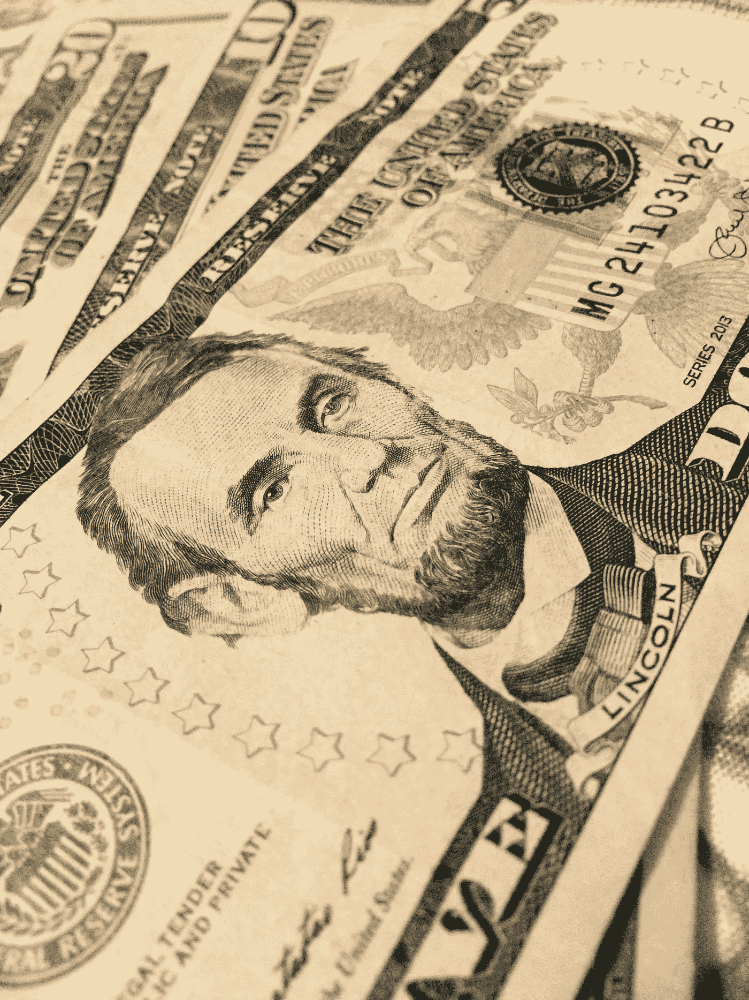

# 是的，密码货币很有价值

> 原文：<https://medium.com/hackernoon/yes-cryptocurrencies-are-valuable-aab9ce58ca54>

Photo by [Grace Stroke](https://unsplash.com/photos/gWfr0Mt9unw?utm_source=unsplash&utm_medium=referral&utm_content=creditCopyText)

R 很奇怪，在人类历史上，我们作为一个民族从根本上重新思考金钱。在过去的一万年里，牛、贝壳、金属硬币和黄金都被用作交换单位。就在 80 多年前，美国还处于金本位制。虽然纸质法定货币已经存在了一段时间，但这种由[政府](https://hackernoon.com/tagged/government)发布的法定货币仍然占据着主导地位。

**法定货币背后的价值**

我们应该退后一步，问问自己，今天的法定货币价值是什么？为什么每个美国账单的左上角都写着“这张钞票是所有公共和私人债务的法定货币？”更重要的是，为什么人们相信这种形式的钱并继续用它交易？

除了深入宏观经济理论之外，美元或任何法定货币本质上就是政府*税收抵免*。信不信由你，税收债务给了纸币价值。美国政府每年征收数万亿美元的税收，并接受美元作为支付方式。对美国货币体系的信心，以及对国内和国际上发生的层层交易准确有效地执行税收制度的能力，有效地赋予了美元价值。其他因素，如总体货币供应、通货膨胀和利率也起着一定的作用，但出于本文的目的，我们将不再深入讨论这一主题。

**电子交易**

既然我们可以接受法定货币有价值，现代货币的更大的故事是，我们作为一个民族，经常以电子方式进行银行业务，并依靠我们账户的余额来准确维护。

我们中的许多人每天都进行电子交易。我们不会再考虑它了。我们的工资通常由雇主通过 ACH 转账支付。我们通常使用借记卡和信用卡来支付商品和服务费用，也使用自动取款机卡从我们的支票账户中提取现金。如果我们需要立即从银行汇款，我们可以执行电子汇款。流行的支付应用程序，如贝宝、Venmo 和 Square Cash，通常被用来进行点对点转账。

无论我们使用哪种电子转账服务，我们都相信底层金融处理系统能够准确、高效地对我们的账户进行贷记和借记，最终反映正确的账户余额。通过这样做，我们已经习惯于接受电子支付就是金钱。

**密码连接**

这与加密货币有什么关系呢——比特币、以太坊或其他类似的数字货币？简单地说，它与 ***和*** 都有关系。虽然它们可能不擅长作为稳定的价值储存手段，但我会在这里证明它们本身是有价值的。

请相信，如果你向某人支付名为 ***比特币*** 的东西，交易将被处理和清算，你的收款人将收到你发送的付款。一旦成功接受这一信念，你就已经通过了相信加密货币价值的第一个主要障碍。

Photo by [rawpixel.com](https://unsplash.com/photos/gbHMZCFraAI?utm_source=unsplash&utm_medium=referral&utm_content=creditCopyText)

不足为奇的是，这可能不是一个概念上的延伸，因为我们许多人都无法解释在当今的任何技术水平下，当今的金融交易是如何处理和清算的。同样，除了对加密货币整体不熟悉之外，您真的需要了解底层交易处理系统如何工作才能信任它吗？我认为不是。你只需要知道它是有效的。

**金钱的品质**

下一个合乎逻辑的考虑是进一步检查货币的质量，因为它们与加密货币相关。根据 J. Singh 的说法，货币的八大品质是:普遍可接受性、便携性、不可毁坏性或持久性、同质性、可分性、可塑性、可识别性和价值稳定性。除了这些品质，我们还将考虑稀有性、防伪性、可转让性和不受权威机构控制的品质。

Photo by [Aaron Burden](https://unsplash.com/photos/xG8IQMqMITM?utm_source=unsplash&utm_medium=referral&utm_content=creditCopyText)

*可接受性*。这些货币目前可能不是一杯咖啡或一所房子的可接受的支付形式，但它们具有高度流动性的市场，加密货币可以与美元等现实世界的法定货币进行兑换。

*便携性*。比特币和其他货币可以方便、经济地从一个地方转移到另一个地方。您实际上不需要随身携带任何东西，而是从数字 0 到 9 以及字母 A 到 f 的 64 个字符。您必须以最高级别的安全性来保护这 64 个字符，但这部分数据是您能够与您持有的加密货币进行交易所需的唯一东西。

*耐久性*。加密货币非常耐用。以至于它可以被编程为以几乎任何方式操作，从而优化其在使用环境中的效用。一般来说，加密货币不会因为磨损而变质。比如一个比特币永远是一个比特币。单个比特币或其任何其他面额都不能被磨损，也不能再被用作交易单位。

*同质*。加密货币是完全同质的，因此是可替代的工具。同一种加密货币的任意两个等量的可交换价值没有区别。

*整除性*。大多数加密货币比传统的法定货币更容易分割。一个 Satoshi 是一个比特币可以发送的最小部分。这是 1 比特币的百万分之一，或者说是数字 1 前面有 7 个零。假设比特币价值 4000 美元，一个 Satoshi 代表 0.000040 美元。对任何人来说，这似乎是一笔不合理的小数目，但仍然有可能做到。

*延展性*。虽然这个术语可以追溯到货币能够被制成方便的形状以实现最大交换性的概念，但无形听起来如何呢？有什么东西比你在任何物理意义上都无法触摸或持有的东西更有延展性，但仍然保持着货币的大部分属性。

*认知能力*。加密货币容易被识别吗？这不仅仅是因为它们的新奇，而是与加密货币相关的品牌正在增长，越来越多的人可以识别比特币和以太坊的符号。更具体地说，如果有人给你送来任何面值的比特币，你能认出它吗？假设你有一个比特币钱包，那么*不可能*看不到你的比特币钱包账户被收到的金额记入了账户。

*稳定性*。比特币和许多其他加密货币作为稳定的价值储存手段并没有做得很好。许多加密货币的可兑换价值出现了巨大的波动。虽然比特币和以太坊被吹捧为最稳定的两种，但它们的价值也经历了大幅飙升。如果他们在几天甚至几个小时内损失一半的价值，这不会被认为是不可能的。为了进一步提高加密货币的风险，在大规模技术故障的情况下，货币可能会跌至 0 美元，实际上没有可兑换价值。

*需要注意的是，对于许多加密货币来说，除非发生恶意攻击，占领支持技术基础设施并阻止其重新上线，否则这种情况即使不是统计上不可能发生，也是非常不可能发生的。此外，量子计算攻击的威胁即将出现。如果这些攻击成为现实，它们有可能扰乱甚至摧毁我们当前的金融系统，更不用说加密货币创建的金融系统了。*

*稀罕物*。加密货币很少见吗？有人可能会说它们正变得无处不在，在某种程度上这是正确的。过去的一年被证明是加密货币增长最快的一年，在知名加密货币实时跟踪平台 [CoinMarketCap](http://coincap.io/) 上有超过 850 种活跃的加密货币上市。快速浏览一下 [ICO Alerts](https://www.icoalert.com/) ，很容易发现，仅在接下来的几个月里，就将有数百个新的 ICO Alerts 发布。加密货币的实际数量现在并不那么重要，重要的是我们正在研究的特定加密货币。

加密货币可以被认为是可编程的货币，因为它们具有设计交易系统的人的规则集和特征。在每一个特定的案例中，人们必须评估稀有性，并确定有问题的数字资产是否通过了测试。有些人比其他人得分高。就比特币而言，这种情况非常罕见，因为比特币的最大数量不到 2100 万。考虑到美国有超过 3.2 亿人，全世界总共约有 73 亿人，显而易见的是，不是世界上的每个人都会拥有 1 比特币。

*防伪*。伪造加密货币有可能吗？这是一个有趣的问题。在正常情况下，简短的答案是“不”。人们无法制造伪造的加密货币，但有可能扰乱支持底层加密货币的整体技术。

并且在货币的情况下，其中基本的价值单位被定期地创建和销毁，恶意行为者有可能获得对技术能力的控制，以根据他们自己的判断来创建并可能销毁价值单位。令人惊讶的是，如果这种情况发生，这将是基础加密货币的“真实创造”。不幸的是，这种数字资产的“真实创建”可能是恶意的，从而未能遵守由主持组织制定的原则和治理模型。

*可转移性*。这是加密货币最大的价值主张之一。它们是高度可转让的。虽然每种加密货币的操作方式都有所不同，但比特币交易通常在不到 1 小时内完成清算，过去一年里，这一数字低至 10 分钟以内。这些处理时间也有例外，但一般来说，这不是几天的事。

*自愿的，不受权威控制的*。你可以随意使用你的加密货币吗？鉴于您保管您的加密货币，您对何时何地发送您的加密货币拥有绝对控制权。任何机构都不能用您的加密货币执行交易。为了做到这一点，他们必须有你的私人 64 字符字符串。不可否认，这确实变得具有挑战性，尤其是在 IT 安全受到威胁的情况下。这个字符串需要得到保护，否则除了你自己以外的其他人也可以访问你的加密货币。

**可怜的兑换单位，依然值钱**

既然我们已经对货币的上述品质给予了一些关注，上面提到的两个最大的关注点是*稳定的价值储存*和*可接受性*。这并不奇怪，因为这些都是高度相关的品质。正如人们可以推理的那样，自愿以一种不可能成为稳定价值储存手段的货币来发送或接收付款似乎是不符合逻辑的。

Photo by Aaron Blanco Tejedor

虽然一些实体可能愿意承担与接受这种性质的付款相关的风险，但这是有风险的，并且不符合可持续的会计方法和成功的业务运营。虽然比特币和其他货币仍然具有可兑换价值，但它们缺乏稳定性，这使得它们成为商品和服务交换的糟糕工具。

因此，如果加密货币通常不作为稳定的价值储存手段，并且不容易被商品和服务接受，它是否具有现实世界的价值？**是的，他们确实持有现实世界的价值**。

否则，加密货币作为一个金融类别将会失败。我们可能在交易单位测试中做得不好，但我们将在未来几年看到更多基于加密货币的支付方式。他们中的许多人今天都在你的支配之下，甚至更好的系统正在工作中。

**扰乱菲亚特**

当我们思考为什么法定货币保持其价值时，人们可能会注意到加密货币不是法定货币，也不受迄今为止任何主权国家的债务和基本税收制度的管理。因此，在很多情况下，它今天也不被接受为一种支付方式。

Photo by [Igor Ovsyannykov](https://unsplash.com/photos/ZHhvHaAj9C4?utm_source=unsplash&utm_medium=referral&utm_content=creditCopyText)

然后，加密货币实验回避了一个问题，有没有可能拥有一项没有主权国家支持的有价值的数字资产，与被视为税收抵免的概念脱钩，并且未能成为一种普遍接受的支付方法？

过去的 8 年向我们证明了这个问题的答案是响亮的“是”，我认为没有理由改变这一点。底层的技术系统、治理和控制已经让密码货币具备了足够的货币质量，可以作为参与者之间交换价值的安全和受控的系统来验证。虽然与世界各地的货币用户相比，今天的密码货币用户数量仍然很少，但密码货币的用户数量正在增长。

当我们考虑牛、黄金、法定货币和现在的密码货币时，我们已经走过了相当长的货币历史。密码市场仍处于早期阶段，我们将在这个过程中经历成长的阵痛。最终，我相信货币的未来确实包括了密码货币。它们有着独特的价值，我认为在未来的许多年里，它们将继续如此。