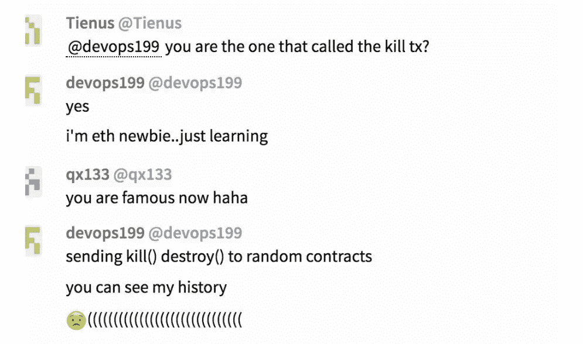

# 是的，这孩子真的通过乱搞以太坊的智能合约删除了 3 亿美元。

> 原文：<https://medium.com/hackernoon/yes-this-kid-really-just-deleted-150-million-dollar-by-messing-around-with-ethereums-smart-2d6bb6750bb9>

去年，分散的“自治”投资基金 DAO[被黑客攻击了](https://www.cryptocompare.com/coins/guides/the-dao-the-hack-the-soft-fork-and-the-hard-fork/)5000 万美元。7 月，一名黑客通过引爆在平价钱包中发现的一个 bug 窃取了 3100 万美元的乙醚[。今天，我们遭遇了迄今为止最糟糕的黑客攻击，只是这一次，赌注更大，而且*只是* *一个大失误。*](https://blog.zeppelin.solutions/on-the-parity-wallet-multisig-hack-405a8c12e8f7)

两天前，一个名为“devops199”的用户在 Parity 的 Github 上开了一个问题，题为[“任何人都可以杀死你的合同”](https://github.com/paritytech/parity/issues/6995#issuecomment-342409816)，似乎想让为以太坊网络用户提供智能合同的公司 Parity 知道他们的智能合同中的一个漏洞。

他提到的智能合同涉及一个“多重签名合同”，它被很多人用作“数字钱包”来安全地存储他们的以太坊。显然，这个钱包的代码中有一个“错误”。这个 bug，或者更好的说法是安全漏洞，允许 Devops199 让自己成为合同的“所有者”之一。这给了他做几乎任何事情的许可。

Devops199 当时的所作所为，可能是有史以来最昂贵的错误之一:

他“取消”了合同。

实质上，他删除了智能合约中允许以太坊所有者转让其以太坊的功能。他在合同中锁定了以太坊，使其完全无用——永远无用。尽管如此，他似乎还不太明白刚刚发生了什么。

> "业主转让可以吗？"

不…不，不会的。你几乎删除了一大笔钱。

基本上，每个使用这个多签名钱包的人都不能再进入他们的以太坊了。对这些合同中以太坊实际金额的估计从 1 . 5 亿美元到 3 亿美元不等。

奇偶校验，他们的多签名钱包也在 Juli 被黑，再次发布了[‘安全警报’](https://paritytech.io/blog/security-alert.html)，声明:

> “我们非常抱歉，昨天的事件给我们的用户和整个社区带来了巨大的压力和困惑，尤其是围绕这个问题的各种猜测。我们将继续调查这一情况，并探索所有可能的影响和解决方案。”

我们从 Devops199 听到的最后一件事:

# **提供解决方案**

需要注意的是，以太坊本身实际上并没有被完全删除。它仍然存在；它不能被访问。

想象一下，2.8 亿美元存放在一个保管箱里。不知何故，一个随机的家伙走进银行，说他是保险箱的主人。他毫无问题地获得了完全的访问权限，随后永久删除了保管箱的钥匙。这把钥匙是独一无二的，不可能再被复制了。

至少，不是在网络的规则下。然而，这个问题有一个解决办法。一个颇具争议的问题。

今年早些时候，去中心化投资工具 DAO 遭到黑客攻击，这种情况通过“硬分叉”得到了解决。以太坊基金会发布了他们的客户端的新版本，其中他们注入了新的交易，以从黑客控制的智能合约中“偷”回以太。当然，从技术上来说，这些新的交易违反了以太坊网络的规则，但是由于它们被硬编码到以太坊客户端中，所以“规则”被特别修改以允许这些交易(并且只允许这些交易！)否则违规交易。

然而，当决定硬分叉以太坊网络以追回在[DAO hack](https://www.cryptocompare.com/coins/guides/the-dao-the-hack-the-soft-fork-and-the-hard-fork/)期间损失的资金时，网络的一部分不同意该决定。那些不同意提供的解决方案的人认为“代码就是法律”，这种改变是非法的。因此，他们继续使用“原始”软件。突然间，以太坊有了两个版本:[以太坊和以太坊经典。](https://blockgeeks.com/guides/what-is-ethereum-classic/)

以太坊经典至今仍然存在，在撰写本文时，其市值约为 13 亿美元，而“分叉”以太坊链(还原黑客的链)价值约为 300 亿美元。

以太坊网看到上次引起的争议，很有可能会再次选择硬叉。毫无疑问，以太坊经典将因此受益。毕竟，以太坊基金会倡导违背他们自己的网络规则的快速修复的资金限制在哪里？

编辑:这篇文章的原始版本有一个错误。感谢[雷纳·施奈德](https://medium.com/u/2bfac46071a2?source=post_page-----2d6bb6750bb9--------------------------------)对我的指正。

# [**再次批判以太坊。**](https://hackernoon.com/the-top-critiques-on-ethereum-a-bubble-waiting-to-pop-6ccf9b577d11)

或许是时候退一步，重新思考智能合约的设计了。这不是第一次这些合同中的漏洞导致巨额资金受损。以太坊基金会喜欢吹嘘以太坊作为一个智能合约平台是“图灵完全的”，这意味着几乎任何东西都可以在其上编码和部署。到目前为止，这种特殊的设计选择已经导致了超过 5 亿美元的损失。

图灵完备性总是会导致漏洞，因为契约自然只和它的开发者一样好。问问任何一个开发人员，他们有多频繁地在他们的代码中意外地写下错误，不管有没有注意到，你可能会明白为什么当有这么多钱处于危险之中时，未经审计的“图灵完全”智能合同的整个概念是非常危险的。设计选择有其后果，在某些时候是时候重新评估它们了。例如，智能签约平台只允许部署由专业人员制定和审核的“预先审核”的智能合同可能是有意义的。

当然，在一个分散的系统中，这是一个非常集中的过程。当然，在智能合约平台的元设计中有许多权衡。但这些权衡是值得思考的，因为如果什么都不改变，以太坊永远会被安全问题困扰。

以太坊的支持者会说，我不应该把智能合约开发者犯的错误归咎于平台，这在某种程度上是有道理的。然而，我们不要忘记，奇偶校验不是由某个不知名的、不称职的青春期男孩运行的，他部署了他的第一批智能合同。不，是盖文·伍德自己创立的，以太坊的联合创始人之一。

如果*甚至*他的智能合约一直有这样的缺陷，那么未来大多数图灵完全智能合约的安全性会有多高？

## *关于作者:*

Thijs Maas 是一名法律系学生，他对分布式账本技术带来的创新浪潮所带来的法律挑战有着浓厚的兴趣。他最近创建了一个网站，作为该主题的信息、见解和学术研究的中心。

是的，我很快会写下这个“错误”引发的法律问题。