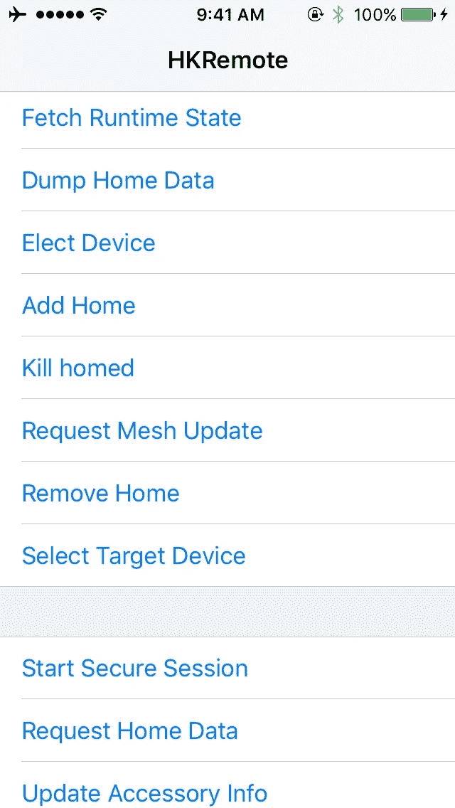
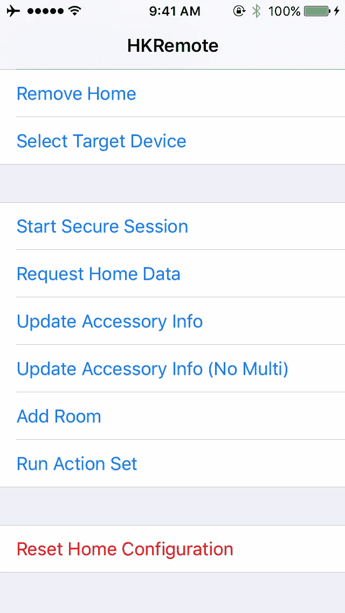
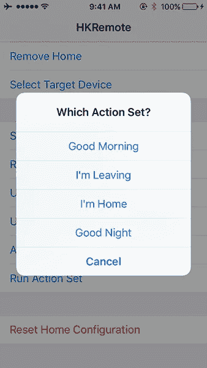

# 你的家终究不是那么安全

> 原文：<https://medium.com/hackernoon/your-home-was-not-so-secure-after-all-af52fbd6777c>

**TL；DR —** 苹果建了一个超级安全的门，把钥匙留在门上，忘了在门周围建墙。

自从有了互联家居配件，[安全](https://hackernoon.com/tagged/security)一直是人们担心的事情。与旧的机械锁相比，你的装有软件的新奇的新 BTLE 锁会出很多问题。曾经有一段时间，互联家居配件市场非常混乱，制造商运输的配件安全性很差。当[苹果](https://hackernoon.com/tagged/apple)在 2014 年宣布 HomeKit 时，我真的很高兴，承诺提供一种安全和隐私的方式来控制联网的家庭配件。

问题是，很多时候人们真的没有办法检查一个东西是否真的安全。对于 HomeKit 来说，它最终并不那么安全。 **HomeKit 在处理请求之前没有检查远程消息的发送者，这最终可能允许任何人远程控制家中的 HomeKit 配件。**

HomeKit 实际上是一个总括术语，涵盖了 iOS 设备上的软件和通信协议。设备上的软件为您提供了一个集中的位置来管理 home 和附件(守护程序)，以及 iOS 上的软件用来与 HomeKit 附件对话的通信协议(HAP)。watchOS 4 和 iOS 11.2 的安全问题是**在守护进程端**，**底层 HAP 交换没有被破坏**。

# 那么，HomeKit 到底出了什么问题？

## 一个不太专业的版本

想象一下 HomeKit 是你家的管家，当你不在家的时候，你可以向它发送 iMessage 请求它为你做事。假设您想要打开前门，您可以向 HomeKit 发送一条消息，请求它打开前门。一旦 HomeKit 收到消息，它应该检查消息是否是由您发送的，然后按照您的要求打开门。除了在现实中，HomeKit 并不检查是谁发送的消息，只要有人要求，它就会很高兴地打开门。

为了让 HomeKit 做一些事情，消息需要包含一个唯一的标识符，用于标识家中的对象(附件、场景或房间)。通常情况下，任何人都不可能找出这些对象的唯一标识符，除非您被授权访问 HomeKit 中的那个 home。然而，有两个独立的错误，一个在 watchOS 4 - 4.1 中，另一个在 iOS 11.2 和 watchOS 4.2 中，允许某人在没有授权的情况下首先进入家中。有了这些唯一标识符，远程攻击者几乎可以要求 HomeKit 做任何事情。

苹果在 12 月 7 日禁用了人们向他人发送 HomeKit 消息的功能，作为一项临时解决方案，同时它正在为未来的 iOS 版本进行适当的修复。因此，在 11.2.1 之前的版本中，iOS 上的用户不再可以共享个人主页给新用户，也不能远程访问现有的共享用户。

## 更技术性的版本

HomeKit 守护进程是基于请求-响应模式构建的。你在你最喜欢的 HomeKit 应用程序中做的每个动作都被翻译成一个请求，发送到 daemon。守护进程处理请求，执行操作，然后回复请求。对于在 iOS 设备上运行的 HomeKit 应用程序，所有通信都通过 [XPC](https://developer.apple.com/documentation/foundation/xpc) 完成，访问权限由 TCC 强制执行(iOS 中的权限弹出窗口)。本文中讨论的所有信息都基于对 iOS SDK 捆绑的 HomeKit 守护进程二进制文件的反汇编。Hopper 是完成这类任务的绝佳工具；)

为了让你在不在家时安全地访问你的配件，并与其他用户分享你的家，苹果建立了一个远程云消息平台(iMessage 后面的同一个)。通过多种传输方式跨用户、设备和应用的消息由 HomeKit 守护程序通过集中式消息调度程序进行处理。

当有人试图设计一个过于灵活的系统时，有趣的事情就会发生。对于 XPC 消息，HomeKit 守护进程实际上不需要对消息执行额外的验证，因为 TCC 和 iOS 通常已经完成了所有的艰苦工作(授权😉).对于普通的守护程序到守护程序的远程通信，实际的消息由 HomeKit 安全会话加密，然后加密的数据包通过远程云消息平台发送。HomeKit 的问题是守护进程如何在没有安全会话的情况下处理远程消息。守护进程不会丢弃对状态机没有意义的消息，而是将该消息视为普通请求并进行处理。苹果在 iOS 11.2.1 和 tvOS 11.2.1 中通过改进守护进程端的消息处理解决了这个问题。

由于 HomeKit 守护进程像普通请求一样处理没有安全会话的请求，我们可以向 home manager 发送消息，并让它泄漏关于 home 及其附件的信息。这些信息可以用来指示 HomeKit 执行正常情况下不应该执行的操作。我们可以通过两种方式从 home manager 收集所需的信息，一种是 watchOS 4 和 4.1 中提供的，另一种是 iOS 11.2 和 watchOS 4.2 中引入的🙃。从 iOS 11.2.1 开始，这两个版本都打了补丁。

# 对于 watchOS 4 和 4.1

在所有可以发送给 HomeKit daemon 的消息中，有一些非常有趣。有一条消息将让 watchOS 上的 HomeKit 回复一个家庭标识符列表，以及用于加密家庭数据和与发送者的附件通信的公钥和私钥。一旦攻击者得到回复，HomeKit 就玩完了。通过配对身份和私钥，攻击者可以欺骗 HomeKit 认为他是房屋的所有者，即使在苹果修复了消息传递问题之后。

A small tool for verifying the vulnerability

但是，是的，现在我们有了告诉 HomeKit daemon 做事情所需的所有信息，我们可以发送针对正确家庭的消息，并控制用户家中的所有东西(包括 IP 摄像头😅).

You can do so many things

幸运的是，苹果在 11 月中旬左右在远程云平台上部署了一个临时修复程序，禁用了针对 Apple Watch 的账户间消息，因此只有 Apple Watch 上的 iCloud 账户才能向该手表发送消息。苹果通过改进消息来源验证和仅使用公钥回复，正确解决了 watchOS 4.2 发送完整配对身份的漏洞。

# 对于 iOS 11.2 和 watchOS 4.2

我在 10 月下旬发送了关于 HomeKit 错误处理消息的报告(稍后将与苹果产品安全团队进行更多沟通)，我很惊讶地看到当 iOS 11.2 正式发布时，他们为远程攻击者控制家庭引入了新的方法(实际上使其变得更加容易)。在 iOS 11.2 之前，要远程控制某人的 HomeKit 配件，目标用户需要有一个运行 watchOS 4 或 4.1 的 Apple Watch，这样攻击者就可以获得足够的信息来发送消息。然而，在 iOS 11.2(和 watchOS 4.2)中，HomeKit 在 home manager 上引入了一条新消息，该消息没有正确验证消息发送者，并将回复敏感的家庭信息。所以现在为了让攻击者远程控制家庭，目标只需要在 iOS 11.2 上有一个 iOS 设备，这与几天前发生的日期问题有关，很多人已经更新了。感谢苹果！🤦

Action Set execution

就是这样，没有花哨的缓冲区溢出，只是错误处理消息😝。对安全的无知程度？macOS 根级别。

# 与苹果公司沟通

老实说，在这个阶段，我认为可以有把握地说，苹果的营销团队可能会在疯狂的期限内从工程团队那里得到他们想要的任何东西。

这些信息处理不当的问题早在 10 月下旬就被发现了，并在我发现的第二天(10 月 28 日)被披露给了苹果的产品安全团队。我(在 10 月 30 日)收到苹果产品安全团队的一封电子邮件，称他们将在整个 11 月份对其进行调查。在此期间，我发送了多封电子邮件(10 月 31 日、11 月 2 日和 11 月 16 日。此外，还有一封于 11 月 27 日发送给联邦快递。)试图确保工程团队理解这个问题，但完全没有回复。我观察到苹果部署了 watchOS 服务器补丁，所以我假设他们只是典型的苹果不回复人(你好雷达🙃)，所以我认为工程团队应该对这个问题有足够的了解，并希望他们能正确地用 iOS 11.2 解决这个问题。但随后 iOS 11.2 正式发布，虽然他们确实解决了我报告中的一些问题，但他们并没有进行全面的安全审计来确保所有消息都得到正确处理，而是引入了一条新消息，这使得整个攻击变得更加容易🤦。

有趣的是，他们是如何对修复进行优先级排序的，在我的初始报告中，我尝试按严重程度列出它们，如下所示:

> HomeKit 守护程序应该区分来自不同传输的消息
> 
> …问题描述…
> 
> — — —
> 
> 重置家庭配置的消息
> 
> …
> 
> — — —
> 
> 获取家庭数据和加密密钥的消息
> 
> …
> 
> — — —
> 
> 可以远程添加/删除家庭
> 
> …
> 
> — — —

不知何故，工程团队设法修复了除了上面关于区分来自不同传输的消息的那个之外的几乎所有东西🤷‍♂️.

由于他们不会回复我的电子邮件，而且在最新版本中他们让情况变得更糟，我真的不知道下一步该做什么。我四处打听，幸运的是有人能够找到他们认识的在产品安全团队工作的人，最后我收到了团队发来的电子邮件回复。我猜这就是现在产品安全的运作方式？我必须认识某人才能妥善处理我的安全问题？

回复的人真的很好，但是不能提供任何有用的信息，说明苹果什么时候可以解决由于他们对原始报告的疏忽而导致的新问题……所以我最终在 9 点到 5 点联系了我的朋友，结果发现苹果的公关渠道比产品安全反应更快，从他们联系苹果的公关到苹果想出一个临时的解决方案，这一切都发生在 48 小时之内。难怪现在人们会把安全问题扔在推特上，对吗？我们生活在一个多么美好的世界。

iOS 11.2.1 于 12 月 13 日发布，正确解决了所有报告的 HomeKit 问题。

所以，是的，当有人承诺某事是安全的时，要保持警惕。有趣的是，代码库中的低级基础设施与其他组件的行为方式不同，这是工程师没有预料到的，最终导致了整个系统的完全安全崩溃。希望苹果将来会更加小心。

*   *应苹果产品安全部门的要求，部分信息被删除。*