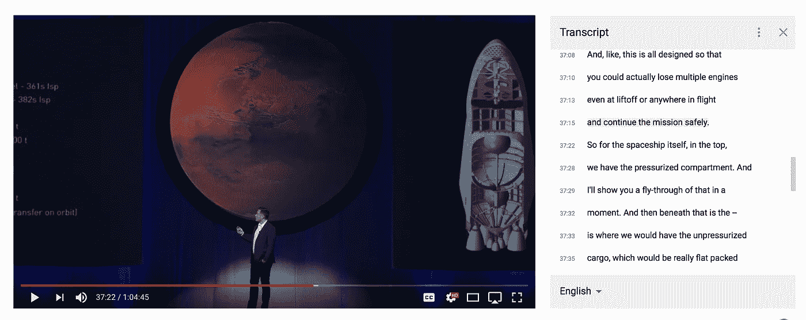

# YouTube 壁画

> 原文：<https://medium.com/hackernoon/youtube-murals-2ef8b5e08207>


Visualizing topic change for this [video](https://bethydiakabana.com/Youtube-Murals/)

## 用自然语言处理和 Processing.js 在 YouTube 视频中绘画主题随时间变化

在漫长的一周学习(现在是工作)后的一些日子里，我习惯于看垃圾电视来让我的大脑休息一下。现在我离开了学校，我从未像现在这样渴望知识。除了阅读日常媒体文章，我还会上 Youtube 或 TED，观看我感兴趣的主题的视频，过去的会议，或者只是为了“lol”。有时候这些视频可以长达两个小时！我承认，我有时会浏览视频的一部分，以确保我找到了主题的根源，并且我没有上当。

在我今年夏天的现代物理课上，我和我的小组做了一项名为“突破星空”项目的研究。我寻找关于这个项目的视频，谢天谢地，他们在 5 分钟内就明白了我的意思。这个视频是 autoplay 上的下一个视频，作为一个埃隆·马斯克的超级粉丝，即使没有上几天课，也让我把它搁置在我无限展示的被遗忘的 Chrome 标签上...

我最终一口气看完了视频，但我只想看到我需要的部分——当我有小组项目、我自己的作业和一个小时的火车回家途中没有免费 wifi 时，有一个小时的空闲时间坐着看这个对我来说将是一个奇迹。

WHOA COOL! But it’s really long right?

断断续续地浏览这段视频令人疲惫不堪。我最终得到了我需要的内容，但是如果我跳过了视频的其他相关部分呢？

第二次我想看这个的时候，我看到 Youtube 上有时间编码的抄本，你可以在视频的右边看到完整的抄本。因为它们是用时间戳索引的，所以我可以搜索特定的单词或短语，并跳转到我需要的部分。



Time encoded transcripts (not machine generated)


Time encoded search results for the desired topic

# 无障碍含义

最初的创意编码草图变成了一个新的艺术项目，对 YouTube 和人类认知产生了巨大的影响。如果我能在某个特定的时间听到别人说了什么，我就有了一个简单的解决方法。对许多其他人来说，情况并非如此。YouTube 用隐藏字幕展示了他们对可访问性的承诺，然而这仅仅是个开始。我相信有更多的方法可以为此做出贡献。

> “每个人都应该能够访问和享受网络。我们致力于实现这一目标。”——[谷歌无障碍](https://www.google.com/accessibility/index.html)。

# 使主题可见

一袋单词的方法听起来直截了当而且有效——在给定的时间点将与特定主题相关的单词分组。每个组的大小取决于特定的持续时间或句子长度。谢天谢地，YouTube 的 API 使得检索字幕成为可能，而不仅仅是自动生成的嘈杂字幕。这些以[时控文本标记语言](https://en.wikipedia.org/wiki/Timed_Text_Markup_Language)(版本 1。我保证你以后会感谢我的)。我将用埃隆·马斯克演讲的文字记录来证明这一点。

TTML snippet from Elon Musk Talk

当通过一个`xml`解析器进行筛选时，我得到了下面的结果，这使得处理变得更加容易:

```
{'start': '75.936', 'dur': '1.302'} 
ELON MUSK: Thank you. Thank you very{'start': '77.238', 'dur': '1.887'} 
much for having me. I look forward to{'start': '79.125', 'dur': '3.547'} 
talking about the SpaceX Mars{'start': '82.672', 'dur': '2.25'} 
architecture. And what I really want to{'start': '84.922', 'dur': '3.019'} 
achieve here is to make Mars seem{'start': '87.941', 'dur': '2.949'} 
possible, make it seem as though it&#39;s{'start': '90.89', 'dur': '2.32'} 
something that we can do in our{'start': '93.21', 'dur': '3.11'} 
lifetimes and that you can go. And is{'start': '96.32', 'dur': '1.76'} 
there really a way that anyone can go if{'start': '98.08', 'dur': '1.55'} 
they wanted to?
```

在自然语言处理中，过滤掉停用词(特定语言中的常用词)以减少按主题聚类词时的噪音是很重要的。没有完整的停用词列表，但是我使用了 [NLTK](http://www.nltk.org/) 的停用词语料库(用 unicode 编码)。在英语中，这些包括介词、冠词和专有名词。我之前从文本聚类中删除了这些单词

```
[u'i', u'me', u'my', u'myself', u'we', u'our', u'ours', u'ourselves', u'you', u'your', u'yours', u'yourself', u'yourselves', u'he', u'him', u'his', u'himself', u'she', u'her', u'hers', u'herself', u'it', u'its', u'itself', u'they', u'them', u'their', u'theirs', u'themselves', u'what', u'which', u'who', u'whom', u'this', u'that', u'these', u'those', u'am', u'is', u'are', u'was', u'were', u'be', u'been', u'being', u'have', u'has', u'had', u'having', u'do', u'does', u'did', u'doing', u'a', u'an', u'the', u'and', u'but', u'if', u'or', u'because', u'as', u'until', u'while', u'of', u'at', u'by', u'for', u'with', u'about', u'against', u'between', u'into', u'through', u'during', u'before', u'after', u'above', u'below', u'to', u'from', u'up', u'down', u'in', u'out', u'on', u'off', u'over', u'under', u'again', u'further', u'then', u'once', u'here', u'there', u'when', u'where', u'why', u'how', u'all', u'any', u'both', u'each', u'few', u'more', u'most', u'other', u'some', u'such', u'no', u'nor', u'not', u'only', u'own', u'same', u'so', u'than', u'too', u'very', u's', u't', u'can', u'will', u'just', u'don', u'should', u'now', u'd', u'll', u'm', u'o', u're', u've', u'y', u'ain', u'aren', u'couldn', u'didn', u'doesn', u'hadn', u'hasn', u'haven', u'isn', u'ma', u'mightn', u'mustn', u'needn', u'shan', u'shouldn', u'wasn', u'weren', u'won', u'wouldn', u"'s", u"n't", u"'m", u"'d"]
```

## 潜在狄利克雷分配

LDA 是自然语言处理中的一种常见模型，它在句子或文档中发现主题。它会假设你有你的文件字数。它搜索一段文本，找到一串关键词，用来了解文档的内容。

想想那些正在为英语课的小测验做准备的焦虑不安的高中生，他们阅读(或略读)下节课的作业，并确保他们明白发生了什么，因为他们的老师知道他们在使用 Spark 笔记。他们会在阅读作业中突出单词、句子、段落或 99%的文本。他们会选择一些他们在课堂上讨论过的话题，当他们阅读下一个作业时，他们会试图找出为什么它与这个话题相吻合。他们会一遍又一遍地阅读课文，以确保他们记笔记的部分符合那个主题。

就像在 LDA 中一样，学生对他或她的阅读笔记进行心理快照，并看到对于每一章 *c* 和主题类别 *t* ，他或她可以看到每个类别下突出显示的部分，以完整表示*c。*如果他们碰巧正在阅读类似哈利波特的书，并且他们已经读完了第 *c* 章，他们可能会看到主题分布可能是 10%友谊、50%魔法、10%勇敢

在反复查看文档后，该模型返回了出现在 Musk 抄本中的单词的概率，假设它在寻找 5 个主题:

```
LdaModel(num_terms=1016, num_topics=5, decay=0.5, chunksize=100)[(0, u'0.041*"engine" + 0.026*"really" + 0.025*"make" + 0.022*"tank" + 0.016*"rocket" + 0.014*"vehicle" + 0.013*"also" + 0.013*"merlin" + 0.013*"capable" + 0.012*"because"'), (1, u'0.031*"mars" + 0.028*"use" + 0.025*"mission" + 0.024*"carbon" + 0.022*"fiber" + 0.022*"liquid" + 0.018*"thing" + 0.017*"falcon" + 0.016*"day" + 0.015*"very"'), (2, u'0.045*"system" + 0.035*"would" + 0.032*"propel" + 0.028*"go" + 0.026*"time" + 0.024*"solar" + 0.022*"mars" + 0.018*"orbit" + 0.018*"cost" + 0.016*"greater"'), (3, u'0.034*"first" + 0.027*"station" + 0.026*"applause" + 0.024*"dragon" + 0.020*"space" + 0.016*"think" + 0.016*"ton" + 0.015*"mars" + 0.014*"launch" + 0.013*"go"'), (4, u'0.028*"booster" + 0.028*"spaceship" + 0.025*"get" + 0.023*"land" + 0.022*"like" + 0.021*"really" + 0.021*"maybe" + 0.019*"go" + 0.018*"anywhere" + 0.018*"actual"')]
```

经过 50 次迭代后，我们已经有了马斯克演讲的估计主题混合，下面是这幅壁画:


Youtube Mural for “Making Humans a Multiplanetary Species”

# 壁画样本🎨

上面的壁画是在假设视频中有 5 个可能的主题，并且每个单词以 60 秒的间隔分组的情况下绘制的。这些可以配置为显示更多或更少的主题，具有不同的时间间隔等。下面是更多基于时间间隔、句子间隔、主题数量、LDA 迭代的不同设置的壁画。


10 topics grouped by 60 second intervals after 10 LDA iterations


10 topics grouped by 5 second intervals after 10 LDA iterations


5 topics grouped by 60 second intervals after 10 LDA iterations


5 topics grouped by 60 words per sentence after 10 LDA iterations


10 topics grouped by 60 words per sentence after 10 LDA iterations


10 topics grouped by 100 words per sentence after 10 LDA iterations


10 topics grouped by 100 second intervals after 10 LDA iterations

壁画中的每一行代表一个不同的主题，颜色根据每个单词的分布而变化。壁画的长度总是恒定的，每个标记根据持续时间映射(单词将共享主题，尤其是没有出现在停用词语料库中的常用单词)。主题行中较亮的区域显示与特定主题相关的单词较多的区域。


5 topics grouped by 60 second intervals after 20 LDA iterations


5 topics grouped by 60 second intervals after 50 LDA iterations


5 topics grouped by 60 second intervals after 200 LDA iterations

经过多次迭代后绘制的壁画通常会有更亮的亮点。这是因为正如我前面提到的高中生的例子，他们倾向于回去仔细检查他们的文本，以确保他们为第二天的测验做好准备。同样的事情也适用于 LDA——该模型需要仔细检查，以确保单词被正确分组，以实现最大的准确性。


A YouTube mural used to navigate Musk’s talk.

# 结论

自然语言处理和丰富多彩的多媒体界面增加了无障碍交互的新方法。谷歌自动生成的标题无疑让浏览者更容易进入网站；这篇谷歌博客的作者分享了这些影响，因为他自己是聋子。当然，这是一个让我在漫长的一天后浏览冗长视频时保持清醒的好方法，但 YouTube 壁画可以为尚未适应的残疾观众提供一个解决方案。

颜色对大脑来说是一种强有力的刺激——这是它最先注意和记住的。它参与大脑的其他区域，提高学习和记忆能力。现在试着看一下马斯克的演讲，看看你是否注意到在如何集中注意力和记住它上有什么不同。如果你确实注意到了改进，想象一下这将对课堂讲座、儿童视频或老年用户(如阿尔茨海默氏症患者)有什么影响。

对于很多人来说，在现实世界中进行互动确实很难，但与无障碍网络进行互动却很容易，而且由于人工智能，这将变得更容易。

*供进一步阅读:*

1.  *LDAExplore:可视化使用潜在狄利克雷分配生成的主题模型:*[*https://arxiv.org/pdf/1507.06593.pdf*](https://arxiv.org/pdf/1507.06593.pdf)
2.  *潜在狄利克雷分配简介:*[http://blog . echen . me/2011/08/22/introduction-to-Latent-Dirichlet-Allocation/](http://blog.echen.me/2011/08/22/introduction-to-latent-dirichlet-allocation/)
3.  *颜色对记忆表现的影响:*[*https://www.ncbi.nlm.nih.gov/pmc/articles/PMC3743993/*](https://www.ncbi.nlm.nih.gov/pmc/articles/PMC3743993/)