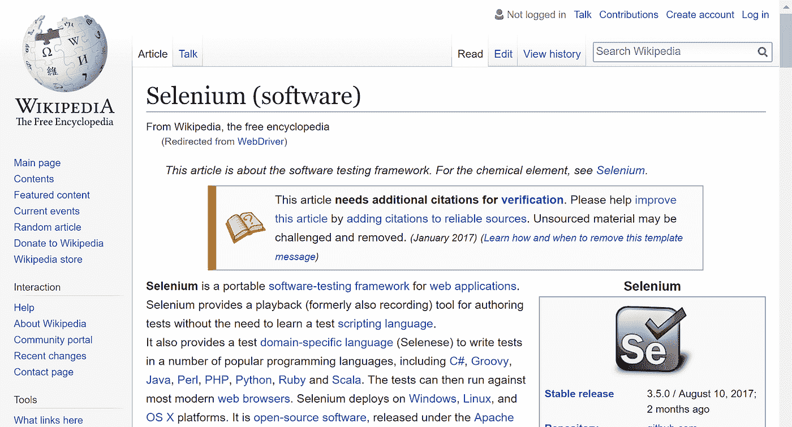
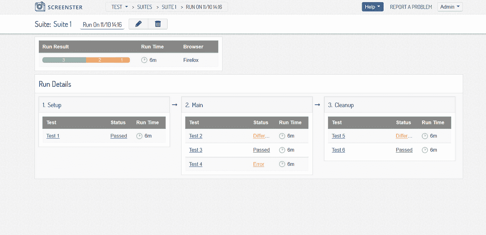

# 爱硒？它可能在欺骗你

> 原文：<https://medium.com/hackernoon/youve-been-using-selenium-and-are-pretty-happy-with-it-right-8eeac1bc875c>

你一直在使用[硒](https://hackernoon.com/tagged/selenium)并且很满意，对吗？这可能不是你在[编程](https://hackernoon.com/tagged/programming)中最有趣的部分，但是它完成了工作，你知道你可以一直依靠它来实现 UI 测试自动化。还是可以？

# **真相很吓人**

好吧，所以我选了一个戏剧性的标题来引起反应，但是事情是这样的。我的大多数朋友，从 CTO 到初级开发人员，都认为 Selenium 提供了足够好的自动化覆盖率，如果自动化测试通过，他们会很乐意将更改推向 prod。

但是在我提出关于硒的观点后，大约 5 分钟后，我看到他们的眼睛睁开了，他们的信心受到了打击，他们的思维开始寻找解决方案。

事实是，WebDriver API 无法验证人类可以立即发现的问题的一半，即使是良好编码的 Selenium 测试通常也只能验证不到 10%的用户界面。通过 Selenium 测试会给你一种安全的错觉，而实际上你必须使用人工测试来确保用户不会收到垃圾邮件。我现在引起你的注意了吗？

# 典型测试中缺少什么？

为了理解为什么我声称一个测试只覆盖了 10%的 UI 功能，让我们来看看 StackOverflow 对 Google 搜索自动化测试的顶级回答:

*public static void main(String[]args){*

*web driver driver = new Firefox driver()；*

*driver . get(" http://www . Google . com ")；*

*web element element = driver . find element(by . name(" q "))；*

*element.sendKeys("奶酪！\ n ")；//同时发送一个" \n"*

*element . submit()；*

*//等到 google 页面显示结果*

*web element myDynamicElement =(new web driver wait(driver，10))*

*。until(expected conditions . presenceofelementlocated(by . id(" resultStats "))；*

*List<web element>find elements = driver . find elements(by . XPath("//*[@ id = ' rso ']//H3/a "))；*

*//这都是你喜欢访问的链接*

*for(web element web element:find elements)*

*{*

*system . out . println(web element . get attribute(" href "))；*

*}*

*}*

非常简单:打开页面，找到搜索框，输入值并提交表单。然后使用 XPath 在页面上找到结果元素，并读取它们的链接属性。

那么少了什么呢？实际上，很多。

# 视觉验证

让我们从视觉效果开始。看看下面的图片，看看你能从中发现多少问题。

你发现他们三个了吗？可怕的是:它们对 Selenium test 都是不可见的，所以它会很高兴地将这个页面报告为“绿色”。

测试是否验证了 CSS 样式仍然是好的？没有。它是否检查文本是否适合分配的空间并且没有被裁剪？没有。图像没有被破坏？没有。按钮上的文字颜色在背景上是可读的？这将是另一个不。

# 内容验证

好吧，可能你不太在意和你分辨率不同的颜色，字体，图片，用户(讽刺！:-).内容呢？显示给用户的所有文本、数字和消息。这很重要，对吧？

典型的 Selenium 测试检查页面标题和页面正文中的几个字符串。为元素编写一堆查找，获取它们的文本，然后尝试验证其正确性，这将是疯狂的。并期望代码不会被破解。因此，我们的 Selenium 测试并没有验证用户将会看到什么。

我们能不能也用手工测试来验证内容呢？让我们再看几页，看看人类是如何进行变化检测的。这是维基百科关于硒的文章:

在下面同一页的截图中，有一些东西坏了，你能认出是什么吗？

你看到“脚本语言”链接变成常规文本了吗？我敢打赌这不像前面例子中发现丢失的按钮那么容易，但是丢失链接对用户来说有点糟糕。

用不同的分辨率检查相同的内容怎么样？

无论您是否注意到“Selenium IDE”参考已经消失，我确信这不像在前面的例子中发现一个丢失的按钮那么容易。缺失的文本、额外的文本和更改的文本都可能是用户或金融、法律甚至社交应用程序的主要问题(“喜欢”与“不喜欢”)。

到目前为止，我们都同意验证我们向用户显示的内容实际上非常重要，而 Selenium 没有很好地解决这个问题。明显的反对意见是，测试不能检查屏幕上的每一个像素和每一个字母，因为它总是会被破坏，审查这些被破坏的测试是对时间的巨大浪费。我想说这是真的，但这并不意味着对此没有解决方案。只需要一点小魔法，不过这个我们以后再说:-)

# 测试维护

有一些自动化测试比没有好得多，所以尽管 Selenium 远非完美，但人们可以说它完成了工作。您编写了测试代码，并从此受益。但是任何实现了相当数量的自动化测试的人都知道维护这些测试是一项艰巨的任务。

## 破损的选择器

您想要验证的元素越多，测试中断的频率就越高。在页面上移动一个元素可能会破坏一百个使用 CSS 或 XPath 选择器引用它的测试。可以实现像 page objects 这样的设计模式来改进这一点，但是它们需要预先计划和时间投入，并且修复损坏的定位器需要时间。

## 保持一切同步

浏览器会自动更新。Webdriver 库需要保持同步，但是每个库中都有数百个未修复的错误，让所有这些保持正常工作是一种“挑选你的毒药”的情况。

## 误差分析

测试可能因应用程序错误而失败，但也可能因 WebDriver 中的错误、浏览器崩溃或超时而失败。浏览日志并找出实际发生的事情并不是一件有趣的任务。

## 管理状态

控制运行哪些测试以及以什么顺序运行并不容易。在套件中组织它们、确定执行的优先级、调度它们并发运行以及快速解释执行的结果，这些都留给开发人员在较低的级别进行设置和审查。对我来说，在 21 世纪处理这些世俗的任务就像用水桶冲厕所一样。我可以做到这一点，但我更喜欢自动注水带手柄的水箱，非常感谢！

# 停止战斗，开始革命

对某些工具的问题喋喋不休是很容易的。如果不提供解决方案，这样做是不明智的。所以我来了。

几年前，我们放弃了让 Selenium 为我们的产品 AjaxSwing 的 UI 测试工作的尝试。我们意识到 Selenium 并不能保证我们产品的 UI 不被破坏，我们也找不到任何被破坏的东西。我们也意识到，我们，人类，不能在手工测试过程中检测所有的变化，我们知道我们不能只是将未测试的产品发送给我们的客户。所以我们建立了 Screenster，一个基于云的 Selenium 替代品，真正测试人类在屏幕上实际看到的东西。

让我简单地分享一下 Screenster 是如何解决上述 Selenium 的每个基本问题的。

## 视觉验证

Screenster 有一个基线的概念，当用户记录测试时，基线被捕获。Baseline 存储了每个页面和 DOM 状态的截图，因此它可以理解页面上的每个元素。

在基线被捕获之后，后续的运行可以将新的屏幕截图与基线屏幕截图进行比较，并且未预料到的变化被突出显示，以供测试人员查看。如果这些是新特性，测试人员可以批准这些更改，或者将它们标记为需要修复的 bug。转眼间。

## 内容验证

视觉验证对于像素完美的用户界面来说是非常好的，但是它会导致大量的修改。一个移动了几个像素的按钮或者一个背景颜色的小调整不应该破坏每个测试。

Screenster 支持内容验证模式，在这种模式下，它将测试运行期间的所有内容与基线的内容进行比较。所有的 CSS 更改都会被忽略，但是文本中的任何差异都会报告给用户以供批准或拒绝。

## 测试维护

我们花了很大力气来减少测试失败的可能性。我们使用智能选择器进行自我修复测试，自动定位被移动、重命名或更改的元素。仅这个特性就可以防止 90%的硒测试失败的原因。

Screenster 有智能超时逻辑，它可以重试失败的操作，当错误发生时，它们会直观地显示在发生错误的屏幕上。

有一个很酷的门户，团队可以在那里协作，有一个调度程序可以并行运行测试，结果显示在看起来很棒的仪表板上，您可以用它给业务和管理留下深刻印象:-)

# 结果

编写 Selenium 测试是在购买一种错觉，即您已经通过自动化保护了 UI。抱歉，但是那不是真实的。您的测试没有触及 90%的用户界面，因此没有捕捉到 90%的会发送给用户的问题。

像 Screenster 这样的新一代平台为手工编码框架的许多问题提供了解决方案。它们还不成熟，但每个月都在变得更好，它们的目标是将人类从做猴子的工作中解脱出来，让他们实际上发展特征。

看看吧，让我知道你的想法！